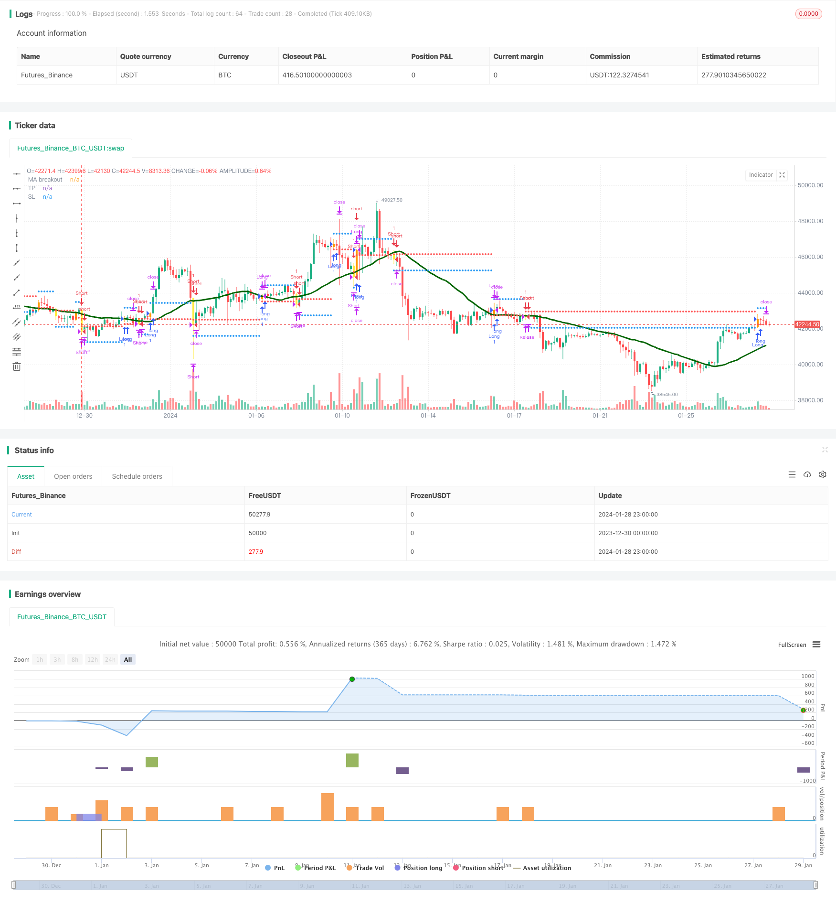

> Name

Momentum-Breakout-and-Engulfing-Pattern-Algorithmic-Trading-Strategy
> Author

ChaoZhang

> Strategy Description


 [trans]
## Overview
This article introduces an algorithmic trading strategy that uses the engulfing pattern to identify profit opportunities and the intersection of price and moving averages as entry signals. This strategy combines price technical analysis with trend following methods, aiming to profit from consolidation and trend reversal points.
## Principle
The core logic of this strategy is based on the fusion of two non-correlated indicators:
1. Swallowing pattern: A reversal pattern of two K lines. The entity of the second K line completely "swallows" the entity of the first K line to identify reversal opportunities.
2. The price crosses the moving average: When the price breaks from below the moving average and crosses the moving average upward, a buy signal is generated; when the price breaks through from above the moving average and crosses the moving average downward, a sell signal is generated.
Judging the timing of a possible market reversal through the engulfing pattern, and then combining the crossing of the price and the moving average as a filtering signal to determine the reversal, can increase the probability of profit.
Specifically, this strategy determines the possibility of consolidation and reversal by tracking three engulfing patterns: long engulfing, short engulfing and shadowless engulfing. Combined with the golden cross and dead cross signal filtering of price and moving average, the direction of opening a position is finally decided.
## Advantages
The biggest advantage of this strategy is to use the fusion of non-correlated indicators to improve decision-making effects. The engulfing pattern determines the timing and probability of market reversal; while the price crosses with the moving average to verify the direction and strength of the reversal. The two mutually verify each other, which can effectively reduce transaction losses caused by false signals.
Another advantage is the flexible parameter setting. Users can set parameters such as the moving average period and stop loss range by themselves to optimize the strategy.
## Risk
Although a variety of indicators are used to improve the judgment effect, this strategy still has a certain risk of false signals. The engulfing pattern is not a 100% reliable reversal signal, and the intersection of price and the moving average may also fail. All of these may lead to losses from early opening of positions.
In addition, like most technical analysis strategies, this strategy has poor market effect on conflicting markets such as price shocks and consolidations. Continued shocks may trigger stop losses or shorten profit margins.
In order to control risks, the moving average parameters can be appropriately adjusted and the stop loss range optimized. You can also consider combining other indicators to identify trends and volatile market conditions, and dynamically adjust the degree of strategic participation.
## Optimization direction
This strategy can be optimized through the following aspects:
1. Test more types of moving averages to find the best parameter combination. For example, weighted moving average, sequential smoothing of moving average, etc.
2. Add trend judgment indicators to avoid opening positions in volatile market conditions. For example, ADX, Bollinger Bands, etc.
3. Optimize the stop loss method and improve the stop loss effect. Stop loss strategies such as trailing stop loss and Chandelier Exit can be considered.
4. Add machine learning methods to determine the K-line shape and improve the accuracy of phagocytosis identification.
5. Add automatic parameter optimization function to realize parameter adaptation.
## Summarize
This strategy uses the engulfing pattern to determine the timing of reversal, and uses price and moving averages to cross-check the reversal direction. Improving decision-making effects through indicator fusion is a technical analysis strategy. The advantage is that the indicators are complementary and the parameters are flexible; the disadvantage is that there is still the risk of false signals and it is weak against volatile market conditions. The strategy effect can be further enhanced by optimizing moving average parameters, stop loss methods, and adding trend judgment.
||

## Overview

This article introduces an algorithmic trading strategy that identifies profitable opportunities through engulfing patterns and uses price crossover with moving average as entry signals. Combining technical analysis with trend following methods, this strategy aims to profit at consolidation and trend reversal points.

## Principles 

The core logic of this strategy is based on the convergence of two unrelated indicators:

1. Engulfing Pattern: A two-candlestick reversal pattern in which the body of the second candle completely "engulfs" the body of the first one, used to identify reversal opportunities.  

2. Price Crossover with Moving Average: A buy signal is generated when the price crosses above the moving average line from below; A sell signal is when the price crosses below the moving average line from above.

By judging the timing of potential market reversal with engulfing patterns and using price crossover with moving average as confirmation signals, the probability of profiting can be improved. 

Specifically, this strategy tracks three types of engulfing patterns - bullish, bearish and no shadow engulfing to determine possible consolidation and reversals. Together with the golden cross and dead cross signals of price and moving average crossover, the direction of opening positions is finally determined.

## Advantages

The biggest advantage of this strategy is utilizing the convergence of unrelated indicators to improve decision efficacy. Engulfing patterns judge the timing and probability of market reversal; while price crossover with moving average verifies the direction and momentum of the reversal. The two validate each other and can effectively reduce trading losses caused by false signals.

Another advantage is the flexibility of parameter settings. Users can set parameters like moving average period and stop loss range to optimize the strategy themselves. 

## Risks

Although using multiple indicators improves judgement, there are still some risks of false signals in this strategy. Engulfing patterns are not 100% reliable reversal signals, and failure scenarios also exist in price crossover with moving average. These can all lead to losses from premature opening positions.

Moreover, like most technical analysis strategies, it also performs poorly in conflicting trending markets like ranging and consolidation. Prolonged sideways price action may trigger stop loss or limit profit capturing space. 

To control risks, parameters like moving average period and stop loss range can be adjusted accordingly. Other indicators can also be considered to identify trending and sideways markets, so that strategy participation can be managed dynamically.

## Optimization Directions   

The following areas can be optimized for this strategy:

1. Test more moving average types to find optimal parameter sets, like weighted moving average, double smoothed moving average etc.

2. Add trend judging indicators to avoid opening positions in sideways markets. Examples are ADX, Bollinger Bands etc.

3. Optimize stop loss methods to improve efficacy. Trailing stop loss, Chandelier Exit can be considered. 

4. Increase machine learning methods to judge candlestick patterns and improve engulfing recognition accuracy. 

5. Add parameter optimization functions for adaptive adjustment.

## Conclusion

This strategy identifies reversal timing with engulfing patterns and verifies the direction using price crossover with moving average. By improving decision efficacy through indicator convergence, it is a technical analysis approach. Advantages include complementary indicators and flexible parameters. Disadvantages are risks of false signals and weakness in sideways markets. Ways to further enhance this strategy include optimizing moving average parameters, stop loss methods, adding trend filtering indicators etc.

[/trans]

> Strategy Arguments


|Argument|Default|Description|
|----|----|----|
|v_input_1_close|0|Source Price vs MA: close|high|low|open|hl2|hlc3|hlcc4|ohlc4|
|v_input_2|0|Type of MA: SMA|RMA|EMA|WMA|VWMA|SMMA|KMA|TMA|HullMA|DEMA|TEMA|
|v_input_3|32|MA Length|
|v_input_4|2017|Backtest Start Year|
|v_input_5|true|Backtest Start Month|
|v_input_6|true|Backtest Start Day|
|v_input_7|2020|Backtest Stop Year|
|v_input_8|12|Backtest Stop Month|
|v_input_9|31|Backtest Stop Day|
|v_input_10|600|Backtest Profit Goal (in USD)|
|v_input_11|300|Backtest STOP Goal (in USD)|


> Source (PineScript)

``` pinescript
/*backtest
start: 2023-12-30 00:00:00
end: 2024-01-29 00:00:00
period: 3h
basePeriod: 15m
exchanges: [{"eid":"Futures_Binance","currency":"BTC_USDT"}]
*/

//@version=4
//@author=Daveatt

StrategyName = "BEST Engulfing + MA"
ShortStrategyName = "BEST Engulfing + MA"

strategy(title=StrategyName, shorttitle=ShortStrategyName, overlay=true)

includeEngulfing = true

includeMA = true
source_ma = input(title="Source Price vs MA", type=input.source, defval=close)
typeofMA = input(title="Type of MA", defval="SMA", options=["RMA", "SMA", "EMA", "WMA", "VWMA", "SMMA", "KMA", "TMA", "HullMA", "DEMA", "TEMA"])
length_ma = input(32, title = "MA Length", type=input.integer)

// ---------- Candle components and states
GreenCandle = close > open
RedCandle = close < open
NoBody = close==open
Body = abs(close-open)


// bullish conditions
isBullishEngulfing1 = max(close[1],open[1]) < max(close,open) and min(close[1],open[1]) > min(close,open) and Body > Body[1] and GreenCandle and RedCandle[1]
isBullishEngulfing2 = max(close[1],open[1]) < max(close,open) and min(close[1],open[1]) <= min(close,open) and Body > Body[1] and GreenCandle and RedCandle[1]

// bearish conditions
isBearishEngulfing1 = max(close[1],open[1]) < max(close,open) and min(close[1],open[1]) > min(close,open) and Body > Body[1] and RedCandle and GreenCandle[1]
isBearishEngulfing2 = max(close[1],open[1]) >= max(close,open) and min(close[1],open[1]) > min(close,open) and Body > Body[1] and RedCandle and GreenCandle[1]

// consolidation of conditions
isBullishEngulfing = isBullishEngulfing1 or isBullishEngulfing2
isBearishEngulfing = isBearishEngulfing1 or isBearishEngulfing2

//isBullishEngulfing = max(close[1],open[1]) < max(close,open) and min(close[1],open[1]) > min(close,open) and Body > Body[1] and GreenCandle and RedCandle[1]
//isBearishEngulfing = max(close[1],open[1]) < max(close,open) and min(close[1],open[1]) > min(close,open) and Body > Body[1] and RedCandle and GreenCandle[1]

Engulf_curr = 0 - barssince(isBearishEngulfing) + barssince(isBullishEngulfing)
Engulf_Buy = Engulf_curr < 0 ? 1 : 0
Engulf_Sell = Engulf_curr > 0 ? 1 : 0


// Price vs MM


smma(src, len) =>
    smma = 0.0
    smma := na(smma[1]) ? sma(src, len) : (smma[1] * (len - 1) + src) / len
    smma

ma(smoothing, src, length) => 
    if smoothing == "RMA"
        rma(src, length)
    else
        if smoothing == "SMA"
            sma(src, length)
        else 
            if smoothing == "EMA"
                ema(src, length)
            else 
                if smoothing == "WMA"
                    wma(src, length)
				else
					if smoothing == "VWMA"
						vwma(src, length)
					else
						if smoothing == "SMMA"
						    smma(src, length)
						else
							if smoothing == "HullMA"
								wma(2 * wma(src, length / 2) - wma(src, length), round(sqrt(length)))
							else
								if smoothing == "LSMA"
									src
								else
								    if smoothing == "KMA"
								        xPrice = src
                                        xvnoise = abs(xPrice - xPrice[1])
                                        nfastend = 0.666
                                        nslowend = 0.0645
                                        nsignal = abs(xPrice - xPrice[length])
                                        nnoise = sum(xvnoise, length)
                                        nefratio = iff(nnoise != 0, nsignal / nnoise, 0)
                                        nsmooth = pow(nefratio * (nfastend - nslowend) + nslowend, 2) 
                                        nAMA = 0.0
                                        nAMA := nz(nAMA[1]) + nsmooth * (xPrice - nz(nAMA[1]))
                                        nAMA
								    else
								        if smoothing == "TMA"
									        sma(sma(close, length), length)
						                else
							                if smoothing == "DEMA"
							                    2 * src - ema(src, length)
							                else
							                    if smoothing == "TEMA"
							                        3 * (src - ema(src, length)) + ema(ema(src, length), length) 
							                    else
		    							            src
		    							                

MA = ma(typeofMA, source_ma, length_ma)

plot(MA, color=#006400FF, title="MA breakout", linewidth=3)

macrossover  = crossover (source_ma, MA)
macrossunder = crossunder(source_ma, MA)

since_ma_buy = barssince(macrossover)
since_ma_sell = barssince(macrossunder)
macross_curr = 0 - since_ma_sell + since_ma_buy
bullish_MA_cond = macross_curr < 0 ?  1 : 0
bearish_MA_cond = macross_curr > 0 ? 1  : 0

posUp = (Engulf_Buy ? 1 : 0) + (bullish_MA_cond ? 1 : 0) 
posDn = (Engulf_Sell ? 1 : 0) + (bearish_MA_cond ? 1 : 0) 

conditionUP = posUp == 2 and posUp[1] < 2
conditionDN = posDn == 2 and posDn[1] < 2


sinceUP = barssince(conditionUP)
sinceDN = barssince(conditionDN)

// primary-first signal of the trend
nUP = crossunder(sinceUP,sinceDN)
nDN = crossover(sinceUP,sinceDN)


// and the following secondary signals

// save of the primary signal
sinceNUP = barssince(nUP)
sinceNDN = barssince(nDN)

buy_trend   = sinceNDN > sinceNUP
sell_trend  = sinceNDN < sinceNUP

// engulfing by
barcolor(nUP ? color.orange : na, title="Bullish condition")
barcolor(nDN ? color.yellow : na, title="Bearish condition")

isLong  = nUP
isShort = nDN

long_entry_price    = valuewhen(nUP, close, 0)
short_entry_price   = valuewhen(nDN, close, 0)

longClose   = close[1] < MA
shortClose  = close[1] > MA

///////////////////////////////////////////////
//* Backtesting Period Selector | Component *//
///////////////////////////////////////////////


StartYear = input(2017, "Backtest Start Year",minval=1980)
StartMonth = input(1, "Backtest Start Month",minval=1,maxval=12)
StartDay = input(1, "Backtest Start Day",minval=1,maxval=31)
testPeriodStart = timestamp(StartYear,StartMonth,StartDay,0,0)

StopYear = input(2020, "Backtest Stop Year",minval=1980)
StopMonth = input(12, "Backtest Stop Month",minval=1,maxval=12)
StopDay = input(31, "Backtest Stop Day",minval=1,maxval=31)
testPeriodStop = timestamp(StopYear,StopMonth,StopDay,0,0)

testPeriod() => true


//////////////////////////
//* Profit Component *//
//////////////////////////

input_tp_pips = input(600, "Backtest Profit Goal (in USD)",minval=0)
input_sl_pips = input(300, "Backtest STOP Goal (in USD)",minval=0)


tp = buy_trend? long_entry_price + input_tp_pips : short_entry_price - input_tp_pips
sl = buy_trend? long_entry_price - input_sl_pips : short_entry_price + input_sl_pips


long_TP_exit  = buy_trend and high >= tp
short_TP_exit = sell_trend and low <= tp

plot(tp, title="TP", style=plot.style_circles, linewidth=3, color=color.blue)
plot(sl, title="SL", style=plot.style_circles, linewidth=3, color=color.red)

if testPeriod()
    strategy.entry("Long", 1, when=isLong)
    strategy.close("Long", when=longClose )
    strategy.exit("XL","Long", limit=tp,  when=buy_trend, stop=sl)


if testPeriod()
    strategy.entry("Short", 0,  when=isShort)
    strategy.close("Short", when=shortClose )
    strategy.exit("XS","Short", when=sell_trend, limit=tp, stop=sl)

```

> Detail

https://www.fmz.com/strategy/440459

> Last Modified

2024-01-30 17:20:59
