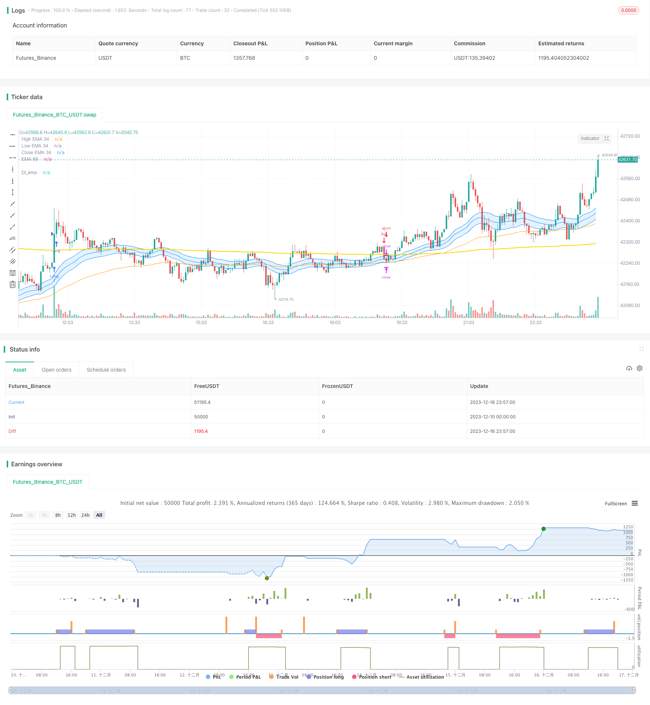

> Name

Momentum-Breakthrough-Moving-Average-Trading-Strategy
> Author

ChaoZhang

> Strategy Description


 [trans]

### Overview
This strategy is a trend following strategy that combines momentum indicators and moving average indicators. It uses exponential moving averages as its primary trend-judging tool, combined with high volume to issue buy and sell signals. This strategy is suitable for medium and long-term positions and tracking the main market trends.
### Strategy Principles
1. Use the 34-period EMA as the main trend judgment tool. When the price crosses above the EMA, it is a bullish signal, and when it crosses below the EMA, it is a bearish signal.
2. Compare the 21-day moving average of volume to the most recent 1.5x average volume. If the current trading volume is greater than 1.5 times the average volume, it is considered high volume.
3. Only when the price forms a golden cross with the EMA and the volume is high, a buy signal is issued; only when the price forms a dead cross with the EMA and the volume is high, a sell signal is issued.
4. After opening a position, set the stop loss and take profit ratios, which can be customized.
This comprehensively considers various factors such as trend, momentum and risk control, making it more comprehensive and stable.
### Advantage Analysis
1. Use EMA to determine the main trend direction of the market and effectively track the mid- and long-term trends.
2. Perform FILTER in combination with high trading volume to avoid being misled by false breakthroughs.
3. Setting the stop-loss and stop-profit ratios can effectively control the risk of a single transaction.
4. Adopt a medium- and long-term position strategy to avoid being affected by high-frequency market noise and maintain stable profits.

### Risks and Solutions
1. There is a high probability of being misled by high-frequency false breakthroughs. The solution is to add transaction volume verification.
2. Medium and long-term positions increase capital occupation. The solution is to appropriately control the position size.
3. The moving average trading strategy may lag behind and fail to seize short-term opportunities. The solution is to combine other short-term signals.
4. Large losses may occur in sharply volatile market conditions. The solution is to set an appropriate stop loss position.
### Optimization direction
1. Test the pros and cons of different EMA cycle parameters and find the optimal parameters.
2. Test the impact of different stop-loss and take-profit ratio parameters on the strategy’s return rate and risk resistance.
3. Try to combine other indicators such as MACD, KDJ, etc. to determine short-term opportunities.
4. Optimize fund management strategies, such as position control, dynamic stop loss and other methods.

### Summarize
Generally speaking, this strategy is a medium and long-term position holding strategy with stable value. It can effectively track the main market trends and use volume indicators to filter out misleading signals. At the same time, take appropriate stop-loss and stop-profit measures to control the risk of a single transaction. It can be said to be a "fixed light" work for trend trading. If proper optimization is carried out, I believe that a more ideal strategic return rate can be obtained.
|| 

### Overview

This strategy is a trend tracking strategy that combines momentum indicators and moving averages. It uses exponential moving averages as the main trend judgment tool and issues buy and sell signals in combination with high trading volume. The strategy is suitable for medium and long term holdings to track major market trends.

### Strategy Principles  

1. Use 34-period EMA as the main tool for trend judgment. When the price crosses above the EMA, it is a bullish signal, and when it crosses below, it is a bearish signal.

2. Compare the 21-day moving average of volume with 1.5 times the recent average. If the current volume is greater than 1.5 times the average, it is considered high volume.

3. Buy signals are only issued when the price crosses the EMA upward and the volume is high. Sell signals are only issued when the price crosses the EMA downward and the volume is high.  

4. After opening a position, set stop loss and take profit ratios, which can be customized.

By comprehensively considering factors such as trends, momentum and risk control, it is relatively comprehensive and stable.

### Advantage Analysis   

1. Using EMA to determine the main trend direction of the market can effectively track medium and long term trends.

2. Combining with high trading volume FILTER can avoid being misled by false breakouts.  

3. Setting stop loss and take profit ratios can effectively control the risk of single trades.

4. Adopting medium and long term holding strategies is not affected by high frequency market noise and steadily profitable.

### Risks and Solutions

1. High probability of being misled by high frequency false breakouts. The solution is to add transaction volume verification.

2. Medium and long term holdings increase capital occupancy. The solution is to appropriately control the position size.

3. Moving average trading strategies may lag and miss short-term opportunities. The solution is to combine other short-term signals. 

4. Significant fluctuations in volatile markets can lead to large losses. The solution is to set the appropriate stop loss position.

### Optimization Directions  

1. Test the strengths and weaknesses of different EMA cycle parameters to find the optimal parameters.

2. Test the impact of different stop loss and take profit ratio parameters on strategy return and risk resistance.  

3. Try combining other indicators such as MACD and KDJ to determine short-term opportunities.

4. Optimize capital management strategies such as position control and dynamic stop loss methods.

### Summary  

Overall, this strategy is a stable medium-long term holding strategy. It can effectively track major market trends and use volume indicators to filter misleading signals. At the same time, appropriate stop loss and take profit means are adopted to control the risk of single trades. It can be described as a "steady and light" trend trading work. With proper optimization, I believe it can achieve a more ideal strategy rate of return.

[/trans]

> Strategy Arguments


|Argument|Default|Description|
|----|----|----|
|v_input_1|true|(?Cài đặt thời gian)Ngày bắt đầu|
|v_input_2|true|Tháng bắt đầu|
|v_input_3|2023|Năm bắt đầu|
|v_input_4|31|Đến ngày|
|v_input_5|12|Đến tháng|
|v_input_6|2033|Đến năm|
|v_input_int_1|34|(?Cài đặt EMA)EMA 34|
|v_input_7|21|(?Cài đặt Volume)Đường Trung Bình Vol|
|v_input_8|1.5|Mức trung bình|
|v_input_float_1|true|(?Cài đặt TP & SL %)Stop Loss %|
|v_input_float_2|2|Take Profit %|


> Source (PineScript)

``` pinescript
/*backtest
start: 2023-12-10 00:00:00
end: 2023-12-17 00:00:00
period: 3m
basePeriod: 1m
exchanges: [{"eid":"Futures_Binance","currency":"BTC_USDT"}]
*/

// This source code is subject to the terms of the Mozilla Public License 2.0 at https://mozilla.org/MPL/2.0/
// © TradingSignalHub

//@version=5
strategy("Di strategy ", overlay=true)

//date setting
fromDay = input(defval = 1, title = "Ngày bắt đầu", group = "Cài đặt thời gian")
fromMonth = input(defval = 1, title = "Tháng bắt đầu", group = "Cài đặt thời gian")
fromYear = input(defval = 2023, title = "Năm bắt đầu", group = "Cài đặt thời gian")

toDay = input(defval = 31, title = "Đến ngày", group = "Cài đặt thời gian")
toMonth = input(defval = 12, title = "Đến tháng", group = "Cài đặt thời gian")
toYear = input(defval = 2033, title = "Đến năm", group = "Cài đặt thời gian")

startDate = timestamp(fromYear, fromMonth, fromDay, 00, 00)
finishDate = timestamp(toYear, toMonth, toDay, 00, 00)
time_cond() => 
    time >= startDate and time <= finishDate ? true : false

//snr setting
price = close
ema34     = input.int(34, minval=2, title="EMA 34", group = "Cài đặt EMA")
pacC        = ta.ema(close,ema34)
pacL        = ta.ema(low,ema34)
pacH        = ta.ema(high,ema34)
L =plot(pacL, color=color.rgb(3, 139, 251), linewidth=1, title="High EMA 34")
H =plot(pacH, color=color.rgb(3, 137, 247), linewidth=1, title="Low EMA 34")
C =plot(pacC, color=color.rgb(4, 138, 248), linewidth=1, title="Close EMA 34")
fill(L,H, color=color.rgb(33, 149, 243, 85),title="Fill dãi EMA 34")

//EMA full setting
ema89 =ta.ema(close,89)
DIema= ta.ema(close,458)
plot(DIema,title="DI_ema",color=color.rgb(247, 214, 3),linewidth=2)
plot(ema89,title="EMA 89",color=color.orange,linewidth=1)
//ema200= ta.ema(close,200)
//ema610= ta.ema(close,610)
//ema144= ta.ema(close,144)
//ema258= ta.ema(close,258)
//plot(ema200,title="EMA 200",color=color.purple,linewidth=2)
//plot(ema610,title="EMA 610",color=color.white,linewidth=2)
//plot(ema144,title="144Banker",color=color.green,linewidth=1)
//plot(ema258,title="258Banker",color=color.yellow,linewidth=1)

EMAbuy = ta.crossover(price, DIema)
EMAsell = ta.crossunder(price, DIema)

//volume setting
vol = (volume)
length = input(21, "Đường Trung Bình Vol", group = "Cài đặt Volume" )
div = input(1.5, "Mức trung bình", group = "Cài đặt Volume" )
up = close > open 
down = open>close
Volhigh = volume> (ta.ema(volume, length)*div)

//Cài đặt lệnh
longCondition = EMAbuy and Volhigh
if time_cond()
    if (longCondition)
        strategy.entry("Long", strategy.long)

shortCondition = EMAsell and Volhigh
if time_cond()
    if (shortCondition)
        strategy.entry("Sell", strategy.short)


stopPer = input.float(1.0, title="Stop Loss %", group = "Cài đặt TP & SL %" ) / 100
takePer = input.float(2.0, title="Take Profit %", group = "Cài đặt TP & SL %" ) / 100

// Determine where you've entered and in what direction
longStop = strategy.position_avg_price * (1 - stopPer)
shortStop = strategy.position_avg_price * (1 + stopPer)
shortTake = strategy.position_avg_price * (1 - takePer)
longTake = strategy.position_avg_price * (1 + takePer)

if strategy.position_size > 0 
    strategy.exit(id="Đóng Long", stop=longStop, limit=longTake)
if strategy.position_size < 0 
    strategy.exit(id="Đóng Sell", stop=shortStop, limit=shortTake)

alertcondition(longCondition, title = "Tín hiệu BUY", message = "Tín hiệu BUY")
alertcondition(shortCondition, title = "Tín hiệu SELL", message = "Tín hiệu SELL")
//PLOT FIXED SLTP LINE
//plotshape(strategy.position_size > 0 ? longStop : na, shape.labelup, color=color.rgb(34, 249, 6, 50), linewidth=1, title="Long SL")
//plot(strategy.position_size < 0 ? shortStop : na, style=plot.style_circles, color=color.rgb(250, 8, 8, 50), linewidth=1, title="Short SL")
//plot(strategy.position_size > 0 ? longTake : na, style=plot.style_linebr, color=color.rgb(59, 248, 7), linewidth=1, title="Long TP")
//plot(strategy.position_size < 0 ? shortTake : na, style=plot.style_linebr, color=color.rgb(247, 7, 7), linewidth=1, title="Short TP")

```

> Detail

https://www.fmz.com/strategy/435776

> Last Modified

2023-12-18 18:01:59
