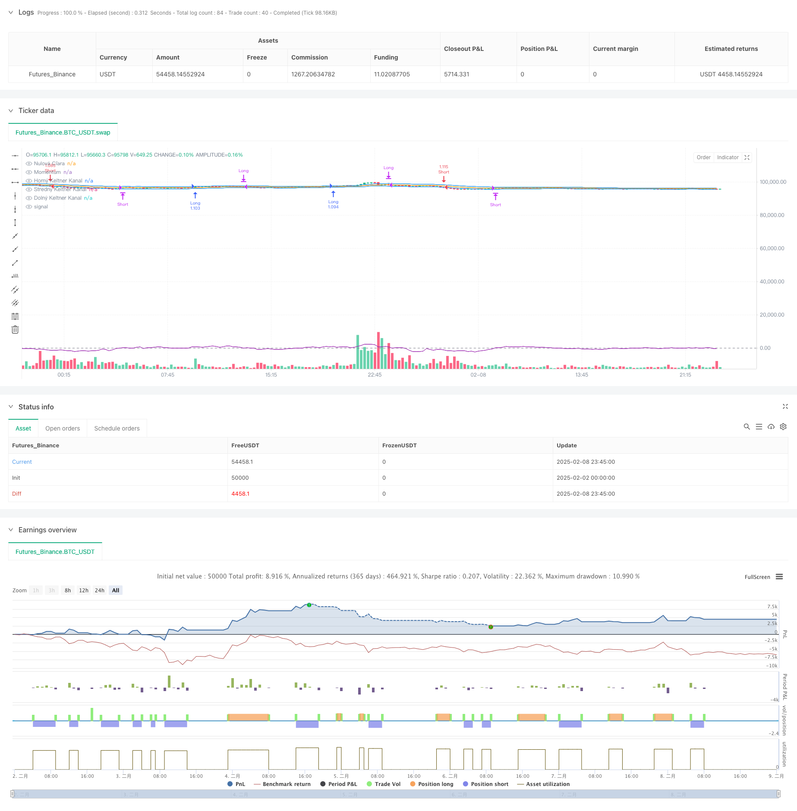

> Name

Momentum-Driven-Keltner-Channel-Breakout-Trading-Strategy
> Author

ChaoZhang

> Strategy Description



[trans]
#### Overview
This strategy is a trading system that combines Keltner Channels and Momentum indicators. It is mainly used to identify potential breakout trading opportunities and determine the strength of market movements. The strategy monitors whether the price breaks through the upper and lower rails of the Keltner Channel, and combines the momentum indicator to confirm the strength of the trend to make trading decisions.
#### Strategy Principle
The core logic of the strategy is based on two main technical indicators:
1. Keltner Channel (KC):
- Medium track: Use the 20-period exponential moving average (EMA)
- Upper and lower rails: add or subtract 1.5 times the true amplitude (ATR) on the basis of the middle rail
2. Momentum indicator:
- Calculate price change rate using 14 periods
- Positive values indicate upward momentum, negative values indicate downward momentum
Trading signal generation rules:
- Conditions for going long: the price breaks through the upper track and the momentum indicator is greater than 0
- Short selling conditions: price breaks through the lower track and the momentum indicator is less than 0
- Conditions for closing positions: price crosses the middle track or momentum indicator turns
#### Strategic Advantages
1. High signal reliability: combines the confirmation of trend and momentum.
2. Reasonable risk control: use the middle rail of the Keltner Channel as the stop loss position
3. Strong adaptability: can be used in different market environments
4. Adjustable parameters: easy to optimize according to the characteristics of different varieties
5. Clear logic: clear trading rules, easy to execute and backtest
#### Strategy Risk
1. A volatile market may produce false breakthrough signals
2. Response to trend turning points may be delayed
3. Improper parameter settings may affect strategy performance
4. Transaction costs may affect strategy returns
5. When the market fluctuates too much, the stop loss position may be far away
Risk control suggestions:
-Set maximum position limit
- Dynamically adjust parameters based on market volatility
- Add trend confirmation filter conditions
- Consider setting a fixed stop loss position
#### Strategy optimization direction
1. Dynamic parameter optimization:
- Adaptively adjust channel width based on volatility
- Adjust momentum cycles based on market cycle characteristics
2. Signal filtering enhancement:
-Add trading volume confirmation conditions
- Combined with more technical indicators for verification
3. Optimization of stop profit and stop loss:
- Implement dynamic stop loss position setting
- Added tracking stop profit function
4. Improvement of warehouse management:
- Dynamically adjust positions based on volatility
- Achieve opening and closing positions in batches
#### Summary
This strategy builds a more reliable trend following trading system by combining Keltner Channel and momentum indicators. The advantage of the strategy lies in high signal reliability and reasonable risk control, but it is also necessary to pay attention to the impact of the market environment on strategy performance. Through improvements in parameter optimization and signal filtering, the stability and profitability of the strategy are expected to be further improved.
|| 

#### Overview
This strategy combines Keltner Channels and Momentum indicators to identify potential breakout trading opportunities and determine market trend strength. The strategy monitors price breakouts of Keltner Channels while using the Momentum indicator to confirm trend strength for making trading decisions.

#### Strategy Principles
The core logic is based on two main technical indicators:
1. Keltner Channels (KC):
- Middle line: 20-period Exponential Moving Average (EMA)
- Upper/Lower bands: Middle line ±1.5 times Average True Range (ATR)
2. Momentum Indicator:
- Calculates price rate of change over 14 periods
- Positive values indicate bullish momentum, negative values indicate bearish momentum

Trading signal rules:
- Long entry: Price breaks above upper band and momentum is positive
- Short entry: Price breaks below lower band and momentum is negative
- Exit conditions: Price crosses middle band or momentum reverses

#### Strategy Advantages
1. High signal reliability: Combines trend and momentum confirmation
2. Reasonable risk control: Uses Keltner Channel middle line as stop loss
3. Strong adaptability: Applicable in different market conditions
4. Adjustable parameters: Easy to optimize for different instruments
5. Clear logic: Trading rules are explicit, easy to implement and backtest

#### Strategy Risks
1. False breakout signals in ranging markets
2. Potential lag at trend reversal points
3. Parameter sensitivity affecting strategy performance
4. Trading costs impact on strategy returns
5. Wide stop loss distances in high volatility periods

Risk control suggestions:
- Set maximum position limits
- Dynamically adjust parameters based on volatility
- Add trend confirmation filters
- Consider fixed stop loss levels

#### Optimization Directions
1. Dynamic Parameter Optimization:
- Adapt channel width based on volatility
- Adjust momentum period based on market cycles

2. Signal Filter Enhancement:
- Add volume confirmation conditions
- Incorporate additional technical indicators

3. Stop Loss/Profit Optimization:
- Implement dynamic stop loss positioning
- Add trailing stop profit functionality

4. Position Management Improvement:
- Dynamically adjust position size based on volatility
- Implement scaled entry and exit

#### Summary
The strategy combines Keltner Channels and Momentum indicators to create a reliable trend-following trading system. Its strengths lie in high signal reliability and reasonable risk control, though market conditions can impact performance. Through parameter optimization and signal filter improvements, the strategy's stability and profitability can be further enhanced.

[/trans]


> Source (PineScript)

``` pinescript
/*backtest
start: 2025-02-02 00:00:00
end: 2025-02-09 00:00:00
period: 15m
basePeriod: 15m
exchanges: [{"eid":"Futures_Binance","currency":"BTC_USDT"}]
*/

//@version=5
strategy("Keltner Channels + Momentum Strategy", overlay=true, default_qty_type=strategy.percent_of_equity, default_qty_value=200)

// Nastavenia Keltner Channels
lengthKC = input.int(20, title="KC Dĺžka")
mult = input.float(1.5, title="KC Multiplikátor")
src = input(close, title="Zdroj")

// Výpočet Keltner Channels
emaKC = ta.ema(src, lengthKC)
atrKC = ta.atr(lengthKC)
upperKC = emaKC + mult * atrKC
lowerKC = emaKC - mult * atrKC

// Vykreslenie Keltner Channels
plot(upperKC, color=color.blue, title="Horný Keltner Kanal")
plot(emaKC, color=color.orange, title="Stredný Keltner Kanal")
plot(lowerKC, color=color.blue, title="Dolný Keltner Kanal")

// Nastavenia Momentum
lengthMomentum = input.int(14, title="Momentum Dĺžka")
momentum = ta.mom(close, lengthMomentum)

// Vykreslenie Momentum
hline(0, "Nulová Čiara", color=color.gray)
plot(momentum, color=color.purple, title="Momentum")

// Logika stratégie
// Vstup do Long pozície: cena prekročí horný Keltner kanal a Momentum je rastúci
longCondition = ta.crossover(close, upperKC) and momentum > 0
if (longCondition)
    strategy.entry("Long", strategy.long)

// Vstup do Short pozície: cena prekročí dolný Keltner kanal a Momentum je klesajúci
shortCondition = ta.crossunder(close, lowerKC) and momentum < 0
if (shortCondition)
    strategy.entry("Short", strategy.short)

// Výstup z Long pozície: cena prekročí stredný Keltner kanal alebo Momentum klesne pod 0
exitLong = ta.crossunder(close, emaKC) or momentum < 0
if (exitLong)
    strategy.close("Long")

// Výstup z Short pozície: cena prekročí stredný Keltner kanal alebo Momentum stúpne nad 0
exitShort = ta.crossover(close, emaKC) or momentum > 0
if (exitShort)
    strategy.close("Short")

```

> Detail

https://www.fmz.com/strategy/481364

> Last Modified

2025-02-10 15:03:16
