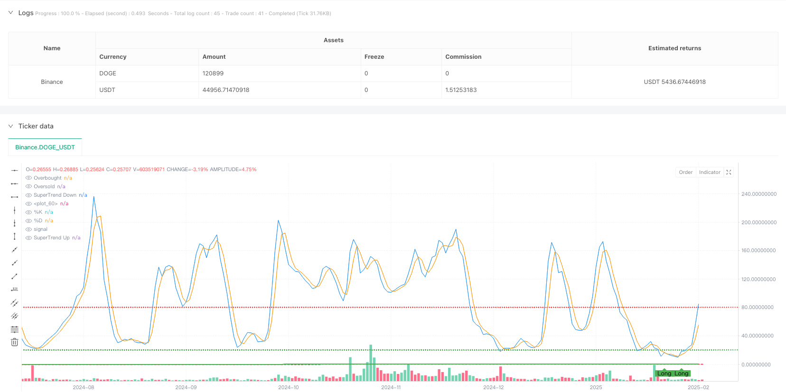
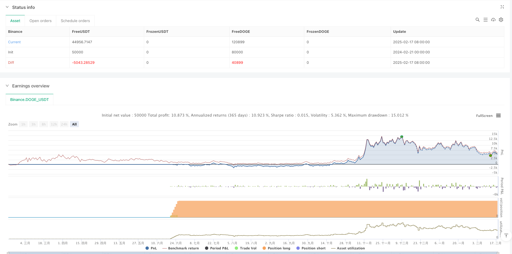

> Name

Momentum-Enhanced-SuperTrend-Stochastic-Dual-Indicator-Trading-Strategy
> Author

ianzeng123

> Strategy Description





[trans]#### Overview
This is a compound trading strategy that combines SuperTrend and Stochastic Oscillator. This strategy uses the SuperTrend indicator to identify market trend direction, while using the stochastic oscillator to confirm price momentum, thereby achieving more accurate trading signal generation. The strategy uses ATR (average true amplitude) as the volatility reference and tracks the trend by dynamically adjusting support/resistance levels.
#### Strategy Principle
The core logic of the strategy is based on the following key components:
1. SuperTrend indicator uses 10-period ATR and 3.0x multiplier to calculate dynamic support and resistance channels
2. The stochastic oscillator uses the classic parameter setting (14, 3, 3) to identify overbought and oversold areas.
3. Conditional requirements for going long:
   - SuperTrend indicates bullish trend
   - The stochastic indicator %K line crosses the %D line
   - %K value is in the oversold zone (below 20)
4. Short selling conditions and requirements:
   - SuperTrend indicates bearish trend
   - The stochastic indicator %K line crosses below the %D line
   - %K value is in overbought zone (above 80)
#### Strategic Advantages
1. Combine trend tracking and momentum confirmation to significantly improve the reliability of trading signals
2. Use ATR to dynamically adjust the SuperTrend channel width to better adapt to market fluctuations
3. Use the overbought and oversold filter of the stochastic indicator to avoid counter-trend trading in extreme areas.
4. Strict signal conditions can effectively filter out false breakthroughs and reduce false signals
5. The strategy logic is clear and the parameters are highly adjustable, suitable for different market environments.
#### Strategy Risk
1. In a volatile market, too many trading signals may be generated, increasing transaction costs.
2. Signal conditions that are too strict may miss some potential trading opportunities.
3. The SuperTrend indicator may lag when it fluctuates violently.
4. Stochastic may signal reversal prematurely in a strong trending market
The following risk control measures are recommended:
-Set reasonable stop loss and take profit positions
- Consider adding a trend strength filter (like ADX)
- Dynamically adjust parameters according to market environment
#### Strategy optimization direction
1. Introduce trend strength indicators (such as ADX) to optimize transaction filtering:
   - Only open positions when the trend is clear
   - Can avoid frequent trading that shakes the market
2. Optimize stochastic indicator parameters:
   - Consider using adaptive cycles
   - Dynamically adjust overbought and oversold thresholds based on volatility
3. Improve the fund management system:
   - Set dynamic stop loss position based on ATR
   - Dynamic adjustments to achieve profit targets
4. Add time filter function:
   - Avoid periods of low liquidity
   - Halt trading ahead of important data releases
#### Summary
This strategy achieves an organic combination of trend following and momentum confirmation by combining SuperTrend and the stochastic oscillator. The strategy design is reasonable and has good adjustability and adaptability. Through the suggested optimization direction, the stability and profitability of the strategy are expected to be further improved. In real trading, it is recommended that traders make targeted adjustments to parameters based on specific market characteristics and their own risk preferences. ||
#### Overview
This is a composite trading strategy that combines the SuperTrend indicator with the Stochastic Oscillator. The strategy utilizes SuperTrend to identify market trend direction while using the Stochastic Oscillator to confirm price momentum, thereby generating more accurate trading signals. The strategy employs ATR (Average True Range) as volatility reference, tracking trends through dynamic support/resistance level adjustments.

#### Strategy Principles
The core logic is based on the following key components:
1. SuperTrend indicator uses 10-period ATR and 3.0 multiplier to calculate dynamic support/resistance channels
2. Stochastic Oscillator adopts classic parameters (14,3,3) to identify overbought/oversold areas
3. Long conditions require:
   - SuperTrend indicates bullish trend
   - Stochastic %K line crosses above %D line
   - %K value is in oversold area (below 20)
4. Short conditions require:
   - SuperTrend indicates bearish trend
   - Stochastic %K line crosses below %D line
   - %K value is in overbought area (above 80)

#### Strategy Advantages
1. Combines trend following and momentum confirmation, significantly improving signal reliability
2. Uses ATR to dynamically adjust SuperTrend channel width, better adapting to market volatility
3. Filters extreme area counter-trend trades through Stochastic indicator's overbought/oversold levels
4. Strict signal conditions effectively filter false breakouts, reducing fake signals
5. Clear strategy logic with adjustable parameters, suitable for different market environments

#### Strategy Risks
1. May generate excessive trading signals in ranging markets, increasing transaction costs
2. Strict signal conditions might miss some potential trading opportunities
3. SuperTrend indicator may lag during violent volatility
4. Stochastic indicator might generate premature reversal signals in strong trend markets
Recommended risk control measures:
- Set reasonable stop-loss and take-profit levels
- Consider adding trend strength filter (like ADX)
- Dynamically adjust parameters based on market environment

#### Strategy Optimization Directions
1. Introduce trend strength indicator (like ADX) to optimize trade filtering:
   - Only enter positions during clear trends
   - Can avoid frequent trading in ranging markets
2. Optimize Stochastic indicator parameters:
   - Consider using adaptive periods
   - Dynamically adjust overbought/oversold thresholds based on volatility
3. Improve money management system:
   - Set dynamic stop-loss levels based on ATR
   - Implement dynamic profit target adjustments
4. Add time filtering functionality:
   - Avoid low liquidity periods
   - Pause trading before important data releases

#### Summary
The strategy achieves an organic combination of trend following and momentum confirmation by combining SuperTrend and Stochastic Oscillator. The strategy design is reasonable with good adjustability and adaptability. Through the suggested optimization directions, the strategy's stability and profitability can be further improved. In live trading, it is recommended that traders make targeted parameter adjustments based on specific market characteristics and their own risk preferences.[/trans]


> Source (PineScript)

``` pinescript
/*backtest
start: 2024-02-21 00:00:00
end: 2025-02-18 08:00:00
period: 1d
basePeriod: 1d
exchanges: [{"eid":"Binance","currency":"DOGE_USDT"}]
*/

//@version=5
strategy("SuperTrend + Stochastic Strategy", overlay=true, default_qty_type=strategy.percent_of_equity, default_qty_value=10)

// === Vstupy ===
// SuperTrend
atrPeriod = input.int(10, title="ATR Period", minval=1)
multiplier = input.float(3.0, title="SuperTrend Multiplier", step=0.1)

// Stochastic Oscillator
kPeriod = input.int(14, title="%K Period", minval=1)
dPeriod = input.int(3, title="%D Period", minval=1)
smoothK = input.int(3, title="Smooth %K", minval=1)

// === Výpočty Indikátorov ===
// Výpočet ATR
atr = ta.atr(atrPeriod)

// Výpočet SuperTrend
upperBasic = (ta.highest(high, 1) + ta.lowest(low, 1)) / 2 + (multiplier * atr)
lowerBasic = (ta.highest(high, 1) + ta.lowest(low, 1)) / 2 - (multiplier * atr)

var float upperBand = na
var float lowerBand = na
var bool isBullish = true

if (na(upperBand[1]))
    upperBand := upperBasic
    lowerBand := lowerBasic
else
    upperBand := close[1] > upperBand[1] ? math.max(upperBasic, upperBand[1]) : upperBasic
    lowerBand := close[1] < lowerBand[1] ? math.min(lowerBasic, lowerBand[1]) : lowerBasic

isBullish := close > upperBand[1] ? true : close < lowerBand[1] ? false : isBullish[1]

// Výpočet Stochastic Oscillator
stochK = ta.sma(ta.stoch(high, low, close, kPeriod), smoothK)
stochD = ta.sma(stochK, dPeriod)

// === Podmienky Pre Vstupy ===
// Nákupný signál
longCondition = isBullish and ta.crossover(stochK, stochD) and stochK < 20

// Predajný signál
shortCondition = not isBullish and ta.crossunder(stochK, stochD) and stochK > 80

// === Vstupné Signály ===
if (longCondition)
    strategy.entry("Long", strategy.long)

if (shortCondition)
    strategy.entry("Short", strategy.short)

// === Výstupné Podmienky ===
// Môžete pridať vlastné podmienky pre uzatvorenie pozícií alebo použitie stop-loss/take-profit

// === Vykreslenie Indikátorov na Grafe ===
// Vykreslenie SuperTrend
plot(isBullish ? upperBand : na, color=color.green, title="SuperTrend Up", linewidth=2)
plot(not isBullish ? lowerBand : na, color=color.red, title="SuperTrend Down", linewidth=2)
fill(plot(isBullish ? upperBand : na, color=color.green), plot(not isBullish ? lowerBand : na, color=color.red), color=isBullish ? color.new(color.green, 90) : color.new(color.red, 90), title="SuperTrend Fill")

// Vykreslenie Stochastic Oscillator na samostatnom okne
hline(80, "Overbought", color=color.red, linestyle=hline.style_dotted)
hline(20, "Oversold", color=color.green, linestyle=hline.style_dotted)
plot(stochK, color=color.blue, title="%K")
plot(stochD, color=color.orange, title="%D")

// Vizualizácia Signálov
plotshape(series=longCondition, title="Long Entry", location=location.belowbar, color=color.green, style=shape.labelup, text="Long")
plotshape(series=shortCondition, title="Short Entry", location=location.abovebar, color=color.red, style=shape.labeldown, text="Short")

```

> Detail

https://www.fmz.com/strategy/482831

> Last Modified

2025-02-20 14:51:10
