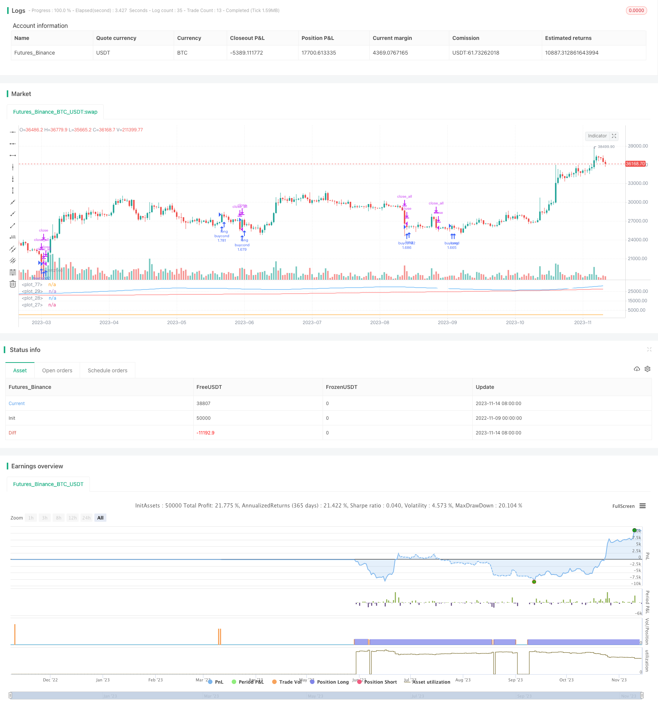

> Name

Momentum-Exhaustion-Strategy
> Author

ChaoZhang

> Strategy Description


[trans]


## Overview
The Momentum Oscillator Depletion Strategy is a trend following strategy that utilizes moving averages and the Price Percent Oscillator to minimize downside risk. This strategy belongs to the index fund trading model and can effectively control risks.
## Strategy Principle
The core indicators of this strategy are the exhaustion value and the exhaustion moving average. Exhaustion value is a measure of price oscillations calculated from the closing price, the highest price and the lowest price. The specific calculation method is: (closing price + highest price + lowest price - moving average of exhaustion value) / (moving average of exhaustion value). The exhaustion average is a moving average of exhaustion values. When the exhaustion value goes above the exhaustion moving average, it means that the market is consolidating and a new trend may be formed; when the exhaustion value goes below the exhaustion moving average, it means that the trend is reversing and you should consider taking profit.
In addition, the strategy also uses long and short-term moving averages to assist in judging trends, including the 300-day line, the 150-day line and the 50-day line. When the short-term moving average crosses below the long-term moving average, it indicates a trend reversal and a stop loss should be considered.
MACD is also used to determine short-term buying and selling points. When the MACD line crosses the signal line, it is bullish; when it crosses below the signal line, it is bearish. RSI lows are also used as buy signals.
The specific entry and exit logic is:
Buying conditions: The exhaustion value crosses the exhaustion moving average, and the 50-day line is higher than the 150-day line; or the RSI is lower than 30.
Short-term stop loss conditions: the exhaustion value falls below the exhaustion moving average; or the MACD falls below the signal line.
Medium and long-term stop loss conditions: the 50-day line goes below the 150-day line; or the 150-day line goes below the 300-day line.
## Strategic Advantages
This strategy combines multiple indicators to determine trends and endtime exhaustion to control risks and has the following advantages:
1. The exhaustion indicator can effectively judge consolidation and reversal. Timely detection of trend reversals is the key to effectively controlling risks.
2. Use multi-time period moving averages to determine trends and avoid being misled by short-term market noise.
3. MACD assists in confirming buying and selling points and improves the actual effectiveness of the strategy.
4. The RSI indicator plays the role of buying low and selling high, and buying when it is oversold.
5. A clear stop-profit and stop-loss strategy can effectively control the risk of each transaction.
## Strategy Risk
This strategy also has certain risks:
1. Based on the judgment of various indicators, improper parameter settings may lead to incorrect trading signals. Optimization parameters need to be tested repeatedly.
2. The depletion indicator is not completely reliable and may fail when there is a low price divergence.
3. Improper setting of the stop loss point may cause ultra-short-term shocks and lead to stop loss. The stop loss point should take into account the long and short effects of the strategy.
4. When the market as a whole fluctuates, the indicators will become invalid and you need to pay attention to controlling the size of the position.
## Strategy optimization direction
This strategy can be optimized from the following aspects:
1. Test different parameter combinations to find the best parameters to reduce false signals. Adjustable key parameters include moving average period, exhaustion value period, etc.
2. Use volatility indicators such as ATR to dynamically adjust the stop loss range, and appropriately relax the stop loss range during large fluctuations.
3. Optimize position management, different position ratio rules can be preset for different market stages.
4. Combine with graphical indicators such as accumulation lines and support lines to improve the actual effectiveness of the strategy.
5. Add machine learning algorithms to assist in judging the effectiveness of key indicators and achieve dynamic optimization.
## Summarize
The momentum depletion strategy uses a variety of indicators to determine trend reversal to control trading risks. This strategy has trend tracking capabilities and can effectively determine the timing of buying and selling. The strategy effect can be further improved through parameter optimization, stop loss rule setting, graphic indicator assistance, etc. Generally speaking, this strategy has certain adaptability to market fluctuations and can be used as one of the risk control strategy options.
||
 

## Overview

The Momentum Exhaustion Strategy is a trend following strategy that utilizes moving averages and price percentage oscillators to minimize downside exposure. It belongs to index fund trading models and can effectively control risks.

## Strategy Logic

The core indicators of this strategy are Exhaustion and Exhaustion Moving Average. Exhaustion is a measure of price oscillation, calculated from close, high and low prices. The specific calculation is: (close+high+low-moving average of Exhaustion)/moving average of Exhaustion. The Exhaustion Moving Average is the moving average of Exhaustion. When Exhaustion crosses above Exhaustion Moving Average, it indicates consolidation in the market and a possible new trend forming. When Exhaustion crosses below Exhaustion Moving Average, it signals a trend reversal and we should consider taking profit.

In addition, the strategy also uses long and short term moving averages to assist in determining the trend, including 300-day, 150-day and 50-day lines. When the short term moving average crosses below the long term moving average, it signals a trend reversal and we should consider stopping loss.

MACD is also used for short-term buy and sell signals. When MACD line crosses above signal line, it indicates a bullish signal, and when MACD crosses below signal line, it indicates a bearish signal. RSI bottoms are also used as buy signals.

The specific entry and exit logic is:

Buy signal: Exhaustion crossing above Exhaustion Moving Average, and 50-day MA above 150-day MA; or RSI below 30. 

Short-term stop loss: Exhaustion crossing below Exhaustion Moving Average; or MACD crossing below signal line.

Mid-long term stop loss: 50-day MA crossing below 150-day MA; or 150-day MA crossing below 300-day MA.

## Advantages of the Strategy

This strategy combines multiple indicators to determine the trend exhaustion and control risks. The advantages are:

1. The Exhaustion indicator can effectively identify consolidation and reversal. Timely detecting trend reversal is key to controlling risks.

2. Using moving averages of multiple timeframes to determine the trend avoids being misled by short-term market noise.

3. MACD helps confirm buy and sell signals, improving the strategy's performance. 

4. RSI plays its role of buying low and selling high, buying at extremely oversold situations.

5. The clear profit taking and stop loss strategy can effectively control the risk of each trade.

## Risks of the Strategy

There are also some risks with this strategy:

1. Relying on multiple indicators, improper parameter settings may lead to wrong trading signals. Parameters need to be repeatedly tested and optimized.

2. The Exhaustion indicator is not completely reliable, it may fail when there is price divergence.

3. Improper stop loss placement may result in being stopped out by short-term fluctuations. Stop loss should balance long and short term effects.

4. When the overall market is ranging, the indicators may fail. Position sizing needs to be controlled.

## Optimization Directions

The strategy can be optimized in the following aspects:

1. Test different parameter combinations to find the optimal parameters and reduce false signals. Key adjustable parameters include moving average periods, Exhaustion periods etc.

2. Incorporate volatility indicators like ATR to dynamically adjust stop loss range according to market volatility.

3. Optimize position sizing, with different position sizing rules for different market conditions. 

4. Incorporate chart patterns like trendlines, support lines to improve strategy performance.

5. Add machine learning algorithms to assist in gauging the effectiveness of key indicators, realizing dynamic optimization.

## Conclusion

The Momentum Exhaustion Strategy combines multiple indicators to identify trend reversal and control risks. It has trend following capability and can effectively determine entry and exit points. Further improvements can be made through parameter optimization, stop loss rules, incorporating chart patterns and more. Overall it has adaptability to market fluctuations and can be considered as a risk control strategy option.

[/trans]

> Strategy Arguments


|Argument|Default|Description|
|----|----|----|
|v_input_1|12|Fast Length|
|v_input_2|26|Slow Length|
|v_input_3_close|0|Source: close|high|low|open|hl2|hlc3|hlcc4|ohlc4|
|v_input_4|9|Signal Smoothing|
|v_input_5|false|Simple MA (Oscillator)|
|v_input_6|false|Simple MA (Signal Line)|
|v_input_7|14|Length|


> Source (PineScript)

``` pinescript
/*backtest
start: 2022-11-09 00:00:00
end: 2023-11-15 00:00:00
period: 1d
basePeriod: 1h
exchanges: [{"eid":"Futures_Binance","currency":"BTC_USDT"}]
*/

// This source code is subject to the terms of the Mozilla Public License 2.0 at https://mozilla.org/MPL/2.0/
// © spiritualhealer117

//@version=4

strategy("Infiten Slope Strategy", overlay=false,calc_on_every_tick = true, default_qty_type=strategy.percent_of_equity, default_qty_value = 100)
// //TIME RESTRICT FOR BACKTESTING {
// inDateRange = (time >= timestamp(syminfo.timezone, 2003,
//          1, 1, 0, 0)) and
//      (time < timestamp(syminfo.timezone, 2021, 5, 25, 0, 0))
// //}

//OPTIMAL PARAMETERS {
daysback = 30
volumesens = 1.618
//}
//Calculating Exhaustion and Exhaustion Moving Average {
clh = close+low+high
exhaustion = (clh-sma(clh,daysback))/sma(clh,daysback)
exhaustionSma = sma(exhaustion,daysback)
//}
//Long Term Moving Averages for sell signals {
red = sma(close,300)
white = sma(close,150)
blue = sma(close,50)

plot(red,color=color.red)
plot(white,color=color.white)
plot(blue,color=color.blue)
//}
//MACD Calculation {
fast_length = input(title="Fast Length", type=input.integer, defval=12)
slow_length = input(title="Slow Length", type=input.integer, defval=26)
src = input(title="Source", type=input.source, defval=close)
signal_length = input(title="Signal Smoothing", type=input.integer, minval = 1, maxval = 50, defval = 9)
sma_source = input(title="Simple MA (Oscillator)", type=input.bool, defval=false)
sma_signal = input(title="Simple MA (Signal Line)", type=input.bool, defval=false)
// Calculating
fast_ma = sma_source ? sma(src, fast_length) : ema(src, fast_length)
slow_ma = sma_source ? sma(src, slow_length) : ema(src, slow_length)
macd = fast_ma - slow_ma
signal = sma_signal ? sma(macd, signal_length) : ema(macd, signal_length)
hist = macd - signal
//}
//SIGMOID Bottom {
timeAdjust = 300/sma(close,500)
//}
//RSI bottom {
len = input(14, minval=1, title="Length")
up = rma(max(change(src), 0), len)
down = rma(-min(change(close), 0), len)
rsi = down == 0 ? 100 : up == 0 ? 0 : 100 - (100 / (1 + up / down))
//}

//Entry and exit conditions {
//Sell conditions
bigVolume = sma(volume,30)*volumesens
sellcond1 = crossunder(exhaustion,exhaustionSma) and volume > bigVolume
sellcond2 = crossunder(macd,signal) and volume > bigVolume
midtermsellcond1 = crossunder(blue,white)
longtermsellcond1 = white < red

//Buy conditions
buycond = crossover(exhaustion,exhaustionSma) and not longtermsellcond1
buycond2 = rsi < 30
buycond3 = crossover(blue,white) and longtermsellcond1
//}

//Backtest Run Buy/Sell Commands {
strategy.entry("buycond",true, when=buycond and bigVolume)
strategy.entry("buycond2",true, when=buycond2 and bigVolume)

strategy.close_all(when=sellcond1,comment="short term sell signal 1")
strategy.close_all(when=midtermsellcond1, comment="mid term sell signal 1")
strategy.close_all(when=longtermsellcond1, comment="long term sell signal 1")
strategy.close_all(when=sellcond2, comment="short term sell signal 2")
plot(strategy.position_size)

//Sell on last tested day (only for data collection)
//strategy.close_all(when=not inDateRange)
//}


```

> Detail

https://www.fmz.com/strategy/432365

> Last Modified

2023-11-16 17:54:00
