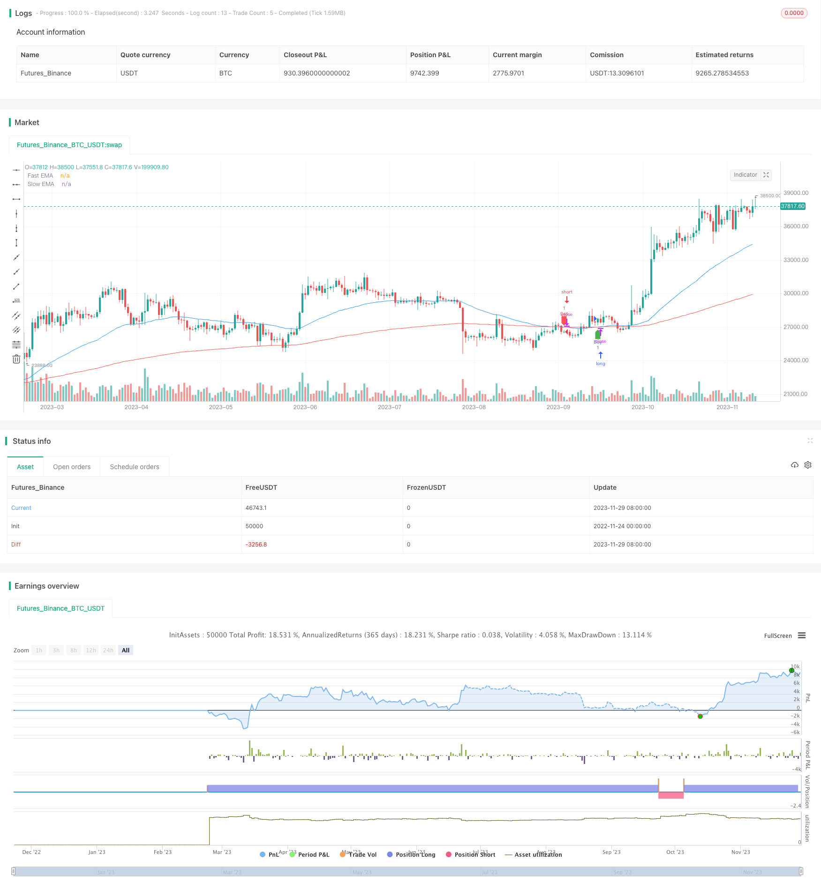

> Name

Momentum-Exponential-Moving-Average-Crossover-Trading-Strategy
> Author

ChaoZhang

> Strategy Description


[trans]

### Overview
This strategy generates trading signals based on the golden cross and dead cross of two exponential moving averages (EMA). Specifically, this strategy calculates the 50-period EMA and the 200-period EMA. When the short-term EMA (50 periods) crosses the long-term EMA (200 periods), a buy signal is generated; when the short-term EMA crosses below the long-term EMA, a sell signal is generated. This can effectively capture short-term and long-term trend changes in stock prices and form a momentum-based trading strategy.
### Strategy Principles
1. Calculate two exponential moving averages: the 50-period EMA and the 200-period EMA. EMA gives more weight to recent data and is more sensitive to short-term price changes.
2. Identify trading signals:
   - Buy signal: The short-term EMA crosses the long-term EMA, indicating that the short-term trend has turned upward.
   - Sell signal: The short-term EMA crosses below the long-term EMA, indicating that the short-term trend has turned downward.
3. Execute trades based on signals: go long on a buy signal and go short on a sell signal.
4. Draw EMA and trading signals on the chart to facilitate intuitive judgment.
### Advantage Analysis
This strategy has the following advantages:
1. Capture the reversal of the general trend, especially suitable for trends and consolidation markets. The effect is better.
2. The decision-making rules are simple and clear, easy to implement and backtest.
3. EMA smoothes price data, which is helpful for identifying trend signals and filtering out noise.
4. The EMA period can be adjusted to adapt to different holding periods.
5. Combined with other indicators, signals can be further filtered and strategies optimized.
### Risk Analysis
There are also some risks with this strategy:
1. In a volatile market, there may be more false signals and too many invalid transactions.
2. Relying only on a single indicator rule is less robust.
3. Failure to consider stop loss rules may lead to the risk of loss expansion.
4. The delay of EMA may miss the best participation point of price changes.
5. Backtesting is required to determine the best parameters, and the actual performance may be different from the backtesting results.
Corresponding risk control and optimization measures include: filtering signals in combination with other indicators, setting stop loss mechanisms, introducing machine learning models, etc.
### Optimization direction
This strategy can be optimized from the following aspects:
1. Combine with other indicators (such as MACD, KD, etc.) to implement a multi-factor model to improve the robustness of the strategy.
2. Add a stop loss mechanism. Such as setting a fixed percentage stop loss or a trailing stop loss. Control the maximum loss in a single transaction.
3. Use machine learning methods to obtain optimal parameters. Improve signal judgment rules. Improve the robustness of your strategy.
4. Set the optimal EMA period combination based on the backtest results. Adjust parameters according to market conditions.
5. Assess transaction cost impacts. Add slippage model and handling fee consideration. Optimize warehouse management.

### Summarize
Overall, this strategy is a relatively classic and simple breakthrough trading strategy. The golden cross and dead cross based on the EMA indicator form a decision rule. Although it has certain timeliness, it also has some defects and room for optimization. How to improve signal judgment, control risks, dynamic parameter adjustment, etc. are key aspects that need to be considered in the future, which will greatly enhance the stable profitability of this strategy in real trading.
||
### Overview
This strategy generates trading signals based on the crossover and crossunder between two Exponential Moving Averages (EMAs), specifically the 50-period EMA and 200-period EMA. It aims to capture changes in short-term and long-term price trends to form a momentum-based trading strategy.  

### Strategy Logic  

1. Calculate two EMAs: 50-period EMA and 200-period EMA. EMAs give more weight to recent data and are more responsive to short-term price moves.   

2. Determine trading signals:   
   - Buy signal: 50-period EMA crosses above 200-period EMA, indicating the short-term trend is turning upwards.  
   - Sell signal: 50-period EMA crosses below 200-period EMA, indicating the short-term trend is turning downwards.

3. Execute trades based on signals: Go long on buy signals, go short on sell signals.  

4. Plot EMAs and trading signals on chart for intuitive visualization.

### Advantages  

The strategy has the following key advantages:

1. Captures major trend reversals, works well for trending and ranging markets.  

2. Simple and clear decision rules, easy to implement and backtest.
   
3. EMAs smooth price data, help identify signals and filter out noise.  

4. Customizable EMA periods suit different holding horizons.  

5. Can combine other indicators to further filter signals and optimize.

### Risks Analysis 

There are also some risks to consider:

1. More false signals and excessive trades possible in choppy markets.  

2. Relies solely on single indicator rules, robustness could improve. 

3. No stop loss in place, risks uncontrolled losing trades.  

4. EMA lag may miss best entry and exit points.

5. Requires backtesting to find optimal parameters, live results may differ.


Corresponding risk control and optimizations include using other indicators as filters, implementing stop losses, introducing machine learning models etc.

### Optimization Opportunities

Some ways the strategy can be further optimized:

1. Add other indicators (e.g. MACD, RSI) for a multi-factor model. Improves robustness.  

2. Incorporate stop losses. E.g. fixed percentage, trailing stop loss. Limits maximum loss per trade.

3. Utilize machine learning for optimal parameters and enhance signal generation rules. 

4. Backtest to find best performing EMA combinations for market regime. Dynamically adjust periods.  

5. Evaluate transaction costs. Add slippage, commission to fine tune position sizing.

### Conclusion
This is an overall simple, classic breakout strategy based on EMA crossovers. Has merits but also some inherent flaws and room for improvement. Enhancing signal reliability, risk control, dynamic adjustment etc. will greatly improve its profitability in live trading.  
[/trans]

> Strategy Arguments


|Argument|Default|Description|
|----|----|----|
|v_input_1|50|Fast EMA Length|
|v_input_2|200|Slow EMA Length|


> Source (PineScript)

``` pinescript
/*backtest
start: 2022-11-24 00:00:00
end: 2023-11-30 00:00:00
period: 1d
basePeriod: 1h
exchanges: [{"eid":"Futures_Binance","currency":"BTC_USDT"}]
*/

//@version=5
strategy("EMA Golden Crossover Strategy", overlay=true)

// Input parameters
fastLength = input(50, title="Fast EMA Length")
slowLength = input(200, title="Slow EMA Length")

// Calculate EMAs using ta.ema
fastEMA = ta.ema(close, fastLength)
slowEMA = ta.ema(close, slowLength)

// Plot EMAs on the chart
plot(fastEMA, color=color.blue, title="Fast EMA")
plot(slowEMA, color=color.red, title="Slow EMA")

// Strategy logic
longCondition = ta.crossover(fastEMA, slowEMA)
shortCondition = ta.crossunder(fastEMA, slowEMA)

// Execute orders
if (longCondition)
    strategy.entry("Buy", strategy.long)

if (shortCondition)
    strategy.entry("Sell", strategy.short)

// Plot buy and sell signals on the chart
plotshape(series=longCondition, title="Buy Signal", color=color.green, style=shape.labelup, location=location.belowbar)
plotshape(series=shortCondition, title="Sell Signal", color=color.red, style=shape.labeldown, location=location.abovebar)


```

> Detail

https://www.fmz.com/strategy/433970

> Last Modified

2023-12-01 18:21:07
