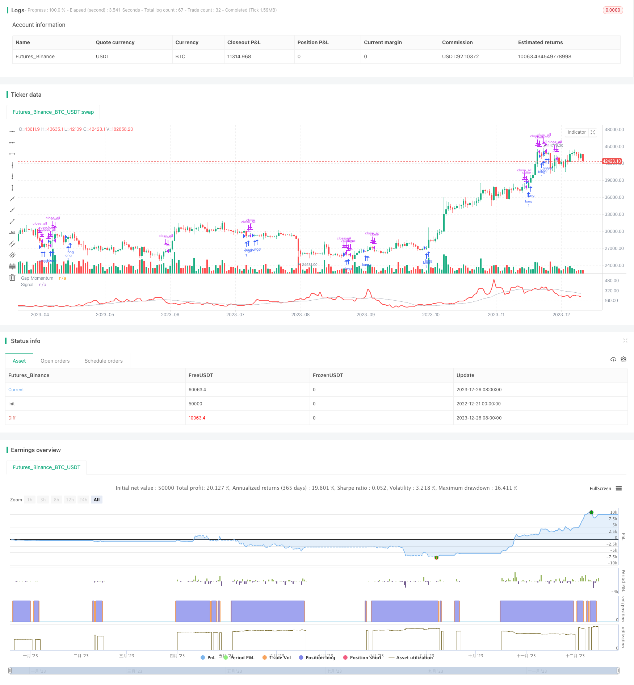

> Name

Momentum-Gap-Trading-Strategy
> Author

ChaoZhang

> Strategy Description




[trans]

## Overview
Momentum Gap Trading Strategy is a quantitative trading strategy that tracks price fluctuations. It uses the gap between the opening price and the previous day's closing price (called the aperture) to construct a momentum indicator and generate trading signals from this indicator. This strategy is suitable for high-volatility stocks and can capture the continuation of price gaps.
This strategy is based on the article "The Pore Momentum Indicator" published in the January 2024 Technical Analysis Journal by former Boeing quantitative analyst Perry J. Kaufman. Kaufman constructed a momentum time series that tracked pores and proposed using the moving average of this time series as a trading signal. Enter a long position when the momentum indicator crosses above its moving average and close a position when it crosses below its moving average.
## Strategy Principle
The key to the momentum pore strategy is to construct the pore momentum time series. The construction idea is similar to the quantitative term "On-Balance Volume" (OBV), except that the price input used is changed from daily closing prices to daily pores.
The specific calculation process is:
1. Calculate the ratio of the total positive pores to the absolute value of negative pores in the last N days
2. Accumulate the ratios to form a pore momentum sequence
3. Apply a moving average to the pore momentum series to generate the signal
Positive porosity is defined as the difference between the opening price and the previous day's closing price, while negative porosity is the opposite. The ratio essentially reflects the intensity of positive versus negative pores over a recent period of time.
Moving averages smooth out the original sequence of fluctuations and can be used to generate trading signals. This strategy uses a slow moving average and goes long when the fast pore momentum indicator crosses above the slow moving average and closes when it crosses below.
## Advantage Analysis
Compared with traditional technical indicators, the momentum pore strategy has the following advantages:
1. Use price gaps to capture market imbalances
A price gap represents a huge imbalance between supply and demand, and the direction of the gap represents a transfer of market bargaining power. This strategy can effectively capture this imbalance by comparing the long and short forces of the market through gaps.
2. Be sustainable
Price jumps are often followed by a continuation of the trend, and tracking the gap momentum can capture the price trend band. Indicator design enhances this persistence characteristic.
3. Few parameters and simple implementation
The entire indicator contains only two parameters, a window period for tracking momentum and a signal smoothing period. Very easy to implement.
4. Quantifiable, suitable for automatic trading
It adopts trading rules with relatively clear numerical values, has a high degree of standardization, can be directly connected to the automatic trading system, and is suitable for programmed trading.
## Risk Analysis
Despite its many advantages, the momentum pore strategy also carries some risks:
1. Easily generate false signals
Price gaps may be covered in the short term, causing the indicator to generate false signals. may generate false signals as gaps may fill shortly after opening.
2. Unable to effectively handle volatile market conditions
When prices fluctuate frequently, indicators will send out a large number of trading signals that cancel each other out.
3. Potential over-optimization issues
Just two parameters can easily lead to over-optimization on historical data. must be careful not to overfit.
It is recommended to control risks through the following methods:
1. Use stop loss to limit single losses
2. Add parameters to adapt to more market conditions
3. Multi-combination optimization to prevent over-optimization
## Optimization direction
This strategy can be expanded and optimized from the following dimensions:
1. Multiple time period combinations
Using multiple pore indicators with different tracking momentum windows can have complementary effects in different periods.
2. Integrate gap indicators
For example, integrating the true gap indicator with the ATR indicator as risk management. manage risk with ATR.
3. Consider all aspects of gapping
For example, gap distance, number of gaps, gap generation date, and more features. incorporate more gap characteristics.   
4. Machine learning model
Using gap data to train more complex machine learning models may achieve better performance.
## Summarize
The Momentum Porosity Strategy is a simple but practical breakout strategy. It tracks market microstructural changes such as price gaps and explores the dramatic changes in supply and demand hidden in them. Compared with other technical indicators, it can reflect market imbalances more clearly and quickly seize the turning point of price trend. Nonetheless, risk control measures still need to be supplemented to avoid potential problems. This strategy provides us with an example of identifying opportunities based on market structure, and is worthy of further optimization and innovation in practice.
||

## Overview

The Momentum Gap Trading Strategy is a quantitative trading strategy that tracks price fluctuations. It utilizes the gap between the opening price and the previous day's closing price (called the gap) to construct a momentum indicator and generates trading signals with it. The strategy is suitable for high volatility stocks and can capture price continuations after gap openings.

This strategy is based on an article titled "Gap Momentum Indicator" published by Perry J. Kaufman, former quantitative analyst at Boeing, in the January 2024 issue of Technical Analysis magazine. Kaufman constructed a momentum time series tracking gaps and proposed using the moving average of that time series as trading signals. A long position is opened when the momentum indicator crosses above its moving average, and flattened when it crosses below.

## Strategy Logic

The key to the Momentum Gap strategy lies in constructing the gap momentum time series. The construction logic is similar to the quantitative term "On-Balance Volume (OBV)", except that the price input is changed from the daily close to the daily gap.  

The specific calculation process is:

1. Calculate the ratio of the sum of positive gaps over the past N days to the sum of negative gaps (absolute values) over the same period.

2. Add the resulting ratio to the cumulative time series called Gap Momentum.  

3. Apply a moving average to the Gap Momentum sequence to generate signals.

A positive gap is defined as the difference when the opening price is higher than the previous day's closing price, and negative gap vice versa. The ratio essentially reflects the recent strength contrast between positive and negative gaps.

The moving average smoothes the original volatile sequence and can be used to issue trading signals. This strategy employs a slower moving average, establishing long positions when the fast Gap Momentum indicator crosses above it and flattening positions when crossing below it.

## Strength Analysis

Compared with traditional technical indicators, the Momentum Gap Trading Strategy has the following strengths:

1. Captures market imbalances with price gaps

   Gaps represent huge supply and demand imbalances. Tracking gaps compares market strength and effectively captures such imbalances.
   
2. Persistence 

   Price gaps are often followed by trend continuations. Tracking gap momentum captures price swings. The indicator design enhances this persistence.

3. Simple to implement

   The whole indicator only contains two parameters, a window for tracking momentum and a period for smoothing signals. Extremely easy to implement.  

4. Quantifiable rules suitable for automation

   Adopting quantifiable trading rules with high standardization, it can be directly connected to auto-trading systems for algorithmic trading.

## Risk Analysis  

Despite many strengths, the Momentum Gap Trading Strategy also carries some risks: 

1. Prone to false signals

   Gaps may fill shortly after opening, causing the indicator to generate incorrect signals.

2. Ineffective in choppy markets
   
   Frequent price whipsaws can lead to excessive offsetting signals.

3. Potential overfitting
   
   Very easy to overfit with just two parameters.

It is advisable to manage risks by:

1. Adopting stops to limit losses

2. Increasing parameters to adapt more market states
   
3. Ensemble optimization to avoid overfitting

## Enhancement Opportunities

This strategy can be expanded and enhanced in the following dimensions:

1. Combining multiple time frames

   Adopting Gap Momentum indicators tracking different momentum windows can achieve complementary effects across time frames.

2. Incorporating gap metrics

   For instance, combining true gap size with ATR as risk management. 

3. Considering more gap characteristics

   Such as gap distance, frequency, opening days etc.
   
4. Machine learning models

   Training more complex ML models on gap data may achieve better performance.  

## Conclusion

The Momentum Gap Trading Strategy is a simple yet practical breakout strategy. By tracking price gaps, an important market microstructure change, it uncovers the drastic supply and demand shifts hidden behind. Compared to other technical indicators, it reflects market imbalances more clearly and swiftly seizes price trend turning points. That said, risk controls are still necessary to address potential issues. This strategy exemplifies how identifying opportunities based on market structure can lead to effective techniques that can be further optimized and innovated in practice.

[/trans]

> Strategy Arguments


|Argument|Default|Description|
|----|----|----|
|v_input_int_1|40|Period:|
|v_input_int_2|20|Signal Period:|
|v_input_bool_1|true|Long Only:|


> Source (PineScript)

``` pinescript
/*backtest
start: 2022-12-21 00:00:00
end: 2023-12-27 00:00:00
period: 1d
basePeriod: 1h
exchanges: [{"eid":"Futures_Binance","currency":"BTC_USDT"}]
*/

//  TASC Issue: January 2024 - Vol. 42, Issue 1
//     Article: Gap Momentum Indicator
//              Taking A Page From The On-Balance Volume
//  Article By: Perry J. Kaufman
//    Language: TradingView's Pine Script™ v5
// Provided By: PineCoders, for tradingview.com


//@version=5
string title  = 'TASC 2024.01 Gap Momentum System'
string stitle = 'GMS'
strategy(title, stitle, false)


int period       = input.int( 40,   'Period:')
int signalPeriod = input.int( 20,   'Signal Period:')
bool longOnly    = input.bool(true, 'Long Only:')


float gap   = open - close[1]
float gapUp = 0.0
float gapDn = 0.0
switch
    gap > 0 => gapUp += gap
    gap < 0 => gapDn -= gap


float gapsUp   = math.sum(gapUp, period)
float gapsDn   = math.sum(gapDn, period)
float gapRatio = gapsDn == 0?1.0:100.0*gapsUp/gapsDn
float signal   = ta.sma(gapRatio, signalPeriod)


if strategy.opentrades <= 0 and signal > signal[1]
    // buy at next open:
    strategy.entry('long', strategy.long)
else if strategy.opentrades > 0 and signal < signal[1]
    if longOnly
        // close all at next open:
        strategy.close_all()
    else
        // sell at next open:
        strategy.entry('short', strategy.short)


plot(gapRatio, 'Gap Momentum', color.red,    2)
plot(signal,   'Signal',       color.silver, 1)

```

> Detail

https://www.fmz.com/strategy/436872

> Last Modified

2023-12-28 14:38:33
