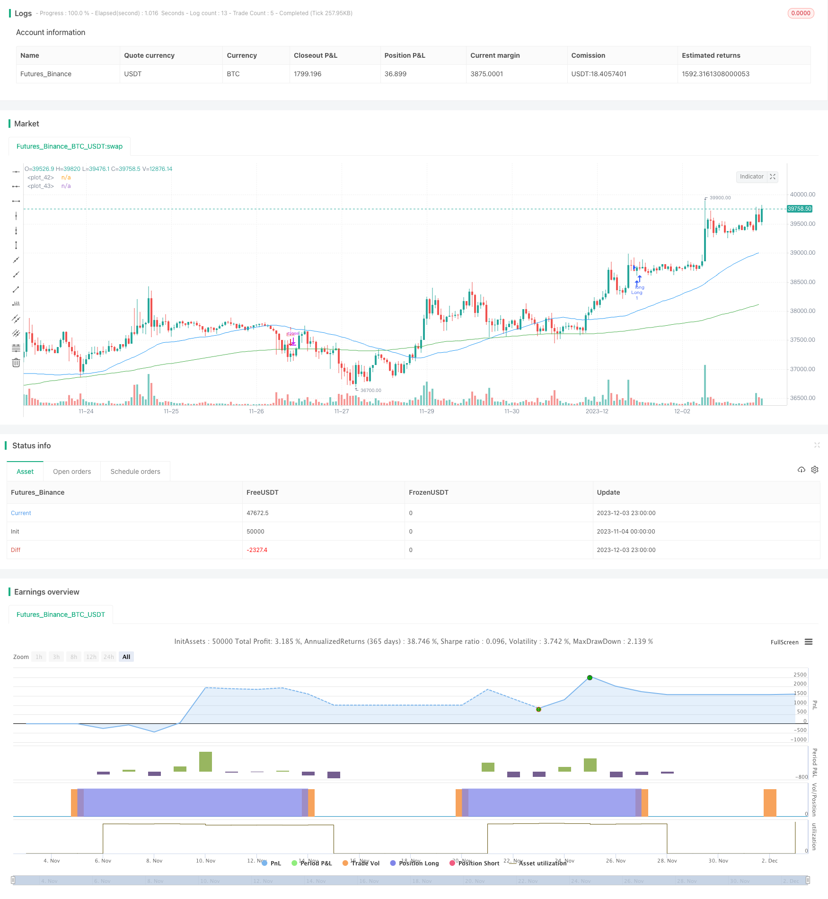

> Name

Momentum-Index-ETF-Trend-Following-Strategy
> Author

ChaoZhang

> Strategy Description


[trans]

## Overview
This is a momentum-based trend following strategy for index ETFs based on moving averages. It uses the direction and slope intersection of the fast moving average and the slow moving average to determine the trend direction and realize momentum trend following of low-risk index ETF assets.
## Strategy Principle
This strategy uses 50-period and 150-period moving averages. When the fast moving average crosses the slow moving average, and the slope of the fast moving average is greater than the threshold, it is considered that the trend has turned, and the position is long; when the fast moving average crosses the slow moving average, or the slope of the fast moving average is less than the threshold, the trend is considered to be reversed, and the position is closed.
This strategy simply and directly uses the direction and slope of the moving average to determine market trends, avoid curve fitting, and effectively control risks. At the same time, moving averages naturally have denoising properties and can effectively filter market noise.
## Advantage Analysis
This is a low-risk index ETF momentum trend following strategy with the following advantages:
1. Strong risk control capabilities. Filter market noise through moving averages and effectively control risks.
2. Low implementation cost. Using only a simple moving average, the implementation cost is low and easy to implement.  
3. Stable income. Index ETFs themselves have small fluctuations and can achieve stable excess returns by following trends.
4. Strong adaptability. There are many adjustable parameters, which can be optimized for different index ETFs.
## Risk Analysis
There are also some risks with this strategy:
1. Rapid reversals may be missed. Using moving averages to determine trends may miss quick reversals.
2. Parameter sensitive. Improperly set parameters can result in too many trades or missed opportunities.
3. The effect changes with the market environment. May perform poorly in volatile markets.
Corresponding solutions:
1. Combine with other indicators to determine rapid reversal. 
2. Test and optimize parameters.
3. Dynamically adjust parameters according to the market environment.
## Optimization direction
This strategy can also be optimized from the following aspects:
1. Use MACD, KD and other indicators to assist judgment and improve strategy effects.
2. Add stop loss logic to further control risks.
3. Optimize the moving average cycle parameters to adapt to more index ETFs.
4. Dynamically adjust parameters to adapt to changes in the market environment.
## Summary
This strategy is a low-risk, simple and easy-to-implement index ETF momentum trend following strategy. It uses the intersection of moving averages to determine the trend direction, and has the advantages of strong risk control capabilities, low implementation costs, and stable returns. This strategy also has certain flaws, but it can be further optimized in a variety of ways, making it an effective tool for index ETF asset allocation.
||
## Overview
This is a momentum index ETF trend following strategy based on moving averages. It uses the crossover and slope of fast and slow moving averages to determine the trend direction for low-risk momentum trend following of index ETF assets.  

## Strategy Logic
The strategy uses 50-period and 150-period moving averages. When the fast moving average crosses over the slow moving average, and the slope of the fast moving average is greater than the threshold, it signals an upside trend reversal for long entry. When the fast moving average crosses below the slow moving average, or the slope of the fast moving average is less than the threshold, it signals a downside trend reversal for exiting positions.

The strategy simply utilizes the direction and slope of moving averages to determine market trend, avoiding overfitting and effectively controlling risks. Meanwhile, moving averages inherently have the ability to filter out market noise for robust signals.  

## Advantage Analysis 
This is a low-risk momentum index ETF trend following strategy with the following advantages:

1. Strong risk control ability. Moving averages filter market noise for effective risk control.
2. Low implementation cost. Only simple moving averages are used, resulting in low cost and easy implementation.
3. Stable profits. Index ETFs themselves have low volatility, combined with trend following, stable excess returns can be achieved.  
4. High adaptability. Many adjustable parameters allow optimizations for different index ETFs.

## Risk Analysis
There are also some risks:  

1. Potentially missing quick reversals. Using moving averages to determine trends may miss out quick reversals.
2. Parameter sensitive. Improper parameter settings may result in overtrading or missing opportunities. 
3. Performance dependence on market conditions. May underperform in choppy/sideway markets.

Solutions:
1. Incorporate other indicators to determine quick reversals.  
2. Test and optimize parameters.
3. Dynamically adjust parameters based on changing market conditions.  

## Optimization Directions
There are a few areas this strategy can be further optimized:

1. Utilize other indicators like MACD, KD to complement the strategy.  
2. Incorporate stop loss logic to further control risks.
3. Optimize moving average periods to adapt more index ETFs.  
4. Dynamically adjust parameters to suit different market environments.  

## Conclusion
In conclusion, this is a low-risk, easy-to-implement momentum index ETF trend following strategy. It determines trend directions using moving average crossovers and has advantages like strong risk control, low implementation cost and stable profits. Although some flaws exist, the strategy can be further improved in many aspects to become an effective tool for index ETF asset allocation.

[/trans]

> Strategy Arguments


|Argument|Default|Description|
|----|----|----|
|v_input_1|50|Fast Moving Average (Int)|
|v_input_2|150|Slow Moving Average (Int)|
|v_input_3|5|Bullish Slope Angle (Deg)|
|v_input_4|-5|Bearish Slope Angle (Deg)|
|v_input_5|14|Average True Range (Int)|
|v_input_6|100|Risk (%)|


> Source (PineScript)

``` pinescript
/*backtest
start: 2023-11-04 00:00:00
end: 2023-12-04 00:00:00
period: 1h
basePeriod: 15m
exchanges: [{"eid":"Futures_Binance","currency":"BTC_USDT"}]
*/

//@version=4
//please use on daily SPY, or other indexes only
strategy("50-150 INDEX TREND FOLLOWING", overlay=true)

//user input
fastSMA = input(title="Fast Moving Average (Int)",type=input.integer,minval=1,maxval=1000,step=1,defval=50,confirm=false)
slowSMA = input(title="Slow Moving Average (Int)",type=input.integer,minval=1,maxval=1000,step=1,defval=150,confirm=false)
longSlopeThreshold = input(title="Bullish Slope Angle (Deg)",type=input.integer,minval=-90,maxval=90,step=1,defval=5,confirm=false)
shortSlopeThreshold = input(title="Bearish Slope Angle (Deg)",type=input.integer,minval=-90,maxval=90,step=1,defval=-5,confirm=false)
atrValue = input(title="Average True Range (Int)",type=input.integer,minval=1,maxval=100,step=1,defval=14,confirm=false)
risk = input(title="Risk (%)",type=input.integer,minval=1,maxval=100,step=1,defval=100,confirm=false)

//create indicator
shortSMA = sma(close, fastSMA)
longSMA = sma(close, slowSMA)

//calculate ma slope
angle(_source) =>
    rad2degree=180/3.14159265359
    ang=rad2degree*atan((_source[0] - _source[1])/atr(atrValue)) 

shortSlope=angle(shortSMA)
longSlope=angle(longSMA)

//specify crossover conditions
longCondition = (crossover(shortSMA, longSMA) and (shortSlope > longSlopeThreshold)) or ((close > shortSMA) and (shortSMA > longSMA) and (shortSlope > longSlopeThreshold))
exitCondition = crossunder(shortSMA, longSMA) or (shortSlope < shortSlopeThreshold)
strategy.initial_capital = 50000
//units to buy
amount = (risk / 100) * (strategy.initial_capital + strategy.netprofit)
units = floor(amount / close)

//long trade
if (longCondition and strategy.position_size == 0)
    strategy.order("Long", strategy.long, units)

//close long trade
if (exitCondition and strategy.position_size > 0)
    strategy.order("Exit", strategy.short, strategy.position_size)

// Plot Moving Average's to chart
plot(shortSMA, color=color.blue)
plot(longSMA, color=color.green)
```

> Detail

https://www.fmz.com/strategy/434332

> Last Modified

2023-12-05 15:13:25
