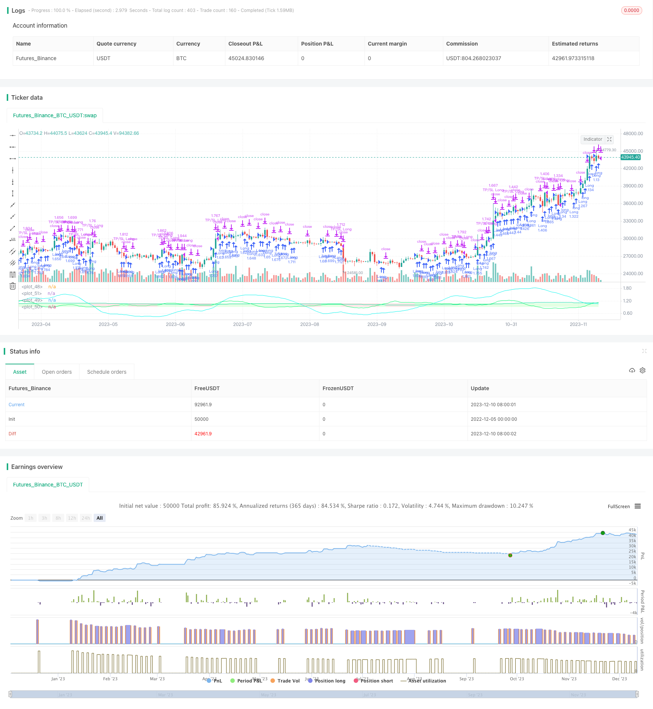

> Name

Momentum-Indicator-Driven-Trend-Following-Trading-Strategy
> Author

ChaoZhang

> Strategy Description


[trans]

## Overview
This strategy builds trading signals based on the momentum indicator RSI and the Exponential Moving Average (EMA) and Simple Moving Average (SMA) of the price. It is a trend following type of strategy.
## Strategy Principle
This strategy uses 3 conditions to generate trading signals:
1. RSI > 45: An RSI value greater than 45 is considered a good buy signal
2. EMA(RSI) > SMA(RSI): If the EMA line is greater than the SMA line, it means that the RSI is accelerating upward, which is a good momentum signal.
3. EMA (closing price) > SMA (closing price): EMA line is greater than SMA line, indicating that the price trend is accelerating upward.
If any two of the above three conditions are met, a buy signal will be generated; if all are not met, a sell signal will be generated.
This strategy also provides an "always buy" mode, which is used to test the performance of the system itself relative to the broader market.
## Strategic advantage analysis
1. Using the momentum indicator RSI to judge the market situation can reduce positions during the volatile trading market.
2. Combine EMA and SMA to determine the trend direction and capture price changes in a timely manner.
3. The conditional rules are simple and clear, easy to understand and optimize
4. Provide “always buy” mode to test system advantages
## Strategy risk analysis
1. Depends on parameter settings. Improper parameters will lead to frequent transactions or missed good trading opportunities.
2. When the market encounters major news, short-term prices may fluctuate greatly, which will lead to stop losses.
3. The strategy itself cannot judge when the trend is about to reverse, and it needs to be judged in conjunction with other indicators.
## Optimization direction
1. Optimize the parameters of RSI, EMA and SMA and find the best parameter combination
2. Add volume, MACD and other technical indicator judgment rules
3. Add trend reversal judgment indicators to reduce the probability of loss
## Summarize
This strategy is generally a medium-frequency trading strategy, aiming to capture mid-term price trends and avoid short-term market fluctuations. Its advantages and risks are relatively obvious. Through parameter optimization and rule enrichment, the stability of the strategy can be further enhanced. It is a high-efficiency quantitative trading strategy worthy of in-depth study and optimization.
|| 

## Overview

This strategy builds trading signals based on momentum indicator RSI and price's Exponential Moving Average (EMA) and Simple Moving Average (SMA). It belongs to the trend following type of strategies.  

## Strategy Principle

The strategy uses 3 conditions to generate trading signals:

1. RSI > 45: RSI value greater than 45 is considered a good buy signal  
2. EMA(RSI) > SMA(RSI): EMA line greater than SMA line indicates RSI is accelerating upwards, which is a good momentum signal
3. EMA(close) > SMA(close): EMA line greater than SMA line indicates the price trend is accelerating upwards

Meeting any 2 of the above 3 conditions generates a buy signal; if none is met, a sell signal is generated.  

The strategy also provides an "always buy" mode for testing the system's performance relative to the broad market.

## Advantage Analysis

1. Using momentum indicator RSI to judge market conditions can reduce positions during market fluctuations
2. Combining EMA and SMA to determine trend direction can timely capture price change trends  
3. Simple and clear conditional rules, easy to understand and optimize
4. Provides "always buy" mode to test system advantages

## Risk Analysis

1. Relies on parameter settings, improper parameters will lead to frequent trading or miss good trading opportunities
2. Major news in the broad market can cause huge volatility in the short term, which will lead to stop loss
3. The strategy itself cannot judge when a trend is about to reverse, other indicators need to be used to determine

## Optimization Directions  

1. Optimize parameters of RSI, EMA and SMA to find best parameter combination
2. Increase other technical indicators like Volume, MACD etc. to enrich rule conditions
3. Increase trend reversal indicators to reduce probability of losses

## Conclusion

In summary, this strategy belongs to a medium-frequency trading strategy that aims to capture mid-term price trends while avoiding short-term market fluctuations. Its advantages and risk points are quite obvious. Further enhancing stability through parameter optimization and enriching rules makes it a worthwhile high-efficiency quantitative trading strategy to research and optimize.

[/trans]

> Strategy Arguments


|Argument|Default|Description|
|----|----|----|
|v_input_string_1|Unitrend|Trading Mode|
|v_input_bool_1|false|compoundingMode|
|v_input_float_1|true|leverage|
|v_input_float_2|true|Risk Capital per Trade unleveraged (%)|
|v_input_float_3|2|TPFactor|


> Source (PineScript)

``` pinescript
/*backtest
start: 2022-12-05 00:00:00
end: 2023-12-11 00:00:00
period: 1d
basePeriod: 1h
exchanges: [{"eid":"Futures_Binance","currency":"BTC_USDT"}]
*/

//@version=5
strategy("I11L Unitrend",overlay=false, initial_capital=1000000,default_qty_value=1000000,default_qty_type=strategy.cash,commission_type=strategy.commission.percent,commission_value=0.00)
tradingMode = input.string("Unitrend", "Trading Mode", ["Unitrend", "Always Buy"], tooltip="Choose the Trading Mode by trying Both in your Backtesting. I use it if one is far better then the other one.")
compoundingMode = input.bool(false)
leverage = input.float(1.0,step=0.1)
SL_Factor = 1 - input.float(1,"Risk Capital per Trade unleveraged (%)", minval=0.1, maxval=100, step=0.1) / 100
TPFactor = input.float(2, step=0.1)


var disableAdditionalBuysThisDay = false
var lastTrade = time
if(time > lastTrade + 1000 * 60 * 60 * 8 or tradingMode == "Always Buy")
    disableAdditionalBuysThisDay := false

if(strategy.position_size != strategy.position_size[1])
    lastTrade := time
    disableAdditionalBuysThisDay := true

//Trade Logic
SCORE = 0

//rsi momentum
RSIFast = ta.ema(ta.rsi(close,50),24)
RSISlow = ta.sma(ta.rsi(close,50),24)
RSIMomentum = RSIFast / RSISlow
goodRSIMomentum = RSIMomentum > 1
SCORE := goodRSIMomentum ? SCORE + 1 : SCORE

//rsi trend
RSITrend = RSISlow / 45
goodRSI = RSITrend > 1
SCORE := goodRSI ? SCORE + 1 : SCORE

//price trend
normalTrend = ta.ema(close,50) / ta.sma(close,50)
goodTrend = normalTrend > 1
SCORE := goodTrend ? SCORE + 1 : SCORE


isBuy =  SCORE > 1 or tradingMode == "Always Buy"
isSell = false //SCORE == 0

//plot(SCORE, color=isBuy ? color.green : #ffffff88)
//reduced some of the values just for illustrative purposes, you can buy after the signal if the trendlines seem to grow
plot(1, color=isBuy ? #77ff7733 : SCORE == 2 ? #ffff0033 : SCORE == 1 ? #ff888833 : #ff000033,linewidth=10)
plot(1 - (1 - RSIMomentum) * 6,color=#00F569)
plot(1 - (1 - RSITrend) * 0.25,color=#00DB9B)
plot(1 - (1 - normalTrend) * 20,color=#00F5EE)


strategy.initial_capital = 50000
if(isBuy and not(disableAdditionalBuysThisDay))
    if(compoundingMode)
        strategy.entry("Long", strategy.long, (strategy.equity / close) * leverage)
    else
        strategy.entry("Long", strategy.long, (strategy.initial_capital / close) * leverage)


if(strategy.position_size != 0)
    strategy.exit("TP/SL Long", "Long", stop=strategy.position_avg_price * (1 - (1 - SL_Factor)), limit=strategy.position_avg_price * (1 + (1 - SL_Factor) * TPFactor))


```

> Detail

https://www.fmz.com/strategy/435124

> Last Modified

2023-12-12 14:52:11
