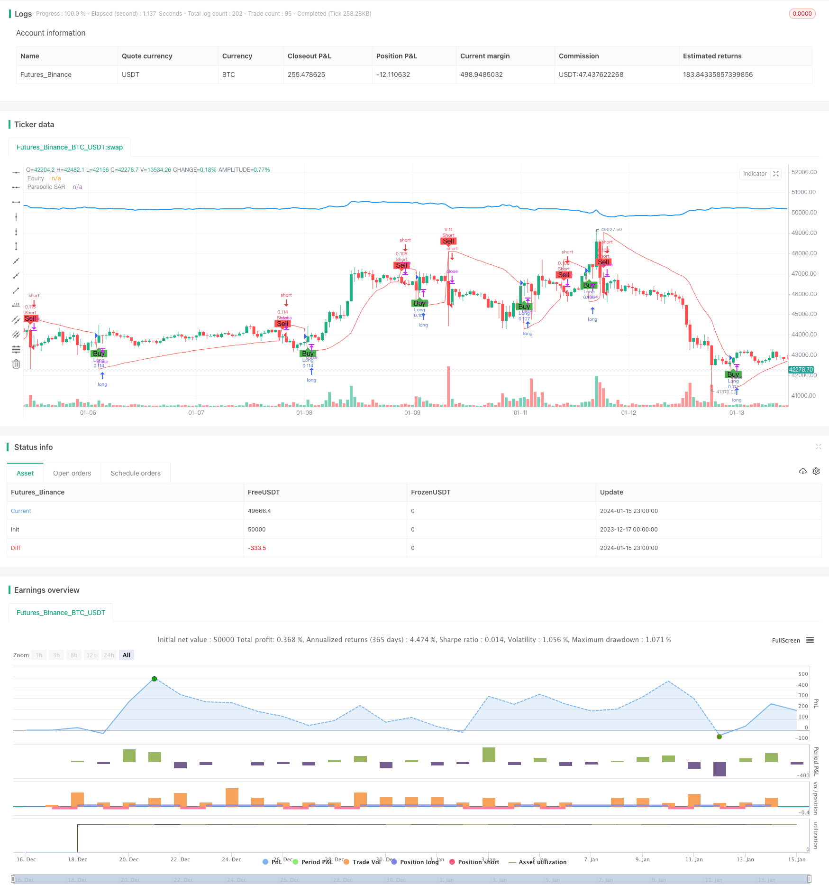

> Name

Parabolic steering system kinetic energy inflection point tracking strategy Momentum-Inversion-Tracking-Strategy
> Author

ChaoZhang

> Strategy Description


 [trans]
## Overview
This strategy uses the Parabolic SAR indicator to identify the turning point of the stock price trend, and performs buying or selling operations when the turning point occurs. This strategy can automatically identify rising and falling trends in stock prices and adjust positions accordingly.
## Strategy Principle
The core indicator of this strategy is Parabolic SAR. This indicator can identify the rising and falling trends of the stock price. When the stock price rises, the SAR point will be below the stock price. When the stock price falls, the SAR point will jump to the top of the stock price. The strategy works by detecting the intersection of the stock price line and the SAR point as buy and sell signals. Specifically, when the stock price line sweeps up the SAR point from below, a buy signal is generated; when the stock price line falls below the SAR point, a sell signal is generated.
The buying condition of this strategy is: `close` is higher than `sar`, which means the stock price line sweeps through the SAR point from below, which is a buy signal; the selling condition is when `close` ​​is lower than `sar`, which means the stock price line breaks through the SAR point from above, which is a sell signal. Therefore, the core logic of this strategy is to track the momentum turning point of the stock price movement and perform buying and selling operations when the turning point crosses.
## Strategic Advantages
The biggest advantage of this strategy is that it can automatically identify the turning point of the stock price trend without manual judgment, avoiding the common mistake of chasing highs and selling lows. The parabolic steering system is a trend identification indicator with good reliability, which can reduce the chance of misoperation.
In addition, the SAR indicator is also relatively responsive to stock prices and can capture small-scale price adjustments in a timely manner, which is very necessary for strategies that pursue high winning rates and frequent trading. Therefore, this strategy can automatically adjust positions to avoid being trapped in a large adjustment situation.
## Strategy Risk
The biggest risk of this strategy is that the SAR indicator is too sensitive to changes in stock prices. Small fluctuations may produce false signals, leading to too frequent buying and selling operations, increasing transaction costs and slippage losses.
In addition, when stocks rise or fall sharply, the setting parameters of the SAR indicator, such as starting value, incremental value, etc., may affect the accuracy and timeliness of its judgment of trend turning. These parameters need to be set carefully.
If position management is not properly configured and SAR signals are tracked too much, positions may fluctuate too frequently and increase the difficulty of actual transactions.
## Optimization suggestions
This strategy can be optimized from the following aspects:
1. Optimize SAR parameter settings, adjust parameter combinations, and find optimal parameters to improve the accuracy of signal judgment.
2. Add other auxiliary indicators for confirmation to avoid unnecessary position switching caused by false positives of the SAR indicator.
3. Configure appropriate positions and stop-loss strategies to avoid too frequent transactions and control risks
4. Combine trend judgment indicators to avoid being trapped in volatile market conditions
5. Optimize the specific buying and selling prices, consider costs and slippage losses, and improve transaction efficiency.
## Summarize
This strategy mainly relies on the parabolic steering system indicator to determine the turning point of the stock price trend, and has reliable trend judgment capabilities. After the strategy is optimized, it can become an effective trend following strategy, which can obtain directional opportunities for stock prices by automatically adjusting positions. However, attention needs to be paid to controlling the frequency of position fluctuations and preventing the risk of false positives.
||

## Overview

This strategy uses the Parabolic SAR indicator to identify turning points in stock price trends and enters long or short positions when reversals occur. It can automatically detect upward and downward momentum in stock prices and adjust positions accordingly.  

## Strategy Logic

The core indicator of this strategy is Parabolic SAR. This indicator can identify upward and downward trends in stock prices. When prices rise, the SAR dots stay below the prices. When prices fall, the SAR dots jump above the prices. The strategy detects crossover between price and SAR dots as trading signals. Specifically, when the price line crosses above the SAR dots from below, a long entry signal is generated. When the price line crosses below the SAR dots from above, a short entry signal is triggered.

The long condition is: `close` above `sar`, indicating the price line has crossed above the SAR dots from below, a long signal. The short condition is: `close` below `sar`, indicating the price line has crossed below the SAR dots from above, a short signal. So the core logic of this strategy is to track inversion points in price momentum and trade on crossovers.  

## Advantages

The biggest advantage of this strategy is it can automatically identify turning points in price trends without manual interference, avoiding common mistakes like chasing peaks and killing dips. The Parabolic SAR is a reliable trend identification indicator, which reduces trading mistakes.  

Besides, SAR reacts sensitively to price changes, capturing minor pullbacks in time. This is important for strategies targeting high win rate and frequent trading. So the strategy can adjust positions automatically to avoid being trapped in significant pullbacks.

## Risks  

The major risk is SAR may overreact to minor price oscillations, generating false signals and causing over-trading, increasing costs and slippage.

Also, in strong uptrends or downtrends, the SAR parameters like starting and increment values could impact the accuracy and timeliness of catching trend reversals. Careful parameter tuning is important. 

Inappropriate position sizing, over-reacting to SAR signals can lead to fluctuating exposure, increasing practical difficulties in trading.

## Enhancement  

The strategy can be optimized in the following aspects:

1. Optimize SAR parameters for higher accuracy of signals  

2. Add filters to avoid false signals caused by SAR  

3. Employ proper position sizing and stop loss to control risks

4. Incorporate trend filters to avoid whipsaws in ranging markets

5. Optimize entry and exit prices considering costs and slippage to improve efficiency

## Conclusion  

The strategy mainly relies on SAR to determine trend reversal points. It has reliable trend identification capability. When optimized, it can serve as an effective trend following strategy by automatically adjusting positions to capture directional price movements. But position churning should be controlled and risk of false signals should be mitigated.

[/trans]

> Strategy Arguments


|Argument|Default|Description|
|----|----|----|
|v_input_1|0.02|Start|
|v_input_2|0.02|Increment|
|v_input_3|0.2|Maximum|


> Source (PineScript)

``` pinescript
/*backtest
start: 2023-12-17 00:00:00
end: 2024-01-16 00:00:00
period: 1h
basePeriod: 15m
exchanges: [{"eid":"Futures_Binance","currency":"BTC_USDT"}]
*/

//@version=5
strategy("Parabolic SAR Strategy", shorttitle="PSAR", overlay=true, default_qty_type=strategy.percent_of_equity, default_qty_value=10)

// Parabolic SAR settings
start = input(0.02, title="Start")
increment = input(0.02, title="Increment")
maximum = input(0.2, title="Maximum")

// Calculate Parabolic SAR
sar = ta.sar(start, increment, maximum)

// Plot Parabolic SAR on the chart
plot(sar, color=color.red, title="Parabolic SAR")

// Strategy logic
longCondition = ta.crossover(close, sar)
shortCondition = ta.crossunder(close, sar)

// Execute strategy orders
strategy.entry("Long", strategy.long, when=longCondition)
strategy.entry("Short", strategy.short, when=shortCondition)

// Plot buy and sell signals on the chart
plotshape(series=longCondition, title="Buy Signal", color=color.green, style=shape.labelup, location=location.belowbar, text="Buy")
plotshape(series=shortCondition, title="Sell Signal", color=color.red, style=shape.labeldown, location=location.abovebar, text="Sell")

// Calculate equity manually
equity = strategy.equity
equity_str = str.tostring(equity)
equity_plot = plot(equity, title="Equity", color=color.blue, linewidth=2)

// Update equity plot only on bar close to avoid repainting issues
label.new(bar_index, na, text=equity_str, style=label.style_none, color=color.blue, yloc=yloc.abovebar)

```

> Detail

https://www.fmz.com/strategy/439080

> Last Modified

2024-01-17 15:46:21
