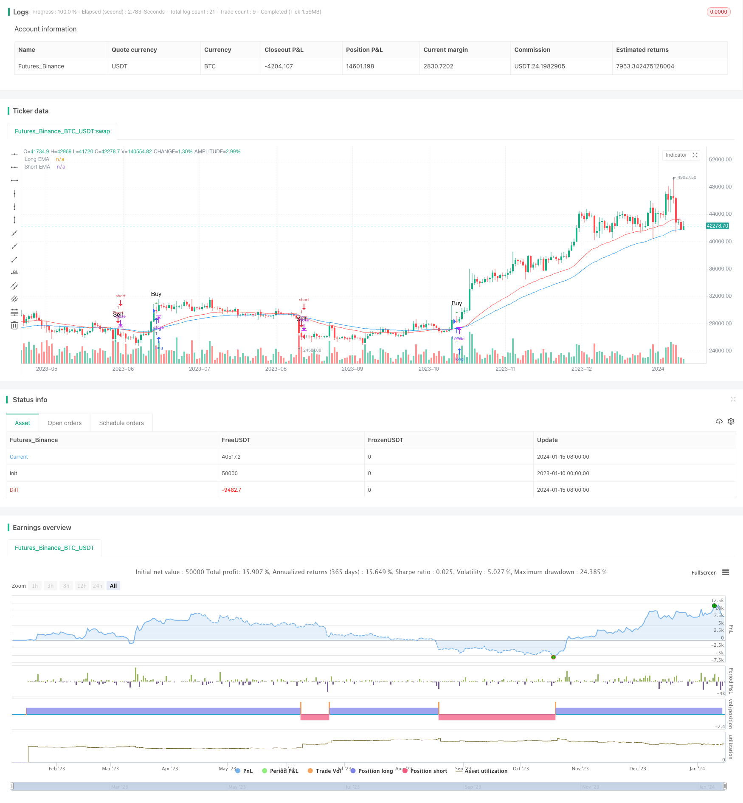

> Name

Momentum-Moving-Average-Crossover-Trading-Strategy
> Author

ChaoZhang

> Strategy Description


 [trans]
## Overview
This strategy is a momentum trading strategy based on moving average crossovers. It uses two exponential moving averages (EMA) with different periods to identify buy and sell signals. When the fast EMA line crosses the slow EMA line from below, a buy signal is generated; when the fast EMA line crosses the slow EMA line from above, a sell signal is generated.
## Principle
The core logic of this strategy is based on the moving average crossover system. EMA refers to exponential moving average, that is, exponential moving average. The calculation formula of EMA is as follows:
$$EMA_t=\frac{P_t \times k}{1+k}+\frac{EMA_{t-1}\times(1-k)}{1+k}$$
Among them, $P_t$ represents the closing price of the day, $EMA_{t-1}$ represents the EMA value of the previous day, $k=\frac{2}{n+1}$, and n represents the time period of EMA.
The fast EMA period in this strategy is set to 55 and the slow EMA period is set to 34. When the short-term EMA crosses the long-term EMA from below, it means that the short-term moving average begins to lead the long-term moving average upward, which is a golden cross signal and creates a buying opportunity. On the contrary, when the short-term EMA crosses the long-term EMA from above, it means that the short-term moving average begins to lag behind the long-term moving average downward, which is a dead cross signal and generates a selling opportunity.
## Advantages
This strategy has the following advantages:
1. The principle is simple, easy to understand and implement;
2. The trading signals are clear and the indicator combination works well;
3. Can be used flexibly in different market environments and is suitable for high-frequency and low-frequency transactions;
4. It can be optimized by adjusting EMA parameters to avoid false signals.
## Risks and Solutions
This strategy also has certain risks, mainly including:
1. May produce more false signals. The solution is to adjust the EMA parameters and use a more stable parameter combination.
2. It is easy to get trapped in volatile market conditions. The solution is to filter in combination with trend indicators.
3. It is impossible to judge the true trend of the market and there are trading risks. The solution is to use it in conjunction with fundamental analysis and volume and price indicators.
## Optimization direction
This strategy can be optimized from the following aspects:
1. EMA cycle optimization. You can test more parameter combinations to find a more suitable fast and slow EMA period.
2. Add a stop loss mechanism. You can set a trailing stop loss or a percentage stop loss to control single losses.
3. Combined with quantity and energy indicators. Indicators such as trading volume and Bollinger Bands can be added for filtering to reduce false signals.
4. Multi-time frame verification. Signals can be verified on higher level time frames to avoid being trapped.
## Summary
Overall, this strategy is a very classic and practical short-term trading strategy. It has simple and clear trading signals and flexible application space. Through parameter optimization, indicator filtering, risk control and other means, the effect of this strategy can be continuously improved, making it one of the important tools for intraday high-frequency trading. Overall, this strategy has high practical value and is a basic module for quantitative trading.
|| 

## Overview
This is a momentum trading strategy based on moving average crossover. It uses two exponential moving averages (EMAs) with different periods to identify trading signals. A buying signal is generated when the faster EMA crosses above the slower EMA. A selling signal is generated when the faster EMA crosses below the slower EMA.  

## Principles
The core logic of this strategy is based on the moving average crossover system. EMA stands for Exponential Moving Average. The calculation formula for EMA is: 
$$EMA_t = \frac{P_t \times k}{1+k}+\frac{EMA_{t-1}\times(1-k)}{1+k}$$
Where $P_t$ is the closing price of the current day, $EMA_{t-1}$ is the EMA value of the previous day, $k = \frac{2}{n+1}$, and n is the EMA period.

The fast EMA period in this strategy is set to 55 and the slow EMA period is set to 34. When the short period EMA crosses above the long period EMA from the bottom up, it indicates the short term moving average starts leading the long term one upwards, generating a golden cross buying signal. On the contrary, when the short period EMA crosses below the long period EMA from the top down, it indicates the short term moving average starts lagging behind the long term one downwards, generating a death cross selling signal.

## Advantages
The advantages of this strategy include:

1. Simple principles, easy to understand and implement;  
2. Clear trading signals with good indicator combination effects;
3. Flexibility to apply in different market environments for high/low-frequency trading;  
4. Optimizable parameters to avoid false signals.  

## Risks and Solutions
There are some risks when using this strategy:  

1. Potentially more false signals. Solution: Optimize EMA parameters with more stable settings.
2. Prone to consolidation market whipsaws. Solution: Use trend filter indicators. 
3. Unable to tell real market trends or sentiments. Solution: Combine fundamental and volume-price analysis.   

## Enhancement Directions
The strategy can be enhanced from the following aspects:  

1. EMA period optimization with more combinations.
2. Add stop loss mechanisms like fixed percentage.  
3. Incorporate volume indicators for filtering signals.
4. Add multi-timeframe verification system.  

## Summary
In summary, this is a very classic and practical short-term trading strategy. It has simple clear signals and flexible application space. Through parameter tuning, filter mechanisms, risk control etc, the strategy's performance can be continuously improved, making it an important tool for high-frequency intraday trading. Overall speaking, this strategy is highly practical with strong application value as a base module for quantified trading.  
[/trans]

> Strategy Arguments


|Argument|Default|Description|
|----|----|----|
|v_input_1|55|Short EMA Length|
|v_input_2|34|Long EMA Length|


> Source (PineScript)

``` pinescript
/*backtest
start: 2023-01-10 00:00:00
end: 2024-01-16 00:00:00
period: 1d
basePeriod: 1h
exchanges: [{"eid":"Futures_Binance","currency":"BTC_USDT"}]
*/

//@version=5
strategy("mohammad tork strategy", overlay=true)

// Input parameters
lengthShortEMA = input(55, title="Short EMA Length")
lengthLongEMA = input(34, title="Long EMA Length")

// Calculate EMAs
emaShort = ta.ema(close, lengthShortEMA)
emaLong = ta.ema(close, lengthLongEMA)

// Conditions for Long Signal
longCondition = ta.crossover(emaLong, emaShort)

// Conditions for Short Signal
shortCondition = ta.crossunder(emaLong, emaShort)

// Execute Long Signal
strategy.entry("Long", strategy.long, when = longCondition)

// Execute Short Signal
strategy.entry("Short", strategy.short, when = shortCondition)

// Plot EMAs on the chart
plot(emaShort, color=color.blue, title="Short EMA")
plot(emaLong, color=color.red, title="Long EMA")

// Plot Long Signal Icon with Buy Label
plotshape(series=longCondition, title="Long Signal", color=color.green, style=shape.triangleup, location=location.abovebar, size=size.small, text="Buy")

// Plot Short Signal Icon with Sell Label
plotshape(series=shortCondition, title="Short Signal", color=color.red, style=shape.triangledown, location=location.abovebar, size=size.small, text="Sell")

```

> Detail

https://www.fmz.com/strategy/439104

> Last Modified

2024-01-17 17:41:48
