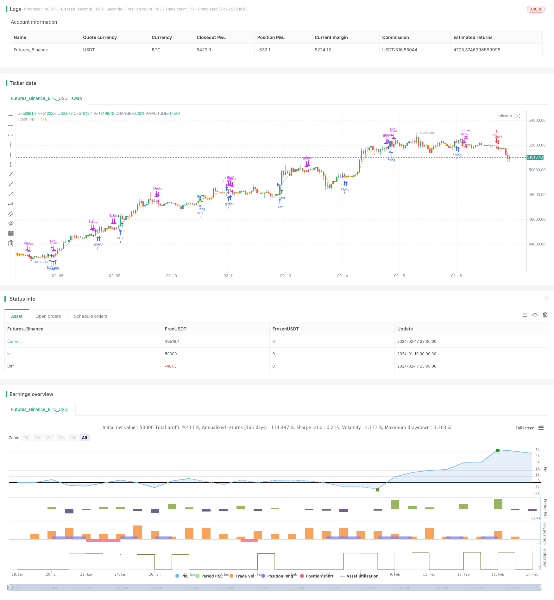

> Name

Momentum-Moving-Average-Crossover-Trading-Strategy
> Author

ChaoZhang

> Strategy Description


[trans]

## Overview
This strategy is based on the MACD indicator to determine trading signals. The MACD indicator includes three lines: MACD line, SIGNAL line and histogram HISTO line. When the MACD line breaks through the SIGNAL line from bottom to top and becomes positive, it is a buy signal. When the MACD line falls below the SIGNAL line from top to bottom and becomes negative, it is a sell signal.
## Strategy Principle
1. Calculate MACD line, SIGNAL line and HISTO line.
2. Determine the intersection of the MACD line and the SIGNAL line to determine buy and sell signals.
3. Further use the 34-period EMA as support and resistance, only go long above the EMA and go short below the EMA.
4. Set stop loss and take profit to ensure arbitrage.
Specifically, when the closing price crosses the 34EMA and the MACD line crosses the SIGNAL line and becomes a positive number, it indicates that the stock price has strong upward momentum, then buy. When the closing price crosses the 34EMA and the MACD line crosses the SIGNAL line and becomes a negative number, it indicates that the stock price has a strong downward momentum, so sell at this time.
## Strategic Advantages
1. The MACD indicator accurately judges stock price changes and provides clear signals.
2. Combined with EMA filtering, false buy and sell signals are avoided.
3. Set stop-loss and stop-profit points to control the loss of each order.
## Risks and Solutions
1. There is a lag in the signal generated by the MACD indicator, and the best buying and selling points may be missed. Parameters can be appropriately optimized to shorten the average period.
2. A single indicator is prone to produce false signals. Other indicators can be added for filtering, such as KDJ indicator. 
3. There is no limit on the number of positions that can be opened, which may result in over-trading. You can set a daily or weekly limit on the number of positions you can open.
## Optimization direction
1. Optimize MACD parameters and find the best parameter combination.
2. Add other indicator judgments to avoid false signals. Common combination indicators include MACD+KDJ, MACD+BOLL, etc.
3. Add a limit on the number of positions opened to avoid excessive trading.
4. Optimize stop-loss and take-profit strategies to improve the profit-loss ratio.
## Summarize
This strategy uses the MACD indicator to determine the timing of buying and selling, and then uses 34EMA to filter out error signals, so that it can capture opportunities in time when the stock price starts a new round of market movement. At the same time, setting stop-loss and stop-profit points to control risks is a relatively stable and reliable trading strategy. In the future, the strategy can be further improved through parameter optimization and other indicator judgments to increase profitability.
||

## Overview

This strategy generates trading signals based on the MACD indicator. The MACD indicator consists of three lines: the MACD line, SIGNAL line and histogram (HISTO) line. When the MACD line crosses above the SIGNAL line and turns positive, it generates a buy signal. When the MACD line crosses below the SIGNAL line and turns negative, it generates a sell signal.  

## Strategy Logic  

1. Calculate the MACD line, SIGNAL line and HISTO line.  
2. Identify crossover points between the MACD line and SIGNAL line to determine buy and sell signals.
3. Use a 34-period EMA as support/resistance zone, go long only above EMA and go short only below EMA.  
4. Set stop loss and take profit to lock in profits.  

Specifically, when the close price crosses above the 34-period EMA and the MACD line crosses above the SIGNAL line into positive territory, it indicates strong upside momentum, so we buy. When the close price crosses below the 34-period EMA and the MACD line crosses below the SIGNAL line into negative territory, it indicates strong downside momentum, so we sell.

## Advantages  

1. MACD indicator accurately identifies turns in price action with clear signals.  
2. Combining with EMA filter avoids false buy/sell signals. 
3. Stop loss and take profit controls per trade loss.  

## Risks and Solutions

1. MACD signals lag price action and may miss best entry/exit points. Can optimize parameters to shorten moving average periods.  
2. Single indicator prone to generating false signals. Can add other indicators like KDJ for filtration.  
3. No limit on number of trades, may lead to overtrading. Can set daily/weekly trade limits.   

## Enhancement Opportunities  

1. Optimize MACD parameters to find best parameter combination.  
2. Add other indicator judgments to avoid false signals, e.g. MACD+KDJ, MACD+BOLL combinations.   
3. Implement trade frequency limits to prevent overtrading. 
4. Optimize stop loss/take profit strategy to improve risk/reward ratio.

## Conclusion  

This strategy identifies trading opportunities using the MACD indicator and filters signals using a 34-period EMA. It allows timely entries when new price trends start while controlling risk via stop loss/take profit. The strategy can be further refined via parameter optimization, adding other indicators etc. to improve profitability.  

[/trans]

> Strategy Arguments


|Argument|Default|Description|
|----|----|----|
|v_input_1|true|Check here for tendies|


> Source (PineScript)

``` pinescript
/*backtest
start: 2024-01-19 00:00:00
end: 2024-02-18 00:00:00
period: 1h
basePeriod: 15m
exchanges: [{"eid":"Futures_Binance","currency":"BTC_USDT"}]
*/

// This source code is subject to the terms of the Mozilla Public License 2.0 at https://mozilla.org/MPL/2.0/
// © melihtuna

//@version=2
strategy("Jim's MACD", overlay=true)

Tendies = input(true, title="Check here for tendies")

// === MACD Setup ===
[macdLine, signalLine, histLine] = macd(close, 12, 26, 9)

//EMA
ma = ema(close, 5)
plot(ema(close,5))


//Entry
if (close > ma and cross(macdLine,signalLine) and histLine> 0.4 and signalLine > 0 or histLine > 0 and signalLine > 0 )
    strategy.entry("BUY", strategy.long)
if(close < ma and cross(macdLine,signalLine) and histLine < -0.4 and signalLine < 0 or close < ma and histLine < 0 and signalLine < 0 )
    strategy.entry("SELL", strategy.short)
    
//Exit 
strategy.close("BUY", when = histLine < 0  )
strategy.close("SELL", when = histLine > 0  )

```

> Detail

https://www.fmz.com/strategy/442118

> Last Modified

2024-02-19 14:53:50
