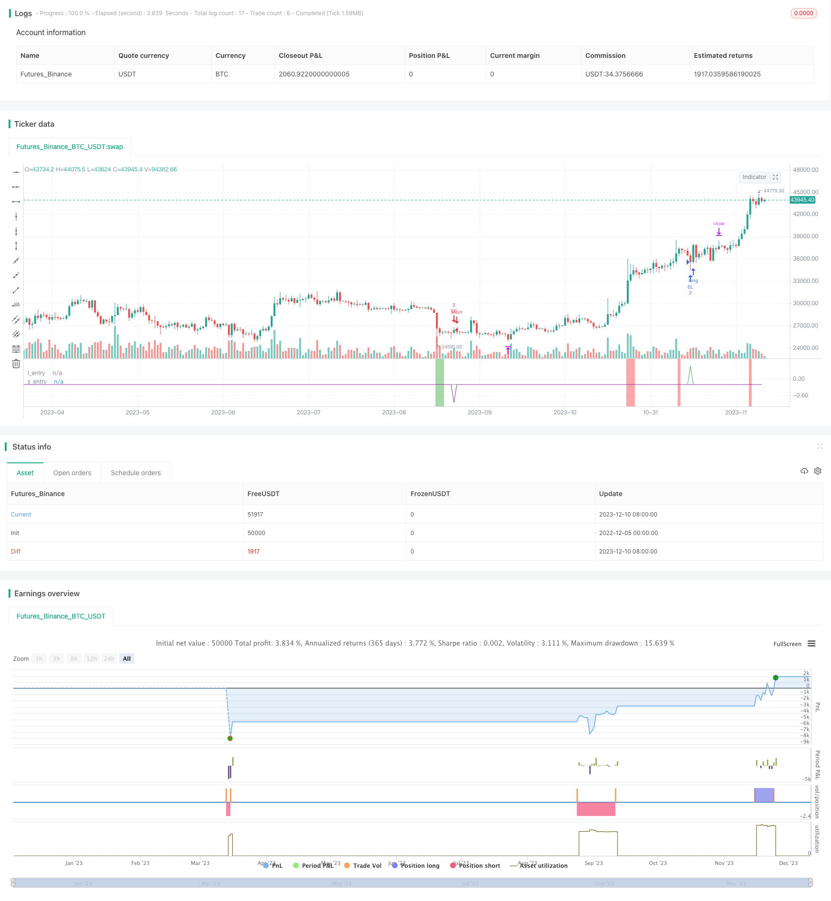

> Name

Momentum-Pullback-Strategy
> Author

ChaoZhang

> Strategy Description


[trans]

## Overview
Momentum Pullback Strategy is a long and short position strategy that identifies RSI extreme values ​​as momentum signals. Unlike most RSI strategies, this strategy looks for the first pullback in the direction of extreme RSI readings to enter.
It goes long/short at the first pullback point of the 5-day EMA (lowest price)/5-day EMA (highest price), and closes the position at the highest high/lowest point of the rolling 12 candlesticks. This rolling high/low mechanism means that if the price enters a long-term consolidation, the take-profit target will be lowered with each new candlestick. The best trades usually come within 2-6 candlesticks.
The recommended stop loss distance is X times ATR of the entry price (adjustable in user input parameters).
This strategy is highly robust to various time periods and markets, with a winning rate between 60% and 70%, and a large profitable transaction scale. There is a need to avoid signaling in the midst of fluctuations caused by major economic news.
## Strategy Principle
1. Calculate the 6-day RSI value and look for extreme points above 90 (overbought) and below 10 (oversold)
2. When RSI is overbought, pull back to the 5-day EMA (lowest line) within 6 K lines for long entry
3. When RSI is oversold, pull back to the 5-day EMA (highest line) within 6 K lines for short entry.
4. The exit strategy is moving take profit. For long positions, the highest point of the past 12 K lines is the first exit target. Then when a new K line appears, it is updated to the highest point of the new 12 K lines to achieve rolling exit. On the contrary, the short position will stop the loss at the lowest point of rolling 12 K lines.
5. The stop loss distance is X times ATR of the entry price, which can be customized.
## Advantage Analysis
This strategy combines the RSI extreme value as a potential energy signal and pullback entry, which can capture potential reversal points in the trend and has a high winning rate.
The moving take-profit mechanism is enabled, which can lock in part of the profit based on the actual price trend and reduce retracement.
ATR stop loss can effectively control single losses.
It has strong robustness, can be applied to different markets and parameter combinations, and is easy to replicate in real markets.
## Risk Analysis
If the ATR value is set too large, the stop loss distance may be too far and the single loss will be expanded.
If a consolidation occurs, the moving take-profit mechanism will reduce the profit margin.
If the pullback distance is too deep and exceeds 6 K lines, the entry opportunity will be missed.
If major economic events occur, trading may experience slippage or false breakouts.
## Optimization direction
You can test shortening the number of entry bars, such as adjusting from 6 to 4 K-lines, to improve the success rate of entry.
You can test increasing the ATR multiple to further control the single stop loss.
You can combine it with volume and energy indicators to avoid losses caused by divergence.
You can enter the market after the pullback breaks through the central axis of the 60-minute level, which can filter out some noise.
## Summarize
The momentum pullback strategy is generally a very practical short-term capturing strategy. It combines many aspects of trend, reversal, and stop loss. It can not only facilitate real-time operation, but also has a certain Alpha. By adjusting parameters and combining other indicators, stability can be further improved. Overall, this strategy is a great boon for quantitative trading and is worth learning and using.
|| 

## Overview

The Momentum Pullback Strategy identifies extreme RSI readings as momentum signals for a long/short strategy. Unlike most RSI strategies, it looks to buy or sell the first pullback in the direction of the extreme RSI reading.

It enters long/short on the first pullback to the 5-period EMA (low)/5-period EMA (high) and exits at the rolling 12-bar high/low. The rolling high/low feature means the profit target will begin to reduce with each new bar if the price enters prolonged consolidation. The best trades tend to work within 2-6 bars.  

The suggested stop loss is X ATRs (adjustable in inputs) from the entry price.

The strategy is fairly robust across timeframes and markets with 60%-70% win rate and larger winning trades. Signals occurring from news volatility should be avoided.

## Strategy Logic

1. Calculate 6-period RSI and identify values above 90 (overbought) and below 10 (oversold).

2. When RSI is overbought, go long on a pullback to the 5-period EMA (low) within 6 bars.  

3. When RSI is oversold, go short on a pullback to the 5-period EMA (high) within 6 bars.

4. The exit strategy is a moving take profit, with the initial target being the highest high/lowest low of the past 12 bars, updating on each new bar for a rolling exit.  

5. The stop loss is X ATRs from the entry price (customizable).

## Advantage Analysis  

The strategy combines RSI extremes as momentum signals and pullback entries to capture potential reversal points in trends, with a high win rate.

The moving take profit mechanism locks in partial profits according to actual price action, reducing drawdowns.

The ATR stop helps effectively control single-trade loss.

Good robustness to apply across different markets and parameter sets for easy real trading replication.

## Risk Analysis

A too-wide stop loss if ATR multiplier set too high, increasing loss per trade.

Moving take profit mechanism may reduce profit margin if prolonged consolidation occurs.  

Missing trades if pullback extends beyond 6 bars.

Potential slippage or false breakout if major news events occur.

## Optimization Directions

Test shortening entry bar count from 6 to 4 to improve entry rate.

Test increasing ATR multiplier to further control loss per trade. 

Incorporate volume indicators to avoid losses from divergence in consolidation.

Enter on pullback break of 60min mid-point to filter noise.

## Conclusion

The Momentum Pullback Strategy is an overall very practical short-term mean reversion approach, incorporating elements of trend, reversal and risk management for easy real trading while still carrying alpha-generating potential. Further stability enhancements are possible through parameter tuning and combining additional indicators. It represents a great boon for quant trading and is well worth learning and applying.

[/trans]

> Strategy Arguments


|Argument|Default|Description|
|----|----|----|
|v_input_float_1|2.75|atr stop|


> Source (PineScript)

``` pinescript
/*backtest
start: 2022-12-05 00:00:00
end: 2023-12-11 00:00:00
period: 1d
basePeriod: 1h
exchanges: [{"eid":"Futures_Binance","currency":"BTC_USDT"}]
*/

// This source code is subject to the terms of the Mozilla Public License 2.0 at https://mozilla.org/MPL/2.0/
// © Marcns_

//@version=5
strategy("M0PB", commission_value = 0.0004, slippage = 1, initial_capital=30000)
// commision is equal to approx $3.8 per round trip which is accurate for ES1! futures and slippage per trade is conservatively 1 tick in and 1 tick out. 

// *momentum pull back* //

// long / short strategy that identifies extreme readings on the rsi as a *momentum signal*
//Strategy buys/ sells a pullback to the 5ema(low)/ 5ema(high) and exits at rolling 12 bar high/ low. The rolling high/ low feature means that 
//if price enters into a pronlonged consolidation the profit target will begin to reduce with each new bar. The best trades tend to work within 2-6 bars
// hard stop is X atr's from postion average price. This can be adjusted in user inputs.
// built for use on 5 min & 1min intervals on: FX, Indexes, Crypto
// there is a lot of slack left in entries and exits but the overall strategy is fairly robust across timeframes and markets and has between 60%-70% winrate with larger winners.
// signals that occur from economic news volatility are best avoided.  


// define rsi
r = ta.rsi(close,6) 

// find rsi > 90
b = 0.0

if r >= 90
    b := 1.0
else
    na

// find rsi < 10
s = 0.0

if r <= 10
    s := -1.0
else
    na

// plot rsi extreme as painted background color
bgcolor(b ? color.rgb(255, 82, 82, 49): na)
bgcolor(s? color.rgb(76, 175, 79, 51): na)


// exponential moving averages for entries. note that source is high and low (normally close is def input) this creates entry bands
//entry short price using high as a source ta.ema(high,5)
es = ta.ema(high,5)

//entry long price using low as a source ta.ema(low,5)
el = ta.ema(low,5)


// long pullback entry trigger: last period above ema and current low below target ema entry 
let = 0.0

if low[1] > el[1] and low <= el
    let := 1.0
else
    na
//short entry trigger ""
set = 0.0

if high[1] < es[1] and high >= es
    set := -1.0
else
    na

// create signal "trade_l" if RSI > 90 and price pulls back to 5ema(low) within 6 bars
trade_l = 0.0

if ta.barssince(b == 1.0) < 6 and let == 1.0
    trade_l := 1.0
else
    na

plot(trade_l, "l_entry", color.green)

//create short signal "trade_s" if rsi < 10 and prices pullback to 5em(high) wihthin 6 bars
trade_s = 0.0

if ta.barssince(s == -1.0) < 6 and set == -1.0
    trade_s := -1.0
else
    na

plot(trade_s, "s_entry", color.purple)

// define price at time of trade_l signal and input value into trade_p to use for stop parems later
trade_p = strategy.position_avg_price

//indentify previous 12 bar high as part of long exit strat
// this creates a rolling 12 bar high target... a quick move back up will exit at previous swing high but if a consolidation occurs system will exit on a new 12 bar high which may be below prev local high
ph = ta.highest(12)

// inverse of above for short exit strat - previous lowest low of 12 bars as exit (rolling)
pl = ta.lowest(12)


// 1.5 atr stop below entry price (trade_p defined earlier) as part of exit strat
atr_inp = input.float(2.75, "atr stop", minval = 0.1, maxval = 6.0)

atr = ta.atr(10)

stop_l = trade_p - (atr* atr_inp)
stop_s = trade_p + (atr* atr_inp)

//strat entry long

strategy.entry("EL", strategy.long, 2, when = trade_l == 1.0)

//strat entry short

strategy.entry("ES", strategy.short, 2, when = trade_s == -1.0)   
    
//strat long exit

if strategy.position_size == 2
    strategy.exit(id = "ph", from_entry = "EL", qty = 2, limit = ph)
    if strategy.position_size == 2
        strategy.close_all(when = low[1] > stop_l[1] and low <= stop_l)

// strat short exit

if strategy.position_size == -2
    strategy.exit(id = "pl", from_entry = "ES", qty = 2, limit =pl)
    if strategy.position_size == -2
        strategy.close_all(when = high[1] < stop_s[1] and high >= stop_s)


// code below to trail remaining 50% of position //

 //if strategy.position_size == 1 
        //strategy.exit(id ="trail", from_entry = "EL", qty = 1, stop = el)
        

```

> Detail

https://www.fmz.com/strategy/435147

> Last Modified

2023-12-12 16:34:52
