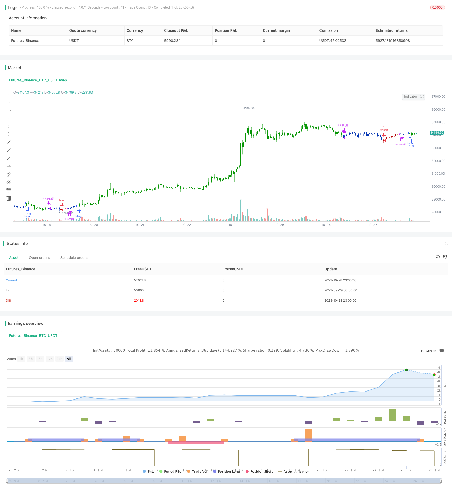

> Name

Momentum-Reversal-Combo-Strategy
> Author

ChaoZhang

> Strategy Description



[trans]

## Overview
This strategy uses a combination of two momentum indicators to explore more trading opportunities. The first indicator is the fast and slow stochastic reversal strategy proposed by Ulf Jansen in his book. The second indicator is detrended synthetic price proposed by John Ehlers. This strategy combines the signals of two indicators and places an order when both indicators send out buy or sell signals at the same time.
## Strategy Principle
The principle of the fast and slow stochastic indicator reversal strategy in the first part is: when the closing price is lower than the previous day's closing price for two consecutive days, and the fast line is higher than the slow line, go long; when the closing price is higher than the previous day's closing price for two consecutive days, and the fast line is lower than the slow line, go short.
The calculation formula for the detrended synthetic price in the second part is:
DSP = EMA(HL/2, 0.25 period) - EMA(HL/2, 0.5 period)
Among them, HL/2 is the midpoint of calculating high and low prices, the 0.25 period EMA represents the short-term trend of prices, and the 0.5 period EMA represents the long-term trend of prices. The detrended composite price represents the price's rise and fall relative to its dominant cycle. It is bullish when DSP crosses above the threshold and bearish when it crosses below.
This strategy takes both indicator signals into consideration. A position will only be opened if both indicators send a buy or sell signal at the same time.
## Advantage Analysis
- Using two indicators to filter uncertain signals can reduce erroneous transactions
- The two indicators verify each other, which can improve the reliability of the signal
- Fast and Slow Stochastic reversal strategy can capture short-term reversal opportunities
- Detrended synthetic prices can identify medium and long-term trends
- Combining two indicators can capture reversals and follow trends with high flexibility
## Risk Analysis
- Fast and Slow Stochastics perform poorly in volatile markets
- Detrended synthetic prices may send false signals before trend turning points
- Only trade when both indicators send signals at the same time, you may miss some opportunities
- Each parameter needs to be set correctly to achieve the combined effect.
## Optimization direction
- You can test different parameters and optimize the effect of indicators
- You can try different indicator weights, such as delayed detrending to synthesize price signals
- Stop loss can be added to control risk
- Can combine more different types of indicators to build multi-factor models
## Summarize
This strategy combines two different momentum indicators, improves signal quality through double filtering, and controls risk while maintaining trading frequency. However, it is necessary to pay attention to the limitations of the indicator itself and optimize the parameters appropriately. If it can be continuously optimized, this strategy is expected to obtain excess returns that exceed the market.
||


## Overview

This strategy combines two momentum indicators to uncover more trading opportunities. The first indicator is a stochastic oscillator reversal strategy proposed in Ulf Jensen's book. The second indicator is John Ehlers' detrended synthetic price. The strategy takes positions when both indicators give concurring buy or sell signals.

## Strategy Logic

The logic behind the stochastic oscillator reversal is: go long when close is lower than previous close for 2 straight days and fast line is above slow line; go short when close is higher than previous close for 2 straight days and fast line is below slow line. 

The detrended synthetic price (DSP) is calculated as:

DSP = EMA(HL/2, 0.25 cycle) - EMA(HL/2, 0.5 cycle)

where HL/2 is the midpoint of high and low, 0.25 cycle EMA represents short-term trend and 0.5 cycle EMA represents long-term trend. DSP shows the price deviation from its dominant cycle. Buy when DSP crosses above threshold and sell when crossing below.

This strategy combines the signals from both indicators. It only enters positions when both indicators give concurring signals.

## Advantage Analysis

- Filtering uncertain signals with two indicators reduces wrong trades
- Validation between indicators enhances signal reliability  
- Stochastic reversal catches short-term reversal opportunities
- DSP identifies medium to long term trends
- Combining two indicators provides flexibility to catch reversals and follow trends

## Risk Analysis

- Stochastic performs poorly in ranging markets
- DSP may give wrong signals near trend turning points  
- Missing some opportunities by only trading on concurring signals
- Needs proper parameter tuning to achieve combinatorial effect

## Enhancement Directions

- Test different parameters to optimize indicator performance
- Try different indicator weighting, e.g. delay DSP signals
- Add stop loss to control risks
- Incorporate more indicators to build multi-factor model

## Conclusion

The strategy combines two different momentum indicators and improves signal quality through double filtering while maintaining trade frequency and controlling risks. But the limitations of the individual indicators need to be noted and parameters properly tuned. With continuous optimizations, the strategy has the potential to generate alpha over the broad market.

[/trans]

> Strategy Arguments


|Argument|Default|Description|
|----|----|----|
|v_input_1|14|Length|
|v_input_2|true|KSmoothing|
|v_input_3|3|DLength|
|v_input_4|50|Level|
|v_input_5|14|LengthDSP|
|v_input_6|-25|SellBand|
|v_input_7|25|BuyBand|
|v_input_8|false|Trade reverse|


> Source (PineScript)

``` pinescript
/*backtest
start: 2023-09-29 00:00:00
end: 2023-10-29 00:00:00
period: 1h
basePeriod: 15m
exchanges: [{"eid":"Futures_Binance","currency":"BTC_USDT"}]
*/

//@version=4
////////////////////////////////////////////////////////////
//  Copyright by HPotter v1.0 18/11/2019
// This is combo strategies for get a cumulative signal. 
//
// First strategy
// This System was created from the Book "How I Tripled My Money In The 
// Futures Market" by Ulf Jensen, Page 183. This is reverse type of strategies.
// The strategy buys at market, if close price is higher than the previous close 
// during 2 days and the meaning of 9-days Stochastic Slow Oscillator is lower than 50. 
// The strategy sells at market, if close price is lower than the previous close price 
// during 2 days and the meaning of 9-days Stochastic Fast Oscillator is higher than 50.
//
// Second strategy
// Detrended Synthetic Price is a function that is in phase with the 
// dominant cycle of real price data. This DSP is computed by subtracting 
// a half-cycle exponential moving average (EMA) from the quarter cycle 
// exponential moving average.
// See "MESA and Trading Market Cycles" by John Ehlers pages 64 - 70. 
//
// WARNING:
// - For purpose educate only
// - This script to change bars colors.
////////////////////////////////////////////////////////////
Reversal123(Length, KSmoothing, DLength, Level) =>
    vFast = sma(stoch(close, high, low, Length), KSmoothing) 
    vSlow = sma(vFast, DLength)
    pos = 0.0
    pos := iff(close[2] < close[1] and close > close[1] and vFast < vSlow and vFast > Level, 1,
	         iff(close[2] > close[1] and close < close[1] and vFast > vSlow and vFast < Level, -1, nz(pos[1], 0))) 
	pos

D_DSP(Length, SellBand, BuyBand) =>
    pos = 0.0
    xHL2 = hl2
    xEMA1 = ema(xHL2, Length)
    xEMA2 = ema(xHL2, 2 * Length)
    xEMA1_EMA2 = xEMA1 - xEMA2
    pos := iff(xEMA1_EMA2 > SellBand, 1,
	         iff(xEMA1_EMA2 < BuyBand, -1, nz(pos[1], 0))) 
	pos

strategy(title="Combo Backtest 123 Reversal & D_DSP (Detrended Synthetic Price) V 2", shorttitle="Combo", overlay = true)
Length = input(14, minval=1)
KSmoothing = input(1, minval=1)
DLength = input(3, minval=1)
Level = input(50, minval=1)
//-------------------------
LengthDSP = input(14, minval=1)
SellBand = input(-25)
BuyBand = input(25)
reverse = input(false, title="Trade reverse")
posReversal123 = Reversal123(Length, KSmoothing, DLength, Level)
posD_DSP = D_DSP(LengthDSP, SellBand, BuyBand)
pos = iff(posReversal123 == 1 and posD_DSP == 1 , 1,
	   iff(posReversal123 == -1 and posD_DSP == -1, -1, 0)) 
possig = iff(reverse and pos == 1, -1,
          iff(reverse and pos == -1 , 1, pos))	   
if (possig == 1) 
    strategy.entry("Long", strategy.long)
if (possig == -1)
    strategy.entry("Short", strategy.short)	 
if (possig == 0) 
    strategy.close_all()
barcolor(possig == -1 ? #b50404: possig == 1 ? #079605 : #0536b3 )
```

> Detail

https://www.fmz.com/strategy/430555

> Last Modified

2023-10-30 11:49:26
