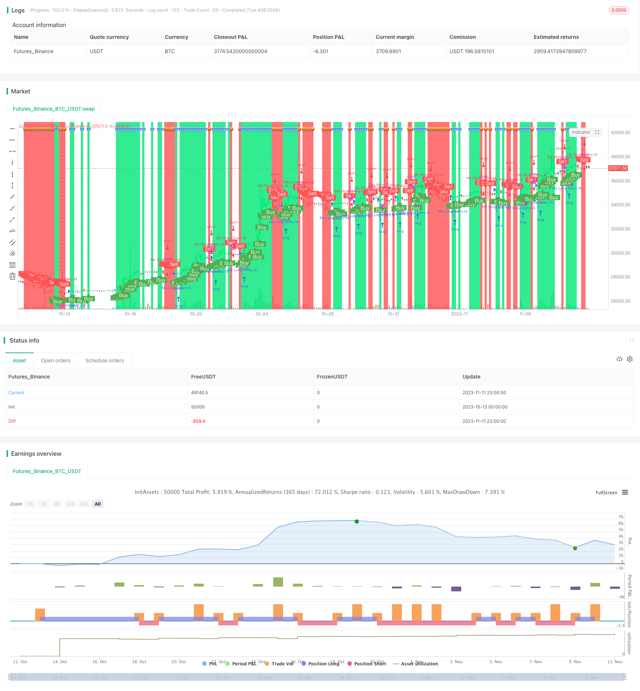

> Name

Short-term momentum reversal strategy Momentum-Reversal-Strategy
> Author

ChaoZhang

> Strategy Description


[trans]

### Overview
The purpose of this strategy is to detect the price change percentage of the target within a specific period of time and generate a trading signal when it exceeds the set threshold. This strategy is suitable for short-term and handicap trading, and can capture trading opportunities brought about by sudden market changes.
### Strategy Principles
1. The input parameter x represents the number of K-line periods to be checked. The default value is 5, which represents the 5-minute K-line.
2. Calculate the change percentage of the current K-line closing price relative to the closing price x period ago, and save it as trueChange1 and trueChange2.
3. The input parameters percentChangePos and percentChangeNeg represent the set change percentage thresholds. The defaults are 0.4% and -0.4%.
4. When trueChange1 is greater than percentChangePos, a buy signal is generated. When trueChange2 is less than percentChangeNeg, a sell signal is generated.
5. Draw text and background marks for buy and sell status.
6. Set entry and exit conditions based on signals.
7. Configure alarms and graphics.
### Strategic Advantages
1. Use percentage changes instead of absolute price changes to automatically adjust parameters to suit different targets.
2. The percentage thresholds for positive and negative changes can be flexibly set to identify breakthroughs on both sides of the Bollinger Band.
3. The detection cycle parameters can be adjusted to identify trend changes in different time periods.
4. Alarm reminders can be configured to ensure that important signals are not missed.
5. Simple and direct trading signal logic, easy to understand and use.
6. Capture short-term market reversal opportunities at the market.
### Strategy Risk
1. Percent change cannot determine the trend direction and may produce misleading signals.
2. The default parameters may not be suitable for all targets and need to be adjusted accordingly.
3. There is no stop loss method and it is impossible to control a single loss.
4. Signals are frequent and transaction costs may be high.
5. Unable to judge the market structure and easily trapped in a volatile market.
Solution:
1. Use indicators such as trend linear regression to determine the general trend.
2. Optimize parameter settings according to the characteristics of different targets.
3. Set stop loss conditions appropriately.
4. Filter signals to avoid trading too frequently.
5. Judge the market structure based on a higher time period and avoid blind trading in volatile markets.
### Strategy optimization
1. Add stop loss mechanisms, such as trailing stop loss, trailing stop loss, etc., to control single losses.
2. Add filtering conditions, such as energy indicators, moving averages, etc., to avoid being trapped.
3. Optimize the setting of buying and selling points, such as combining MACD and other indicators to confirm signals.
4. Use machine learning methods to automatically optimize parameters.
5. Increase your judgment on the market structure and avoid blind trading in volatile markets.
6. Consider the differences in volatility, liquidity, etc. of the underlying and dynamically set parameters.
7. Combine with high-level time period analysis to determine the direction of the general trend.
### Summarize
This strategy determines the timing of buying and selling by comparing the price change percentage with the preset threshold, and is a short-term reversal strategy. The advantage is that it is simple and intuitive, can be configured flexibly, and is suitable for capturing unexpected situations. The disadvantage is that there is a certain risk of profit and loss, which requires the use of trend judgment and risk control methods. Overall, the strategy is clear and easy to understand, and can become an effective short-term trading strategy through reasonable optimization.

||


### Overview

This strategy aims to detect the percentage price change of stocks within a certain time period and generate trading signals when a threshold is exceeded. It is suitable for short-term and scalping trading to capture opportunities from sudden market movements.

### Strategy Logic

1. The input parameter x represents the number of candlestick periods to check, with a default of 5 for 5-minute candles.

2. Calculate the percentage change of the current closing price relative to the closing price x periods ago, saved as trueChange1 and trueChange2.  

3. The input parameters percentChangePos and percentChangeNeg represent the threshold percentage change, with default values of 0.4% and -0.4%.

4. When trueChange1 is greater than percentChangePos, a buy signal buy is generated. When trueChange2 is less than percentChangeNeg, a sell signal sell is generated.

5. Add text and background colors for buy and sell status. 

6. Set entry and exit rules based on the signals.

7. Configure alerts and drawings.

### Advantages

1. Use percentage change rather than absolute price change, adaptable to different stocks.

2. Flexibly set positive and negative percentage thresholds to identify Bollinger Bands breakouts.

3. Adjustable detection period to identify trend changes in different time frames. 

4. Configurable alerts to catch important signals.

5. Simple and straightforward signal logic, easy to understand and use. 

6. Catch short-term reversals at market open.

### Risks

1. Percentage change does not determine trend direction, may generate misleading signals.

2. Default parameters may not suit all stocks, specific tuning needed.

3. No stop loss in place, unable to limit losses.

4. Frequent signals, potentially high trading costs. 

5. Unable to determine market structure, prone to whipsaws in ranging markets.

Solutions:

1. Combine with trend indicators like linear regression to determine overall trend.

2. Optimize parameters based on stock characteristics.

3. Implement proper stop loss. 

4. Filter signals to avoid over-trading.

5. Gauge market structure from higher time frames to avoid trading whipsaws.

### Enhancements

1. Add stop loss mechanisms like trailing stop loss to limit losses.

2. Add filter conditions like volume, moving averages to avoid whipsaws.

3. Optimize entry and exit rules with indicators like MACD.

4. Use machine learning to auto optimize parameters.

5. Incorporate analysis of market structure to avoid whipsaws. 

6. Dynamically set parameters based on volatility and liquidity.

7. Combine with higher time frame analysis to determine overall trend.

### Summary

This strategy generates trades by comparing percentage price change to preset thresholds, making it a short-term mean-reversion strategy. The advantages lie in its simplicity, flexibility and ability to capture sudden market movements. The drawbacks are risks which can be addressed through optimizations and proper usage with trend analysis and risk management. Overall, it has sound logic and can be an effective short-term trading strategy when enhanced properly.

[/trans]

> Strategy Arguments


|Argument|Default|Description|
|----|----|----|
|v_input_1|5|x candles difference|
|v_input_2|0.4|Percent Change|
|v_input_3|-0.4|Percent Change|


> Source (PineScript)

``` pinescript
/*backtest
start: 2023-10-13 00:00:00
end: 2023-11-12 00:00:00
period: 3h
basePeriod: 15m
exchanges: [{"eid":"Futures_Binance","currency":"BTC_USDT"}]
*/

//@version=4
// created by Oliver
strategy("Percentage Change strategy w/BG color", overlay=true, scale=scale.none, precision=2)

x = input(5, title = 'x candles difference', minval = 1)
trueChange1 = (close - close[x]) / close[x] * 100
percentChangePos = input(0.4, title="Percent Change")

//if (percentChange > trueChange) then Signal  

plotChar1 = if percentChangePos > trueChange1
    false
else
    true

plotchar(series=plotChar1, char='?', color=color.green, location=location.top, size = size.tiny )

trueChange2 = (close - close[x]) / close[x] * 100
percentChangeNeg = input(-0.4, title="Percent Change")

plotChar2 = if percentChangeNeg < trueChange2
    false
else
    true
plotchar(series=plotChar2, char='?', color=color.red, location=location.top, size = size.tiny)

//------------------------------------------------------------------------
UpColor() => percentChangePos < trueChange1
DownColor() => percentChangeNeg > trueChange2

//Up = percentChangePos < trueChange1
//Down = percentChangeNeg > trueChange2


col = percentChangePos < trueChange1 ? color.lime : percentChangeNeg > trueChange2 ? color.red : color.white
//--------
condColor = percentChangePos < trueChange1 ? color.new(color.lime,50) : percentChangeNeg > trueChange2 ? color.new(color.red,50) : na
//c_lineColor = condUp ? color.new(color.green, 97) : condDn ? color.new(color.maroon, 97) : na
//barcolor(Up ? color.blue : Down ? color.yellow : color.gray, transp=70)

//Background Highlights
//bgcolor(condColor, transp=70)


//---------

barcolor(UpColor() ? color.lime: DownColor() ? color.red : na)
bgcolor(UpColor() ? color.lime: DownColor() ? color.red : na)

//------------------------------------------------------------------------

buy = percentChangePos < trueChange1
sell = percentChangeNeg > trueChange2


//------------------------------------------------------------------------
/////////////// Alerts /////////////// 
alertcondition(buy, title='buy', message='Buy')
alertcondition(sell, title='sell', message='Sell')

//-------------------------------------------------

if (buy)
    strategy.entry("My Long Entry Id", strategy.long)

if (sell)
    strategy.entry("My Short Entry Id", strategy.short)


/////////////////// Plotting //////////////////////// 
plotshape(buy, title="buy", text="Buy", color=color.green, style=shape.labelup, location=location.belowbar, size=size.small, textcolor=color.white, transp=0)  //plot for buy icon
plotshape(sell, title="sell", text="Sell", color=color.red, style=shape.labeldown, location=location.abovebar, size=size.small, textcolor=color.white, transp=0)

```

> Detail

https://www.fmz.com/strategy/431885

> Last Modified

2023-11-13 10:02:25
