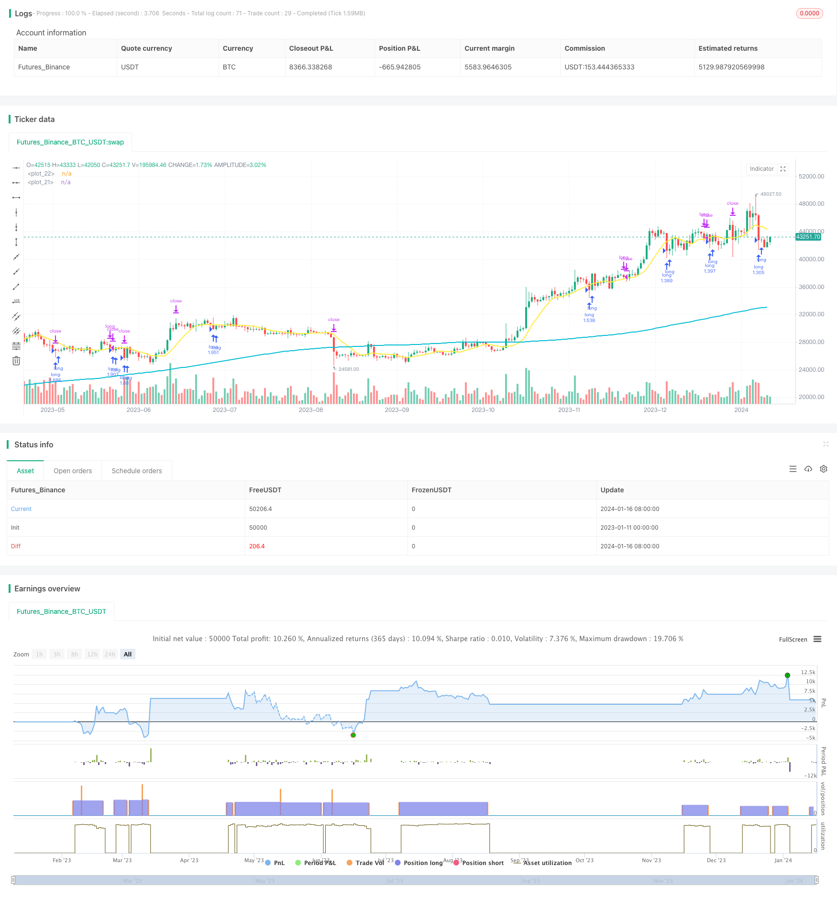

> Name

Momentum Reversal Short-term Trading Strategy-Momentum-Reversal-Trading-Strategy
> Author

ChaoZhang

> Strategy Description



[trans]

## Overview
This strategy is a very simple short-term trading strategy, mainly suitable for daily trading of stock indexes. It only conducts long transactions, and builds long positions when the stock index is in a long-term rising channel and a short-term reversal signal appears.
## Strategy Principle
This strategy is mainly based on moving averages and RSI indicators to determine trends and overbought and oversold phenomena. The specific trading signals are: the closing price of the stock index reaches or exceeds the long-term 200-day moving average, which is regarded as a long-term trend judgment; the closing price falls below the 10-day moving average, which constitutes a short-term adjustment signal; the RSI 3-period indicator is less than 30, which is regarded as an oversold signal. When the above three conditions are met, it is believed that the probability of short-term adjustment reversal is greater, so a long position is established.
After opening a position, close the position based on stop loss, take profit and short-term trend judgment. If the closing price returns to the 10-day moving average, it is judged that the short-term adjustment has ended, and profit is taken proactively at this time; if the closing price reaches a new low, stop loss is exited; profit is taken when the closing price rises by 10%.
## Advantage Analysis
This strategy has several advantages:
1. Simple logic, easy to understand and implement, suitable for beginners;
2. Make full use of the long-term upward trend of the stock index and avoid trading against the trend;
3. Use the RSI indicator to determine the short-term reversal point and increase the probability of profit;
4. There are stop-loss and take-profit mechanisms to control risks;
5. The data requirements are small, daily data is enough, and it is suitable for zero-cost implementation.
## Risk Analysis
There are also some risks with this strategy:
1. A long-term bear market that continues to decline will lead to losses;
2. Failure to reverse may result in larger losses;
3. Improper parameter settings will also affect the effect, such as improper setting of the moving average period;
4. The trading frequency may be low and it is impossible to capture all adjustments;
5. The upper limit of income is limited, and there will not be much income if it exceeds the market index.
In view of the above risks, it can be improved by optimizing cycle parameters, adjusting the stop loss and take profit ratio, and adding other indicators to judge.
## Optimization direction
This strategy can mainly be optimized from the following aspects:
1. Add multi-factor judgment on long-term and short-term trends, such as MACD, KD, etc., to improve the accuracy of judgment;
2. Add transaction volume analysis. Such as opening a position when there is a large increase;
3. Optimize parameter settings. Optimize the best parameters through methods such as Walk Forward Analysis;
4. Incorporate more inversion factors. Such as Fibonacci retest lines, support and resistance levels, etc. to determine the reversal height;
5. Comprehensive consideration of benefit ratio optimization. For example, adjust the position and stop-profit and stop-loss ratio to achieve greater profits.
## Summarize
This strategy is generally a very simple and practical short-term trading strategy. It uses the combination strategy of long-term rising channel of stock index and short-term adjustment and reversal to obtain excess returns while controlling risks. By continuously optimizing and controlling parameters, better results can be achieved.
||

## Overview  

This is a very simple short-term trading strategy that is mainly suitable for index futures daily trading. It only goes long when the index is in a long-term uptrend channel and there is a short-term reversal signal.   

## Principles  

The strategy mainly uses moving averages and RSI indicators to determine trends and overbought/oversold conditions. The specific trading signals are: the index closing price rebounds from the long-term 200-day moving average and remains above it as the long-term trend judgment; the closing price breaks below the 10-day moving average as the short-term adjustment signal; RSI3 less than 30 as the oversold signal. When the above three conditions are met, it is believed that the probability of a short-term reversal is relatively large, so go long.

After taking a position, exits are based on stop loss, take profit and short-term trend judgments. If the closing price stands back above the 10-day MA, judging that the short-term adjustment has ended, take profit actively; if the closing price hits a new low, stop out with a loss; take profit when the closing price rises 10%.

## Advantage Analysis   

The strategy has the following advantages:

1. Simple logic, easy to understand and implement, suitable for beginners;  
2. Make full use of the long-term uptrend of the index to avoid trading against the trend;
3. Use the RSI indicator to determine the short-term reversal point to increase the profit probability;  
4. There are stop loss and take profit mechanisms to control risks;
5. Low data requirements, daily data is enough, suitable for zero-cost implementation.

## Risk Analysis   

The strategy also has some risks:   

1. Sustained declines in bear markets will lead to losses; 
2. Failed reversals can cause significant losses;
3. Improper parameter settings can also affect results, such as incorrect moving average periods;  
4. Trading frequency may be low, unable to capture all adjustments; 
5. Limited profit upside, not much higher than market index returns.

In response to the above risks, methods such as optimizing cycle parameters, adjusting stop-loss ratios, adding other indicator judgments, etc. can be used to improve the strategy.

## Optimization Directions

The strategy can be optimized in the following aspects:  

1. Increase multifactor judgments of long-term and short-term trends, such as MACD and KD to improve judgment accuracy;   
2. Add trading volume analysis, such as going long when trading volume surges;
3. Optimize parameter settings through Walk Forward Analysis and other methods to find the best parameters;
4. Combine more reversal factors,such as Fibonacci retracement levels, support and resistance levels to determine the reversal levels;
5. Comprehensively consider profit ratio optimization, such as adjusting positions and stop-loss ratios to achieve higher returns.  

## Summary  

In summary, this is a very simple and practical short-term trading strategy. It combines the long-term uptrend and short-term pullback reversal of the index to obtain excess returns while controlling risks. By continuously optimizing and parameter tuning, better results can be achieved.

[/trans]

> Strategy Arguments


|Argument|Default|Description|
|----|----|----|
|v_input_int_1|200|(?パラメータ) long term moving average BASE200/period of long term sma|
|v_input_int_2|10|Long-term moving average BASE10/period of short term sma|
|v_input_int_3|5|stoploss percentages|
|v_input_int_4|20|利食いの合合%/take profit percentages|
|v_input_1|timestamp(01 Jan 2000 13:30 +0000)|(?Period)バックテストを开户める日/start trade day|
|v_input_2|timestamp(1 Jan 2099 19:30 +0000)|Finish date day|

> Source (PineScript)

``` pinescript
/*backtest
start: 2023-01-11 00:00:00
end: 2024-01-17 00:00:00
period: 1d
basePeriod: 1h
exchanges: [{"eid":"Futures_Binance","currency":"BTC_USDT"}]
*/

// This source code is subject to the terms of the Mozilla Public License 2.0 at https://mozilla.org/MPL/2.0/
// © tsujimoto0403

//@version=5
strategy("simple pull back", overlay=true,default_qty_type=strategy.percent_of_equity,
     default_qty_value=100)

//input value 
malongperiod=input.int(200,"長期移動平均BASE200/period of long term sma",group = "パラメータ")
mashortperiod=input.int(10,"長期移動平均BASE10/period of short term sma",group = "パラメータ")
stoprate=input.int(5,title = "損切の割合％/stoploss percentages",group = "パラメータ")
profit=input.int(20,title = "利食いの割合％/take profit percentages",group = "パラメータ")
startday=input(title="バックテストを始める日/start trade day", defval=timestamp("01 Jan 2000 13:30 +0000"), group="期間")
endday=input(title="バックテスを終わる日/finish date day", defval=timestamp("1 Jan 2099 19:30 +0000"), group="期間")


//polt indicators that we use 
malong=ta.sma(close,malongperiod)
mashort=ta.sma(close,mashortperiod)

plot(malong,color=color.aqua,linewidth = 2)
plot(mashort,color=color.yellow,linewidth = 2)

//date range 
datefilter = true

//open conditions
if close>malong and close<mashort and strategy.position_size == 0 and datefilter and ta.rsi(close,3)<30 
    strategy.entry(id="long", direction=strategy.long)
    
//sell conditions 
strategy.exit(id="cut",from_entry="long",stop=(1-0.01*stoprate)*strategy.position_avg_price,limit=(1+0.01*profit)*strategy.position_avg_price)


if close>mashort and close<low[1] and strategy.position_size>0
    strategy.close(id ="long")
        


```

> Detail

https://www.fmz.com/strategy/439187

> Last Modified

2024-01-18 11:26:40
