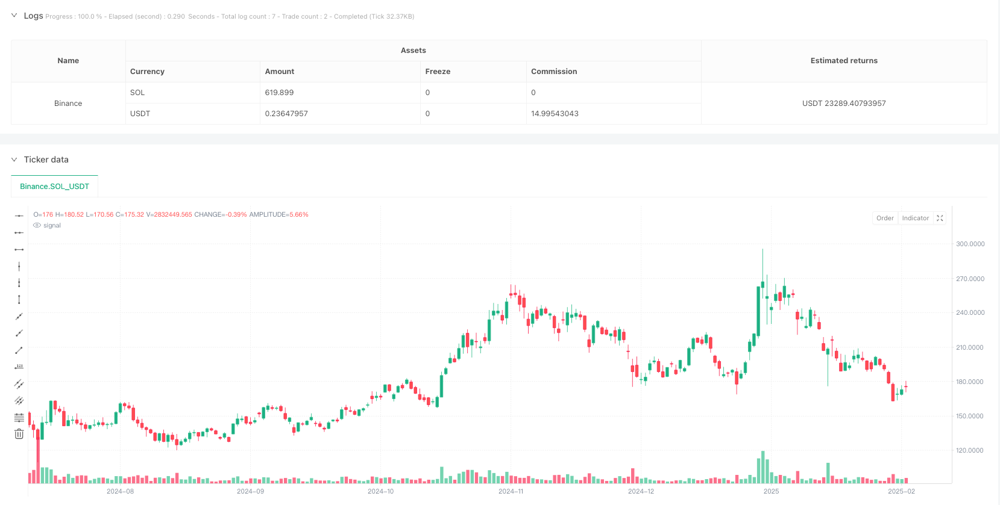
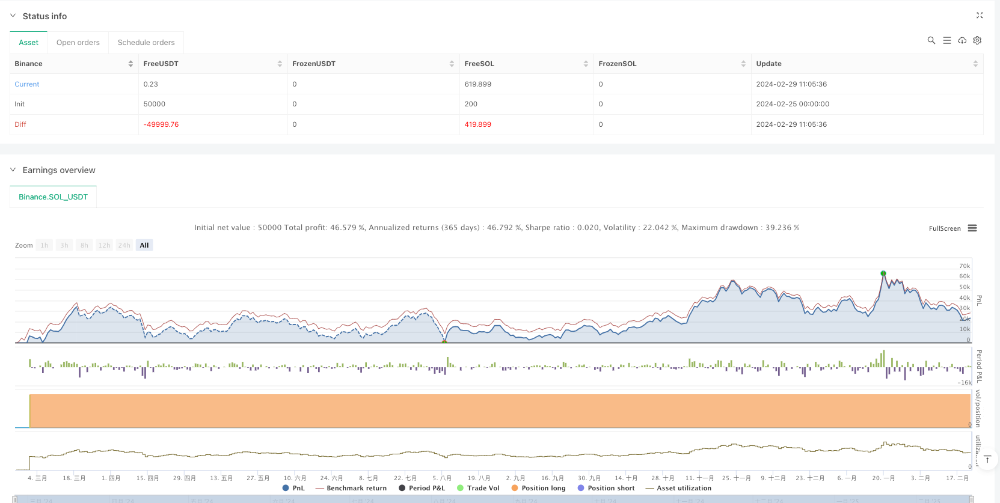

> Name

Momentum-Threshold-Driven-Balance-of-Power-Trading-Strategy
> Author

ianzeng123

> Strategy Description





[trans]
#### Overview
This strategy is a momentum-based trading system that primarily utilizes the Balance of Power indicator to trade on the 4-hour timeframe. By measuring the balance of power between buyers and sellers, a trading signal is triggered when the indicator exceeds a preset threshold. The strategy includes functions such as dynamic position management, adjustable leverage, and visual transaction tracking, which can effectively capture the turning points of market trends.
#### Strategy Principle
The core of the strategy is to measure the balance of market buying and selling power by calculating (closing price - opening price) / (highest price - lowest price). When the value is close to 1 it indicates strong bullish momentum, and when it is close to -1 it indicates strong bearish pressure. The specific transaction logic is as follows:
- Conditions for opening a position: When the balance power indicator crosses 0.8, it indicates that the buyer has strong power and enters the market to go long.
- Conditions for closing the position: When the balance power indicator crosses -0.8, it indicates that the seller's pressure is increasing and the position is closed.
- Position management: dynamic adjustment based on account equity, and leverage can be set
#### Strategic Advantages
1. Clear signals: Use fixed threshold triggers to avoid frequent transactions and focus on high-confidence signals
2. Controllable risk: Flexible risk management through dynamic positions and adjustable leverage
3. Strong visualization: Provide transaction marks and historical records to facilitate strategy backtesting and optimization
4. Good adaptability: suitable for volatile market environments and able to grasp trend turning points in a timely manner
#### Strategy Risk
1. Slippage risk: You may face large slippage during severe fluctuations
2. False breakthrough risk: False breakthrough signals may be triggered, leading to losses.
3. Trend dependence: May perform poorly in volatile markets
4. Leverage risk: Excessive leverage may cause serious losses
#### Strategy optimization direction
1. Introduce trend filtering: combine with other technical indicators to determine the direction of the general trend
2. Optimize threshold settings: dynamically adjust thresholds according to different market environments
3. Improve the stop loss mechanism: add risk control methods such as trailing stop loss
4. Add time filtering: consider time factors such as the release of important economic data
#### Summary
This strategy captures market momentum changes through balanced power indicators, combines dynamic position management and risk control, and builds a relatively complete trading system. Although there are certain risks, the stability and profitability of the strategy can be further improved through continuous optimization and improvement. Suitable for use and research by traders interested in momentum trading.
|| 

#### Overview
This strategy is a momentum-based trading system that utilizes the Balance of Power (BoP) indicator on a 4-hour timeframe. By measuring the strength between buyers and sellers, it triggers trading signals when the indicator crosses predetermined thresholds. The strategy includes dynamic position sizing, adjustable leverage, and visual trade tracking features, effectively capturing market trend reversal points.

#### Strategy Principles
The core mechanism calculates (Close-Open)/(High-Low) to measure market force balance. Values near 1 indicate strong bullish momentum, while values near -1 suggest strong bearish pressure. The trading logic includes:
- Entry Condition: Long position when BoP crosses above 0.8, indicating strong buying pressure
- Exit Condition: Close position when BoP crosses below -0.8, showing increased selling pressure
- Position Management: Dynamic adjustment based on account equity with adjustable leverage

#### Strategy Advantages
1. Clear Signals: Fixed thresholds prevent frequent trading and focus on high-confidence signals
2. Controlled Risk: Flexible risk management through dynamic positioning and adjustable leverage
3. Strong Visualization: Provides trade markers and historical records for strategy backtesting
4. Good Adaptability: Suitable for volatile market conditions, capturing trend reversals effectively

#### Strategy Risks
1. Slippage Risk: May face significant slippage during volatile periods
2. False Breakout Risk: Potential losses from false breakthrough signals
3. Trend Dependency: May underperform in ranging markets
4. Leverage Risk: High leverage may lead to substantial losses

#### Optimization Directions
1. Trend Filtering: Incorporate additional technical indicators for trend direction
2. Threshold Optimization: Dynamically adjust thresholds based on market conditions
3. Stop-Loss Enhancement: Add trailing stop-loss and other risk control measures
4. Time Filtering: Consider important economic data releases and timing factors

#### Summary
The strategy captures market momentum changes through the Balance of Power indicator, combining dynamic position management and risk control to build a relatively complete trading system. While risks exist, continuous optimization can further enhance strategy stability and profitability. It's suitable for traders interested in momentum trading research and implementation.[/trans]


> Source (PineScript)

``` pinescript
/*backtest
start: 2024-02-25 00:00:00
end: 2025-02-22 08:00:00
period: 1d
basePeriod: 1d
exchanges: [{"eid":"Binance","currency":"SOL_USDT"}]
*/

//@version=5
strategy(title="Balance of Power for US30 4H", format=format.price, precision=2, default_qty_type=strategy.percent_of_equity, default_qty_value=100, overlay=true, commission_value=0.01, max_labels_count=500, max_lines_count = 500)

leverage = input.float(5, "Leverage 1:", tooltip="Multiply your equity (100%) times the leverage.")

p = (close - open) / (high - low)
qty = strategy.equity * leverage / close

if ta.crossover(p, 0.8)
    strategy.entry("L", strategy.long, qty=qty)

if ta.crossunder(p, -0.8)
    strategy.close("L")

green   = color.new(#0097a7, 0)
red     = color.new(#ff195f, 0)
green90 = color.new(#0097a7, 85)
red90   = color.new(#ff195f, 85)

if strategy.position_size > strategy.position_size[1]
    label.new(bar_index, low * 0.999, text="▲", textcolor=green, size=size.normal, textalign=text.align_center, color=green90, style=label.style_text_outline)
    label.new(bar_index, low * 0.999, text="Buy", textcolor=green, size=size.tiny, textalign=text.align_center, color=green90, style=label.style_label_up)

if strategy.position_size < strategy.position_size[1]
    label.new(bar_index, high * 1.001, text="▼", textcolor=red, size=size.normal, textalign=text.align_center, color=red90, style=label.style_text_outline)
    label.new(bar_index, high * 1.001, text="Close", textcolor=red, size=size.tiny, textalign=text.align_center, color=red90, style=label.style_label_down)


var float tradeEntryPrice = na
var int   tradeEntryBar   = na

if strategy.position_size > 0 and strategy.position_size[1] == 0
    tradeEntryPrice := close
    tradeEntryBar   := bar_index


if strategy.position_size == 0 and strategy.position_size[1] > 0
    exitPrice = close
    exitBar   = bar_index
    tradeColor = (exitPrice - tradeEntryPrice > 0) ? green : red

    topPrice    = math.max(tradeEntryPrice, exitPrice)
    bottomPrice = math.min(tradeEntryPrice, exitPrice)

    box.new(tradeEntryBar, topPrice, exitBar, bottomPrice, border_width=0, bgcolor=color.new(tradeColor, 85))
    line.new(tradeEntryBar, topPrice, exitBar, topPrice, color=tradeColor, width=1)
    line.new(tradeEntryBar, bottomPrice, exitBar, bottomPrice, color=tradeColor, width=1)

```

> Detail

https://www.fmz.com/strategy/483504

> Last Modified

2025-02-27 16:50:22
