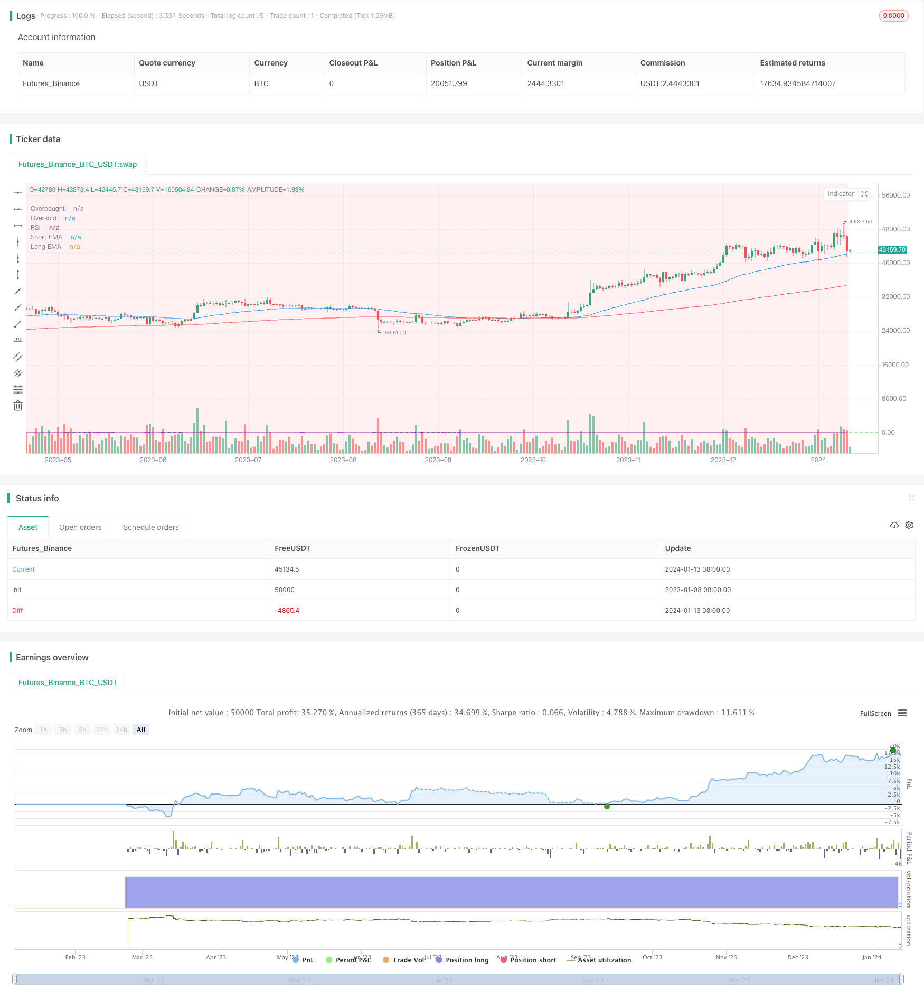

> Name

Momentum-Trend-Following-Trading-Strategy
> Author

ChaoZhang

> Strategy Description



[trans]

### Overview
The momentum trend following trading strategy is a quantitative trading strategy that combines trend following and overbought and oversold indicators. This strategy uses the EMA moving average to determine the price trend direction, and combines it with the RSI indicator to determine whether it is overbought or oversold, and enters the market when the trend direction is determined. At the same time, this strategy also uses the demand area and supply area to determine more accurate entry points.
### Strategy Principles
This strategy is mainly based on the EMA moving average and RSI indicators to determine price trends and overbought and oversold conditions. Specifically, the strategy uses the golden cross between the fast EMA 50-day and the slow EMA 200-day to determine the price trend. When the fast line crosses the slow line, it is a bullish signal. Buy when the price breaks through the fast line. When the fast line crosses the slow line, it is a bearish signal. When the price falls below the slow line, it is a bearish signal. Sell when the price falls below the slow line. At the same time, the strategy also combines the RSI indicator to filter out false breakthroughs. RSI above 55 is an overbought zone, and below 45 is an oversold zone. Only trend signals that are not overbought or oversold will trigger entry. Finally, the strategy uses the demand zone and supply zone to further screen the entry opportunities, and only buys in the demand zone and sells in the supply zone, thereby ensuring a better entry point.
### Advantage Analysis
This strategy combines trend tracking and overbought and oversold indicators to effectively filter out the noise caused by false breakthroughs and ensure the quality of trading signals. In addition, using the demand zone and supply zone to determine the timing of entry also makes the entry point more accurate. Overall, this strategy has the following advantages:
1. Use the EMA moving average to determine the main trend direction to avoid being trapped in a volatile market.
2. The RSI indicator effectively filters out false breakthroughs in overbought and oversold situations.
3. The demand zone and supply zone make the timing of entry more precise.
4. Combine multiple indicators to make the strategy more robust.
### Risk Analysis
Although this strategy has its advantages, there are also certain risks that need to be noted. Major risks include:
1. There is room for arbitrage in strong market conditions. When the market breaks through strongly, both the EMA and RSI may lag, causing the first entry opportunity to be missed. It can be optimized by appropriately shortening the parameter period.
2. Whipsaw may occur in volatile markets. When the price fluctuates near the moving average, it is easy to trigger the stop loss. The stop loss line distance can be appropriately relaxed for optimization.
3. There is a certain degree of subjectivity between the demand area and the supply area. The judgment of these areas needs to be combined with more factors, such as changes in trading volume, etc.
### Optimization direction
This strategy can be optimized mainly from the following directions:
1. Dynamically adjust EMA parameters to quickly respond to price changes under different market conditions.
2. Optimize RSI parameters to better characterize overbought and oversold phenomena.
3. Use more indicators to judge demand areas and supply areas to reduce subjectivity.
4. Add a stop-loss and stop-profit strategy to control single profit and loss.
5. Test the parameter robustness of different varieties and evaluate the adaptability of the strategy.
### Summarize
The momentum trend following trading strategy comprehensively considers the trend, overbought and oversold conditions, and demand and supply conditions to ensure high-quality entry based on stable screening of signals. This strategy effectively controls important risks in trend trading and demonstrates the organic combination of multiple technical indicators and concepts. In the future, improvements can be made from aspects such as parameter optimization, stop-loss mechanism, and variety adaptability to make the strategy more effective.
||

### Overview

The momentum trend following trading strategy is a quantitative trading strategy that combines trend following with overbought-oversold indicators. The strategy uses EMA lines to determine price trend direction and combines RSI indicator to judge overbought-oversold levels. It enters trades following confirmed trend direction. Meanwhile, it utilizes demand and supply zones to determine more precise entry points.  

### Strategy Logic

The core of this strategy is based on EMA lines and RSI indicator to determine price trend and overbought-oversold levels. Specifically, it uses crossover between fast EMA 50-day line and slow EMA 200-day line to determine price trend direction. Golden cross is bullish signal while death cross is bearish signal. It goes long when price breaks above fast EMA line after golden cross and goes short when price breaks below fast EMA line after death cross. In the meantime, it uses RSI indicator to filter false breakouts. RSI above 55 is considered overbought zone while below 45 oversold zone. Trades are only triggered with trend signal when not in overbought-oversold situation. Finally, it utilizes demand and supply zones to further filter entry price. It buys in demand zone and sells in supply zone to ensure better entry price.

### Advantage Analysis 

The strategy combines trend following and overbought-oversold indicators to effectively filter false breakout noise and ensure signal quality. Using demand and supply zones to determine entries also makes entry price more precise. In summary, advantages of this strategy include:

1. Using EMA lines to determine major trend avoids whipsaws in ranging markets.  

2. RSI filters false breakout in overbought-oversold situations.

3. Demand and supply zones offer precise entry timing.  

4. Combining multiple indicators makes strategy more robust.

### Risk Analysis

Despite advantages, the strategy also has some risks to note. Major risks include:  

1. Potential missed initial entries during strong trends when EMA and RSI lag. Can optimize by shortening parameter cycle.  

2. Potential whipsaws in ranging market when stops are triggered from price oscillation around EMA lines. Can loosen stop distance.

3. Subjectivity in determining demand and supply zones. Needs incorporation of more factors like volume changes.

### Optimization Directions

Main optimization directions for this strategy:

1. Dynamically adjust EMA parameters to faster adapt to changing market conditions.  

2. Optimize RSI parameters for better overbought-oversold representation. 

3. Use more indicators to determine demand and supply zones objectively.  

4. Add stop loss and take profit for risk control.

5. Test robustness across different products and assess adaptability. 

### Summary

The momentum trend following strategy comprehensively considers trend, overbought-oversold levels, demand and supply in ensuring high quality signal filtering and entries. It effectively controls key risks in trend trading and demonstrates organic incorporation of multiple technical indicators and concepts. Future improvements can be made in areas like parameter optimization, stop loss mechanism and adaptability to enhance strategy performance.

[/trans]

> Strategy Arguments


|Argument|Default|Description|
|----|----|----|
|v_input_1|50|Short EaMA Length|
|v_input_2|200|Long EMA Length|
|v_input_3|14|RSI Length|
|v_input_4|true|Demand Zone|
|v_input_5|true|Supply Zone|


> Source (PineScript)

``` pinescript
/*backtest
start: 2023-01-08 00:00:00
end: 2024-01-14 00:00:00
period: 1d
basePeriod: 1h
exchanges: [{"eid":"Futures_Binance","currency":"BTC_USDT"}]
*/

//@version=4
strategy("Trading Trend Following", overlay=true)

// Define EMA parameters
emaLengthShort = input(50, title="Short EaMA Length")
emaLengthLong = input(200, title="Long EMA Length")
ema50 = ema(close, emaLengthShort)
ema200 = ema(close, emaLengthLong)

// Calculate RSI
rsiLength = input(14, title="RSI Length")
rsiValue = rsi(close, rsiLength)

// Define Demand and Supply zones
demandZone = input(true, title="Demand Zone")
supplyZone = input(true, title="Supply Zone")

// Define Buy and Sell conditions
buyCondition = crossover(ema50, ema200) and close > ema50 and rsiValue > 55
sellCondition = crossunder(ema50, ema200) and close < ema50 and rsiValue < 45

// Entry point buy when the price is closed above Demand and EMA gives a buy signal
buyEntryCondition = close > ema50 and demandZone
strategy.entry("Buy", strategy.long, when=buyCondition and buyEntryCondition)

// Entry point sell when the price is closed below Supply and EMA gives a sell signal
sellEntryCondition = close < ema50 and supplyZone
strategy.entry("Sell", strategy.short, when=sellCondition and sellEntryCondition)

// Plot EMAs for visualization
plot(ema50, color=color.blue, title="Short EMA")
plot(ema200, color=color.red, title="Long EMA")

// Plot RSI for visualization
hline(55, "Overbought", color=color.red)
hline(45, "Oversold", color=color.green)
plot(rsiValue, color=color.purple, title="RSI")

// Plot Demand and Supply zones
bgcolor(demandZone ? color.new(color.green, 90) : na)
bgcolor(supplyZone ? color.new(color.red, 90) : na)

```

> Detail

https://www.fmz.com/strategy/438802

> Last Modified

2024-01-15 14:27:09
