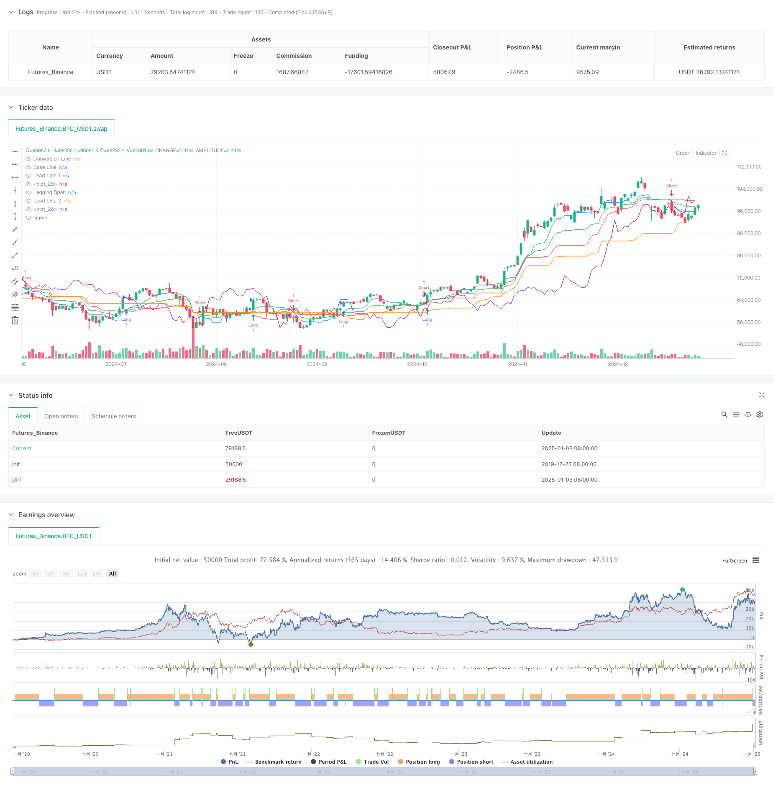

> Name

Momentum Trend Cross Cloud Trading Strategy-Momentum-Trend-Ichimoku-Cloud-Trading-Strategy
> Author

ChaoZhang

> Strategy Description



[trans]
#### Overview
This strategy is a trend following trading system based on the Ichimoku Cloud indicator. This strategy uses the intersection of the Conversion Line and the Base Line to generate trading signals, and combines the support and resistance areas of the Cloud to confirm the trend direction, thereby realizing the grasp of market trends and the capture of trading opportunities. The core idea of ​​the strategy is to identify the trend conversion point through the dynamic crossover of multi-period moving averages, and conduct corresponding transactions when the trend is established.
#### Strategy Principle
The strategy is mainly based on the following key components:
1. Conversion line (9 periods): reflects short-term price momentum
2. Baseline (26 periods): reflects the mid-term price trend
3. Leading Bands 1 and 2: constitute the cloud chart area and provide reference for support and resistance.
4. Lagging line: used to confirm the continuity of the trend
Trigger conditions for trading signals:
- Buy signal: Conversion line crosses above Kijun line
- Sell signal: Conversion line crosses below the base line
#### Strategic Advantages
1. Multi-dimensional trend confirmation: Confirm the trend through multiple dimensions of conversion lines, baselines and cloud charts to reduce the risk of false breakthroughs
2. Dynamic support and resistance: The cloud area provides dynamic support and resistance levels to adapt to market changes.
3. Verification of trend continuity: Use lagging lines to verify the continuity of the trend and improve the reliability of transactions
4. Parameter adjustability: various parameters can be optimized and adjusted according to different market characteristics
5. Visually intuitive: The visual display of cloud charts makes trend judgment more intuitive.
#### Strategy Risk
1. Poor performance in sideways markets: Frequent false signals may occur in volatile markets
2. Lagging risk: Due to the use of a longer period moving average, the reaction may be slower at the turning point of the trend.
3. Parameter sensitivity: Different parameter settings have a greater impact on strategy performance
4. Market environment dependence: The strategy performs better in strong trending markets, but may not be effective in other market environments.
5. Stop loss control: The strategy itself lacks a clear stop loss mechanism
#### Strategy optimization direction
1. Introduce volatility filtering: add ATR indicator to filter cross signals with small fluctuations
2. Integrate volume and energy indicators: Combine with trading volume indicators to confirm the validity of the trend
3. Optimize the stop-loss mechanism: design a dynamic stop-loss plan based on the cloud area
4. Add trend strength filtering: Introduce trend strength indicators such as ADX to filter weak trend environments
5. Improve signal confirmation mechanism: add price pattern analysis to improve signal reliability
#### Summary
This strategy provides a systematic framework for trading decisions through multi-dimensional analysis of the Ichimoku equilibrium diagram. The advantage of the strategy is that it can fully grasp the market trend, but at the same time, there is also a certain lag and dependence on the market environment. By introducing supplementary indicators and optimizing the signal confirmation mechanism, the practicality and reliability of the strategy can be further improved. In practical applications, it is recommended to optimize and adjust parameters according to specific market characteristics and combine with other technical indicators to enhance the stability of the strategy. ||
#### Overview
This strategy is a trend-following trading system based on the Ichimoku Cloud indicator. It generates trading signals through the crossover of the Conversion Line and Base Line, while utilizing the Cloud's support and resistance zones to confirm trend direction. The core concept is to identify trend reversal points through dynamic crossovers of multiple-period moving averages and execute trades when trends are established.

#### Strategy Principles
The strategy is based on several key components:
1. Conversion Line (9 periods): Reflects short-term price momentum
2. Base Line (26 periods): Reflects medium-term price trends
3. Leading Spans 1 and 2: Form the Cloud area, providing support and resistance references
4. Lagging Span: Confirms trend persistence

Trade signal triggers:
- Buy Signal: Conversion Line crosses above Base Line
- Sell Signal: Conversion Line crosses below Base Line

#### Strategy Advantages
1. Multi-dimensional Trend Confirmation: Validates trends through multiple dimensions including Conversion Line, Base Line, and Cloud, reducing false breakout risks
2. Dynamic Support and Resistance: Cloud area provides dynamic support and resistance levels, adapting to market changes
3. Trend Persistence Verification: Uses Lagging Span to verify trend continuation, improving trade reliability
4. Parameter Adjustability: All parameters can be optimized for different market characteristics
5. Visual Intuitiveness: Cloud visualization makes trend identification more intuitive

#### Strategy Risks
1. Poor Performance in Ranging Markets: May generate frequent false signals in sideways markets
2. Lag Risk: May react slowly to trend reversals due to longer-period moving averages
3. Parameter Sensitivity: Different parameter settings significantly impact strategy performance
4. Market Environment Dependency: Strategy performs well in strong trends but may underperform in other market conditions
5. Stop Loss Control: Strategy lacks explicit stop-loss mechanisms

#### Strategy Optimization Directions
1. Incorporate Volatility Filtering: Add ATR indicator to filter small volatility crossover signals
2. Integrate Volume Indicators: Combine volume indicators to confirm trend validity
3. Optimize Stop Loss Mechanism: Design dynamic stop-loss solutions based on Cloud areas
4. Add Trend Strength Filtering: Introduce ADX or similar indicators to filter weak trend environments
5. Improve Signal Confirmation: Add price pattern analysis to enhance signal reliability

#### Summary
The strategy provides a systematic framework for trading decisions through multi-dimensional Ichimoku Cloud analysis. Its strength lies in comprehensive trend capture, though it faces certain limitations in terms of lag and market environment dependency. The strategy's practicality and reliability can be further enhanced by introducing supplementary indicators and optimizing signal confirmation mechanisms. In practical application, it is recommended to optimize parameters based on specific market characteristics and combine with other technical indicators to enhance strategy stability.[/trans]


> Source (PineScript)

``` pinescript
/*backtest
start: 2019-12-23 08:00:00
end: 2025-01-04 08:00:00
period: 1d
basePeriod: 1d
exchanges: [{"eid":"Futures_Binance","currency":"BTC_USDT"}]
*/

//@version=5
strategy("Ichimoku Cloud Strategy", overlay=true)

// Ichimoku Settings
conversionPeriods = input(9, title="Conversion Line Period")
basePeriods = input(26, title="Base Line Period")
laggingSpan2Periods = input(52, title="Lagging Span 2 Period")
displacement = input(26, title="Displacement")

// Ichimoku Calculation
conversionLine = (ta.highest(high, conversionPeriods) + ta.lowest(low, conversionPeriods)) / 2
baseLine = (ta.highest(high, basePeriods) + ta.lowest(low, basePeriods)) / 2
leadLine1 = (conversionLine + baseLine) / 2
leadLine2 = (ta.highest(high, laggingSpan2Periods) + ta.lowest(low, laggingSpan2Periods)) / 2
laggingSpan = ta.valuewhen(close, close, 0)[displacement]

// Plot Ichimoku Cloud
plot(conversionLine, title="Conversion Line", color=color.blue)
plot(baseLine, title="Base Line", color=color.red)
plot(leadLine1, title="Lead Line 1", color=color.green)
plot(leadLine2, title="Lead Line 2", color=color.orange)
plot(laggingSpan, title="Lagging Span", color=color.purple)

// Cloud Fill
plot(leadLine1, color=color.new(color.green, 90))
plot(leadLine2, color=color.new(color.red, 90))

// Signals
buySignal = ta.crossover(conversionLine, baseLine)
sellSignal = ta.crossunder(conversionLine, baseLine)

// Execute Trades
if buySignal
    strategy.entry("Long", strategy.long)
if sellSignal
    strategy.entry("Short", strategy.short)

// Debugging Plots
plotshape(buySignal, style=shape.triangleup, location=location.belowbar, color=color.green, size=size.small)
plotshape(sellSignal, style=shape.triangledown, location=location.abovebar, color=color.red, size=size.small)

```

> Detail

https://www.fmz.com/strategy/477554

> Last Modified

2025-01-06 13:49:45
