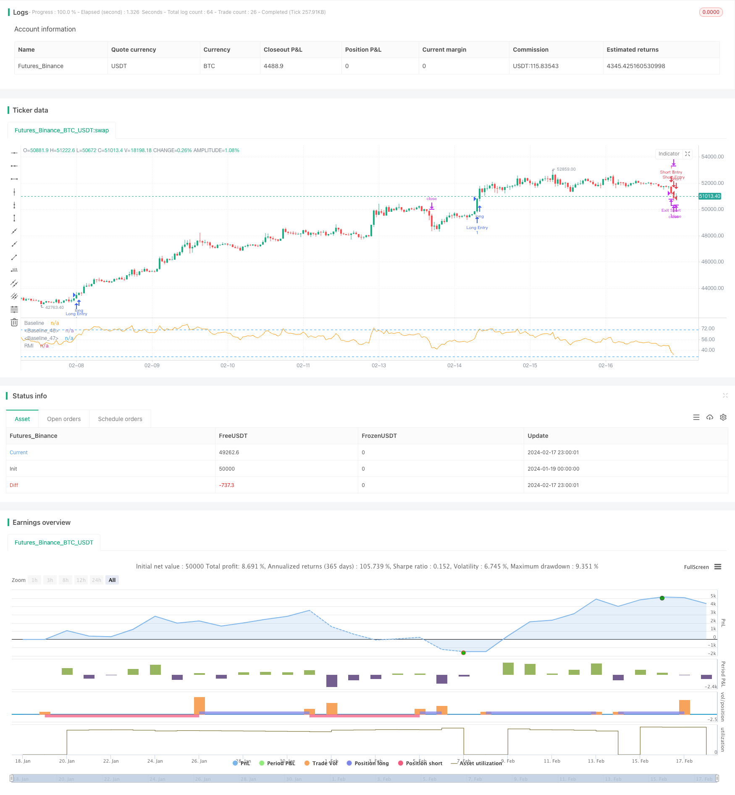

> Name

Momentum-Trend-Synergy-Strategy based on momentum trend synchronization strategy
> Author

ChaoZhang

> Strategy Description


[trans]
## Overview
The Momentum Trend Synchronization Strategy is a trading strategy that combines the Relative Momentum Index (RMI) and a custom presentTrend indicator. This strategy adopts a multi-level approach, combining momentum analysis with trend judgment to provide traders with a more flexible and sensitive trading mechanism.
## Strategy Principle
### RMI indicator
The RMI indicator is a variation of the Relative Strength Index (RSI), which measures the momentum of rising and falling prices relative to price changes in the previous period. The calculation formula is:
RMI = 100 - 100/(1 + rising average/falling average)
- The rising average is the average rising number in the past N periods
- The average number of declines is the average number of declines in the past N periods
The value of the RMI indicator ranges from 0 to 100. The larger the value, the stronger the upward momentum, and the smaller the value, the stronger the downward momentum.
### presentTrend indicator
The presentTrend indicator combines true range (ATR) and moving averages to determine trend direction and dynamic support or resistance levels. The calculation formula is:
- Upper track: moving average + (ATR × F)
- Lower track: moving average - (ATR × F)
- The moving average is the average of the closing prices of the past M periods
- ATR is the average true range of the past M periods
- F is the multiplier to adjust the sensitivity
When the price breaks through the upper and lower rails of presentTrend, it indicates that the trend has changed and is a possible entry or exit signal point.
### Strategy logic
**Admission conditions:**
- Go long: When RMI exceeds the threshold (such as 60), it indicates a strong bull market momentum, and at the same time, the price is higher than the upper track of presentTrend, confirming that the trend is upward, go long and enter the market.
- Short selling: When RMI is lower than the threshold (such as 40), it indicates a strong bear market momentum, and at the same time, the price is lower than the lower track of presentTrend, confirming that the trend is downward, enter short.
**Exit conditions (with dynamic stop loss):**
- Exit long: Exit when the price falls below the lower track of presentTrend or RMI falls back to the neutral zone, indicating that the bullish trend is weakening.
- Short exit: exit when the price rises above the upper limit of presentTrend or RMI rises back to the neutral zone, indicating that the bearish trend is weakening.
Dynamic stop loss calculation formula:
- Long position: After entering the market, use the lower band of presentTrend as the exit price
- Short position: After entering the market, use the upper track of presentTrend as the exit price
The advantage of this strategy is that it integrates RMI's momentum judgment and presentTrend's trend and dynamic stop loss, which can effectively control risks while tracking the trend.
## Advantage Analysis
This strategy has the following advantages:
1. Multi-level judgment mechanism, combining momentum indicators and trend indicators to improve decision-making efficiency
2. Dynamic stop loss mechanism, which can adjust the stop loss position according to market changes and effectively control risks.
3. You can choose long, short or two-way trading according to personal preferences, with strong flexibility
4. RMI Parameter can be adjusted to adapt to different cycle judgments
5. presentTrend Parameter is adjustable and can control the sensitivity of the strategy
## Risk Analysis
This strategy also has certain risks:
1. There are many trading signals, which makes it easy to over-trade and increase transaction costs and slippage risks.
2. Double judgment mechanism may miss some trading opportunities
3. Parameters need to be adjusted appropriately to match your own trading style
4. It is still necessary to manually judge the direction of the general trend and avoid trading against the trend.
The above risks can be reduced by appropriately relaxing entry conditions, optimizing parameter combinations, and combining trend judgment.
## Optimization direction
This strategy can be optimized from the following directions:
1. Combine with volatility indicators to avoid mistaken entry when volatility is high
2. Increase the judgment of quantity and energy indicators to ensure that there is enough current power to support entry.
3. Optimize the range of dynamic stop loss and strive for greater profits while ensuring stop loss.
4. Add re-entry conditions to fully capture trend opportunities
5. Parameter optimization and backtesting to find optimal parameters to maximize returns
## Summarize
The momentum trend synchronization strategy is a multi-level trading strategy that considers both momentum indicators and trend indicators at the same time. It has the characteristics of accurate judgment and excellent risk control. This strategy can be flexibly adjusted according to personal preferences. After in-depth optimization, it can give full play to the advantages of trend capture and is a recommended trading strategy.
||

## Overview  

The Momentum Trend Synergy Strategy combines the Relative Momentum Index (RMI) and a custom presentTrend indicator into one powerful trading approach. This multifaceted strategy integrates momentum analysis with trend direction to provide traders with a more nuanced and responsive trading mechanism.

## Strategy Logic

### RMI Indicator

The RMI is a variation of the Relative Strength Index (RSI) that measures the momentum of up moves and down moves relative to previous price changes over a given period. The RMI over N periods is calculated as:

RMI = 100 - 100/(1 + Upward Avg/Downward Avg)  

- Upward Avg is the average upward price change over N periods. 
- Downward Avg is the average downward price change over N periods.

RMI values range from 0 to 100. Higher figures indicate stronger upward momentum while lower values suggest stronger downward momentum. 

### presentTrend Indicator

The presentTrend indicator combines Average True Range (ATR) with a moving average to determine trend direction and dynamic support/resistance levels. presentTrend over M periods and multiplier F is:   

- Upper Band: MA + (ATR x F)
- Lower Band: MA - (ATR x F)

- MA is the moving average close over M periods.  
- ATR is the Average True Range over M periods.
- F is the multiplier to adjust sensitivity.  

Trend direction switches when price crosses the presentTrend bands, signaling potential entry or exit points.

### Strategy Logic   

**Entry Conditions:**

- Long Entry: Triggered when RMI exceeds a threshold like 60, indicating strong bullish momentum, and price is above presentTrend upper band, confirming uptrend.  
- Short Entry: Occurs when RMI drops below a threshold like 40, showing strong bearish momentum, and price is below presentTrend lower band, indicating a downtrend.

**Exit Conditions with Dynamic Trailing Stop:**  

- Long Exit: Initiated when price crosses below presentTrend lower band or when RMI falls back towards neutral, suggesting weakening bullish momentum.   
- Short Exit: Executed when price crosses above presentTrend upper band or when RMI rises towards neutral, indicating weakening bearish momentum.

**Equations for Dynamic Trailing Stop:**   

- For Long Positions: Exit price is set at lower presentTrend band once entry condition is met.  
- For Short Positions: Exit price is determined by upper presentTrend band post-entry.  

The dual analysis of RMI momentum and presentTrend direction/trailing stop is the strength of this strategy. It aims to enter trending moves early and exit positions strategically to maximize gains and reduce losses across various market conditions.  

## Advantage Analysis  

The advantages of this strategy include:

1. Multilayered decision framework combining momentum and trend indicators improves efficiency.  
2. Dynamic trailing stops adjust to markets to effectively manage risk.
3. Flexibility in trade direction caters to preferences and market conditions.  
4. Customizable RMI and presentTrend parameters suit different trading timeframes and sensibilities.  

## Risk Analysis

Potential risks to consider:

1. More signals may increase overtrading, costs, slippage.  
2. Dual analysis judges may miss some trade opportunities.  
3. Parameters need alignment with personal trading style.
4. Requires manual trend direction bias to avoid counter-trend trades.  

Proper parameter optimization, trend alignment, and refinements to entry logic can reduce the above risks.

## Enhancement Opportunities

Areas for strategy improvement include:

1. Incorporate volatility indicator to avoid high volatility false signals. 
2. Add volume analysis to ensure sufficient momentum on entries.  
3. Optimize dynamic stop loss levels to balance protection and profitability.  
4. Introduce re-entry conditions to fully capitalize on trends.
5. Parameter optimization and backtesting to maximize return metrics.   

## Conclusion  

The Momentum Trend Synergy Strategy provides a multilayered approach, incorporating both momentum and trend indicators for accurate and risk-managed trading. The high customizability of this strategy allows traders to tailor it to their personal style and market environments. When optimized, it can fully leverage its trend-capturing capabilities for strong performance. Thus, it represents a recommended addition for most trading toolboxes.

[/trans]

> Strategy Arguments


|Argument|Default|Description|
|----|----|----|
|v_input_string_1|0|Trade Direction: Both|Short|Long|
|v_input_int_1|21|RMI Length|
|v_input_int_2|5|presentTrend Length|
|v_input_float_1|4|presentTrend Multiplier|


> Source (PineScript)

``` pinescript
/*backtest
start: 2024-01-19 00:00:00
end: 2024-02-18 00:00:00
period: 1h
basePeriod: 15m
exchanges: [{"eid":"Futures_Binance","currency":"BTC_USDT"}]
*/

// This Pine Script™ code is subject to the terms of the Mozilla Public License 2.0 at https://mozilla.org/MPL/2.0/
// © PresentTrading

//@version=5
strategy("PresentTrend RMI Synergy - Strategy [presentTrading]", shorttitle="PresentTrend RMI Synergy - Strategy [presentTrading]", overlay=false)

// Inputs
tradeDirection = input.string("Both", title="Trade Direction", options=["Long", "Short", "Both"])
lengthRMI = input.int(21, title="RMI Length")
lengthSuperTrend = input.int(5, title="presentTrend Length")
multiplierSuperTrend = input.float(4.0, title="presentTrend Multiplier")

// RMI Calculation
up = ta.rma(math.max(ta.change(close), 0), lengthRMI)
down = ta.rma(-math.min(ta.change(close), 0), lengthRMI)
rmi = 100 - (100 / (1 + up / down))

// PresentTrend Dynamic Threshold Calculation (Simplified Example)
presentTrend = ta.sma(close, lengthRMI) * multiplierSuperTrend // Simplified for demonstration

// SuperTrend for Dynamic Trailing Stop
atr = ta.atr(lengthSuperTrend)
upperBand = ta.sma(close, lengthSuperTrend) + multiplierSuperTrend * atr
lowerBand = ta.sma(close, lengthSuperTrend) - multiplierSuperTrend * atr
trendDirection = close > ta.sma(close, lengthSuperTrend) ? 1 : -1
// Entry Logic
longEntry = rmi > 60 and trendDirection == 1 
shortEntry = rmi < 40 and trendDirection == -1 

// Exit Logic with Dynamic Trailing Stop
longExitPrice = trendDirection == 1 ? lowerBand : na
shortExitPrice = trendDirection == -1 ? upperBand : na

// Strategy Execution
if (tradeDirection == "Long" or tradeDirection == "Both") and longEntry
    strategy.entry("Long Entry", strategy.long)
    strategy.exit("Exit Long", stop=longExitPrice)

if (tradeDirection == "Short" or tradeDirection == "Both") and shortEntry
    strategy.entry("Short Entry", strategy.short)
    strategy.exit("Exit Short", stop=shortExitPrice)

// Visualization
plot(rmi, title="RMI", color=color.orange)
hline(50, "Baseline", color=color.white)
hline(30, "Baseline", color=color.blue)
hline(70, "Baseline", color=color.blue)

```

> Detail

https://www.fmz.com/strategy/442117

> Last Modified

2024-02-19 14:48:37
