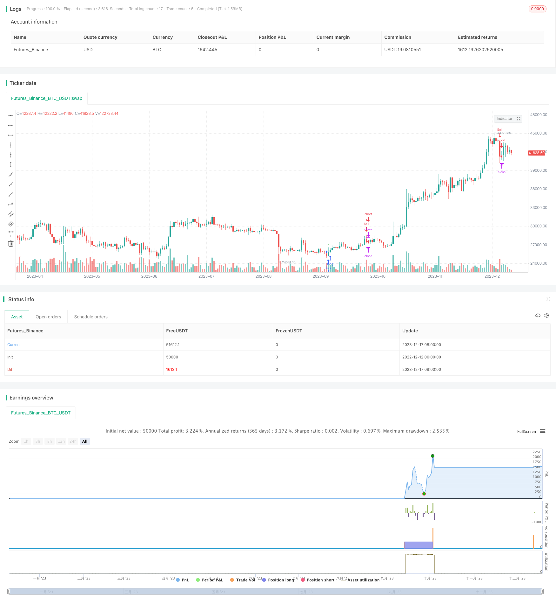

> Name

Momentum-and-Volume-Trading-Strategy based on momentum trading strategy
> Author

ChaoZhang

> Strategy Description


 [trans]

## Overview
This strategy bases buy and sell decisions on a stock's momentum and volume indicators. When the rising momentum of the stock price accelerates and the trading volume suddenly increases, buy; when the falling momentum of the stock price accelerates and the trading volume suddenly increases, sell. This strategy captures short-term price momentum caused by mass market behavior.
## Strategy Principle
The strength and duration of a stock's price trend determines momentum. This strategy determines price momentum by calculating the amount of change in a stock's price from the previous day. When prices continue to rise, momentum is positive; when prices continue to fall, momentum is negative. This strategy also incorporates volume indicators. Buy and sell signals are only issued when volume is significantly higher than the last 20-day average (crossing the threshold).
Specifically, the buying condition is that the momentum indicator crosses 0 above and the trading volume exceeds 2 times the 20-day average trading volume; the selling condition is that the momentum indicator crosses below 0 and the trading volume exceeds 2 times the 20-day average trading volume. After buying, the take-profit level is set to 0.8 times the buying price, and the stop-loss level is 0.5 times the buying price; after selling, the take-profit and stop-loss levels are the opposite.
## Strategic Advantages
The biggest advantage of this strategy is that it captures the short-term trends and mass behavior of the market. When stock prices continue to rise or fall, a large number of retail investors and institutions will follow the strong stock price momentum to trade. This creates a self-reinforcing short-term price trend. This strategy captures this market psychology and generates additional investment returns. Compared with a simple passive investment strategy that tracks the market index, the expected excess return of this strategy will be higher.
## Strategy Risk
First, short-term fluctuations in stock prices cannot be completely predicted and controlled. There is a risk of sharp price reversal due to unexpected events, and the stop-loss mechanism cannot completely avoid losses at this time. Second, the quality of trading volume data varies. The possibility that the trading volume of some stocks has been artificially manipulated cannot be completely ruled out, which will lead to distorted trading signals. Thirdly, it is impossible to accurately control the short-term trend of the market simply by relying on simple judgments of price and trading volume. When there is a major structural turning point in the market, the effectiveness of the strategy will be affected.
## Strategy optimization direction
Consider combining more data sources to improve strategy effectiveness. For example, introduce the volume of relevant stock discussions on Internet platforms such as social media. When the volume of related discussions about a stock increases significantly, it is likely to indicate future changes in the stock price. This can be used as a secondary buy and sell signal for the strategy. In addition, you can also consider combining the fundamental indicators of the stock, such as price-earnings ratio, price-to-book ratio, etc. This helps to further verify the sustainability of price changes and reduce the possibility of erroneous transactions.
## Summarize
This strategy achieves judgment on short-term market trends and mass behavior by capturing comprehensive changes in stock price momentum indicators and trading volume indicators. This quantitative investment strategy based on the principles of big data and behavioral finance has higher expected returns than traditional investment strategies. But at the same time, it is also necessary to fully understand and prevent risks, and constantly optimize the input parameters of the strategy to improve trading effects.
||


## Overview

This strategy makes buy and sell decisions based on the momentum indicator and trading volume indicator of stocks. It buys when the upward momentum of stock prices accelerates and trading volume surges, and sells when the downward momentum accelerates and trading volume surges. The strategy captures short-term price momentum brought by market herd behavior.   

## Strategy Principle

The strength and duration of stock price change trends determine momentum. This strategy calculates the change from the previous day's close to judge price momentum. Momentum is positive when prices rise consecutively and negative when prices fall consecutively. The strategy also combines the trading volume indicator. Buy and sell signals are only triggered when trading volume is significantly higher than the 20-day moving average (above threshold).

Specifically, the buy condition is a crossover of the momentum indicator above 0 with trading volume more than 2 times the 20-day average. The sell condition is the opposite. After buying, the profit target is set at 0.8 times the entry price, and the stop loss is 0.5 times. The profit target and stop loss after selling are reversed accordingly.  

## Advantages

The biggest advantage is capturing short-term market trends and herd behavior. When stock prices show sustained rises or falls, lots of retail and institutional investors will follow the stronger price momentum to trade. This creates a self-reinforcing short-term price trend. The strategy generates excess returns by leveraging such market psychology. Compared with passive index tracking strategies, the expected excess return of this strategy is higher.  

## Risks  

Firstly, short-term price fluctuations are unpredictable. There are risks of sharp reversals due to sudden events, which cannot be fully avoided despite stop losses. Secondly, the data quality of trading volumes varies. The possibility of manipulation cannot be fully ruled out, which distorts trade signals. Thirdly, simple price and volume analysis cannot precisely control short-term trends. Major structural market shifts can affect strategy performance.

## Enhancement 

More data sources could be incorporated to improve strategy efficacy. For example, the volume of related stock discussions on social media platforms can indicate future price movements. This data could provide supplementary entry and exit signals. Fundamental indicators like P/E ratio and P/B ratio could also help verify price change sustainability and reduce erroneous trades.  

## Conclusion  

By capturing integrated changes in price momentum and trading volume, this strategy judges short-term trends and herd behavior. Such big data and behavioral finance-based quantitative strategies can yield higher expected returns than traditional strategies. But risks need acknowledgment and prevention. Input parameters require constant optimization to keep improving trading outcomes.

[/trans]

> Strategy Arguments


|Argument|Default|Description|
|----|----|----|
|v_input_1|0.8|Profit Target (%)|
|v_input_2|0.5|Stop Loss (%)|
|v_input_3|2|Volume Threshold|


> Source (PineScript)

``` pinescript
/*backtest
start: 2022-12-12 00:00:00
end: 2023-12-18 00:00:00
period: 1d
basePeriod: 1h
exchanges: [{"eid":"Futures_Binance","currency":"BTC_USDT"}]
*/

//@version=5
strategy('Momentum and Volume Bot', overlay=true)

// Define strategy parameters
profit_target_percent = input(0.8, title='Profit Target (%)')
stop_loss_percent = input(0.5, title='Stop Loss (%)')
volume_threshold = input(2, title='Volume Threshold')

// Calculate momentum
momentum = close - close[1]

// Calculate average volume
avg_volume = ta.sma(volume, 20)

// Buy condition
buy_condition = ta.crossover(momentum, 0) and volume > avg_volume * volume_threshold

// Sell condition
sell_condition = ta.crossunder(momentum, 0) and volume > avg_volume * volume_threshold

// Strategy logic
strategy.entry('Buy', strategy.long, when=buy_condition)
strategy.entry('Sell', strategy.short, when=sell_condition)

// Set profit target and stop loss
strategy.exit('Take Profit/Stop Loss', from_entry='Buy', profit=close * profit_target_percent / 100, loss=close * stop_loss_percent / 100)
strategy.exit('Take Profit/Stop Loss', from_entry='Sell', profit=close * profit_target_percent / 100, loss=close * stop_loss_percent / 100)

// Plotting
plotshape(series=buy_condition, title='Buy Signal', color=color.new(color.green, 0), style=shape.triangleup, size=size.small)
plotshape(series=sell_condition, title='Sell Signal', color=color.new(color.red, 0), style=shape.triangledown, size=size.small)


```

> Detail

https://www.fmz.com/strategy/435894

> Last Modified

2023-12-19 15:37:16
