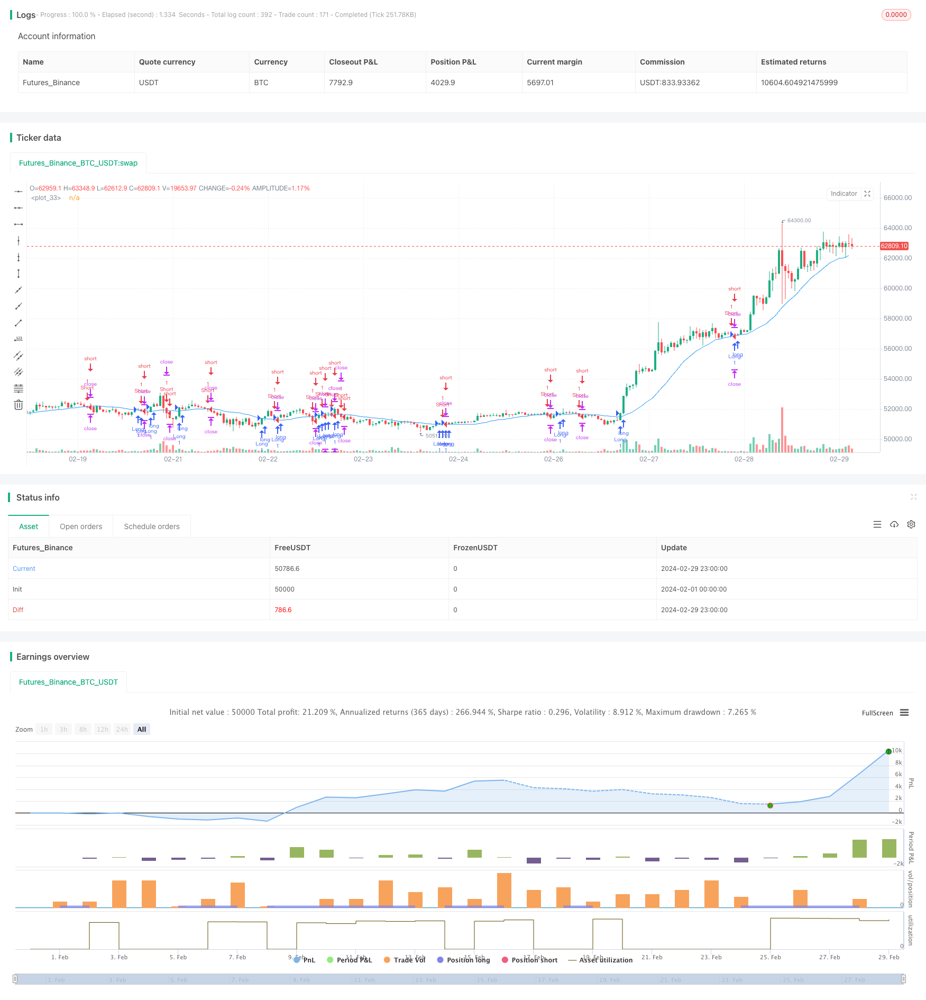

> Name

Moving-Average-Breakout-Trading-Strategy Based on Moving Average
> Author

ChaoZhang

> Strategy Description


[trans]
## Overview
This strategy is a breakout trading strategy based on moving averages. The main idea of ​​the strategy is to judge the market trend by comparing the current closing price with the moving average of a certain period, and trade when the moving average is broken. The risk-reward ratio of this strategy is 1:3, that is, the stop-loss position is 1% and the take-profit position is 3%.
## Strategy Principle
The core of this strategy is the moving average. The moving average is a curve connecting the average closing price within a certain period of time. It can smooth out short-term price fluctuations and reflect the mid- to long-term trend of stock prices. When the stock price breaks above the moving average, it means that the market trend may change.
The specific principles of the strategy are as follows:
1. Calculate the moving average of a certain period (default is 20).
2. Determine whether the current closing price crosses above or below the moving average.
   - If it crosses the moving average, open a long position, the stop loss position is 1% of the opening price, and the take profit position is 3% of the opening price.  
   - If it crosses the moving average, open a short position, the stop loss position is 1% of the opening price, and the take profit position is 3% of the opening price.
3. If a position has been opened, determine whether the stop loss or take profit price has been reached:
   - If the long position hits the stop loss or take profit level, the position is closed.
   - If the short position hits the stop loss or take profit level, the position is closed.
4. Draw a moving average on the chart to observe the relationship between the stock price and the moving average.
## Advantage Analysis
The advantages of this strategy are:
1. Simple and easy to use: This strategy uses only one moving average, with clear logic and easy to understand and implement.
2. Trend following: The moving average can reflect the medium and long-term trend of stock prices. By breaking through the moving average to open a position, the main trend of the market can be tracked.
3. Fixed risk reward: The stop loss and take profit positions of this strategy are fixed, and the risk reward ratio is 1:3, which can strictly control the risk of each transaction.
4. Wide applicability: This strategy can be applied to different markets and varieties, such as stocks, futures, foreign exchange, etc.
## Risk Analysis
Although this strategy has certain advantages, there are also some risks:
1. Parameter optimization: The key parameter of this strategy is the period of the moving average. Different periods may bring different results. If parameters are chosen improperly, the strategy may fail.
2. Market risk: This strategy performs better in trending markets, but in volatile markets there may be more false signals, leading to frequent transactions and capital losses.
3. Slippage and transaction costs: This strategy may generate more trading signals, and frequent transactions will increase slippage and transaction costs, thus affecting the overall performance of the strategy.
To reduce these risks, the following improvements can be considered:
1. Carry out parameter optimization and find the parameter combination that is most suitable for the current market.
2. Add other filtering conditions, such as trading volume, volatility, etc., to reduce false signals.
3. Control the frequency of transactions, such as adding signal filtering to avoid too frequent transactions.
## Optimization direction
1. Combination of multiple time periods: You can consider combining moving averages of different time periods, such as short-term, mid-term and long-term moving averages, and generate trading signals based on their arrangement and crossover. This allows for a more comprehensive judgment of market trends and improves signal reliability.
2. Dynamic stop loss and take profit: The stop loss and take profit position of the current strategy is fixed. You can consider dynamically adjusting the stop loss and take profit position according to market fluctuations, such as using indicators such as ATR (Average True Range) to calculate the dynamic stop loss and take profit price. This can better adapt to market changes and improve the flexibility of the strategy.
3. Add other technical indicators: In addition to the moving average, you can also add other technical indicators, such as MACD, RSI, etc., to jointly confirm the trading signal with multiple indicators and improve the reliability of the signal.
4. Market environment adaptation: The parameters or rules of the strategy can be adjusted according to different market environments, such as trending markets, volatile markets, etc., to adapt to different market characteristics and improve the adaptability and stability of the strategy.
5. Add position management: At present, the position of each transaction in the strategy is fixed. You can consider dynamically adjusting the position size of each transaction based on market volatility, account funds and other factors to better control risks and improve capital utilization efficiency.
Through the above optimization measures, the reliability, adaptability and stability of the strategy can be improved, better adapted to market changes, and the overall performance of the strategy improved.
## Summarize
This strategy is a simple and easy-to-use trend following strategy that compares closing prices to moving averages and generates trading signals when prices break above the moving averages. The advantage of this strategy is that it has clear logic, wide applicability, and the ability to track the main trends of the market. But there are also some risks, such as parameter selection, market risk, transaction costs, etc. In order to improve the strategy, you can consider optimization measures such as combining multiple time periods, dynamic stop loss and profit, adding other technical indicators, adapting to the market environment, and position management.
In general, this strategy can be used as a basic trading strategy, suitable for beginners to learn and use. However, in practical applications, the strategy needs to be appropriately optimized and improved based on specific market conditions and one's own risk preferences to improve the stability and profitability of the strategy. At the same time, any strategy has its limitations and cannot be relied upon blindly. It should be combined with other methods and tools, such as fundamental analysis, risk management, etc., to more comprehensively grasp market opportunities and control transaction risks.
|| 

## Overview

This strategy is a breakout trading strategy based on moving averages. The main idea of the strategy is to determine the market trend by comparing the current closing price with the moving average of a certain period, and to enter a trade when the price breaks through the moving average. The risk-reward ratio of this strategy is 1:3, with a stop loss of 1% and a take profit of 3%.

## Strategy Principle

The core of this strategy is the moving average. A moving average is a curve that connects the average closing prices over a certain time period, which can smooth out short-term price fluctuations and reflect the medium to long-term trend of the stock price. When the stock price breaks through the moving average, it indicates that the market trend may be changing.

The specific principles of the strategy are as follows:

1. Calculate the moving average over a certain period (default is 20).
2. Determine whether the current closing price crosses above or below the moving average.
   - If it crosses above the moving average, open a long position with a stop loss of 1% and a take profit of 3% of the entry price.
   - If it crosses below the moving average, open a short position with a stop loss of 1% and a take profit of 3% of the entry price.
3. If a position is already open, determine whether the stop loss or take profit price level has been reached:
   - If a long position reaches the stop loss or take profit price, close the position.
   - If a short position reaches the stop loss or take profit price, close the position.
4. Plot the moving average on the chart for observation of the relationship between the stock price and the moving average.

## Advantages Analysis

The advantages of this strategy are:

1. Simplicity and ease of use: This strategy only uses one moving average, with clear logic and easy to understand and implement.
2. Trend tracking: The moving average can reflect the medium to long-term trend of the stock price. By opening positions when the price breaks through the moving average, it can track the main trend of the market.
3. Fixed risk-reward ratio: The stop loss and take profit levels of this strategy are fixed, with a risk-reward ratio of 1:3, which can strictly control the risk of each trade.
4. Wide applicability: This strategy can be applied to different markets and instruments, such as stocks, futures, forex, etc.

## Risk Analysis

Although this strategy has certain advantages, it also has some risks:

1. Parameter optimization: The key parameter of this strategy is the period of the moving average. Different periods may bring different results. If the parameter selection is inappropriate, it may lead to strategy failure.
2. Market risk: This strategy performs well in trending markets, but in range-bound markets, it may generate many false signals, leading to frequent trading and capital losses.
3. Slippage and transaction costs: This strategy may generate many trading signals, and frequent trading will increase slippage and transaction costs, affecting the overall performance of the strategy.

To reduce these risks, the following improvements can be considered:
1. Perform parameter optimization to find the most suitable parameter combination for the current market.
2. Add other filtering conditions, such as trading volume, volatility, etc., to reduce false signals.
3. Control trading frequency, such as increasing signal filtering to avoid excessive trading.

## Optimization Directions

1. Combination of multiple time frames: Consider combining moving averages of different time frames, such as short-term, medium-term, and long-term moving averages, and generate trading signals based on their arrangement and crossovers. This can more comprehensively determine market trends and improve the reliability of signals.
2. Dynamic stop loss and take profit: Currently, the stop loss and take profit levels of the strategy are fixed. Consider dynamically adjusting the stop loss and take profit levels according to market volatility, such as using indicators like ATR (Average True Range) to calculate dynamic stop loss and take profit prices. This can better adapt to market changes and improve the flexibility of the strategy.
3. Add other technical indicators: In addition to moving averages, other technical indicators such as MACD, RSI, etc. can be added to confirm trading signals with multiple indicators, improving the reliability of signals.
4. Market environment adaptation: Adjust strategy parameters or rules according to different market environments, such as trending markets, range-bound markets, etc., to adapt to different market characteristics and improve the adaptability and stability of the strategy.
5. Add position management: Currently, the position size of each trade in the strategy is fixed. Consider dynamically adjusting the position size of each trade according to factors such as market volatility and account funds, to better control risk and improve capital utilization efficiency.

Through the above optimization measures, the reliability, adaptability, and stability of the strategy can be improved to better adapt to market changes and enhance the overall performance of the strategy.

## Summary

This strategy is a simple and easy-to-use trend-following strategy that generates trading signals when the price breaks through the moving average by comparing the closing price with the moving average. The advantages of this strategy lie in its clear logic, wide applicability, and ability to track the main market trend. However, it also has some risks, such as parameter selection, market risk, and transaction costs. To improve the strategy, optimization measures such as multi-timeframe combination, dynamic stop loss and take profit, adding other technical indicators, market environment adaptation, and position management can be considered.

Overall, this strategy can serve as a basic trading strategy suitable for beginners to learn and use. However, in practical application, it is necessary to optimize and improve the strategy according to specific market conditions and personal risk preferences to enhance the stability and profitability of the strategy. At the same time, any strategy has its limitations and should not be blindly relied upon. It should be combined with other methods and tools, such as fundamental analysis and risk management, to more comprehensively grasp market opportunities and control trading risks.
[/trans]

> Strategy Arguments


|Argument|Default|Description|
|----|----|----|
|v_input_1|20|Breakout Period|
|v_input_2|true|Stop Loss (%)|
|v_input_3|3|Take Profit (%)|


> Source (PineScript)

``` pinescript
/*backtest
start: 2024-02-01 00:00:00
end: 2024-02-29 23:59:59
period: 1h
basePeriod: 15m
exchanges: [{"eid":"Futures_Binance","currency":"BTC_USDT"}]
*/

//@version=4
strategy("Nifty Breakout Strategy", overlay=true)

// Define Inputs
breakoutPeriod = input(20, title="Breakout Period")
stopLossPercent = input(1, title="Stop Loss (%)") / 100
takeProfitPercent = input(3, title="Take Profit (%)") / 100

// Calculate Moving Average
smaValue = sma(close, breakoutPeriod)

// Define Breakout Conditions
longCondition = crossover(close, smaValue)
shortCondition = crossunder(close, smaValue)

// Set Stop Loss and Take Profit Levels
longStopLoss = close * (1 - stopLossPercent)
longTakeProfit = close * (3 + takeProfitPercent)
shortStopLoss = close * (1 + stopLossPercent)
shortTakeProfit = close * (3 - takeProfitPercent)

// Execute Long Trade
if (longCondition)
    strategy.entry("Long", strategy.long)
    strategy.exit("LongExit", "Long", stop=longStopLoss, limit=longTakeProfit)

// Execute Short Trade
if (shortCondition)
    strategy.entry("Short", strategy.short)
    strategy.exit("ShortExit", "Short", stop=shortStopLoss, limit=shortTakeProfit)

// Plot Moving Average for Visualization
plot(smaValue, color=color.blue)
```

> Detail

https://www.fmz.com/strategy/444011

> Last Modified

2024-03-08 15:33:24
