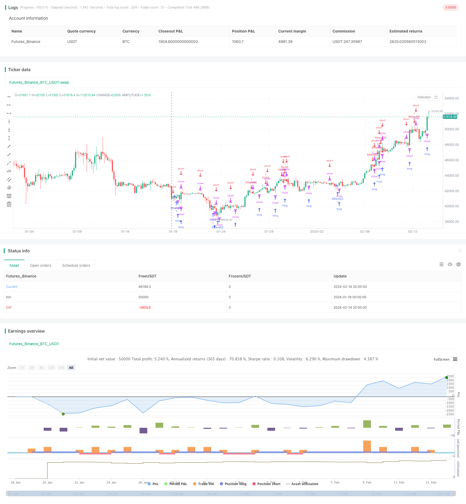

> Name

Moving-Average-Breakout-and-Bollinger-Band-Breakout-Strategy
> Author

ChaoZhang

> Strategy Description


[trans]
## Overview
This strategy comprehensively uses the RSI indicator to identify overbought and oversold signals, the Bollinger Bands to determine price breakthroughs and operate, and the golden cross pattern of the moving average, so as to judge the market at different stages of the trend and achieve profits.
## Strategy Principle
This strategy mainly consists of the following indicators:
1. RSI indicator: When the RSI indicator line crosses the set overbought line or falls below the oversold line, perform corresponding long or short operations.
2. Bollinger Bands: When the price breaks through the upper track of the Bollinger Bands, carry out short selling operations; when the price falls below the lower track of the Bollinger Bands, carry out long operations.
3. Moving average: Calculate the highest price and lowest price within a certain period (such as 5 periods). When the price is higher than the highest point of the last 5 periods, go long; when the price is lower than the lowest point of the last 5 periods, go short.
4. MACD: Calculate the golden cross of fast line, slow line and MACD line as an auxiliary judgment indicator.
These indicators are combined with each other. In the trend market, the Bollinger Bands are used to judge the time point when the price breaks through and returns to the central axis; in the consolidation market, the moving average is used to judge the breakthrough to capture the trend transition point; in the overbought and oversold market, the extreme value area of ​​the RSI indicator is used to judge the reverse operation.
## Advantage Analysis
This strategy has several advantages:
1. Multi-indicator combination enables accurate judgment. Indicators such as RSI, Bollinger Bands, and moving averages verify each other, making trading signals more reliable.
2. Suitable for different market conditions. Use Bollinger Bands for trending markets, moving averages for consolidating markets, and RSI for overbought and oversold markets, and can handle a variety of market conditions.
3. Moderate operating frequency. The indicator parameters should be set more cautiously to avoid too frequent transactions.
4. The program structure is clear. The code is standardized and easy to read and develop.
## Risk Analysis
There are also some risks with this strategy:
1. Parameter setting risks. Improper setting of indicator parameters may lead to incorrect trading signals. Optimization parameters need to be tested repeatedly.
2. Risk of switching between long and short positions. Switching between long and short positions may be more frequent at market turning points, and transaction costs will increase. The holding time can be adjusted appropriately.
3. Programming implementation risks. There may be some hard-to-find logic errors in the code, leading to abnormal transactions. Exception handling and logging need to be improved.
## Optimization direction
This strategy can also be optimized from the following directions:
1. Add a stop-loss strategy to lock in profits and reduce losses.
2. Combine with trading volume indicators to avoid false signals. For example, check the trading volume when the Bollinger Bands are broken.
3. Add machine learning algorithms, use historical data training, and automatically optimize parameters.
4. Added graphical display to visually display strategy performance.
5. Carry out backtest optimization and select the best parameter combination.
## Summarize
This strategy comprehensively uses multiple indicators such as moving averages, Bollinger Bands, and RSI to form trading signals based on the combination of indicators. The advantage of the strategy is strong adaptability and accurate judgment; the risk mainly lies in parameter setting and program implementation, which requires continuous optimization and testing. Next, we will continue to improve the strategy, add a stop-loss mechanism, use machine learning to train optimal parameters, develop a graphical interface, and improve monitoring and exception handling functions.
||

## Overview

This strategy combines the use of RSI indicator to identify overbought and oversold signals, Bollinger Bands to determine price breakouts, and moving average crossovers to judge the market in different trend stages, in order to profit.  

## Strategy Logic

The strategy consists of the following main indicators:

1. RSI indicator: When the RSI line crosses over the overbought threshold or crosses below the oversold threshold, long or short trades are placed accordingly.

2. Bollinger Bands: When price breaks through the Bollinger upper band, a short trade is placed; when price breaks down the Bollinger lower band, a long trade is placed.  

3. Moving Average: The highest and lowest prices over a certain period (e.g. 5 periods) are calculated. When price is higher than the highest point over the past 5 periods, a long trade is placed; when price is lower than the lowest point over the past 5 periods, a short trade is placed.  

4. MACD: The crossover and death cross of fast line, slow line and MACD line are used as auxiliary judgement indicators.  

These indicators work together to judge the market in trending and consolidating stages. Bollinger Bands identify breakouts and reversions to mean. Moving averages determine trend reversal points during consolidation. RSI extremes spot overbought/oversold market conditions for counter-trend trades.

## Advantage Analysis 

The advantages of this strategy are:

1. Combination of multiple indicators improves accuracy. RSI, Bollinger Bands, moving average and more interact to produce reliable trading signals.  

2. Applicable to different market conditions. Bollinger Bands for trends, moving averages for consolidation, RSI for extremes. Flexibility is ensured.

3. Reasonable trading frequency. Indicator parameters are set conservatively to avoid over-trading. 

4. Clean code structure. Easy to understand, edit and build upon.

## Risk Analysis

Some risks need attention:

1. Parameter risks. Inappropriate indicator parameters may generate incorrect trading signals. Parameters need continuous testing and optimization.

2. Long/short switch risks. Frequent long/short position changes around trend reversals increase trading costs. Holding period can be adjusted.

3. Coding risks. Logical flaws hidden in the code could lead to abnormal trades. Exception handling and logging should be improved.  

## Optimization 

The strategy can be upgraded in the following aspects:

1. Add stop loss to lock in profits and reduce losses. 

2. Incorporate trading volume to avoid false signals. E.g. check volume on Bollinger breakouts.

3. Introduce machine learning to find optimal parameters based on historical data.  

4. Build graphical interface for intuitive display of performance.

5. Conduct backtesting to find best parameter combinations.

## Conclusion

This strategy combines moving average, Bollinger Bands, RSI and more to generate trading signals. Its versatility and accuracy are clear strengths, while parameter setting and coding risks need to be managed. Next steps are to add stops, machine learning for parameter optimization, GUI for monitoring, and to improve exceptions handling.

[/trans]

> Strategy Arguments


|Argument|Default|Description|
|----|----|----|
|v_input_1|14|lengthrsi|
|v_input_2|30|overSold|
|v_input_3|70|overBought|
|v_input_4|20|lengthbb|
|v_input_5|2|mult|
|v_input_6|false|Strategy Direction|
|v_input_7|12|fastLength|
|v_input_8|26|slowlength|
|v_input_9|9|MACDLength|
|v_input_10|3|consecutiveBarsUp|
|v_input_11|3|consecutiveBarsDown|
|v_input_12|5|lengthch|


> Source (PineScript)

``` pinescript
/*backtest
start: 2024-01-19 00:00:00
end: 2024-02-15 00:00:00
period: 4h
basePeriod: 15m
exchanges: [{"eid":"Futures_Binance","currency":"BTC_USDT"}]
*/

//@version=2
strategy("MD strategy", overlay=true)
lengthrsi = input( 14 )
overSold = input( 30 )
overBought = input( 70 )
price = close
source = close
lengthbb = input(20, minval=1)
mult = input(2.0, minval=0.001, maxval=50)
direction = input(0, title = "Strategy Direction",minval=-1, maxval=1)
fastLength = input(12)
slowlength = input(26)
MACDLength = input(9)
consecutiveBarsUp = input(3)
consecutiveBarsDown = input(3)
lengthch = input( minval=1, maxval=1000, defval=5)
upBound = highest(high, lengthch)
downBound = lowest(low, lengthch)


ups = price > price[1] ? nz(ups[1]) + 1 : 0
dns = price < price[1] ? nz(dns[1]) + 1 : 0
MACD = ema(close, fastLength) - ema(close, slowlength)
aMACD = ema(MACD, MACDLength)
delta = MACD - aMACD

strategy.risk.allow_entry_in(direction == 0 ? strategy.direction.all : (direction < 0 ? strategy.direction.short : strategy.direction.long))

basis = sma(source, lengthbb)
dev = mult * stdev(source, lengthbb)

upper = basis + dev
lower = basis - dev

vrsi = rsi(price, lengthrsi)

if (not na(vrsi))
    if (crossover(vrsi, overSold))
        strategy.entry("RsiLE", strategy.long, comment="RsiLE")
    if (crossunder(vrsi, overBought))
        strategy.entry("RsiSE", strategy.short, comment="RsiSE")

if (crossover(source, lower))
    strategy.entry("BBandLE", strategy.long, stop=lower, oca_name="BollingerBands",  comment="BBandLE")
else
    strategy.cancel(id="BBandLE")

if (crossunder(source, upper))
    strategy.entry("BBandSE", strategy.short, stop=upper, oca_name="BollingerBands",  comment="BBandSE")
else
    strategy.cancel(id="BBandSE")
    
    
if (not na(close[lengthch]))
    strategy.entry("ChBrkLE", strategy.long, stop=upBound + syminfo.mintick, comment="ChBrkLE")
    strategy.entry("ChBrkSE", strategy.short, stop=downBound - syminfo.mintick, comment="ChBrkSE")
    
    
//plot(strategy.equity, title="equity", color=red, linewidth=2, style=areabr)
```

> Detail

https://www.fmz.com/strategy/442109

> Last Modified

2024-02-19 14:18:00
