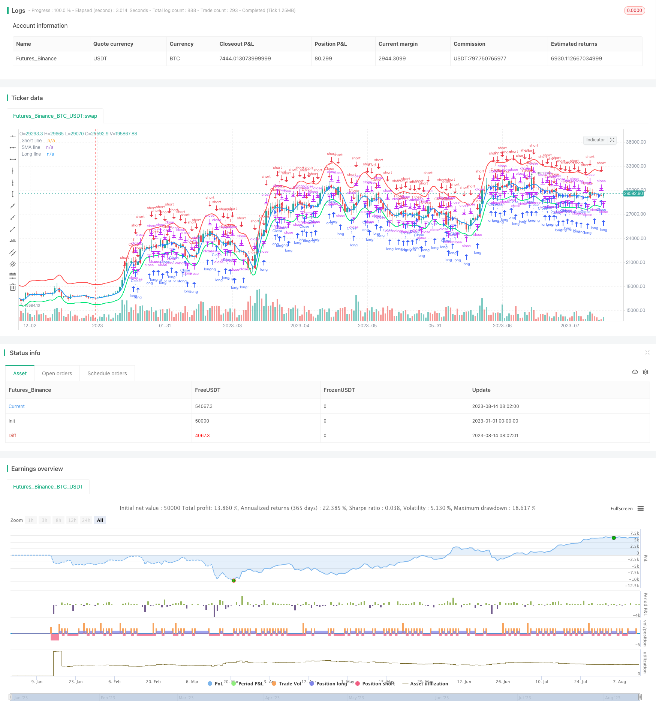

> Name

Moving Average Range Breakout Strategy Moving-Average-Channel-Breakout-Strategy
> Author

ChaoZhang

> Strategy Description



[trans]

### Overview
This strategy is a range breakout strategy based on moving averages. It will judge the price breakthrough based on the moving average of a certain period and the set upper and lower trajectories for buying and selling operations.
### Strategy Principles
The core principles of this strategy are:
1. Set a moving average of a certain period as the central axis.
2. Set the interval range above and below the central axis. The interval range is obtained by multiplying the central axis by a certain percentage. The upper trajectory is the central axis multiplied by (100% + set percentage), and the lower trajectory is the central axis multiplied by (100% - set percentage).
3. When the price rises and breaks through the upper track, go short; when the price falls and breaks through the lower track, go long.
4. The order price is set to the corresponding upper and lower track prices.
5. When the price returns to the central axis, close the position and leave the market.
In this way, the moving average and its range are used to capture price breakthroughs and implement trading strategies.
### Advantage Analysis
This strategy has the following advantages:
1. The concept is simple and clear, easy to understand and implement.
2. Parameters can be adjusted to adapt to different market environments.
3. The central axis and range can effectively filter market noise and capture trends.
4. Place orders using limit orders to control risks.
5. Stop loss when returning to the central axis to avoid excessive losses.
### Risk Analysis
There are also some risks with this strategy:
1. Improper setting of interval parameters may lead to frequent or insufficient trading.
2. There is a high probability of a false breakthrough in a breakthrough, and a stop loss may occur.
3. When the market fluctuates violently, the central axis and interval range become invalid.
4. If you force stop loss when returning to the central axis, you may leave the market prematurely.
Corresponding solutions:
1. Optimize parameters and select appropriate moving average period and interval percentage.
2. Combine with other indicators such as volume and energy to avoid false breakthroughs.
3. Add manual intervention methods.
4. The moving average period is set to be longer, and the interval range is appropriately enlarged.
### Optimization direction
This strategy can be optimized mainly from the following directions:
1. Add stop loss conditions, such as trailing stop loss, to avoid excessive losses.
2. Add indicator filtering, such as MACD, KD, etc., to reduce false breakthroughs.
3. Add automatic parameter optimization function so that parameters can be adjusted in real time according to market changes.
4. Increase the opening conditions to avoid relying solely on breakthroughs.
5. Optimize the moving average period and interval parameter settings.
### Summarize
This strategy is overall a more practical moving average interval breakthrough strategy. It has a simple concept, is easy to understand and implement, filters noise through intervals, and works better in markets with obvious trends. But there are also some risks, and you need to pay attention to parameter optimization and use in combination with other indicators. It has certain practical and development value.
||
### Overview
This is a moving average channel breakout strategy based on moving averages and range channels. It uses moving average lines and upper/lower channel lines to determine breakouts for trading signals.

### Strategy Logic

The core logic of this strategy is:

1. Set a moving average line of certain period as the middle line. 

2. Set upper and lower channel lines by multiplying the middle line by certain percentages. The upper line is middle line * (100% + preset percentage). The lower line is middle line * (100% - preset percentage).

3. When price breaks out above the upper line, go short. When price breaks out below the lower line, go long.  

4. Set order prices at the corresponding upper/lower lines.

5. Close positions when price comes back to the middle line.

So it trades based on the breakouts of the moving average channel.

### Advantage Analysis 

The advantages of this strategy are:

1. Simple and clear concept, easy to understand and implement.

2. Adjustable parameters fitting different market conditions.  

3. Middle line and channel range can filter market noise and catch trends.

4. Limit orders control risks. 

5. Cut losses when price comes back to middle line.

### Risk Analysis

There are also some risks:

1. Improper parameter settings may cause over/insufficient trading.

2. High probability of false breakouts and stop loss.

3. Failure of the middle and channel lines under huge market swings. 

4. Premature exit when forced to close on middle line.

Solutions:

1. Optimize parameters like MA period and channel percentage.

2. Add other indicators like volume to avoid false breakouts.

3. Increase manual intervention. 

4. Use longer MA period and wider channel range.

### Optimization

The strategy can be improved from the following aspects:

1. Add stop loss methods like trailing stop to limit losses.

2. Add filtering indicators like MACD to reduce false signals.

3. Enable automatic parameter optimization.

4. Add more open position criteria beyond breakout.

5. Optimize MA and channel parameters.

### Conclusion

In conclusion, this is a practical MA channel breakout strategy. It has a simple logic for easy use, while the channel range can filter noise. It performs well in trending markets. But risks exist and parameters together with additional filters need optimization for actual trading. The strategy has certain practical and development value.

[/trans]

> Strategy Arguments


|Argument|Default|Description|
|----|----|----|
|v_input_1|true|Long|
|v_input_2|true|Short|
|v_input_3|100|Lot, %|
|v_input_4|3|Length|
|v_input_5_ohlc4|0|Source: ohlc4|high|low|open|hl2|hlc3|hlcc4|close|
|v_input_6|10|Short line (red)|
|v_input_7|-5|Long line (lime)|
|v_input_8|1900|From Year|
|v_input_9|2100|To Year|
|v_input_10|true|From Month|
|v_input_11|12|To Month|
|v_input_12|true|From day|
|v_input_13|31|To day|


> Source (PineScript)

``` pinescript
/*backtest
start: 2023-01-01 00:00:00
end: 2023-08-15 00:00:00
period: 1d
basePeriod: 1h
exchanges: [{"eid":"Futures_Binance","currency":"BTC_USDT"}]
*/

//Noro
//2018

//@version=3
strategy(title = "Robot WhiteBox ShiftMA", shorttitle = "Robot WhiteBox ShiftMA", overlay = true, default_qty_type = strategy.percent_of_equity, default_qty_value = 100, pyramiding = 0)

//Settings
needlong = input(true, defval = true, title = "Long")
needshort = input(true, defval = true, title = "Short")
capital = input(100, defval = 100, minval = 1, maxval = 10000, title = "Lot, %")
per = input(3, title = "Length")
src = input(ohlc4, title = "Source")
shortlevel = input(10.0, title = "Short line (red)")
longlevel = input(-5.0, title = "Long line (lime)")
fromyear = input(1900, defval = 1900, minval = 1900, maxval = 2100, title = "From Year")
toyear = input(2100, defval = 2100, minval = 1900, maxval = 2100, title = "To Year")
frommonth = input(01, defval = 01, minval = 01, maxval = 12, title = "From Month")
tomonth = input(12, defval = 12, minval = 01, maxval = 12, title = "To Month")
fromday = input(01, defval = 01, minval = 01, maxval = 31, title = "From day")
today = input(31, defval = 31, minval = 01, maxval = 31, title = "To day")

//SMAs
sma = sma(src, per) 
shortline = sma * ((100 + shortlevel) / 100)
longline = sma * ((100 + longlevel) / 100)
plot(shortline, linewidth = 2, color = red, title = "Short line")
plot(sma, linewidth = 2, color = blue, title = "SMA line")
plot(longline, linewidth = 2, color = lime, title = "Long line")

//Trading
size = strategy.position_size
lot = 0.0
lot := size == 0 ? strategy.equity / close * capital / 100 : lot[1]

if (not na(close[per])) and size == 0 and needlong
    strategy.entry("L", strategy.long, lot, limit = longline)
    
if (not na(close[per])) and size == 0 and needshort
    strategy.entry("S", strategy.short, lot, limit = shortline)
    
if (not na(close[per])) and size > 0 
    strategy.entry("Close", strategy.short, 0, limit = sma)
    
if (not na(close[per])) and size < 0 
    strategy.entry("Close", strategy.long, 0, limit = sma)

if time > timestamp(toyear, tomonth, today, 23, 59)
    strategy.close_all()
```

> Detail

https://www.fmz.com/strategy/435159

> Last Modified

2023-12-12 17:38:19
