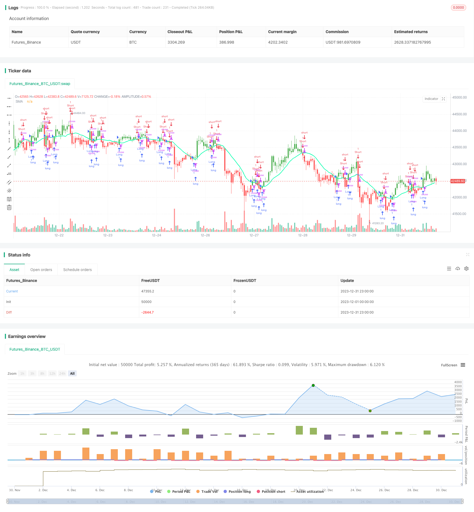

> Name

Quantitative trading strategy based on moving average Moving-Average-Crossover-Strategy
> Author

ChaoZhang

> Strategy Description


[trans]
### Overview
The moving average crossover strategy is a quantitative trading strategy based on moving averages. This strategy calculates the average price of a security over a period of time and uses the intersection of the moving average of the price to generate trading signals and achieve profits.
### Strategy Principles
This strategy mainly uses the intersection of fast moving averages and slow moving averages to determine price trends and generate trading signals. Specifically, it uses two moving averages with different period lengths, such as the 10-day line and the 20-day line.
When the fast moving average breaks through the slow moving average from below, it is considered that the market has turned from falling to rising, and a buy signal is generated. When the fast moving average falls from above and breaks below the slow moving average, it is considered that the market has turned from rising to falling, and a sell signal is generated.
By capturing the turning points of the price trend, this strategy can buy when the market turns good and sell when the market turns bad to achieve profits.
### Advantage Analysis
This strategy has the following advantages:
1. Simple concept, easy to understand and implement
2. It is highly customizable and can adjust parameters such as the period of the moving average.
3. The backtesting effect is good, especially suitable for trending market conditions.
4. Can incorporate stop-profit and stop-loss logic to control risks
### Risk Analysis
This strategy also has the following risks:
1. Wrong signals and over-trading are likely to occur during consolidation.
2. It is necessary to debug parameters. Different parameter combinations have greatly different backtest effects.
3. Transaction costs and slippage are not taken into account, and the effect of real offer may be weaker than backtesting.
4. There is a time lag and the opportunity for rapid price reversal may be missed.
These risks can be mitigated through appropriate optimization.
### Optimization direction
This strategy can be optimized from the following directions:
1. Combine with other indicators to filter signals, such as volume indicators, shock indicators, etc., to avoid erroneous transactions during consolidation
2. Add adaptive moving averages to dynamically change period parameters and better track prices.
3. Optimize the period parameters of the moving average and find the best parameter combination
4. Set re-entry conditions to avoid frequent transactions
5. Consider actual transaction costs and slippage, and adjust stop-profit and stop-loss points
Through the above optimization, the real offer effect of the strategy can be greatly improved.
### Summarize
The moving average crossover strategy is overall a quantitative trading strategy that is easy to master and implement. It uses the intersection principle of price averages to judge market trends and generate trading signals simply and intuitively. Through parameter tuning and cooperation with other technical indicators, the real trading effect of this strategy can be strengthened, making it a reliable quantitative profit tool.
||

### Overview

The moving average crossover strategy is a quantitative trading strategy based on moving averages. By calculating the average price of securities over a period of time, it generates trading signals through the crossover of price moving averages to make profits.

### Strategy Principle  

This strategy mainly uses the crossover of fast and slow moving average lines to determine price trends and generate trading signals. Specifically, it employs two moving averages with different period lengths, such as 10-day and 20-day lines.  

When the fast moving average line breaks through the slow moving average line upward, the market is considered to turn from decline to rise, generating a buy signal. When the fast moving average line breaks through the slow moving average line downward, the market is thought to turn from rise to decline, producing a sell signal.

By capturing the inflection points of price trends, this strategy can buy during an improving market and sell during a worsening market to make profits.

### Advantage Analysis

This strategy has the following advantages:

1. The concept is simple and easy to understand and implement
2. Highly customizable by adjusting moving average periods etc. 
3. Good backtesting results, especially suitable for trending markets
4. Can incorporate take profit and stop loss to control risks

### Risk Analysis  

This strategy also has the following risks:  

1. Prone to generating false signals and overtrading during range-bound markets
2. Parameter tuning needed as different parameter sets lead to varied backtest results  
3. Ignores transaction costs and slippage, actual results likely weaker than backtest
4. Time lag exists, may miss opportunities from fast price reversals

These risks can be alleviated through appropriate optimizations.

### Optimization Directions

This strategy can be optimized in the following aspects:

1. Add filters like volume and volatility indicators to avoid wrong trades during consolidations
2. Employ adaptive moving averages to allow dynamic period changes for better trend following
3. Optimize moving average periods to find best parameter sets  
4. Set re-entry conditions to prevent excessive trades
5. Consider actual trading costs and slippage, adjust take profit and stop loss  

The above optimizations can greatly improve the actual performance of the strategy.  

### Summary

In summary, the moving average crossover strategy is an easy to grasp and implement quantitative trading strategy. It judges market trends and generates trading signals through the intuitive principle of price average line crossovers. With parameter tuning and combinations with other technical indicators, it can strengthen the actual performance of this strategy and make it a reliable profit generator.

[/trans]

> Strategy Arguments


|Argument|Default|Description|
|----|----|----|
|v_input_1|D|Resolution|
|v_input_2_close|0|Source: close|high|low|open|hl2|hlc3|hlcc4|ohlc4|
|v_input_3|14|Length|
|v_input_4_close|0|Trigger Price: close|high|low|open|hl2|hlc3|hlcc4|ohlc4|
|v_input_5|50|Take Profit|
|v_input_6|20|Stop Loss|
|v_input_7|false|Use TakeStop|
|v_input_8|true|Painting bars|
|v_input_9|true|Show Line|
|v_input_10|false|Use Alerts|
|v_input_11|false|Trade Reverse|


> Source (PineScript)

``` pinescript
/*backtest
start: 2023-12-01 00:00:00
end: 2023-12-31 23:59:59
period: 1h
basePeriod: 15m
exchanges: [{"eid":"Futures_Binance","currency":"BTC_USDT"}]
*/

// This source code is subject to the terms of the Mozilla Public License 2.0 at https://mozilla.org/MPL/2.0/
// © HPotter
//  Simple SMA strategy
//
// WARNING:
//      - For purpose educate only
//      - This script to change bars colors
//@version=4
strategy(title="Simple SMA Strategy Backtest", shorttitle="SMA Backtest", precision=6, overlay=true)
Resolution = input(title="Resolution", type=input.resolution, defval="D")
Source = input(title="Source", type=input.source, defval=close)
xSeries = security(syminfo.tickerid, Resolution, Source)
Length = input(title="Length", type=input.integer, defval=14, minval=2)
TriggerPrice = input(title="Trigger Price", type=input.source, defval=close)
TakeProfit = input(50, title="Take Profit", step=0.01)
StopLoss = input(20, title="Stop Loss", step=0.01)
UseTPSL = input(title="Use Take\Stop", type=input.bool, defval=false)
BarColors = input(title="Painting bars", type=input.bool, defval=true)
ShowLine = input(title="Show Line", type=input.bool, defval=true)
UseAlerts = input(title="Use Alerts", type=input.bool, defval=false)
reverse = input(title="Trade Reverse", type=input.bool, defval=false)
pos = 0
xSMA = sma(xSeries, Length)
pos := iff(TriggerPrice > xSMA, 1,
         iff(TriggerPrice < xSMA, -1, nz(pos[1], 0)))
nRes = ShowLine ? xSMA : na
alertcondition(UseAlerts == true and pos != pos[1] and pos == 1, title='Signal Buy', message='Strategy to change to BUY')
alertcondition(UseAlerts == true and pos != pos[1] and pos == -1, title='Signal Sell', message='Strategy to change to SELL')
alertcondition(UseAlerts == true and pos != pos[1] and pos == 0, title='FLAT', message='Strategy get out from position')
possig =iff(pos[1] != pos,
         iff(reverse and pos == 1, -1,
           iff(reverse and pos == -1, 1, pos)), 0)
if (possig == 1)
    strategy.entry("Long", strategy.long)
if (possig == -1)
    strategy.entry("Short", strategy.short)
    
if (UseTPSL)    
    strategy.close("Long", when = high > strategy.position_avg_price + TakeProfit, comment = "close buy take profit")
    strategy.close("Long", when = low < strategy.position_avg_price - StopLoss, comment = "close buy stop loss")
    strategy.close("Short", when = low < strategy.position_avg_price - TakeProfit, comment = "close buy take profit")
    strategy.close("Short", when = high > strategy.position_avg_price + StopLoss, comment = "close buy stop loss")
nColor = BarColors ? strategy.position_avg_price != 0  and pos == 1 ? color.green :strategy.position_avg_price != 0 and pos == -1 ? color.red : color.blue : na
barcolor(nColor)
plot(nRes, title='SMA', color=#00ffaa, linewidth=2, style=plot.style_line)
```

> Detail

https://www.fmz.com/strategy/440107

> Last Modified

2024-01-26 16:29:23
