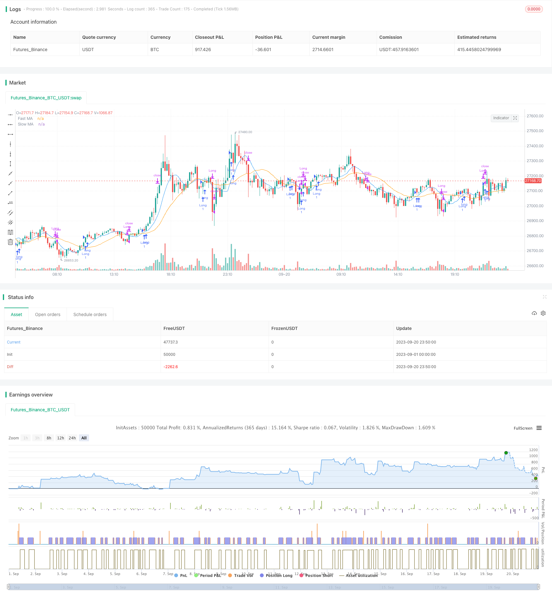

> Name

Moving-Average-Crossover-Strategy
> Author

ChaoZhang

> Strategy Description



[trans]


## Overview
This strategy is a trend following strategy based on moving averages. It uses the golden cross and dead cross of the fast moving average and the slow moving average to determine the trend direction and realize low-risk trend following transactions.
## Strategy Principle
This strategy uses a fast moving average of length 9 and a slow moving average of length 21. When the fast moving average crosses the slow moving average, it means that the market has entered an upward trend, and you can go long; when the fast moving average crosses below the slow moving average, it means that the market has entered a downward trend, and you can close your long position.
Specifically, the strategy determines the trend direction by calculating the values ​​of the fast moving average and the slow moving average, and comparing the relationship between the two. In the long direction, if the fast moving average crosses the slow moving average, a long signal will be triggered and a long position will be entered. In the short direction, if the fast moving average crosses the slow moving average, a closing signal will be triggered to close the previous long position.
In this way, the transition of the market trend can be captured through the golden cross of the fast and slow moving averages, and low-risk trend following transactions can be realized.
## Strategic Advantages
- Use moving averages to determine trends, which can filter market noise and identify trend directions.
- Fast moving averages can capture trend transitions faster, while slow moving averages filter out false signals
- Use golden cross buying and dead cross selling trading signals to avoid chasing highs and selling lows.
- The strategic trading logic is simple and clear, easy to understand and implement
## Strategy Risk
- There is a lag in the moving average and the best time point for trend conversion may be missed.
- Fixed average line length cannot adapt to various market cycles
- The dual moving average strategy is prone to generating frequent trading signals and has the risk of over-fitting.
- Only using moving averages to judge is susceptible to unexpected events and carries the risk of loss.
Risks can be managed by adjusting moving average parameters, introducing other indicators as filters, and setting stop loss and take profit.
## Strategy optimization direction
- Try different parameter settings, such as moving average length combinations, golden cross and dead cross judgment criteria, etc.
- Add filters such as volume and energy indicators to avoid false breakthroughs
- Add trend indicator judgment to distinguish between trend and oscillating markets
- Optimize stop loss and take profit settings combined with volatility indicators
- Introduce machine learning algorithm to dynamically optimize parameters
## Summarize
As a simple trend following strategy, the core idea of ​​this strategy is to determine the trend direction through a combination of fast and slow moving averages. The advantage is that it is simple and easy to understand, the trading rules are clear, and it can effectively track trends; the disadvantage is that there is lag and it is easy to generate false signals. We can optimize the strategy by adjusting parameters and adding other technical indicators to better adapt to the market environment. In general, the double moving average strategy, as a basic strategy, provides a simple and reliable idea for quantitative trading. pass
Through continuous optimization and improvement, the actual trading effect of this strategy can be made better.
|| 

## Overview

This strategy is a trend-following strategy based on moving averages. It uses the crossover and crossunder of fast and slow moving averages to determine the trend direction for low-risk trend trading.

## Strategy Logic

The strategy employs a fast moving average of period 9 and a slow moving average of period 21. When the fast MA crosses above the slow MA, it signals an uptrend in the market and a long position is taken. When the fast MA crosses below the slow MA, it signals a downtrend and any long position is closed. 

Specifically, the strategy calculates the values of the fast and slow MAs and compares their relationship to determine the trend direction. In an uptrend, if the fast MA crosses above the slow MA, a long entry signal is triggered. In a downtrend, if the fast MA crosses below the slow MA, an exit signal is triggered to close the existing long position.

This way, the crossover and crossunder of the fast and slow MAs captures trend transitions for low-risk trend following trading.

## Advantages

- Using moving averages to determine trend filters out market noise and identifies trend direction
- The fast MA captures trend changes faster, while the slow MA filters out false signals
- Using crossover to buy and crossunder to sell avoids chasing tops and selling bottoms
- Simple and clear trading logic, easy to understand and implement

## Risks

- Moving averages have lag and may miss best entry/exit points for trend transitions 
- Fixed MA lengths cannot adapt to different market cycles
- Dual MA strategies tend to generate excessive trading signals and overfitting
- Using just MAs to determine trades is prone to sudden events and losses

Risks can be managed by tuning parameters, adding filters, stop loss/take profit.

## Improvement Directions 

- Test different parameter settings like MA lengths, crossover/crossunder thresholds etc.
- Add momentum indicators as filters to avoid false breakouts
- Add trend-determining indicators to distinguish trending and ranging markets
- Incorporate volatility metrics to optimize stops and take profits  
- Employ machine learning to dynamically optimize parameters

## Summary

As a simple trend following strategy, the core idea is to use fast and slow MAs to determine trend direction. The pros are simplicity, clear rules, and effective trend tracking. The cons are lag, false signals, and excessive trades. We can optimize it by adjusting parameters and adding other indicators to better adapt to market conditions. Overall, the dual MA strategy provides a simple and reliable approach to quantitative trading. With continuous improvements, its performance can become even better.

[/trans]

> Strategy Arguments


|Argument|Default|Description|
|----|----|----|
|v_input_int_1|9|Fast MA Length|
|v_input_int_2|21|Slow MA Length|
|v_input_float_1|true|Stop Loss %|
|v_input_float_2|true|Take Profit %|


> Source (PineScript)

``` pinescript
/*backtest
start: 2023-09-01 00:00:00
end: 2023-09-20 23:59:59
period: 10m
basePeriod: 1m
exchanges: [{"eid":"Futures_Binance","currency":"BTC_USDT"}]
*/

//@version=5
strategy("Profitable Crypto Strategy", shorttitle="Profit Strategy", overlay=true)

// Define strategy parameters
fastLength = input.int(9, title="Fast MA Length", minval=1)
slowLength = input.int(21, title="Slow MA Length", minval=1)
stopLossPercent = input.float(1.0, title="Stop Loss %", step=0.1)
takeProfitPercent = input.float(1.0, title="Take Profit %", step=0.1)

// Calculate moving averages
fastMA = ta.sma(close, fastLength)
slowMA = ta.sma(close, slowLength)

// Entry condition: Buy when fast MA crosses above slow MA
longCondition = ta.crossover(fastMA, slowMA)
// Exit condition: Sell when fast MA crosses below slow MA
shortCondition = ta.crossunder(fastMA, slowMA)

// Plot moving averages on the chart
plot(fastMA, color=color.blue, title="Fast MA")
plot(slowMA, color=color.orange, title="Slow MA")

// Strategy entry and exit logic
var stopLossPrice = 0.0
var takeProfitPrice = 0.0

if (longCondition)
    stopLossPrice := close * (1.0 - stopLossPercent / 100)
    takeProfitPrice := close * (1.0 + takeProfitPercent / 100)
    strategy.entry("Long", strategy.long)

if (shortCondition)
    strategy.close("Long")

// Set stop loss and take profit for open positions
strategy.exit("Stop Loss/Profit", stop=stopLossPrice, limit=takeProfitPrice)

```

> Detail

https://www.fmz.com/strategy/429499

> Last Modified

2023-10-17 16:46:57
