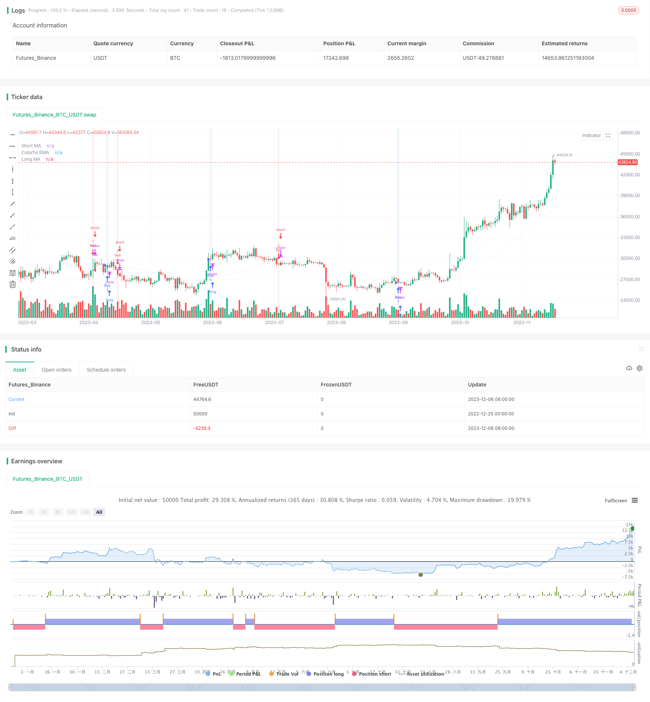

> Name

Moving-Average-Crossover-Strategy based on different periods
> Author

ChaoZhang

> Strategy Description


[trans]

## Overview
The moving average crossover strategy is a timing strategy based on moving averages. It calculates moving averages of different periods, determines their intersections, and generates buy and sell signals. This strategy also combines the exponential moving average as an auxiliary judgment indicator to further improve the accuracy of the signal.
## Principle
The core logic of this strategy is based on the intersection of two moving averages. Specifically, the n-day simple moving average (short MA) and the m-day simple moving average (long MA) are calculated respectively. When the short MA breaks through the long MA from bottom to top, a buy signal is generated; when the short MA falls below the long MA from top to bottom, a sell signal is generated. This reflects the wash and correction of short-term trends to long-term trends.
In addition, the strategy also introduces the x-day exponential moving average (EMA) as a secondary indicator. EMA is smoother than SMA and can reflect price changes more quickly. Its auxiliary role is that the actual trading signal is only triggered when the short-term EMA also confirms the moving average crossover signal. This avoids the interference of some false signals and improves the stability of the trading strategy.
## Advantages
The moving average crossover strategy has the following advantages:
1. Easy to use. This strategy only relies on the intersection of two moving averages and is very simple, easy to understand and implement.
2. Intuitive image. The moving average can clearly reflect the market trend, and its intersection is also very intuitive, without complex calculations.
3. It has a long history. The moving average strategy can be traced back to the beginning of the last century. After a hundred years of market testing, it has become one of the classic tools of technical analysis.
4. Risks are controllable. By adjusting the days parameter of the moving average, you can control the frequency of trading signals and thereby control risks.
5. Universal and flexible. The moving average crossover strategy is suitable for a variety of varieties and time periods, and is a very versatile and flexible trading strategy.
## Risk
There are also some risks with this strategy:
1. Frequent position switching. When the market fluctuates and fluctuates, the moving averages may cross frequently, causing positions to be swapped too frequently.
2. Delay occurs. The moving average itself carries a certain lag, especially the long-term moving average, which may miss short-term trading opportunities.
3. Parameter adjustment and optimization are required. Under different varieties and time periods, moving average parameters need to be independently tested and optimized, otherwise the effect may be poor.
4. Can be combined with other indicators. The effect of a single moving average strategy is not optimal, and it often needs to assist other technical indicators to filter signals.
## Optimization direction
This strategy can be optimized from the following aspects:
1. Adjust the moving average parameters to adapt to different periods. You can test different combinations of short-term and long-term moving average parameters to find the best parameters.
2. Increase the auxiliary judgment of trading volume. For example, set a volume breakthrough indicator to avoid invalid signals.
3. Increase the judgment of volatility indicators. For example, KDJ, MACD, etc. determine the actual market trend and filter uncertain signals.
4. Combined with corporate fundamentals. Adjust parameters based on performance expectations and other factors to make the strategy more forward-looking.
5. Combination application of strategies. Use in combination with other strategies or models to create synergistic effects.
## Summarize
The moving average crossover strategy generates trading signals through the simple moving average crossover principle. It is intuitive and easy to understand, has flexible parameter adjustment and controllable risks. It is a very practical timing strategy. But it also has certain hysteresis and frequent switching risks. Therefore, this strategy can be optimized and combined in a variety of ways to achieve greater effectiveness. It has become a simple and effective basic strategy in quantitative trading.
||

## Overview

The moving average crossover strategy is a timing strategy based on moving averages. It generates buy and sell signals by calculating different period moving averages and judging their crossover. This strategy also combines the exponential moving average as an auxiliary indicator to further improve the accuracy of signals.

## Principles  

The core logic of this strategy is based on the crossover between two moving averages. Specifically, it calculates the n-day simple moving average (short MA) and the m-day simple moving average (long MA). When the short MA breaks through the long MA from bottom to top, a buy signal is generated. When the short MA breaks through the long MA from top to bottom, a sell signal is generated. This reflects the wash and correction of short-term trends on long-term trends.

In addition, this strategy also introduces the x-day exponential moving average (EMA) as an auxiliary indicator. Compared with SMA, EMA is smoother and can reflect price changes faster. Its auxiliary effect is that only when the short-term EMA also confirms the moving average crossover signal, the actual trading signal will be triggered. This avoids some interference from false signals and improves the stability of trading strategies.

## Advantages

The moving average crossover strategy has the following advantages:  

1. Simple and easy to use. This strategy relies solely on the crossover between two moving averages, which is very simple, easy to understand and implement.

2. Intuitive and vivid. Moving averages can clearly reflect market trends, and their crossover is also very intuitive without complex calculations.  

3. Long history. Moving average strategies can be traced back to the early 20th century and have undergone 100 years of market test to become one of the classic technical analysis tools.

4. Controllable risks. By adjusting the moving average parameters, you can control the frequency of trading signals and thus control risks.

5. Universal and flexible. The moving average crossover strategy is suitable for various products and time cycles, making it a very versatile and flexible trading strategy.

## Risks

This strategy also has some risks:

1. Frequent position switching. When the market fluctuates sharply, the moving averages may frequently crossover, resulting in over-frequent position switching.

2. Lagging effects. The moving average itself carries a certain lag, especially long-cycle moving averages, which may miss short-term trading opportunities.

3. Parameter optimization needed. For different products and time cycles, the parameters of the moving averages need to be independently tested and optimized, otherwise the results may be poor.

4. Can be combined with other indicators. A single moving average strategy is not the best performing. It often requires other technical indicators to filter out signals.

## Optimization Directions  

This strategy can be optimized in the following aspects:

1. Adjust moving average parameters to adapt to different cycles. Different combinations of short-term and long-term moving averages can be tested to find the optimal parameters.

2. Add auxiliary judgment of trading volume. For example, set up indicators for breaking through trading volume to avoid invalid signals.

3. Add volatility indicators for judgment. For example, KDJ and MACD can judge the actual market trend and filter uncertain signals.

4. Combine fundamentals. Adjust parameters based on earnings expectations to make strategies more forward-looking.

5. Portfolio application of strategies. Use with other strategies or models to achieve synergistic effects.

## Conclusion  

The moving average crossover strategy generates trading signals through the simple principle of moving average crossover. It is intuitive, easy to understand, flexible in parameter adjustment and risk controllable. But it also has inherent lagging properties and risks of over-frequent position switching. Therefore, this strategy can be optimized and combined in various ways to maximize its utility. It has become a simple and effective basic strategy in quantitative trading.

[/trans]

> Strategy Arguments


|Argument|Default|Description|
|----|----|----|
|v_input_1|10|Short MA Length|
|v_input_2|40|Long MA Length|
|v_input_3|20|EMA Length|


> Source (PineScript)

``` pinescript
/*backtest
start: 2022-12-25 00:00:00
end: 2023-12-07 05:20:00
period: 1d
basePeriod: 1h
exchanges: [{"eid":"Futures_Binance","currency":"BTC_USDT"}]
*/

//@version=5
strategy("MA Crossover Strategy", overlay=true)

// Define input parameters
shortLength = input(10, title="Short MA Length")
longLength = input(40, title="Long MA Length")
emaLength = input(20, title="EMA Length")

// Calculate moving averages
shortMA = ta.sma(close, shortLength)
longMA = ta.sma(close, longLength)
colorfulEMA = ta.ema(close, emaLength)

// Create buy and sell conditions
buyCondition = ta.crossover(shortMA, longMA)
sellCondition = ta.crossunder(shortMA, longMA)

// Execute buy and sell orders
if (buyCondition)
    strategy.entry("Buy", strategy.long)
    strategy.close("Sell")

if (sellCondition)
    strategy.entry("Sell", strategy.short)
    strategy.close("Buy")

// Color the background based on buy and sell conditions
bgcolor(buyCondition ? color.new(color.blue, 90) : na)
bgcolor(sellCondition ? color.new(color.red, 90) : na)

// Plot moving averages
plot(shortMA, color=color.new(color.blue, 90), title="Short MA")
plot(longMA, color=color.new(color.red, 90), title="Long MA")

// Plot colorful EMA with transparency
plot(colorfulEMA, color=color.new(color.green, 90), title="Colorful EMA")

```

> Detail

https://www.fmz.com/strategy/436617

> Last Modified

2023-12-26 12:04:34
