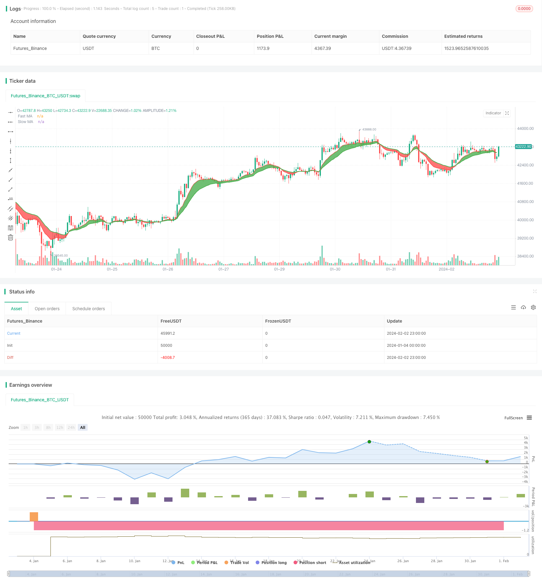

> Name

Moving-Average-Crossover-Strategy Based on Moving Average Crossover Trading Strategy
> Author

ChaoZhang

> Strategy Description


[trans]
## Overview
The moving average crossover strategy is a relatively common stock trading strategy. This strategy works by calculating a fast moving average and a slow moving average and generating buy and sell signals when they cross. Specifically, when the fast moving average crosses the slow moving average from below, a buy signal is generated; when the fast moving average crosses below the slow moving average from above, a sell signal is generated.
## Strategy Principle
The core logic of this strategy is: the fast moving average represents the short-term trend of the stock, and the slow moving average represents the long-term trend of the stock. When the short-term trend turns upward (golden cross), it means that the stock has entered the buying range; when the short-term trend turns downward (death cross), it means the stock has entered the selling range.
Specifically, this strategy defines the fast moving average maFast and the slow moving average maSlow. The maFast length is 9, which represents the 9-day short-term trend of the stock; the maSlow length is 18, which represents the 18-day long-term trend of the stock. The strategy determines changes in short-term and long-term trends by calculating the intersection of two moving averages. When maFast crosses maSlow above, a buy signal is generated; when maFast crosses below maSlow, a sell signal is generated.
## Advantage Analysis
This strategy has the following advantages:
1. The principle is simple and easy to understand and implement.
2. The moving average can effectively filter out the noise of stock prices and generate more reliable trading signals.  
3. The fast and slow moving average combines the short and long-term trends, and the trading signals are relatively stable.
4. The moving average parameters can be flexibly adjusted to adapt to the characteristics of different stocks.
5. Better trading results can be obtained by optimizing the moving average cycle parameters.
## Risk Analysis
There are also some risks with this strategy:
1. When stock prices fluctuate more, more false signals and excessive trading occur.
2. Improper parameter settings may lead to excessive trading frequency or signal delay.
3. Inability to effectively track rapidly changing markets and individual stocks.
4. There is a certain time lag, and key buying and selling points may be missed.
The above risks can be reduced by adjusting moving average parameters and setting stop loss strategies.
## Optimization direction
There is room for further optimization of this strategy:
1. Combine with other technical indicators to filter signals, such as trading volume, STOCH, etc.
2. Add a trend judgment mechanism to avoid missing the main trend. 
3. Optimize the moving average parameters and find the best parameter combination.
4. Set up a stop-loss strategy to control single losses.
5. Combine with deep learning and other models to predict price trends.
## Summarize
The moving average crossover strategy is overall a very classic and practical strategy. Its principle is simple, easy to implement, and widely used in actual transactions. Through parameter tuning and the application of auxiliary technical indicators, the strategy can be further improved to obtain a better risk-benefit ratio. Overall, this strategy is an important cornerstone of quantitative trading and deserves in-depth study and application.
||

## Overview

The moving average crossover strategy is a common stock trading strategy. It generates buying and selling signals by calculating fast and slow moving averages and detecting their crossover points. Specifically, when the fast moving average crosses above the slow moving average from below, it generates a buy signal; when the fast moving average crosses below the slow moving average from above, it generates a sell signal.  

## Strategy Logic

The core logic of this strategy is: the fast moving average represents the short-term trend of a stock, while the slow moving average represents its long-term trend. When the short-term trend turns upward (golden cross), it indicates the stock may enter a buy zone; when the short-term trend turns downward (death cross), it indicates the stock may enter a sell zone.

In this strategy, the fast moving average maFast and slow moving average maSlow are defined. maFast has a period of 9 representing the 9-day short-term trend of a stock. maSlow has a period of 18 representing the 18-day long-term trend. The strategy detects their crossover to determine changes in short-term and long-term trends. It generates a buy signal when maFast crosses above maSlow, and a sell signal when maFast crosses below maSlow.  

## Advantage Analysis 

The advantages of this strategy are:

1. Its logic is simple and easy to understand and implement.  
2. Moving averages can filter out price noises effectively and generate reliable trading signals.
3. The fast and slow MAs combine short-term and long-term trends, making the signals stable. 
4. The MA parameters can be adjusted flexibly to adapt to different stocks.
5. Further optimizations on the MA period parameters can lead to better trading performance.

## Risk Analysis

There are also some risks with this strategy:

1. More incorrect signals and excessive trading can happen when price fluctuation is high.  
2. Improper parameter settings may cause too frequent trading or signal delay.
3. It cannot track rapidly changing market and individual stocks effectively. 
4. There can be some time lag, which may cause missing important entry or exit spots.

These risks can be reduced by adjusting MA parameters, setting stop loss strategies etc.

## Optimization Directions

There are further optimization spaces for this strategy:

1. Combine other technical indicators to filter signals, e.g. trading volume, STOCH.  
2. Add trend determination mechanism to avoid missing major trends.
3. Optimize MA parameters to find the best combination. 
4. Set stop loss strategies to control single trade loss.
5. Incorporate deep learning models to predict price movements.

## Conclusion  

In conclusion, the moving average crossover strategy is a very classic and practical strategy overall. It has simple logic and wide applications in actual trading. By parameter tuning and combining other technical indicators, it can be further improved to achieve better risk-reward ratios. In general, it is an important cornerstone of quantitative trading and deserves in-depth research and application.

[/trans]

> Strategy Arguments


|Argument|Default|Description|
|----|----|----|
|v_input_1_close|0|Fast MA Source: close|high|low|open|hl2|hlc3|hlcc4|ohlc4|
|v_input_2|9|Fast MA Period|
|v_input_3_close|0|Slow MA Source: close|high|low|open|hl2|hlc3|hlcc4|ohlc4|
|v_input_4|18|Slow MA Period|


> Source (PineScript)

``` pinescript
/*backtest
start: 2024-01-04 00:00:00
end: 2024-02-03 00:00:00
period: 1h
basePeriod: 15m
exchanges: [{"eid":"Futures_Binance","currency":"BTC_USDT"}]
*/

//@version=3
strategy(title="Moving Average Cross", overlay=true, initial_capital=10000, currency='USD')


// === GENERAL INPUTS ===
// short ma
maFastSource   = input(defval = close, title = "Fast MA Source")
maFastLength   = input(defval = 9, title = "Fast MA Period", minval = 1)
// long ma
maSlowSource   = input(defval = close, title = "Slow MA Source")
maSlowLength   = input(defval = 18, title = "Slow MA Period", minval = 1)


// === SERIES SETUP ===
/// a couple of ma's..
maFast = ema(maFastSource, maFastLength)
maSlow = ema(maSlowSource, maSlowLength)


// === PLOTTING ===
fast = plot(maFast, title = "Fast MA", color = red, linewidth = 2, style = line, transp = 30)
slow = plot(maSlow, title = "Slow MA", color = green, linewidth = 2, style = line, transp = 30)


// === LOGIC ===
enterLong = crossover(maFast, maSlow)
exitLong = crossover(maSlow, maFast)


// Entry //
strategy.entry(id="Long Entry", long=true, when=enterLong)
strategy.entry(id="Short Entry", long=false, when=exitLong)


// === FILL ====

fill(fast, slow, color = maFast > maSlow ? green : red)
```

> Detail

https://www.fmz.com/strategy/441002

> Last Modified

2024-02-04 16:00:31
