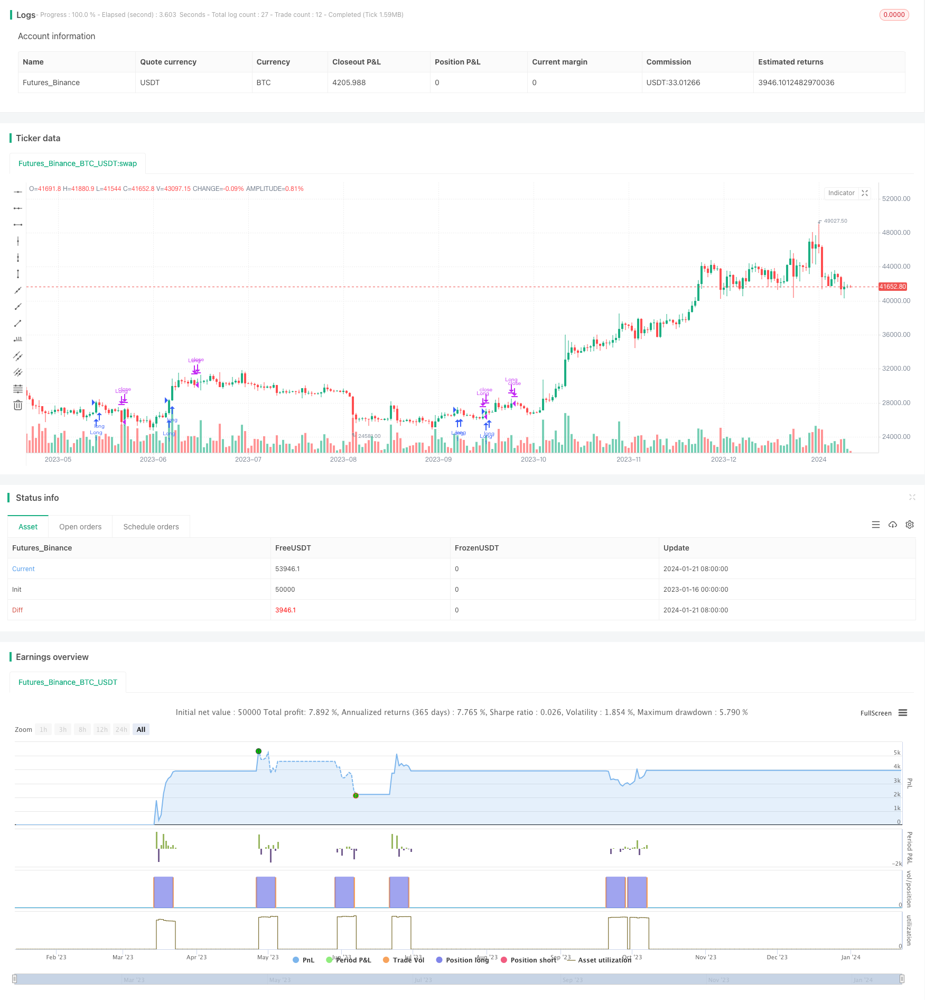

> Name

Based on Moving Average Crossover Strategy-Moving-Average-Crossover-Strategy
> Author

ChaoZhang

> Strategy Description


 [trans]
## Overview
This strategy is a trading strategy based on moving averages. It uses the 45-day moving average as the main technical indicator, and performs buy and sell operations based on the signal that the price breaks through the moving average.
## Strategy Principle
When the price rises above the 45-day moving average, a buy signal is generated; when the position is held for 8 days, a sell signal is generated. Thereafter, if the price rises again above the 45-day moving average, a buy signal will again be generated. This cycle operates.
The specific principles of the strategy are:
1. Calculate the 45-day moving average.
2. When the closing price breaks through from below the moving average to above, a buy signal is generated to enter the market long.
3. Hold for 8 trading days after entering the market.
4. After 8 days, close the long position and generate a sell signal.
5. If the closing price breaks through from below the moving average to above again, a buy signal will be generated again and the market will be entered again.
The above is the core trading logic of the strategy.
## Strategic Advantages
This strategy has the following advantages:
1. The operating rules are simple and clear, easy to understand and implement.
2. Use the trend tracking function of moving averages to effectively capture medium and long-term trends.
3. The 8-day position holding time is neither long nor short. It can not only follow the trend but also stop losses in time.
4. The rules for re-entering the market are clear and the trading frequency can be effectively controlled.
## Strategy Risk
There are also some risks with this strategy:
1. The delay of the moving average will lead to late entry and early stop loss.
2. Fixed position holding time and moving average parameters may not adapt to market changes.
3. The trading frequency may be too high, increasing transaction costs and slippage losses.
4. Breakthrough signals may produce false signals, and there is a certain probability of false entries and false exits.
Countermeasures:
1. Optimize moving average parameters and reduce latency.
2. Increase the holding time or trailing stop loss to follow the trend. 
3. Combine with other indicators to filter out false breakthroughs.
4. Optimize re-entry conditions and control trading frequency.
## Strategy optimization direction
This strategy can mainly be optimized from the following aspects:
1. Optimize the moving average parameters and find the best parameter combination. Different day parameters such as 15 days, 30 days, 60 days, etc. can be tested.
2. Optimize the holding time and find the best number of days to hold the position. Different holding periods such as 5 days, 10 days, and 15 days can be tested.
3. Add a trailing stop to track trends and control risks. For example, trialing stop or ATR stop loss.
4. Add other indicators for filtering, such as MACD, KDJ, etc., to reduce false signals.
5. Optimize re-entry conditions to prevent too frequent transactions. For example, increase the cooling period, etc.
6. Test the effects of different markets and different varieties. Parameters need to be optimized for different markets.
## Summarize
This moving average crossover strategy is overall a simple and practical trend following strategy. It uses the trend following function of moving averages to generate trading signals in conjunction with price breakouts. The advantage is that it is easy to implement, but the trade-off is that there may be some mistakes. Better results can be achieved by optimizing parameters and adding auxiliary technical indicators.
|| 

## Overview

This is a trading strategy based on moving average crossover signals. It uses a 45-day moving average line as the major technical indicator and generates buy and sell signals when the price breaks through the moving average line.  

## Strategy Logic

When the price rallies and breaks above the 45-day moving average line, a buy signal is generated. After holding the position for 8 days, a sell signal is generated. Afterwards, if the price rallies and breaks above the 45-day moving average line again, a new buy signal will be triggered, and so on so forth.  

The specific logic principles are:

1. Calculate the 45-day moving average line.  
2. When the closing price breaks from below to above the moving average line, a buy signal is generated to go long.
3. Hold the position for 8 trading days after entering the market.  
4. Close the long position after 8 days and generate a sell signal.
5. If later on the closing price breaks from below to above the moving average line again, regenerate a buy signal to reopen a long position.

The above constitutes the core trading logic of this strategy.  

## Advantages

This strategy has the following advantages:

1. The trading rules are simple and clear, easy to understand and implement.  
2. Utilizes the trend tracking feature of moving averages to effectively capture medium-to-long term trends.   
3. The 8-day holding period is appropriately long enough to track trends and short enough to cut losses in time.
4. The rules for re-entering the market are clear, which helps restrict trading frequency.  

## Risks

There are a few risks with this strategy:

1. The lagging nature of moving averages could lead to late entries and premature exits. 
2. The fixed holding period and MA parameters may fail to adapt to changing market conditions.  
3. Trading frequency might be too high, increasing costs and slippage.
4. Breakout signals may produce false signals resulting in some whipsaws.  

Solutions:

1. Optimize MA parameters to reduce lag.
2. Increase holding period or use trailing stops to better track trends.  
3. Add filters using other indicators like MACD or KDJ to confirm signals.  
4. Refine re-entry rules to control frequency.

## Enhancement Areas

The main enhancement areas are:  

1. Optimize MA parameters to find best combinations, e.g. 15-day, 30-day, 60-day MAs.    

2. Optimize holding period to determine optimal duration, e.g. 5 days, 10 days, 15 days.   

3. Add trailing stops to track trends and control risks, e.g. trialing stops or ATR stops.  

4. Add filters using other indicators like MACD, KDJ to reduce false signals.   

5. Refine re-entry rules to prevent over-trading, e.g. enforce cooling-off periods. 

6. Test effectiveness across different markets and instruments. Parameters need to be tuned for different markets.

## Summary 

In summary, this MA crossover strategy is a simple and practical trend following system. It takes advantage of the trend tracking ability of MAs and combines price breakouts to generate trade signals. The pros are it's easy to implement while the cons are occasional whipsaws. The strategy can be further enhanced through parameter optimization and adding other indicators as filters.

[/trans]


> Source (PineScript)

``` pinescript
/*backtest
start: 2023-01-16 00:00:00
end: 2024-01-22 00:00:00
period: 1d
basePeriod: 1h
exchanges: [{"eid":"Futures_Binance","currency":"BTC_USDT"}]
*/

//@version=5
strategy("Moving Average Crossover Strategy", overlay=true)

// Calculate the 45-day moving average
ma_length = 45
ma = ta.sma(close, ma_length)

// Track position entry and entry bar
var bool in_long_position = na
var int entry_bar = na
var int exit_bar = na

// Entry condition: Close price crosses above the 45-day moving average to enter the position
if (not in_long_position and ta.crossover(close, ma) and not na(ma[1]) and close > ma and close[1] < ma[1])
    in_long_position := true
    entry_bar := bar_index

// Exit condition: Close the position after holding for 8 trading days
if (in_long_position and bar_index - entry_bar >= 8)
    in_long_position := false
    exit_bar := bar_index

// Re-entry condition: Wait for price to cross over the 45-day moving average again
if (not in_long_position and ta.crossover(close, ma) and not na(ma[1]) and close > ma and close[1] > ma[1] and (na(exit_bar) or bar_index - exit_bar >= 8))
    in_long_position := true
    entry_bar := bar_index

// Execute long entry and exit
if (in_long_position)
    strategy.entry("Long", strategy.long)

if (not in_long_position)
    strategy.close("Long")
```

> Detail

https://www.fmz.com/strategy/439756

> Last Modified

2024-01-23 15:20:16
