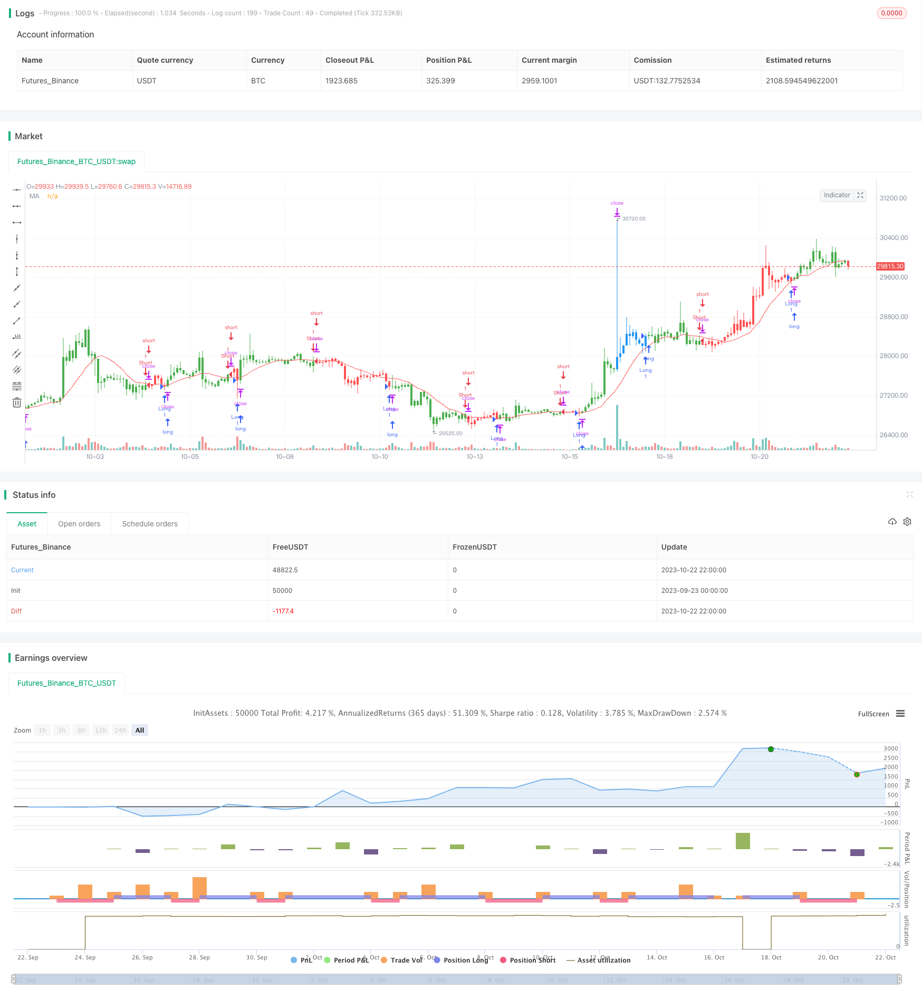

> Name

Moving-Average-Crossover-Strategy Based on Moving Average Crossover Strategy
> Author

ChaoZhang

> Strategy Description


[trans]

## Overview
This strategy is based on the principle of moving average crossover. It goes long when the short-term moving average crosses the long-term moving average from below, and goes short when the short-term moving average crosses the long-term moving average from above. It is a typical trend following strategy.
## Strategy Principle
This strategy mainly calculates two simple moving averages, short-term and long-term, and determines the trend direction based on their intersection.
Specifically, the strategy first calculates the short-term moving average xMA and the long-term moving average. The length of the short-term moving average is Len and the length of the long-term moving average is 2*Len.
Then the strategy determines whether the short-term moving average crosses above the long-term moving average, and if it crosses above, it generates a long signal; it judges whether the short-term moving average crosses below the long-term moving average, and if it crosses below, it generates a short signal.
After receiving a long signal, if there is currently no position, a long position will be opened at the market price; after a short signal is received, if there is no current position, a short position will be opened at the market price.
In addition, the strategy also sets stop-loss and stop-profit points. After going long, set the stop-loss price as entry price - stop-loss percentage * entry price, and set the stop-profit price as entry price + take-profit percentage * entry price; after going short, set the stop-loss price as entry price + stop-loss percentage * entry price, and set the stop-profit price as entry price - take-profit percentage * entry price.
Finally, the strategy also outputs a visual curve of the moving average to assist in judging the trend.
## Strategic Advantages
- The ideas are simple and clear, easy to understand and implement, and suitable for novices to learn;
- Determine the trend direction based on the moving average, which can effectively track market trends;
- Set stop loss and profit points to control risks;
- Visually display the moving average curve to intuitively reflect trend changes.
## Strategy Risk
- The moving average is lagging, which may lead to the risk of missing the best entry point;
- Unreasonable stop loss setting may lead to the stop loss being too loose or too strict;
- When the stock price fluctuates violently, the moving average may generate false signals;
- Parameter optimization based only on the moving average period parameters may lead to overfitting.
These risks can be reduced by appropriately loosening stop losses, optimizing the combination of moving average cycle parameters, and adding other indicator filters.
## Strategy optimization direction
- Add other indicators for filtering, such as MACD, KDJ, etc., to avoid false signals caused by moving average misalignment;
- Perform multi-combination optimization on short-term moving average and long-term moving average lengths to find the best parameter combination;
- Test different stop-loss and take-profit strategies, such as zigzag stop loss, trailing stop loss, etc.;
- Add a position management module to optimize capital utilization efficiency.
## Summarize
The overall idea of ​​this strategy is clear and concise. It determines the trend direction based on the intersection of moving averages. It can effectively track the trend and the risk is controllable. It is suitable for novices to learn and refer to. However, relying only on moving averages may cause erroneous signals, and there is still a lot of room for optimization. Optimization and improvements can be made from many aspects to make the strategy more robust and reliable.
||


## Overview

This strategy is based on the moving average crossover principle. It goes long when the short-term moving average crosses above the long-term moving average from below, and goes short when the short-term moving average crosses below the long-term moving average from above. It's a typical trend following strategy.

## Strategy Logic

The strategy mainly calculates the short-term and long-term simple moving averages, and determines the trend direction based on their crossover. 

Specifically, it first calculates the short-term moving average xMA and the long-term moving average, where the short-term period is Len, and the long-term period is 2*Len.

Then it checks if the short-term MA crosses above the long-term MA, and generates a long signal if the crossover happens. It also checks if the short-term MA crosses below the long-term MA, and generates a short signal if the crossover happens.

Upon receiving a long signal, it opens a long position at market price if there is no position. Upon receiving a short signal, it opens a short position at market price if there is no position.

In addition, stop loss and take profit points are configured. For long trades, the stop loss is set at entry price - stop loss percentage * entry price, and take profit at entry price + take profit percentage * entry price. For short trades, the stop loss is set at entry price + stop loss percentage * entry price, and take profit at entry price - take profit percentage * entry price. 

Finally, the moving averages are plotted for visualization to assist with trend determination.

## Advantages

- Simple and easy to understand, suitable for beginners.

- Can effectively track market trends based on moving average crossovers. 

- Risks are controlled by configuring stop loss and take profit.

- Visualization of moving averages intuitively reflects trend changes.

## Risks

- Moving averages have lagging effects, which may cause missing the best entry points.

- Improper stop loss configuration may result in stops being too wide or too tight.

- Prices whipsawing may generate false signals.

- Optimizing solely based on the moving average periods may lead to overfitting.

These risks can be reduced by using looser stops, optimizing moving average period combinations, adding filter indicators etc.

## Optimization Directions

- Add other indicators like MACD, KDJ for filtering to avoid false signals.

- Optimize combinations of short and long moving average periods to find optimum parameters.  

- Test different stop loss/take profit strategies like trailing stops.

- Add position sizing to optimize capital utilization.

## Summary

The strategy has a clear and simple logic, can track trends effectively based on moving average crossovers, and has controllable risks. It is suitable for beginners to learn from. But relying solely on moving averages may generate false signals. There is still much room for optimizating it in various aspects to make it more robust.

[/trans]

> Strategy Arguments


|Argument|Default|Description|
|----|----|----|
|v_input_2|13|Len|
|v_input_float_3|7|Take Profit %|
|v_input_float_4|7|Stop Loss %|
|v_input_1||(?entry)Signal Token|
|v_input_string_1|0|Order Type: market|limit|
|v_input_float_1|false|Order Price Offset|
|v_input_string_2|0|Investment Type: percentage_balance|contract|margin|percentage_investment|
|v_input_float_2|100|Amount|


> Source (PineScript)

``` pinescript
/*backtest
start: 2023-09-23 00:00:00
end: 2023-10-23 00:00:00
period: 2h
basePeriod: 15m
exchanges: [{"eid":"Futures_Binance","currency":"BTC_USDT"}]
*/

//@version=5
//@strategy_alert_message {{strategy.order.alert_message}} 
////////////////////////////////////////////////////////////
//  Copyright by HPotter v2.0 19/09/2023
// MA Crossover Bot for OKX Exchange
////////////////////////////////////////////////////////////
var ALERTGRP_CRED = "entry"
signalToken = input("", "Signal Token", inline = "11", group = ALERTGRP_CRED)
OrderType = input.string("market", "Order Type", options = ["market", "limit"], inline = "21", group = ALERTGRP_CRED)
OrderPriceOffset = input.float(0, "Order Price Offset", minval = 0, maxval = 100, step = 0.01, inline = "21", group = ALERTGRP_CRED)
InvestmentType = input.string("percentage_balance", "Investment Type", options = ["margin", "contract", "percentage_balance", "percentage_investment"], inline = "31", group = ALERTGRP_CRED)
Amount = input.float(100, "Amount", minval = 0.01, inline = "31", group = ALERTGRP_CRED)

getAlertMsg(action, instrument, signalToken, orderType, orderPriceOffset, investmentType, amount) =>
    str = '{'
    str := str + '"action": "' + action + '", '
    str := str + '"instrument": "' + instrument + '", '
    str := str + '"signalToken": "' + signalToken + '", '
    //str := str + '"timestamp": "' + str.format_time(timenow, "yyyy-MM-dd'T'HH:mm:ssZ", "UTC+0") + '", '
    str := str + '"timestamp": "' + '{{timenow}}' + '", '
    str := str + '"orderType": "' + orderType + '", '
    str := str + '"orderPriceOffset": "' + str.tostring(orderPriceOffset) + '", '
    str := str + '"investmentType": "' + investmentType + '", '
    str := str + '"amount": "' + str.tostring(amount) + '"'
    str := str + '}'
    str

getOrderAlertMsgExit(action, instrument, signalToken) =>
    str = '{'
    str := str + '"action": "' + action + '", '
    str := str + '"instrument": "' + instrument + '", '
    str := str + '"signalToken": "' + signalToken + '", '
    str := str + '"timestamp": "' + '{{timenow}}' + '", '
    str := str + '}'
    str

strategy(title='OKX: MA Crossover', overlay=true)
Len = input(13)
Profit = input.float(7, title='Take Profit %', minval=0.01) / 100
Stop =  input.float(7, title='Stop Loss %', minval=0.01) / 100
xMA = ta.sma(close, Len)
//Robot State
isLong = strategy.position_size > 0 
isShort = strategy.position_size < 0 
isFlat = strategy.position_size == 0 
//Current Signal
doLong = low < xMA[1] ? true : false
doShort =   high > xMA[1] ? true:  false
//Backtest Start Date
tm =  timestamp(2022, 01, 01, 09, 30)
//Entry and exit orders
if  doLong[2] == false and isLong == false and doLong and time > tm
    strategy.cancel_all()
    buyAlertMsgExit = getOrderAlertMsgExit(action = 'EXIT_LONG', instrument = syminfo.ticker, signalToken = signalToken)
    buyAlertMsg = getAlertMsg(action = 'ENTER_LONG', instrument = syminfo.ticker, signalToken = signalToken, orderType =  OrderType, orderPriceOffset =  OrderPriceOffset, investmentType =  InvestmentType, amount = Amount)
    strategy.entry('Long', strategy.long, limit = close, comment='Long', alert_message =buyAlertMsg)
    strategy.exit("ExitLong", 'Long', stop=close - close * Stop  , limit = close + close * Profit , qty_percent = 100, alert_message = buyAlertMsgExit)  
if doShort[2] == false and isShort == false and doShort and time > tm
    strategy.cancel_all()
    sellAlertMsgExit = getOrderAlertMsgExit(action = 'EXIT_SHORT', instrument = syminfo.ticker, signalToken = signalToken)
    sellAlertMsg = getAlertMsg(action = 'ENTER_SHORT', instrument = syminfo.ticker, signalToken = signalToken, orderType =  OrderType, orderPriceOffset =  OrderPriceOffset, investmentType =  InvestmentType, amount = Amount)
    strategy.entry('Short', strategy.short, limit=close, comment='Short', alert_message = sellAlertMsg)
    strategy.exit("ExitShort", 'Short', stop=close + close * Stop  , limit = close - close * Profit  , qty_percent = 100, alert_message = sellAlertMsgExit)  
//Visual
barcolor(isShort  ? color.red : isLong ? color.green : color.blue)
plot(xMA, color=color.new(color.red, 0), title='MA')
```

> Detail

https://www.fmz.com/strategy/430064

> Last Modified

2023-10-24 16:39:40
