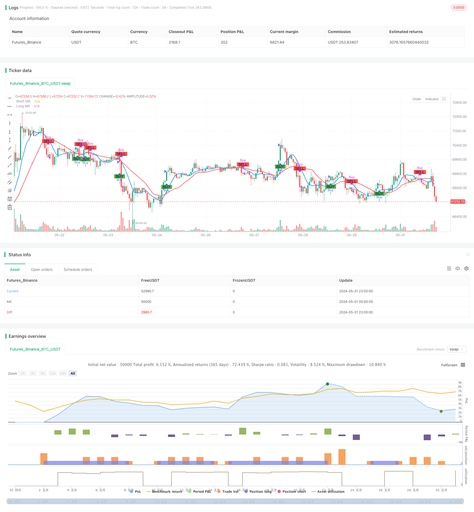

> Name

Moving Average Strategy Based on Dual-Moving-Averages-Moving-Average-Crossover-Strategy-Based-on-Dual-Moving-Averages
> Author

ChaoZhang

> Strategy Description


[trans]
#### Overview
The moving average strategy based on double moving average crossover is a simple and effective intraday trading method that aims to identify potential buying and selling opportunities in the market by analyzing the relationship between two moving averages of different periods. This strategy uses a short-term simple moving average (SMA) and a long-term simple moving average. When the short-term moving average crosses the long-term moving average, it indicates a bullish signal and prompts a potential buying opportunity; conversely, when the short-term moving average crosses below the long-term moving average, it indicates a bearish signal and prompts a potential selling opportunity. This crossover method helps traders capture market trends while minimizing market noise.
#### Strategy Principle
The core principle of this strategy is to use the trend characteristics and hysteresis of moving averages of different periods, and by comparing the relative positions of short-term moving averages and long-term moving averages, to judge the trend direction of the current market and make corresponding trading decisions. When the market shows an upward trend, the price will first break through the long-term moving average, and then the short-term moving average will cross above the long-term moving average to form a golden cross, generating a buy signal; when the market shows a downward trend, the price will first fall below the long-term moving average, and the short-term moving average will then cross below the long-term moving average to form a golden cross, generating a sell signal. In the parameter settings of this strategy, the period of the short-term moving average is 9 and the period of the long-term moving average is 21. These two parameters can be adjusted according to market characteristics and personal preferences. At the same time, this strategy also introduces the concept of capital management, by setting the initial capital and risk ratio of a single transaction, and using position adjustment to control the risk exposure of each transaction.
#### Strategic Advantages
1. Simple and easy to understand: This strategy is based on the classic moving average theory, with clear logic and easy to understand and implement.
2. Strong adaptability: This strategy can be applied to multiple markets and different trading varieties. By adjusting parameter settings, it can flexibly respond to different market characteristics.
3. Capture the trend: Judging the trend direction through the intersection of double moving averages can help traders follow the mainstream trend in a timely manner and improve profit opportunities.
4. Risk control: This strategy introduces the concept of risk management, controlling the risk exposure of each transaction through position adjustment, and effectively managing potential losses.
5. Reduce noise: Use the hysteresis characteristics of moving averages to effectively filter out random noise in the market and improve the reliability of trading signals.
#### Strategy Risk
1. Parameter selection: Different parameter settings will have an important impact on strategy performance. Improper selection may lead to strategy failure or poor performance.
2. Market trend: In a volatile market or trend turning point, this strategy may cause continuous losses.
3. Slippage costs: Frequent trading may generate higher slippage costs, affecting the overall returns of the strategy.
4. Black swan events: This strategy has poor adaptability to extreme market conditions, and black swan events may cause huge losses to the strategy.
5. Overfitting risk: If parameter optimization relies too much on historical data, it may cause the strategy to perform poorly in actual trading.
#### Strategy optimization direction
1. Dynamic parameter optimization: Dynamically adjust strategy parameters according to changes in market conditions to improve adaptability.
2. Trend confirmation: After generating a trading signal, introduce other indicators or price action patterns to confirm the trend and improve signal reliability.
3. Stop loss and take profit: Introduce a reasonable stop loss and take profit mechanism to further control the risk exposure of a single transaction.
4. Position management: Optimize methods of position adjustment, such as introducing volatility indicators and dynamically adjusting positions according to market volatility levels.
5. Assessment of long and short strength: Evaluate the comparative relationship between the strength of bulls and shorts, intervene at the early stage of the trend, and improve the accuracy of trend grasp.
#### Summary
The moving average strategy based on double moving average crossover is a simple and practical intraday trading method. By comparing the position relationship of moving averages of different periods, it can determine the direction of the market trend and generate trading signals. This strategy has clear logic and strong adaptability, and can effectively capture market trends while introducing risk management measures to control potential losses. However, this strategy also has potential risks such as parameter selection, trend turning, and frequent trading. It is necessary to further improve the robustness and profitability of the strategy through dynamic optimization, signal confirmation, position management, etc. In general, as a classic technical analysis indicator, the moving average's basic principles and practical application value have been widely verified by the market, and it is a trading strategy worthy of in-depth study and continuous optimization.
#### Overview
The Moving Average Crossover Strategy based on dual moving averages is a straightforward and effective intraday trading approach designed to identify potential buy and sell opportunities in the market by analyzing the relationship between two moving averages of different periods. This strategy utilizes a short-term simple moving average (SMA) and a long-term simple moving average. When the short-term moving average crosses above the long-term moving average, it indicates a bullish signal, suggesting a potential buying opportunity. Conversely, when the short-term moving average crosses below the long-term moving average, it indicates a bearish signal, suggesting a potential selling opportunity. This crossover method helps traders capture trending moves in the market while minimizing market noise interference.

#### Strategy Principle
The core principle of this strategy is to utilize the trend characteristics and lag of moving averages with different periods. By comparing the relative position relationship between the short-term moving average and the long-term moving average, it determines the current market trend direction and makes corresponding trading decisions. When an upward trend emerges in the market, the price will first break through the long-term moving average, and the short-term moving average will subsequently cross above the long-term moving average, forming a golden cross and generating a buy signal. When a downward trend emerges in the market, the price will first break below the long-term moving average, and the short-term moving average will subsequently cross below the long-term moving average, forming a death cross and generating a sell signal. In the parameter settings of this strategy, the period of the short-term moving average is set to 9, and the period of the long-term moving average is set to 21. These two parameters can be adjusted based on market characteristics and personal preferences. Additionally, this strategy introduces the concept of money management by setting the initial capital and risk percentage per trade, using position sizing to control the risk exposure of each trade.

#### Strategy Advantages
1. Simplicity: This strategy is based on the classic moving average theory, with clear logic and easy to understand and implement.
2. Adaptability: This strategy can be applied to multiple markets and different trading instruments. By adjusting parameter settings, it can flexibly adapt to different market characteristics.
3. Trend Capture: By using the dual moving average crossover to determine the trend direction, it helps traders timely follow the mainstream trend and increase profit opportunities.
4. Risk Control: This strategy introduces the concept of risk management, using position sizing to control the risk exposure of each trade, effectively managing potential losses.
5. Noise Reduction: By utilizing the lag characteristic of moving averages, it effectively filters out random noise in the market, improving the reliability of trading signals.

#### Strategy Risks
1. Parameter Selection: Different parameter settings can have a significant impact on strategy performance. Improper selection may lead to strategy failure or poor performance.
2. Market Trend: In ranging markets or trend turning points, this strategy may experience consecutive losses.
3. Slippage Costs: Frequent trading may result in higher slippage costs, affecting the overall profitability of the strategy.
4. Black Swan Events: This strategy has poor adaptability to extreme market conditions, and black swan events may cause significant losses to the strategy.
5. Overfitting Risk: If parameter optimization relies too heavily on historical data, it may lead to poor performance of the strategy in actual trading.

#### Strategy Optimization Directions
1. Dynamic Parameter Optimization: Dynamically adjust strategy parameters based on changes in market conditions to improve adaptability.
2. Trend Confirmation: After generating trading signals, introduce other indicators or price behavior patterns to confirm the trend, improving signal reliability.
3. Stop-Loss and Take-Profit: Introduce reasonable stop-loss and take-profit mechanisms to further control the risk exposure of each trade.
4. Position Management: Optimize the position sizing method, such as introducing volatility indicators to dynamically adjust positions based on market volatility levels.
5. Long-Short Strength Assessment: Assess the comparative relationship between bullish and bearish strengths, entering at the early stage of a trend to improve the accuracy of trend capture.

#### Summary
The Moving Average Crossover Strategy based on dual moving averages is a simple and practical intraday trading method. By comparing the position relationship of moving averages with different periods, it determines the market trend direction and generates trading signals. This strategy has clear logic, strong adaptability, and can effectively capture market trends while introducing risk management measures to control potential losses. However, this strategy also has potential risks such as parameter selection, trend reversal, frequent trading, etc. It needs to be further improved through dynamic optimization, signal confirmation, position management, and other methods to enhance the robustness and profitability of the strategy. In general, as a classic technical analysis indicator, the basic principles and practical application value of moving averages have been widely verified by the market. It is a trading strategy worthy of in-depth research and continuous optimization.
[/trans]


> Source (PineScript)

``` pinescript
/*backtest
start: 2024-05-01 00:00:00
end: 2024-05-31 23:59:59
period: 1h
basePeriod: 15m
exchanges: [{"eid":"Futures_Binance","currency":"BTC_USDT"}]
*/

//@version=5
strategy("Moving Average Crossover Strategy", overlay=true)

// Input parameters
shortLength = input.int(9, title="Short Moving Average Length")
longLength = input.int(21, title="Long Moving Average Length")
capital = input.float(100000, title="Initial Capital")
risk_per_trade = input.float(1.0, title="Risk Per Trade (%)")

// Calculate Moving Averages
shortMA = ta.sma(close, shortLength)
longMA = ta.sma(close, longLength)

// Plot Moving Averages
plot(shortMA, title="Short MA", color=color.blue, linewidth=2)
plot(longMA, title="Long MA", color=color.red, linewidth=2)

// Generate Buy/Sell signals
longCondition = ta.crossover(shortMA, longMA)
shortCondition = ta.crossunder(shortMA, longMA)

// Plot Buy/Sell signals
plotshape(series=longCondition, title="Buy Signal", location=location.belowbar, color=color.green, style=shape.labelup, text="BUY")
plotshape(series=shortCondition, title="Sell Signal", location=location.abovebar, color=color.red, style=shape.labeldown, text="SELL")

// Risk management: calculate position size
risk_amount = capital * (risk_per_trade / 100)
position_size = risk_amount / close

// Execute Buy/Sell orders with position size
if (longCondition)
    strategy.entry("Buy", strategy.long, qty=1, comment="Buy")
if (shortCondition)
    strategy.close("Buy", comment="Sell")

// Display the initial capital and risk per trade on the chart
var label initialLabel = na
if (na(initialLabel))
    initialLabel := label.new(x=bar_index, y=high, text="Initial Capital: " + str.tostring(capital) + "\nRisk Per Trade: " + str.tostring(risk_per_trade) + "%", style=label.style_label_down, color=color.white, textcolor=color.black)
else
    label.set_xy(initialLabel, x=bar_index, y=high)

```

> Detail

https://www.fmz.com/strategy/453273

> Last Modified

2024-06-03 16:39:08
