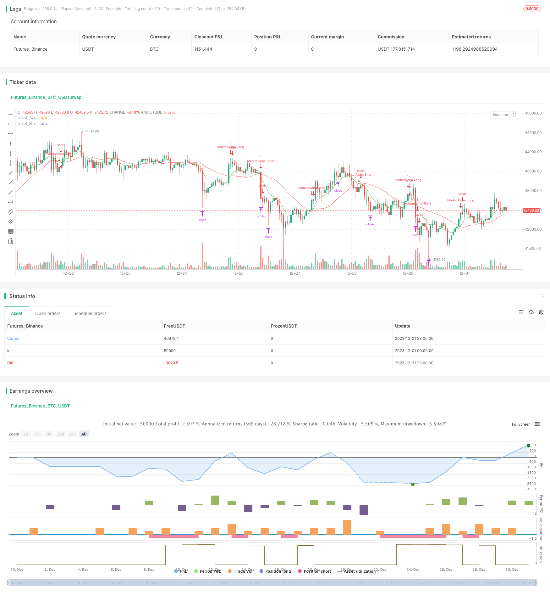

> Name

Moving-Average-Crossover-Trading-Strategy Based on Moving Average Golden Cross and Dead Cross Trading Strategy
> Author

ChaoZhang

> Strategy Description


 [trans]

## Overview
The Moving Average Golden Cross trading strategy generates buy and sell signals by calculating the intersection of the fast EMA (fastLength) and the slow EMA (slowLength). When the fast line crosses the slow line, a buy signal is generated; when the fast line crosses below the slow line, a sell signal is generated. This strategy is simple and practical, suitable for short- and medium-term transactions.
## Strategy Principle
This strategy uses two moving averages, fast and slow. The fast line parameter EMAfastLength defaults to the 9-day line, and the slow line parameter EMAslowLength defaults to the 26-day line. Calculate the intersection of two EMA lines to determine market buy and sell signals:
1. When the fast line breaks through the slow line from bottom to top, a buy signal enterLong() is generated
2. When the fast line falls below the slow line from top to bottom, a sell signal enterShort() is generated.
The specific trading signals and strategy rules are as follows:
1. When the fast line crosses the slow line, go long and enter; when the fast line crosses below the slow line, close the position and leave the market.
2. The take-profit for long positions is the Targetpercentage of the price (default 0.15%), which means closing the position when the increase reaches 15%.
3. The stop loss for long is the StopLosspercentage of the price (default 0.20%), and the stop loss will be closed when the decline reaches 20%. 
4. The same goes for short selling.
Therefore, this strategy is a strategy for trading when the two moving averages have a golden cross or a dead cross.
## Advantage Analysis
1. The strategy is simple and easy to understand.
2. The application of moving averages filters out certain market noise and makes trading signals more accurate.
3. The trading rules are clear and there is a clear stop-profit and stop-loss strategy.
4. Test parameters can be flexibly adjusted to adapt to different market conditions.
## Risk Analysis
1. The moving average itself has hysteresis and may miss short-term price changes, resulting in inaccurate buying and selling points.
2. Moving average parameters of different periods may produce false signals and cause losses.
3. Relying only on a few parameters, this strategy has high hyperparameter optimization requirements and needs to find the best parameter combination.
4. In some specific large-level trends, this strategy is prone to failure.
For risks, parameters that can be optimized include moving average cycles, trading varieties, take-profit and stop-loss ratios, etc. A large number of tests are required to reduce risks.
## Optimization direction
The moving average crossover idea of ​​this strategy is simple and practical, and can be optimized in the following ways:
1. Change the moving average type: In addition to EMA, you can also test SMA, LWMA, HMA and other line types.
2. Add other indicators to judge: combine the timing of divergence of RSI, MACD and other indicators to trade. 
3. Automatic optimization parameters: Automatically optimize and search the two period parameters of EMA to find the best parameter combination.
4. Trend filtering: Selectively conduct transactions based on large-level trends.
5. Optimization of take-profit and stop-loss strategies: Improve the fixed percentage take-profit and stop-loss method to make it more practical.
Through these optimization tests, the actual combat effectiveness and stability of the strategy can be greatly improved.
## Summarize
The moving average crossover strategy has a simple idea, but its practical application requires continuous optimization. This strategy gives its trading signal generation logic and basic trading rules. On this basis, it can be greatly optimized to make it a practical quantitative strategy. The application of moving averages also provides us with strategic ideas, on which we can innovate and improve.
||

## Overview

The moving average crossover trading strategy generates buy and sell signals by calculating the crossover of the fast EMA (fastLength) and slow EMA (slowLength) lines. When the fast line crosses above the slow line, a buy signal is generated. When the fast line crosses below the slow line, a sell signal is generated. This strategy is simple and practical, suitable for medium and short term trading.

## Strategy Principle 

The strategy uses two moving average lines, fast line and slow line. The fast line parameter EMAfastLength defaults to 9-day line, and the slow line parameter EMAslowLength defaults to 26-day line. Calculate the crossover of the two EMA lines to determine market buy and sell signals:

1. When the fast line breaks upward through the slow line, a buy signal enterLong() is generated.
2. When the fast line breaks downward through the slow line, a sell signal enterShort() is generated.

The specific trading signals and strategy rules are as follows:

1. When the fast line crosses above the slow line, go long; when the fast line crosses below the slow line, close position.
2. The take profit for long is Targetpercentage (default 0.15%) of the price, which is to close position when the profit reaches 15%.
3. The stop loss for long is StopLosspercentage (default 0.20%) of the price, which is to close position when the loss reaches 20%.
4. Short position works the same way.

So this strategy trades based on the golden cross and dead cross of the two moving average lines.

## Advantage Analysis

1. The strategy is simple and easy to understand. 
2. The application of moving average filters out some market noise and makes trading signals more precise.
3. Trading rules are clear with definite profit taking and stop loss.
4. Test parameters can be adjusted flexibly to adapt to different market conditions.

## Risk Analysis

1. Moving averages themselves have lagging, which may miss short-term price changes, leading to inaccurate buy and sell points.
2. Different cycle moving average parameters may generate false signals and bring losses.
3. Relying solely on a few parameters, this strategy has high hyperparameter optimization requirements to find the best parameter combination.
4. In some particular major trends, this strategy is prone to fail.

To address the risks, parameters that can be optimized include moving average cycle, trading variety, profit taking and stop loss ratio, etc. Extensive testing is required to reduce risks.

## Optimization Directions

The moving average crossover idea of this strategy is simple and practical. It can be optimized in the following ways:

1. Change moving average type: In addition to EMA, also test SMA, LWMA, HMA and other types. 
2. Add other indicators: Combine with RSI, MACD and other indicators.
3. Parameter optimization: Auto optimize the two cycle parameters of EMA to find the best parameter combination.
4. Trend filtering: Trade selectively based on major trend situations.
5. Profit taking and stop loss optimization: Improve the fixed percentage profit taking and stop loss to make it more practical.

Through these optimization tests, the strategy's practical effect and stability can be greatly improved.

## Summary 

The moving average crossover strategy idea is simple, but practical application requires continuous optimization. This strategy gives the logic of generating trading signals and basic trading rules. On this basis, it can be greatly optimized to become a usable quantitative strategy. The application of moving average also provides us with ideas for strategies, based on which we can innovate and improve.

[/trans]

> Strategy Arguments


|Argument|Default|Description|
|----|----|----|
|v_input_1|9|EMAfastLength|
|v_input_2|26|EMAslowLength|
|v_input_3|0.15|Profit Target in percentage|
|v_input_4|0.2|Stop Loss in percentage|
|v_input_5|true|From Month|
|v_input_6|true|From Day|
|v_input_7|2018|From Year|
|v_input_8|true|To Month|
|v_input_9|true|To Day|
|v_input_10|9999|To Year|


> Source (PineScript)

``` pinescript
/*backtest
start: 2023-12-01 00:00:00
end: 2023-12-31 23:59:59
period: 1h
basePeriod: 15m
exchanges: [{"eid":"Futures_Binance","currency":"BTC_USDT"}]
*/

//@version=4
strategy("EMA Cross by MarketAlpha", overlay=true)
EMAfastLength = input(defval = 9, minval = 2)
EMAslowLength = input(defval = 26, minval = 2)
Targetpercentage = input(defval = 0.15, title = "Profit Target in percentage", minval = 0.05)
StopLosspercentage = input(defval = 0.20, title = "Stop Loss in percentage", minval = 0.05)
profitpoints = close*Targetpercentage
stoplosspoints = close*StopLosspercentage
price = close

FromMonth = input(defval = 1, title = "From Month", minval = 1, maxval = 12)
FromDay   = input(defval = 1, title = "From Day", minval = 1, maxval = 31)
FromYear  = input(defval = 2018, title = "From Year", minval = 2000)
ToMonth   = input(defval = 1, title = "To Month", minval = 1, maxval = 12)
ToDay     = input(defval = 1, title = "To Day", minval = 1, maxval = 31)
ToYear    = input(defval = 9999, title = "To Year", minval = 2017)

start     = timestamp(FromYear, FromMonth, FromDay, 00, 00)  // backtest start window
finish    = timestamp(ToYear, ToMonth, ToDay, 23, 59)        // backtest finish window
window()  => true // create function "within window of time"

emafast = ema(price, EMAfastLength)
emaslow = sma(price, EMAslowLength)
plot(emafast,color=green)
plot(emaslow,color=red)

enterLong() => crossover(emafast, emaslow)
strategy.entry(id = "MarketAlpha Long", long = true, when = window() and enterLong())
strategy.exit("Exit Long", from_entry = "MarketAlpha Long", profit = profitpoints,loss = stoplosspoints)

enterShort() => crossunder(emafast, emaslow)
strategy.entry(id = "MarketAlpha Short", long = false, when = window() and enterShort())
strategy.exit("Exit Short", from_entry = "MarketAlpha Short", profit = profitpoints,loss = stoplosspoints)


```

> Detail

https://www.fmz.com/strategy/439844

> Last Modified

2024-01-24 11:48:29
