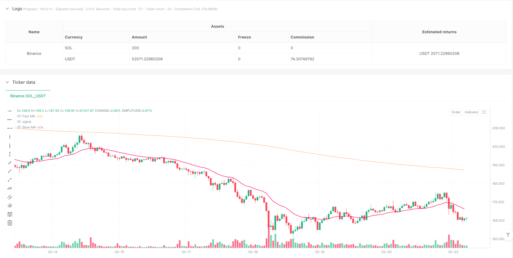
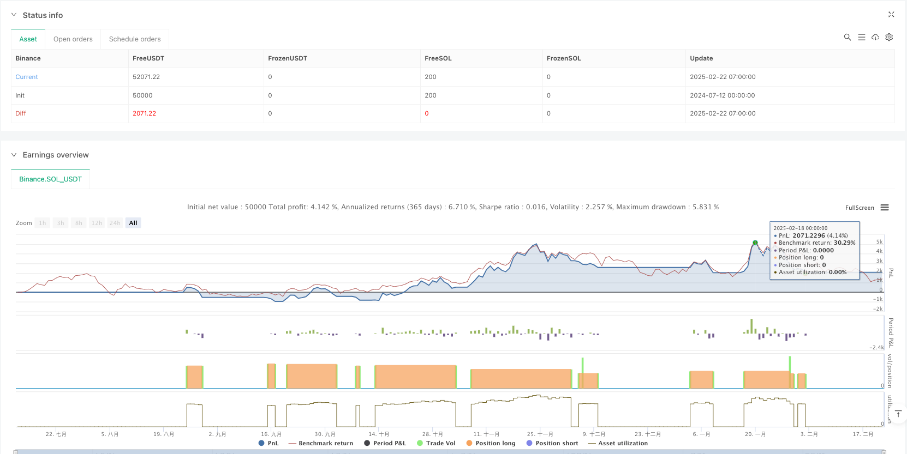

> Name

Moving Average Crossover Trend Following Strategy-Moving-Average-Crossover-Trend-Following-Strategy
> Author

ianzeng123

> Strategy Description





[trans]
#### Overview
This strategy is a trading system based on moving average crossover, supports two types of moving averages, EMA and SMA, and provides optimized preset parameters for multiple time periods such as 1 hour, 4 hours, daily, weekly and biweekly. The system generates trading signals through the intersection of fast and slow moving averages and provides a visual price range filling effect.
#### Strategy Principle
The core of the strategy is to identify potential trend changes by monitoring the crossover of fast and slow moving averages. When the fast moving average crosses the slow moving average upward, a long signal is generated; when the fast moving average crosses the slow moving average downward, a short signal is generated. The strategy provides three mode options: long only, short only and two-way trading. The optimal parameter combination obtained through optimization shows that the parameters and types of the best moving averages for different time periods are different.
#### Strategic Advantages
1. Parameter optimization science: By optimizing historical data, optimized parameter combinations are provided for different time periods.
2. Strong flexibility: supports custom parameter settings, and can adjust the length and type of moving average according to market conditions
3. Visually intuitive: distinguish long and short trends through color filling, and trading signals are clearly visible
4. Applicable to multiple periods: specially optimized parameter settings are provided for different time periods.
5. Complete information display: Current policy settings and parameters are displayed in real time through the information panel
#### Strategy Risk
1. Lagging risk: Moving averages are essentially lagging indicators and may cause delays when the market fluctuates rapidly.
2. Not applicable to volatile markets: In sideways volatile markets, frequent cross signals may lead to continuous losses.
3. Parameter dependency: Although optimization parameters are provided, they may need to be adjusted according to specific conditions in the actual market.
4. Changes in the market environment: Parameters optimized based on historical data may become invalid when the market environment changes in the future.
#### Strategy optimization direction
1. Add trend filter: You can add trend indicators such as ADX and execute trading signals only when there is a strong trend.
2. Introduce volatility adjustment: dynamically adjust moving average parameters according to market volatility
3. Optimize the stop loss mechanism: you can set a dynamic stop loss position in combination with ATR
4. Increase transaction volume confirmation: Add transaction volume analysis when the signal is generated to improve signal reliability
5. Develop adaptive parameters: Research and develop a parameter system that can automatically adjust according to market conditions.
#### Summary
This is a rigorously optimized moving average crossover strategy that works across multiple timeframes. The strategy provides traders with a reliable trend tracking tool through scientific parameter optimization and flexible configuration options. Although there are some inherent risks, the stability and reliability of the strategy can be further improved through the suggested optimization directions. The design concept of the strategy is to combine classic technical analysis methods with modern quantitative analysis tools to provide traders with a trading system that is both easy to use and rigorously verified. ||
#### Overview
This strategy is a trading system based on moving average crossovers, supporting both EMA and SMA types of moving averages and provides optimized preset parameters for multiple timeframes including 1-hour, 4-hour, daily, weekly, and bi-weekly. The system generates trading signals through the crossover of fast and slow moving averages and offers visualized price range filling effects.

#### Strategy Principle
The core of the strategy is to identify potential trend changes by monitoring crossovers between fast and slow moving averages. A long signal is generated when the fast moving average crosses above the slow moving average, while a short signal is generated when the fast moving average crosses below the slow moving average. The strategy offers three trading modes: long-only, short-only, and bi-directional trading. The optimal parameter combinations show that different timeframes require different moving average parameters and types.

#### Strategy Advantages
1. Scientific Parameter Optimization: Parameters optimized through historical data analysis for different timeframes
2. High Flexibility: Supports custom parameter settings, allowing adjustment of moving average lengths and types based on market conditions
3. Visual Intuitiveness: Clear trend visualization through color-filled areas distinguishing bullish and bearish trends
4. Multi-timeframe Applicability: Provides specially optimized parameters for different timeframes
5. Complete Information Display: Real-time display of current strategy settings and parameters through an information panel

#### Strategy Risks
1. Lag Risk: Moving averages are inherently lagging indicators, potentially causing delays in fast-moving markets
2. Ineffective in Ranging Markets: Frequent crossover signals in sideways markets may lead to consecutive losses
3. Parameter Dependency: Although optimized parameters are provided, adjustments may be needed based on specific market conditions
4. Market Environment Changes: Parameters optimized based on historical data may become ineffective when future market conditions change

#### Strategy Optimization Directions
1. Add Trend Filters: Incorporate trend indicators like ADX to execute trades only during strong trends
2. Introduce Volatility Adjustment: Dynamically adjust moving average parameters based on market volatility
3. Optimize Stop Loss Mechanism: Implement dynamic stop loss positions using ATR
4. Add Volume Confirmation: Incorporate volume analysis when generating signals to improve reliability
5. Develop Adaptive Parameters: Research and develop a parameter system that automatically adjusts based on market conditions

#### Summary
This is a rigorously optimized moving average crossover strategy applicable to multiple timeframes. Through scientific parameter optimization and flexible configuration options, the strategy provides traders with a reliable trend-following tool. While there are some inherent risks, the suggested optimization directions can further enhance the strategy's stability and reliability. The strategy's design philosophy combines classical technical analysis methods with modern quantitative analysis tools to provide traders with a trading system that is both simple to use and rigorously validated.[/trans]


> Source (PineScript)

``` pinescript
/*backtest
start: 2024-07-12 00:00:00
end: 2025-02-22 08:00:00
period: 1h
basePeriod: 1h
exchanges: [{"eid":"Binance","currency":"SOL_USDT"}]
*/

//@version=5
strategy("MA Crossover [ClémentCrypto]", overlay=true, default_qty_type=strategy.percent_of_equity, default_qty_value=20, initial_capital=10000,process_orders_on_close=true)

// Groupe pour le choix entre preset et personnalisé
usePreset = input.bool(title="Utiliser Preset", defval=true, group="Mode Selection")

// Inputs pour la stratégie
timeframeChoice = input.string(title="Timeframe Preset", defval="1H", options=["1H", "4H", "1D", "1W", "2W"], group="Preset Settings")
tradeDirection = input.string(title="Trading Direction", defval="Long Only", options=["Long Only", "Short Only", "Both Directions"], group="Strategy Settings")

// Paramètres personnalisés MA
customFastLength = input.int(title="Custom Fast MA Length", defval=23, minval=1, group="Custom MA Settings")
customSlowLength = input.int(title="Custom Slow MA Length", defval=395, minval=1, group="Custom MA Settings")
customMAType = input.string(title="Custom MA Type", defval="EMA", options=["SMA", "EMA"], group="Custom MA Settings")

// Paramètres MA optimisés pour chaque timeframe
var int fastLength = 0
var int slowLength = 0
var string maType = ""

if usePreset
    if timeframeChoice == "1H"
        fastLength := 23
        slowLength := 395
        maType := "EMA"
    else if timeframeChoice == "4H"
        fastLength := 41
        slowLength := 263
        maType := "SMA"
    else if timeframeChoice == "1D"
        fastLength := 8
        slowLength := 44
        maType := "SMA"
    else if timeframeChoice == "1W"
        fastLength := 32
        slowLength := 38
        maType := "SMA"
    else if timeframeChoice == "2W"
        fastLength := 17
        slowLength := 20
        maType := "SMA"
else
    fastLength := customFastLength
    slowLength := customSlowLength
    maType := customMAType

// Calcul des moyennes mobiles
fastMA = maType == "SMA" ? ta.sma(close, fastLength) : ta.ema(close, fastLength)
slowMA = maType == "SMA" ? ta.sma(close, slowLength) : ta.ema(close, slowLength)

// Conditions de trading simplifiées
longEntier = ta.crossover(fastMA, slowMA)
longExit = ta.crossunder(fastMA, slowMA)
shortEntier = ta.crossunder(fastMA, slowMA)
shortExit = ta.crossover(fastMA, slowMA)

// Définition des couleurs
var BULL_COLOR = color.new(#00ff9f, 20)
var BEAR_COLOR = color.new(#ff0062, 20)
var BULL_COLOR_LIGHT = color.new(#00ff9f, 90)
var BEAR_COLOR_LIGHT = color.new(#ff0062, 90)

// Couleurs des lignes MA
fastMAColor = fastMA > slowMA ? BULL_COLOR : BEAR_COLOR
slowMAColor = color.new(#FF6D00, 60)

// Gestion des positions
if tradeDirection == "Long Only"
    if (longEntier)
        strategy.entry("Long", strategy.long)
    if (longExit)
        strategy.close("Long")
        
else if tradeDirection == "Short Only"
    if (shortEntier)
        strategy.entry("Short", strategy.short)
    if (shortExit)
        strategy.close("Short")
        
else if tradeDirection == "Both Directions"
    if (longEntier)
        strategy.entry("Long", strategy.long)
    if (longExit)
        strategy.close("Long")
    if (shortEntier)
        strategy.entry("Short", strategy.short)
    if (shortExit)
        strategy.close("Short")

// Plots
var fastMAplot = plot(fastMA, "Fast MA", color=fastMAColor, linewidth=2)
var slowMAplot = plot(slowMA, "Slow MA", color=slowMAColor, linewidth=1)
fill(fastMAplot, slowMAplot, color=fastMA > slowMA ? BULL_COLOR_LIGHT : BEAR_COLOR_LIGHT)


// Barres colorées
barcolor(fastMA > slowMA ? color.new(BULL_COLOR, 90) : color.new(BEAR_COLOR, 90))
```

> Detail

https://www.fmz.com/strategy/483523

> Last Modified

2025-02-24 10:15:28
