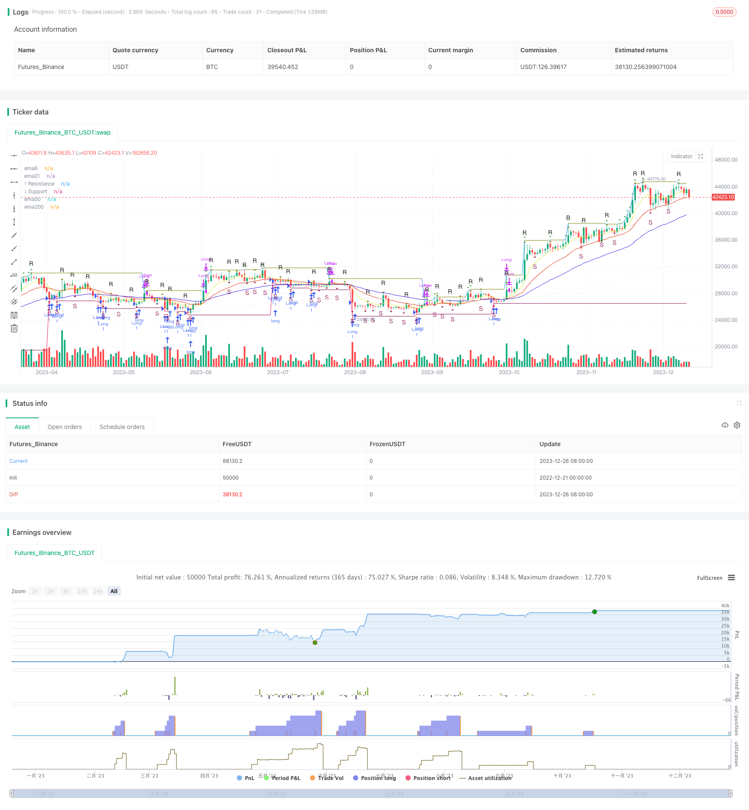

> Name

Moving-Average-Rebound-Strategy
> Author

ChaoZhang

> Strategy Description


[trans]

## Overview
The moving average rebound accumulation strategy is a strategy that combines technical indicators and price patterns at the same time to conduct long and short trading at support and resistance levels. This strategy uses moving average indicators to identify the direction of the market trend, uses morphological indicators based on price extremes to assist in determining reversal points, combines previous highs and lows to determine key support and resistance positions, and performs reverse operations at these levels, which is a typical reversal strategy.
## Strategy Principle
This strategy mainly judges the timing of operations through the following steps:
1. Use the three-moving average Alligator indicator to determine the trend direction. When the price line breaks through the Lip Lines of this indicator, it is considered that a strong breakthrough signal has occurred.
2. Use the Peak-Trough pattern indicator to identify when prices reverse in overbought and oversold areas. When it breaks through the extreme point of Peak-Trough in a certain direction, it is judged as a possible reversal signal.
3. Combine the support and resistance levels to determine the specific entry point for the reversal operation. Open a long or short position when the price is close to the previous support or resistance level.
4. Use the EMA moving average indicator to assist in determining the long-term trend direction. For example, in a volatile market, short-term operations are mainly based on gap reversal, while in trending markets, follow-the-trend operations are the main ones.
5. Use the trailing stop loss method to control single losses.
## Strategic Advantages
This strategy has several advantages:
1. Combine multiple indicator signals at the same time to improve the accuracy of judgment.
2. Using key support and resistance to reverse is a high-probability operation.
3. Using the trailing stop loss method can limit a single loss.
## Strategy Risk
This strategy also has the following risks:
1. Based on a combination of multiple indicators, the frequency of operations may be high, and transaction cost control needs to be paid attention to.
2. Failure at key levels is the biggest risk. If the price does not reverse near the expected support or resistance level, the loss may be relatively large.
3. When the market fluctuates violently, the trailing stop loss may be breached, causing losses to expand.
## Strategy optimization direction
This strategy can be optimized from the following aspects:
1. Optimize and adjust the weights of multiple indicators to find the best parameter combination.
2. Add machine learning algorithms to assist in determining the success rate of key bits.
3. Add trading volume indicators to avoid being trapped when prices fluctuate violently but trading volume is insufficient.
4. Optimize the trailing stop loss model to ensure the effectiveness of the stop loss while minimizing the probability of unnecessary stop loss.
## Summarize
To sum up, this moving average rebound accumulation strategy uses multiple indicators such as moving averages, price patterns, support and resistance levels to make judgments at the same time, and is a typical technical strategy. It has the advantages of high judgment accuracy and high probability operation, but it also needs to pay attention to the risk of key position failure and moving stop loss being breached. By continuously optimizing multi-index weights, applying machine learning and trading volume indicators, the effectiveness of the strategy can be improved to a certain extent.
||

##Overview
The Moving Average Rebound Strategy is a strategy that combines technical indicators and price patterns to trade long and short around support and resistance levels. The strategy uses moving averages to identify market trend direction, pattern indicators to assist in determining turning points, and previous swing highs/lows to spot key support and resistance levels for counter-trend trading.

## Strategy Principles 
The key steps for determining trade entries are:

1. Use the Alligator triple moving average indicator to judge trend direction. Crossing the Lip Lines signals strong momentum.  

2. Identify potential reversal zones with Peak-Trough pattern indicator when in overbought/oversold areas. Breaking specific highs/lows indicates possible reversal.

3. Combine with support/resistance to pinpoint counter-trend trade entry points around key levels.

4. Use EMAS to assist in determining overall long term trend. Use mean reversion in range-bound and trend following in trending markets.

5. Employ trailing stop loss to control single trade loss amount.

## Advantages
Advantages of the strategy:

1. Combining signals from multiple indicators improves accuracy. 

2. Trading counter-trend from key support/resistance areas has high probability.

3. Trailing stop loss containing losses on single trades.

## Risks
Risks involved:

1. More indicators can lead to higher trade frequency & needs transaction cost control.

2. Failed support/resistance levels are biggest risk. Price may not reverse as expected leading to large losses.

3. Stop loss can be taken out during huge volatile moves.

## Enhancement Areas
Areas for improvement:

1. Optimize weights between indicators to find best performance combination.

2. Employ machine learning for improving key support/resistance level accuracy. 

3. Add volume indicators to avoid trades when volatile but low volume environments.

4. Refine adaptive stop loss models to balance effectiveness and unnecessary stops.


## Summary 
In summary, the Moving Average Rebound Strategy utilizes a confluence of indicators including moving averages, price patterns and support/resistance for entries. A typical technical strategy with higher accuracy from multiple signals. Monitor risks around failure of key levels and stop loss slippage. Further optimization on indicator weights, machine learning and volume can enhance performance.

[/trans]

> Strategy Arguments


|Argument|Default|Description|
|----|----|----|
|v_input_1|5|? Lips Length|
|v_input_2|8|? Teeth Length|
|v_input_3|13|? Jaw Length|
|v_input_4|3|? Lips Offset|
|v_input_5|5|? Teeth Offset|
|v_input_6|8|? Jaw Offset|
|v_input_int_1|2|? Period|
|v_input_7|true|⤒⤓ Show Res-Sup|
|v_input_8|13|⤒⤓ Res-Sup Length|


> Source (PineScript)

``` pinescript
/*backtest
start: 2022-12-21 00:00:00
end: 2023-12-27 00:00:00
period: 1d
basePeriod: 1h
exchanges: [{"eid":"Futures_Binance","currency":"BTC_USDT"}]
*/

// This source code is subject to the terms of the Mozilla Public License 2.0 at https://mozilla.org/MPL/2.0/
// © vhurtadocos


//@version=5
strategy('Estrategia EMA Resistencia Soporte', shorttitle='Estrategia EMA RESISTENCIA Y SOPORTE', overlay=true, margin_long=100, margin_short=100, pyramiding = 10 )

//INICIO DE CONDICIONES BASICAS
/// Alligator
smma(src, length) =>
    smma = 0.0
    sma_1 = ta.sma(src, length)
    smma := na(smma[1]) ? sma_1 : (smma[1] * (length - 1) + src) / length
    smma
lipsLength = input(title='? Lips Length', defval=5)
teethLength = input(title='? Teeth Length', defval=8)
jawLength = input(title='? Jaw Length', defval=13)
lipsOffset = input(title='? Lips Offset', defval=3)
teethOffset = input(title='? Teeth Offset', defval=5)
jawOffset = input(title='? Jaw Offset', defval=8)
lips = smma(hl2, lipsLength)
teeth = smma(hl2, teethLength)
jaw = smma(hl2, jawLength)


// Fractals
n = input.int(title='? Period', defval=2, minval=2)
upFractal = high[n + 2] < high[n] and high[n + 1] < high[n] and high[n - 1] < high[n] and high[n - 2] < high[n] or high[n + 3] < high[n] and high[n + 2] < high[n] and high[n + 1] == high[n] and high[n - 1] < high[n] and high[n - 2] < high[n] or high[n + 4] < high[n] and high[n + 3] < high[n] and high[n + 2] == high[n] and high[n + 1] <= high[n] and high[n - 1] < high[n] and high[n - 2] < high[n] or high[n + 5] < high[n] and high[n + 4] < high[n] and high[n + 3] == high[n] and high[n + 2] == high[n] and high[n + 1] <= high[n] and high[n - 1] < high[n] and high[n - 2] < high[n] or high[n + 6] < high[n] and high[n + 5] < high[n] and high[n + 4] == high[n] and high[n + 3] <= high[n] and high[n + 2] == high[n] and high[n + 1] <= high[n] and high[n - 1] < high[n] and high[n - 2] < high[n]
dnFractal = low[n + 2] > low[n] and low[n + 1] > low[n] and low[n - 1] > low[n] and low[n - 2] > low[n] or low[n + 3] > low[n] and low[n + 2] > low[n] and low[n + 1] == low[n] and low[n - 1] > low[n] and low[n - 2] > low[n] or low[n + 4] > low[n] and low[n + 3] > low[n] and low[n + 2] == low[n] and low[n + 1] >= low[n] and low[n - 1] > low[n] and low[n - 2] > low[n] or low[n + 5] > low[n] and low[n + 4] > low[n] and low[n + 3] == low[n] and low[n + 2] == low[n] and low[n + 1] >= low[n] and low[n - 1] > low[n] and low[n - 2] > low[n] or low[n + 6] > low[n] and low[n + 5] > low[n] and low[n + 4] == low[n] and low[n + 3] >= low[n] and low[n + 2] == low[n] and low[n + 1] >= low[n] and low[n - 1] > low[n] and low[n - 2] > low[n]
plotshape(title='? Up-Fractal', series=upFractal, style=shape.triangleup, location=location.abovebar, offset=-2, color=color.new(color.olive, 0), text="R")
plotshape(title='? Down-Fractal', series=dnFractal, style=shape.triangledown, location=location.belowbar, offset=-2, color=color.new(color.maroon, 0), text="S", textcolor = color.new(color.maroon,0))

// Resistance, Support
showRS = input(title='⤒⤓ Show Res-Sup', defval=true)
lengthRS = input(title='⤒⤓ Res-Sup Length', defval=13)
highRS = ta.valuewhen(high >= ta.highest(high, lengthRS), high, 0)
lowRS = ta.valuewhen(low <= ta.lowest(low, lengthRS), low, 0)
plot(title='⤒ Resistance', series=showRS and highRS ? highRS : na, color=highRS != highRS[1] ? na : color.olive, linewidth=1, offset=0)
plot(title='⤓ Support', series=showRS and lowRS ? lowRS : na, color=lowRS != lowRS[1] ? na : color.maroon, linewidth=1, offset=0)


// EMA de 8 períodos
ema8 = ta.ema(close, 8)
plot(title='ema8', series=ema8, color=color.new(#dbef41, 0), offset=0)

// EMA de 21 períodos
ema21 = ta.ema(close, 21)
plot(title='ema21', series=ema21, color=color.new(#e12c0c, 0), offset=0)

// EMA de 50 períodos
ema50 = ta.ema(close, 50)
plot(title='ema50', series=ema50, color=color.new(#3419de, 0), offset=0)

// EMA de 200 períodos
ema200 = ta.ema(close, 200)
plot(title='ema200', series=ema200, color=color.new(#f6f6f4, 0), offset=0)


// Definiciones originales...
// ... (incluyendo tus definiciones de Alligator, Fractals, etc.)

// Guardamos el último soporte y resistencia
var float lastSupport = na
var float lastResistance = na

// Detectando un nuevo soporte y resistencia
newSupportDetected = low == lowRS


if newSupportDetected
    lastSupport := low

// Lógica de entrada y salida

// Condiciones de entrada basadas en soportes recién formados
longCondition = low == lowRS
if longCondition
    strategy.entry("Long", strategy.long)

// Salida (take profit) cuando detectamos una nueva resistencia después de entrar en una posición long
newResistanceDetected = high == highRS
if newResistanceDetected and strategy.position_size > 0
    strategy.close("Long")

// Agregar una condición para el stop loss
longStopLossPrice = close * 0.95
if strategy.position_size > 0 and close <= longStopLossPrice
    strategy.close("Long")

// Pintamos los soportes y resistencias
plotshape(longCondition, style=shape.triangledown, location=location.belowbar, color=color.red)
plotshape(newResistanceDetected, style=shape.triangleup, location=location.abovebar, color=color.green)

// Resto del código para plotear las EMAs y fractales
// ...


```

> Detail

https://www.fmz.com/strategy/436877

> Last Modified

2023-12-28 15:25:29
