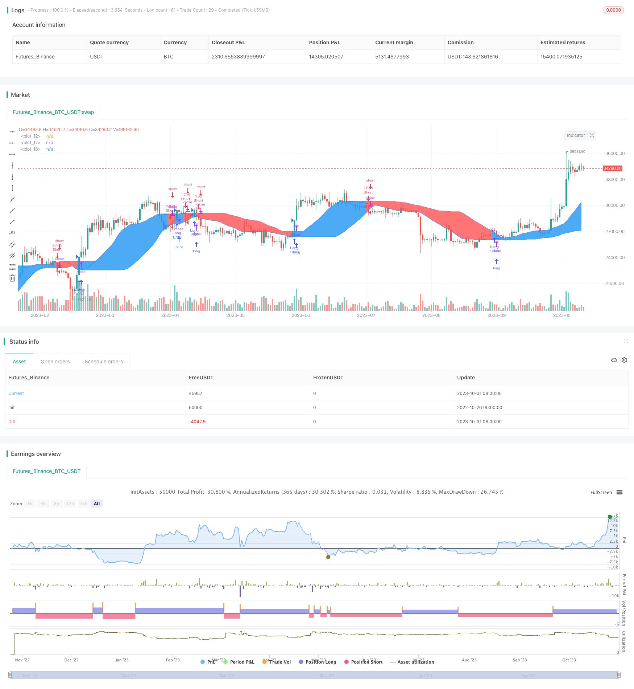

> Name

Moving-Average-Ribbon-Trend-Strategy
> Author

ChaoZhang

> Strategy Description



[trans]

## Overview
Moving Average Ribbon Trend Strategy is a trend following strategy based on moving averages. It uses a single moving average to construct a price channel, and determines the direction of the trend and conducts transactions based on the position of the price relative to the channel. This strategy is suitable for markets with obvious trends and can capture long-term price trends.
## Strategy Principle
This strategy calculates a simple moving average of a specified period length (default is 20 periods) and constructs a price channel from its value. The upper and lower rails of the channel are the highest and lowest values ​​of the moving average respectively. If the closing price is higher than the upper track, it is determined to be an upward trend; if the closing price is lower than the lower track, it is determined to be a downward trend.
This strategy will conduct trading operations when it is judged that the trend has changed. If the price changes from falling to rising, a long position will be opened; if the price changes from rising to short, a short position will be opened. The original long position is closed when it is converted into a short position; the original short position is closed when it is converted into a long position.
Specifically, the trading logic of the strategy is:
- If the closing price is greater than the upper track of the previous period, open a long position
- If the closing price is less than the lower track of the previous period, open a short position
- The original long position is closed when the closing price is below the lower track
- The original short position is closed when the closing price is higher than the upper track
This strategy uses a single moving average to construct a price channel, and determines the trend direction by judging the price breakthrough channel. It is simple, intuitive, easy to implement, and suitable as a trend following strategy.
## Advantage Analysis
The moving average trend strategy has the following advantages:
- The strategy logic is simple, easy to understand and implement, and reduces the difficulty of implementation.
- Use a single moving average, simple parameter adjustment, and avoid over-optimization
- Use price channels to determine trend transitions and clearly identify trend turning points
- Configurable channel width, adjust the sensitivity of the strategy
- Use the method of breaking through the moving average to open a position, which can filter out some false breakthroughs
- Positions continue to accumulate in the direction of the trend, which can fully capture the trend market
- Positions are adjusted according to moving averages to proactively control risks
In summary, the moving average trend strategy is based on simple logic and uses price channels to capture trend transitions. It can effectively track longer-term price trends and is suitable for use as a trend following strategy.
## Risk Analysis
There are also certain risks in the moving average trend strategy, which mainly include:
- The average generation lags behind, and the best time point for trend conversion may be missed.
- Many false breakthroughs occurred in the volatile market, resulting in unnecessary losses.
- Long-term trend trading, the retracement may be large, and sufficient financial support is required
- A single parameter setting is easy to be optimized, and the actual effect may be weaker than backtesting
- Unable to distinguish between different bands in the market and may be insensitive to changes in shorter cycles
This can be optimized through the following methods:
- Adjust the moving average period to reduce the lag
- Add filter conditions to avoid being trapped in volatile markets
- Optimize position management and control single losses
- Real-time parameter adjustment to confirm parameter settings
- Add multiple moving average judgments to identify trends at different levels
## Optimization direction
The moving average trend strategy can also be optimized from the following aspects:
- **Optimized Moving Average Indicator**: You can try different types of moving averages, such as weighted moving averages, etc., to see if they can improve performance.
- **Add filter conditions**: You can add other filter conditions before opening a position, such as trading volume, volatility, etc., to avoid being trapped during the shock period.
- **Multiple time frames**: Use moving averages of different periods to identify trend changes in more time scales.
- **Dynamic adjustment parameters**: Allow the moving average period and channel width to be dynamically adjusted according to market conditions to improve the adaptability of the strategy.
- **Position Optimization**: Adjust the position size according to market conditions to avoid excessive losses. Profit targets can be set to proactively reduce positions.
- **Machine Learning Optimization**: Use machine learning algorithms to automatically optimize the parameters of the strategy and find better combinations.
- **Integrate other strategies**: Integrate with similar trend tracking strategies to achieve strategy combination and improve stability.
In summary, the moving average trend strategy can be comprehensively optimized from the aspects of moving average indicators, filter conditions, time frames, dynamic parameter adjustment, position management, etc., making the strategy more robust, flexible, and adaptable to more market environments.
## Summarize
The moving average trend strategy is a simpler trend following strategy. It uses a single moving average to build a price channel and determines the trend direction through the price breakthrough channel to capture the mid- and long-term trends. This strategy has the advantages of simple logic, few parameters, and easy implementation, and can be used as an introductory strategy for trend tracking. However, this strategy also has risks such as lagging in identifying trends and being easily trapped. By further optimizing moving average indicators, adding filtering mechanisms, dynamic parameter adjustment, etc., better real-time results can be obtained. Generally speaking, the moving average trend strategy provides us with an idea to judge the trend based on the price channel, and is one of the more intuitive trend following strategies.
||
## Overview

The Moving Average Ribbon Trend Strategy is a trend-following strategy based on moving averages. It uses a single moving average to construct a price channel and determines the trend direction based on the price relative to the channel, then places trades accordingly. This strategy works well in trending markets and is able to capture longer-term price trends. 

## Strategy Logic

The strategy calculates a simple moving average with a specified period length (default 20 periods) and builds a price channel using the MA values. The upper and lower bands of the channel are the highest and lowest values of the MA respectively. If the closing price is above the upper band, an uptrend is determined. If the closing price is below the lower band, a downtrend is identified.

When a trend change is detected, the strategy will place trades. If the trend changes from down to up, a long position will be opened. If the trend changes from up to down, a short position will be opened. Existing long positions will be closed if the trend turns down, and existing short positions will be closed if the trend turns up.

Specifically, the trading logic is:

- Open long if closing price > previous upper band 
- Open short if closing price < previous lower band
- Close long if closing price < lower band
- Close short if closing price > upper band

The strategy uses a single MA to construct the price channel and identify trend changes by price breakouts. It is simple, intuitive and easy to implement, suitable as a trend following strategy.

## Advantage Analysis 

The Moving Average Ribbon Trend Strategy has the following advantages:

- Simple logic, easy to understand and implement, lowers execution difficulty
- Uses single MA, fewer parameters, avoids overfitting  
- Price channel clearly identifies trend turning points
- Customizable channel width to adjust sensitivity 
- MA breakout filters some false breakouts
- Position size accumulates along the trend, captures trend moves
- Position adjusted by MA, actively controls risk

In summary, the strategy is based on simple logic, uses the price channel to identify trend changes, and can effectively follow longer-term price trends. It is suitable as a trend following strategy.

## Risk Analysis

The strategy also has some risks:

- MA lag may miss best entry timing for trend change
- Whipsaws may cause unnecessary losses in ranging markets
- Long term trend trading can face larger drawdowns, requires adequate capital
- Single parameter may cause overfitting, underperform in live trading 
- Unable to distinguish cycles, may be insensitive to shorter fluctuations

The risks can be addressed by:

- Adjust MA period to reduce lag
- Add filters to avoid whipsaws in ranging markets
- Optimize position sizing to limit losses
- Parameter tuning with live data
- Add multiple MAs to identify trends on different levels

## Enhancement Opportunities

The strategy can be enhanced in the following aspects:

- **Optimize MA indicator**: Test different MAs like WMA to improve performance.

- **Add filters**: Add filters like volume, volatility before entry to avoid whipsaws. 

- **Multiple timeframes**: Use MAs on different timeframes to identify more trends.

- **Dynamic parameters**: Allow dynamic adjustment of MA period and channel width based on market conditions.

- **Position sizing**: Adjust position size based on market conditions to limit losses. Can set profit targets to reduce size.

- **Machine learning**: Use ML to find optimal parameter combinations.

- **Ensemble methods**: Combine with other trend following strategies for more robustness.

In summary, the strategy can be enhanced comprehensively in terms of indicator selection, filters, timeframes, dynamic parameters, position sizing etc. This will make the strategy more robust and flexible across different market environments.

## Conclusion

The Moving Average Ribbon Trend Strategy is a simple trend following strategy. It uses a single MA to build a price channel and identifies trend direction by channel breakouts, aiming to capture medium- to long-term trends. The strategy has advantages like simple logic, few parameters, and ease of implementation. But it also has risks like lagging in trend identification and being whipsawed. Further enhancements can be made through optimizing MA, adding filters, dynamic parameters etc. to improve live performance. Overall, the strategy provides an intuitive approach to using price channels for trend identification and serves as a basic trend following strategy.

[/trans]

> Strategy Arguments


|Argument|Default|Description|
|----|----|----|
|v_input_1|20|MA Length|
|v_input_2_ohlc4|0|MA Source: ohlc4|high|low|open|hl2|hlc3|hlcc4|close|


> Source (PineScript)

``` pinescript
/*backtest
start: 2022-10-26 00:00:00
end: 2023-11-01 00:00:00
period: 1d
basePeriod: 1h
exchanges: [{"eid":"Futures_Binance","currency":"BTC_USDT"}]
*/

// This source code is subject to the terms of the Mozilla Public License 2.0 at https://mozilla.org/MPL/2.0/
// © noro

//@version=4
strategy(title = "Noro's Trend Ribbon Strategy", shorttitle = "Trend Ribbon str", overlay = true, default_qty_type = strategy.percent_of_equity, default_qty_value = 100, pyramiding = 0, commission_value = 0.1)

len = input(20, minval = 5, title = "MA Length")
src = input(ohlc4, title = "MA Source")

//MA
ma = sma(src, len)
plot(ma, color = color.black)

//Channel
h = highest(ma, len)
l = lowest(ma, len)
ph = plot(h)
pl = plot(l)

//Trend
trend = 0
trend := close > h[1] ? 1 : close < l[1] ? -1 : trend[1]

//BG
col = trend == 1 ? color.blue : color.red
fill(ph, pl, color = col, transp = 50)

//Trading
if close > h[1]
    strategy.entry("Long", strategy.long)
if close < l[1]
    strategy.entry("Short", strategy.short)
```

> Detail

https://www.fmz.com/strategy/430859

> Last Modified

2023-11-02 15:22:17
