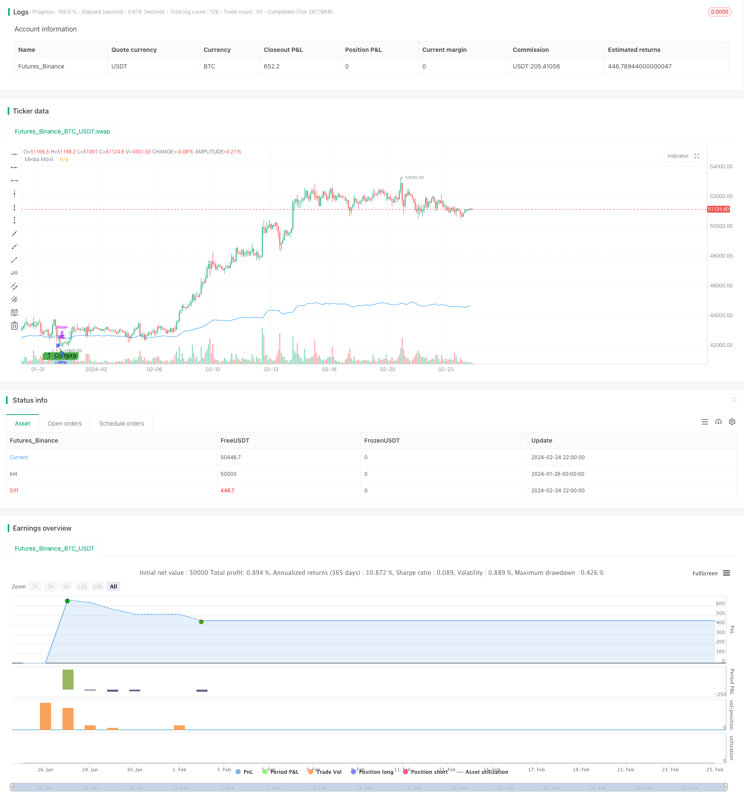

> Name

Moving Average Trading Strategy Moving-Average-Trading-Strategy
> Author

ChaoZhang

> Strategy Description


[trans]
## Overview
This strategy is a trend following trading strategy based on moving averages. It uses the 14-day simple moving average to determine the direction of the market trend, and makes buys or sells when the price is close to the moving average.
## Strategy Principle
The core logic of this strategy is:
1. Calculate the 14-day simple moving average (SMA)
2. When the closing price is lower than 99% of the moving average, it is considered to be oversold and a buy signal is generated.
3. Set stop loss and take profit prices after entering the market
4. The stop loss price is 10 points below the entry price.
5. The take-profit price is 60 points higher than the entry price
This strategy is a trend following strategy. It uses moving averages to determine the overall market trend, intervenes during oversold periods, and follows the general trend to run stop losses and take profits.
## Advantage Analysis
This strategy has the following main advantages:
1. The strategy logic is simple and clear, easy to understand and implement
2. Using moving averages to judge market trends can filter out some noise.
3. Only intervene during the oversold stage to avoid the risk of a sharp decline.
4. Set stop loss and take profit reasonably to avoid losses from expanding.
5. Drawbacks and losses can be controlled within a certain range
## Risk Analysis
There are also some risks with this strategy:
1. There is a lag in the moving average, and short-term trading opportunities may be missed.
2. If the stop loss setting is too aggressive, it may be eliminated instantly.
3. There is a sharp gap in the market or a direction reversal caused by major news
4. Interference from robot arbitrage or high-frequency trading
Some risks can be avoided by appropriately relaxing entry conditions and adjusting stop loss positions.
## Optimization direction
This strategy can also be optimized from the following aspects:
1. Optimize the parameters of the moving average to adapt to more market environments
2. Add moving averages of multiple time periods to make combined judgments
3. Use different stop-loss and take-profit ratios during specific time periods
4. Use volatility indicators to filter entry opportunities
5. Add algorithms such as machine learning to determine trends and key points
## Summarize
Overall this strategy is a simple and practical trend following strategy. It uses moving averages to determine the trend direction, intervenes at oversold points, and sets reasonable stop loss and profit, which can effectively control risks. Through certain optimization and combination, it can adapt to more market conditions and further improve the stability and profitability of the strategy.
||

## Overview   

This is a trend-following trading strategy based on moving average lines. It uses a 14-day simple moving average (SMA) to determine market trend direction and enter trades when price approaches the moving average line.  

## Strategy Logic   

The core logic of this strategy is:

1. Calculate the 14-day simple moving average (SMA) 
2. When close price is below 99% of moving average, market is considered oversold, generating buy signals
3. After entering, set stop loss and take profit price  
4. Stop loss price is set at 10 pips below entry price
5. Take profit price is set at 60 pips above entry price
  
This is a trend-following strategy. It identifies overall market trend using the moving average line and enters oversold stages along the major trend. Stop loss and take profit are used to exit trades.   

## Advantage Analysis

The main advantages of this strategy are:

1. Simple and clear strategy logic, easy to understand and implement  
2. Moving average filters out some noise and determines market trend 
3. Only taking oversold setups avoids large drawdowns
4. Reasonable stop loss and take profit controls risk 
5. Drawdown and loss can be limited to reasonable range

## Risk Analysis   

There are also some risks associated with this strategy:

1. Moving average has lagging effect, possibly missing short-term opportunities  
2. Stop loss may be too aggressive leading to premature exit  
3. Significant price gaps or trend reversals on major news events  
4. Interference from algorithmic and high-frequency trades  

Some methods to mitigate risks include allowing wider entry range, adjusting stop loss position etc.

## Optimization Directions

Some ways to optimize this strategy:

1. Optimize moving average parameters for more market regimes 
2. Add multiple time frame moving averages for combo assessment
3. Use dynamic stop loss/take profit ratios for certain sessions   
4. Utilize volatility metrics to time entries
5. Incorporate machine learning for enhanced trend and key points prediction  

## Conclusion  

In summary, this is a simple and practical trend-following strategy. It identifies trend direction using moving average, enters oversold stages, and sets reasonable stop loss and take profit to control risk. With proper enhancements and combinations, it can be adapted to more market conditions and further improve stability and profitability.

[/trans]


> Source (PineScript)

``` pinescript
/*backtest
start: 2024-01-26 00:00:00
end: 2024-02-25 00:00:00
period: 2h
basePeriod: 15m
exchanges: [{"eid":"Futures_Binance","currency":"BTC_USDT"}]
*/

//@version=5
strategy("Estrategia MA - mejor", overlay=true)

// Parámetros de la estrategia
initialCapital = 1000  // Inversión inicial
riskPerTrade = 0.02  // Riesgo por operación (2% del capital por operación)
lengthMA = 14  // Período de la media móvil
pipValue = 20 / 10  // Valor de un pip (30 euros / 10 pips)

// Apalancamiento
leverage = 10

// Cálculo de la media móvil en el marco temporal de 30 minutos
ma = request.security(syminfo.tickerid, "30", ta.sma(close, lengthMA))

// Condiciones de Entrada en Sobreventa
entryCondition = close < ma * 0.99  // Ejemplo: 1% por debajo de la MA

// Lógica de entrada y salida
if entryCondition
    riskAmount = initialCapital * riskPerTrade  // Cantidad de euros a arriesgar por operación
    size = 1  // Tamaño de la posición con apalancamiento
    strategy.entry("Long", strategy.long, qty=size)
    stopLossPrice = close - (10 * pipValue / size)
    takeProfitPrice = close + (60 * pipValue / size)
    strategy.exit("Exit Long", "Long", stop=stopLossPrice, limit=takeProfitPrice)

// Gráficos
plot(ma, color=color.blue, title="Media Móvil")
plotshape(series=entryCondition, title="Entrada en Sobreventa", location=location.belowbar, color=color.green, style=shape.labelup, text="↑ Compra")

```

> Detail

https://www.fmz.com/strategy/442820

> Last Modified

2024-02-26 11:36:37
