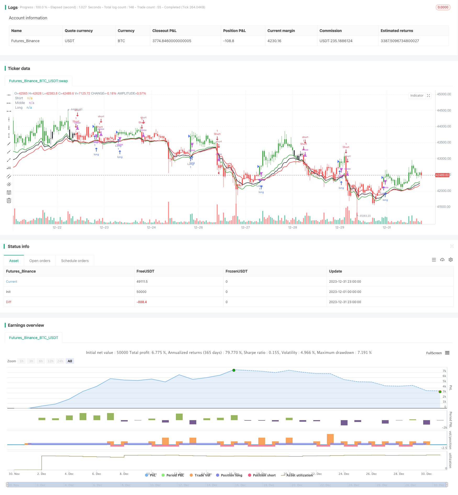

> Name

Trend-Tracking Moving Average Indicator Strategy Moving-Average-Trend-Tracking-Strategy
> Author

ChaoZhang

> Strategy Description


 [trans]
### Overview
This strategy is a quantitative trading strategy based on trend indicators. It mainly uses three moving averages of different periods, combined with the ATR indicator, to track market trends and assist in determining the timing of entry and exit.
### Strategy Principles
This strategy uses three moving averages: 9-day (short-term), 15-day (medium-term), and 24-day (long-term). Among them, the 9-day line and the 15-day line are used to judge the trend direction and market entry time, and the 24-day line is used to judge the take profit and stop loss. At the same time, this strategy also combines the ATR indicator to dynamically adjust the moving average to better adapt to market fluctuations.
Specifically, when the short-term moving average crosses the medium-term moving average and the closing price is greater than the short-term moving average, it indicates that the market has begun to enter a trend, and a long position can be established at this time. When the short-term moving average crosses below the long-term moving average, or the closing price is lower than the long-term moving average, it indicates a trend reversal, and you should close your position with a stop loss or establish a short position.
Additionally, this strategy uses bar chart colors to visually display trend direction. When the short-term line is greater than the mid-term line, it is green, and when it is less than the long-term line, it is red.
### Strategic Advantages
1. Using a combination of three moving averages with different periods can more accurately determine the trend direction.
2. Applying the ATR indicator to dynamically adjust the moving average can better track the volatile market.
3. Set up long-term and short-term stop-profit and stop-loss mechanisms to effectively control risks
4. The visual effect of the histogram color forms an effective morphological signal and the operation is clearer
### Strategy Risk and Optimization
1. In a sideways market, it is easy to generate false signals
2. Improper parameter settings (such as cycle parameters) may lead to frequent transactions or loss of good entry opportunities.
3. Consider combining other indicators to filter entry signals, such as trading volume, MACD, etc.
4. Can test different parameter combinations to find optimal parameters
### Summarize
Overall, this strategy is a relatively robust trend following strategy. It can effectively capture medium and long-term trends, while setting a stop-loss and stop-profit mechanism to control risks. However, this strategy is sensitive to parameters and market conditions and needs to be further optimized to adapt to more market environments.
||

### Overview

This is a trend-based quantitative trading strategy. It mainly uses three moving average lines with different periods, combined with the ATR indicator, to track market trends and assist in determining entry and exit timing.  

### Principle  

The strategy uses three moving average lines of 9 days (short-term), 15 days (medium-term), and 24 days (long-term). Among them, the 9-day and 15-day lines are used to determine the trend direction and entry timing, while the 24-day line is used to determine profit-taking and stop-loss. At the same time, the strategy also incorporates the ATR indicator to dynamically adjust the moving average lines to better adapt to market fluctuations.   

Specifically, when the short-term moving average line crosses above the medium-term moving average line, and the closing price is greater than the short-term moving average line, it indicates that the trend is starting to emerge, and long positions can be established at this point. When the short-term moving average line crosses below the long-term moving average line, or the closing price is below the long-term moving average line, it signifies a trend reversal, so existing positions should be closed for stop loss or short positions can be initiated.   

In addition, the strategy also uses the bar color to intuitively display the trend direction. The bars are colored green when the short-term line is above the medium-term line, and red when below the long-term line.   

### Advantages

1. Using a combination of three moving average lines with different periods can judge the trend direction more accurately  
2. Applying ATR-based dynamic adjustment of moving average lines adapts better to volatile markets
3. Setting long and short stop-loss/profit-taking mechanisms effectively manages risks  
4. Visual effects of the bar colors form effective pattern signals, making trading actions clearer
   
### Risks and Optimization

1. Prone to generating false signals in range-bound markets  
2. Improper parameter settings (e.g. period parameters) may lead to over-trading or missing good entry opportunities  
3. Consider incorporating other filters for entry signals, such as volume, MACD etc.  
4. Different parameter combinations can be tested to find the optimal parameters  
   
### Conclusion  

Overall this is a relatively robust trend-following strategy. It can effectively capture medium to long term trends, while setting stop loss/profit taking mechanisms to control risks. But the strategy is sensitive to parameters and market conditions, requiring further optimization to adapt to more market environments.  

[/trans]

> Strategy Arguments


|Argument|Default|Description|
|----|----|----|
|v_input_1|9|ShortTerm Period|
|v_input_2|15|MidTerm Period|
|v_input_3|24|LongTerm Period|
|v_input_4|5|Invesment Term|
|v_input_5|5|ATR Period|
|v_input_6|true|Barcolor|


> Source (PineScript)

``` pinescript
/*backtest
start: 2023-12-01 00:00:00
end: 2023-12-31 23:59:59
period: 1h
basePeriod: 15m
exchanges: [{"eid":"Futures_Binance","currency":"BTC_USDT"}]
*/

// This source code is subject to the terms of the Mozilla Public License 2.0 at https://mozilla.org/MPL/2.0/
// © ceyhun

//@version=4
strategy("Chaloke System Strategy",overlay=true)

P1=input(9,title="ShortTerm Period")
P2=input(15,title="MidTerm Period")
P3=input(24,title="LongTerm Period")
P4=input(5,title="Invesment Term")
P5=input(5,title="ATR Period")
Barcolor=input(true,title="Barcolor")

Sm=2*P5/10
ATRX=Sm*atr(P4)
S=ema(close,P1)-ATRX
M=ema(close,P2)-ATRX
Lg=ema(close,P3)-ATRX

Sht=iff(close==highest(close,3),S,ema(close[1],P1)-ATRX)
Mid=iff(close==highest(close,3),M,ema(close[1],P2)-ATRX)
Lng=iff(close==highest(close,3),Lg,ema(close[1],P3)-ATRX)

colors=iff(Sht>Mid and close > Sht ,color.green,iff(close < Lng or Sht<Lng,color.red,color.black))

plot(Sht,"Short",color=color.green,linewidth=2)
plot(Mid,"Middle",color=color.black,linewidth=2)
plot(Lng,"Long",color=color.red,linewidth=2)

barcolor(Barcolor ? colors :na)
   
long =  crossover(Sht,Mid) and close > Sht
short = crossunder(Sht,Lng) or close < Lng

if long
    strategy.entry("Long", strategy.long, comment="Long")
    
if short
    strategy.entry("Short", strategy.short, comment="Short")

alertcondition(long, title='Long', message='Chaloke System Alert Long')
alertcondition(short, title='Short', message='Chaloke System Alert Short')
```

> Detail

https://www.fmz.com/strategy/440320

> Last Modified

2024-01-29 11:46:15
