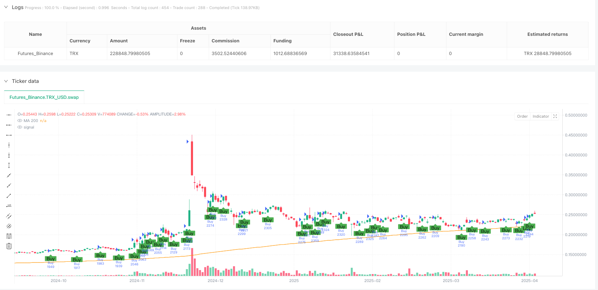
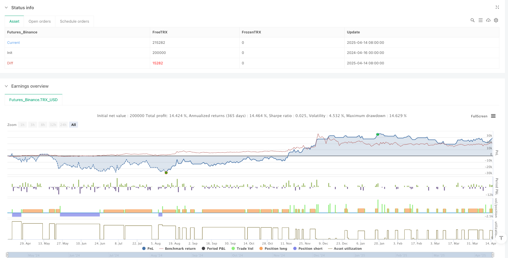

> Name

Moving-Average-and-Momentum-Candle-Trend-Following-System
> Author

ianzeng123

> Strategy Description





[trans]
#### Overview
This strategy is a trend following trading system that combines the 200-period moving average (MA200) and momentum candle pattern analysis. It primarily looks for trading opportunities by identifying price positions relative to long-term trends and momentum changes on candlestick charts. This strategy is suitable for time periods of 4 hours and above, and has a built-in mechanism to prevent repeated entries, ensuring that positions will not be opened repeatedly when there are already open positions, effectively controlling position risks. At the same time, the strategy also provides optional stop-loss and take-profit functions to help traders better manage the risk-reward ratio of each transaction.
#### Strategy Principle
The core principles of this strategy are based on two key factors: judgment of price position relative to the long-term trend and momentum analysis of candle volume.
First, the strategy uses the 200-period simple moving average (SMA) as a reference indicator of the long-term trend. When the price is above the MA200, it is considered to be in an uptrend; when the price is below the MA200, it is considered to be in a downtrend.
Secondly, the strategy introduces the concept of momentum candles, which is to judge market momentum by comparing the physical size of the current candle with the previous candle. When the real body of the current candle is larger than the real body of the previous candle, it is considered to have stronger momentum.
The specific entry signal generation logic is as follows:
- Buy signal: when the closing price is above MA200 (uptrend) and the current is a bullish momentum candle (the closing price is higher than the opening price and the current candle body is larger than the previous candle body)
- Sell signal: when the closing price is below MA200 (downtrend) and there is a bearish momentum candle (the closing price is lower than the opening price and the current candle body is larger than the previous candle body)
The strategy also contains an important risk control mechanism: new entry signals will only be executed when there are no open positions, effectively avoiding excessive risk exposure caused by repeated openings.
Stop loss and take profit settings can be customized through parameters, defaulting to 50 pips and 100 pips respectively, helping traders limit losses when the market moves in the opposite direction and lock in profits when the price moves in the expected direction.
#### Strategic Advantages
Through in-depth analysis of the code implementation of this strategy, the following obvious advantages can be summarized:
1. **Trend confirmation combined with momentum:** The strategy combines the long-term trend indicator (MA200) and the short-term momentum indicator (candle volume comparison), effectively filtering out low-quality signals and only entering the market when the trend direction is clear and there is sufficient momentum.
2. **Anti-repeated entry mechanism:** By checking whether there are currently open positions (strategy.opentrades == 0), the strategy avoids continuing to add more money when there are already positions, effectively controlling financial risks.
3. **Flexible risk management:** Users can set stop-loss and take-profit points according to their own risk preferences, or they can completely turn off the stop-loss and take-profit functions to adapt to different trading styles.
4. **Visual Signal Tips:** The strategy provides visual buy and sell signal marks, allowing traders to intuitively identify entry points, improving the usability of the strategy.
5. **Parameter adjustability:** Key parameters such as MA cycle and stop-loss and take-profit points can be customized by users, which enhances the adaptability of the strategy.
6. **Focus on high-quality signals:** By requiring the current candle body to be larger than the previous candle body, the strategy focuses on capturing market moves with accelerating momentum, improving signal quality.
#### Strategy Risk
Although this strategy is well designed, there are still the following potential risks:
1. **Moving average hysteresis:** As a long-term trend indicator, the 200-period moving average has obvious hysteresis, which may cause erroneous signals consistent with the old trend to be generated in the early stage of trend reversal. The solution is to consider introducing short-term moving averages as auxiliary confirmation indicators.
2. **Fixed stop loss risk:** The strategy uses fixed points as the stop loss setting and does not take into account changes in market volatility, which may lead to premature stop loss during periods of high volatility. The direction of improvement is to consider using dynamic indicators such as ATR (Average True Range) to adjust the stop loss level.
3. **Single Entry Condition:** Although the strategy combines trend and momentum, the entry condition is relatively simple and may generate too many false signals in certain market environments. It is recommended to add additional filtering conditions, such as volume confirmation or auxiliary signals from other technical indicators.
4. **Lack of market environment identification:** The strategy does not distinguish between different market environments (such as oscillating markets and trending markets) and may perform poorly in consolidation markets. You can consider adding market environment judgment logic, adjusting strategy parameters or suspending transactions under different environments.
5. **Imperfect fund management:** Although the strategy sets a fixed position ratio (10% of equity), it does not adjust the position size based on the winning rate or risk of different transactions. It is recommended to implement more complex money management algorithms such as Kelly formula or fixed risk model.
#### Strategy optimization direction
Based on the above analysis, this strategy can be optimized from the following directions:
1. **Introducing multi-period analysis:** The current strategy only operates on a single time period. You can consider adding a multi-period confirmation mechanism, such as opening a position only when the daily and 4-hour period trends are consistent, to improve signal quality.
2. **Dynamic stop loss mechanism:** Change the fixed point stop loss to a dynamic stop loss based on ATR to better adapt to changes in market volatility. For example, you can set the stop loss to 2 times ATR, narrow the stop loss range during low volatility periods, and expand the stop loss range during high volatility periods.
3. **Add signal filter:** Introduce additional technical indicators as confirmation, such as RSI overbought and oversold, MACD histogram direction, trading volume confirmation, etc., to reduce the probability of false signals.
4. **Add trailing stop function:** Implement the trailing stop function, automatically adjust the stop loss position when the price moves in a favorable direction, lock in some profits while giving the price enough breathing space.
5. **Optimize fund management:** Implement fund management based on the risk of each transaction, such as a fixed risk model (the risk of each transaction is fixed at 1% of the account funds), or dynamically adjust the position size based on signal strength.
6. **Add market status judgment:** Develop a market environment identification module, which may suspend trading or adjust to more conservative parameter settings in a volatile market.
7. **Enhanced momentum judgment logic:** The current momentum judgment is only based on a simple comparison of the size of candle entities. You can consider introducing a more complex momentum model, such as considering the entity change trend of N consecutive candles.
#### Summary
The Moving Average and Momentum Candle Trend Following System is a trading strategy that combines long-term trend judgment and short-term momentum analysis. It determines the overall trend direction of the market through the 200-period moving average, while using changes in candle volume to capture market movements with momentum. The strategy has built-in anti-repetition mechanism and optional stop-loss and take-profit functions, which reflects good risk management awareness.
The main advantage of this strategy is its simple and effective signal generation logic, as well as the dual confirmation requirement of trend and momentum, which helps filter out low-quality signals. However, the strategy also has some limitations, such as the hysteresis of moving averages and the potential risks of fixed stops.
By introducing improvements such as multi-period analysis, dynamic stop loss, enhanced signal filtering, and optimized fund management, the strategy can be further optimized to improve its performance stability and profitability in different market environments. For investors pursuing trend following trading, this is a basic strategy framework worth considering that can be customized and expanded to suit individual needs.
 ||
#### Overview
This strategy is a trend following trading system that combines the 200-period Moving Average (MA200) with momentum candle pattern analysis. It identifies trading opportunities by examining the price position relative to the long-term trend and momentum changes on the candlestick chart. The strategy is suitable for 4-hour and higher timeframes and features a built-in mechanism to prevent duplicate entries, ensuring no additional positions are opened when there is already an open position, effectively controlling position risk. Additionally, the strategy offers optional stop-loss and take-profit functions to help traders better manage the risk-reward ratio of each trade.
#### Strategy Principles
The core principles of this strategy are based on two key factors: determining price position relative to the long-term trend and analyzing candle body momentum.

First, the strategy uses a 200-period Simple Moving Average (SMA) as a reference indicator for the long-term trend. When the price is above MA200, it is considered to be in an uptrend; when the price is below MA200, it is considered to be in a downtrend.

Second, the strategy introduces the concept of momentum candles by comparing the current candle's body size with the previous candle. When the current candle body is larger than the previous candle body, it is considered to have stronger momentum.

The specific entry signal generation logic is as follows:
- Buy Signal: When the closing price is above MA200 (uptrend), and the current candle is a bullish momentum candle (closing price higher than opening price, and current candle body larger than previous candle body)
- Sell Signal: When the closing price is below MA200 (downtrend), and the current candle is a bearish momentum candle (closing price lower than opening price, and current candle body larger than previous candle body)

The strategy also includes an important risk control mechanism: new entry signals are only executed when there are no open positions, effectively avoiding excessive risk exposure caused by duplicate entries.

Stop-loss and take-profit settings can be customized through parameters, defaulting to 50 pips and 100 pips respectively, helping traders limit losses when the market moves against them and lock in profits when the price moves in the expected direction.

#### Strategy Advantages
Through in-depth analysis of the strategy's code implementation, the following clear advantages can be summarized:

1. **Trend Confirmation and Momentum Combination:** The strategy combines a long-term trend indicator (MA200) with a short-term momentum indicator (candle body comparison), effectively filtering out low-quality signals and only entering when the trend direction is clear and there is sufficient momentum.

2. **Duplicate Entry Prevention Mechanism:** By checking whether there are currently open positions (strategy.opentrades == 0), the strategy avoids adding to positions when trades are already open, effectively controlling capital risk.

3. **Flexible Risk Management:** Users can set stop-loss and take-profit levels according to their risk preferences, or completely turn off the SL/TP function, adapting to different trading styles.

4. **Visual Signal Indicators:** The strategy provides visualized buy and sell signal markers, allowing traders to intuitively identify entry points, improving the strategy's usability.

5. **Adjustable Parameters:** Key parameters such as MA period, stop-loss, and take-profit levels can be customized by users, enhancing the strategy's adaptability.

6. **Focus on High-Quality Signals:** By requiring the current candle body to be larger than the previous candle body, the strategy focuses on capturing market movements with accelerating momentum, improving signal quality.

#### Strategy Risks
Despite the reasonable design of this strategy, the following potential risks still exist:

1. **Moving Average Lag:** The 200-period moving average as a long-term trend indicator has obvious lag, which may generate incorrect signals consistent with the old trend during the initial phase of trend reversals. The solution is to consider introducing short-term moving averages as auxiliary confirmation indicators.

2. **Fixed Stop-Loss Risk:** The strategy uses a fixed number of pips as stop-loss settings without considering changes in market volatility, which may lead to premature stop-outs during highly volatile periods. An improvement would be to consider using dynamic indicators such as ATR (Average True Range) to adjust stop-loss levels.

3. **Single Entry Condition:** Although the strategy combines trend and momentum, the entry conditions are relatively simple and may generate too many false signals in certain market environments. It is recommended to add additional filtering conditions, such as volume confirmation or auxiliary signals from other technical indicators.

4. **Lack of Market Environment Recognition:** The strategy does not distinguish between different market environments (such as ranging vs. trending markets) and may perform poorly in consolidating markets. Consider adding market environment judgment logic to adjust strategy parameters or pause trading in different environments.

5. **Imperfect Capital Management:** Although the strategy sets a fixed position ratio (10% of equity), it does not adjust position size based on different trade win rates or risks. It is recommended to implement more complex money management algorithms, such as the Kelly formula or fixed risk models.

#### Strategy Optimization Directions
Based on the above analysis, the strategy can be optimized in the following directions:

1. **Introduce Multi-Timeframe Analysis:** The current strategy only runs on a single timeframe. Consider adding a multi-timeframe confirmation mechanism, such as only opening positions when daily and 4-hour trends are consistent, to improve signal quality.

2. **Dynamic Stop-Loss Mechanism:** Change fixed pip stop-losses to ATR-based dynamic stop-losses to better adapt to market volatility changes. For example, set stop-loss at 2x ATR, narrowing the stop-loss range during low volatility periods and widening it during high volatility periods.

3. **Add Signal Filters:** Introduce additional technical indicators as confirmation, such as RSI overbought/oversold conditions, MACD histogram direction, volume confirmation, etc., to reduce the probability of false signals.

4. **Add Trailing Stop Function:** Implement a trailing stop feature that automatically adjusts the stop-loss position as the price moves favorably, locking in partial profits while giving the price sufficient room to breathe.

5. **Optimize Capital Management:** Implement risk-based capital management for each trade, such as a fixed risk model (each trade risking a fixed 1% of account funds), or dynamically adjusting position size based on signal strength.

6. **Add Market State Assessment:** Develop a market environment recognition module that may pause trading or adjust to more conservative parameter settings in ranging markets.

7. **Enhance Momentum Judgment Logic:** The current momentum judgment is based on a simple comparison of candle body sizes. Consider introducing more complex momentum models, such as considering the body change trend of N consecutive candles.

#### Conclusion
The Moving Average and Momentum Candle Trend Following System is a trading strategy that combines long-term trend determination with short-term momentum analysis. It determines the overall market trend direction using a 200-period moving average while capturing momentum-driven market movements through changes in candle body size. The strategy features a built-in mechanism to prevent duplicate entries and optional stop-loss/take-profit functions, demonstrating good risk management awareness.

The main advantage of this strategy lies in its concise yet effective signal generation logic and the dual confirmation requirement of trend and momentum, which helps filter out low-quality signals. However, the strategy also has limitations, such as the lag of moving averages and the potential risks of fixed stop-losses.

By introducing multi-timeframe analysis, dynamic stop-losses, enhanced signal filtering, and optimized capital management, this strategy can be further improved to enhance its performance stability and profitability across different market environments. For investors pursuing trend-following trading, this is a worthwhile basic strategy framework that can be customized and extended according to individual needs.
[/trans]


> Source (PineScript)

``` pinescript
/*backtest
start: 2024-04-16 00:00:00
end: 2025-04-15 00:00:00
period: 1d
basePeriod: 1d
exchanges: [{"eid":"Futures_Binance","currency":"TRX_USD"}]
*/

//@version=5
strategy("MA200 + Momentum Candle Strategy (No Duplicate Entry)", overlay=true, default_qty_type=strategy.percent_of_equity, default_qty_value=10)

// === Input
maLength = input.int(200, title="MA Period")
showSignals = input.bool(true, title="Tampilkan Sinyal")
useSLTP = input.bool(true, title="Gunakan SL/TP?")
slPips = input.int(50, title="Stop Loss (pips)")
tpPips = input.int(100, title="Take Profit (pips)")

// === Perhitungan MA dan candle body
ma200 = ta.sma(close, maLength)
prevBody = math.abs(close[1] - open[1])
currBody = math.abs(close - open)

// === Momentum candle logic
isBullishMomentum = close > open and currBody > prevBody
isBearishMomentum = close < open and currBody > prevBody

// === Syarat entry
isBuySignal = close > ma200 and isBullishMomentum
isSellSignal = close < ma200 and isBearishMomentum

// === SL/TP
pipSize = syminfo.mintick * 10
sl = slPips * pipSize
tp = tpPips * pipSize

// === Cek apakah ada posisi terbuka
noOpenTrade = strategy.opentrades == 0

// === Eksekusi entry jika belum ada posisi terbuka
if isBuySignal and noOpenTrade
    strategy.entry("Buy", strategy.long)
    if useSLTP
        strategy.exit("Exit Buy", from_entry="Buy", stop=close - sl, limit=close + tp)

if isSellSignal and noOpenTrade
    strategy.entry("Sell", strategy.short)
    if useSLTP
        strategy.exit("Exit Sell", from_entry="Sell", stop=close + sl, limit=close - tp)

// === Plot MA dan sinyal visual
plot(ma200, color=color.orange, title="MA 200")

plotshape(showSignals and isBuySignal and noOpenTrade, title="Buy Signal", location=location.belowbar, color=color.green, style=shape.labelup, text="Buy")
plotshape(showSignals and isSellSignal and noOpenTrade, title="Sell Signal", location=location.abovebar, color=color.red, style=shape.labeldown, text="Sell")

```

> Detail

https://www.fmz.com/strategy/490805

> Last Modified

2025-04-16 16:01:57
