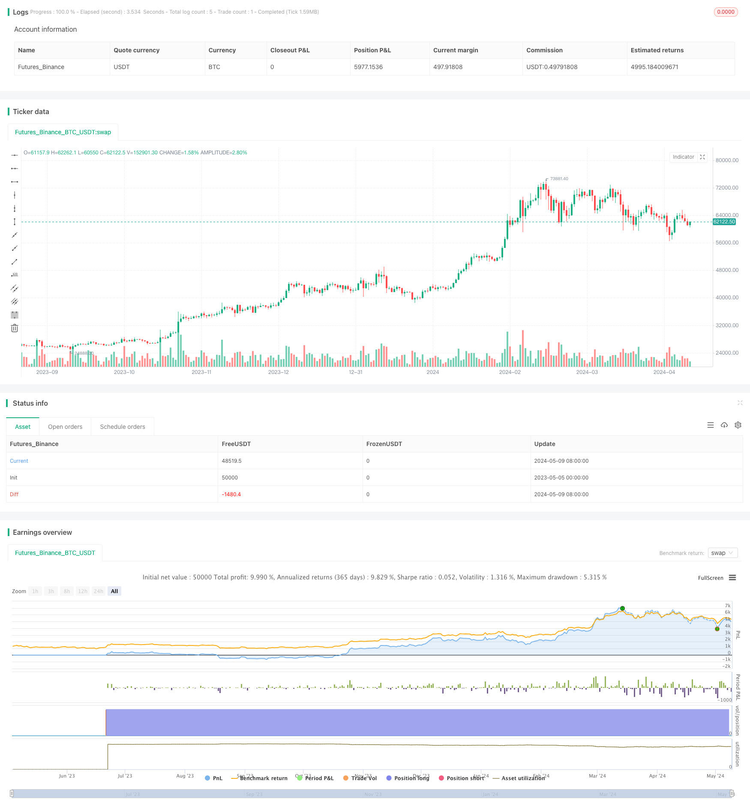

> Name

Moving Average and Relative Strength Index Strategy-Moving-Average-and-Relative-Strength-Index-Strategy
> Author

ChaoZhang

> Strategy Description



[trans]
#### Overview
This strategy combines two technical indicators, the moving average (MA) and the relative strength index (RSI), to generate buy and sell signals through the intersection of the fast and slow moving averages and the overbought and oversold signals of the RSI. When the fast moving average crosses the slow moving average and the RSI is above the oversold threshold, a buy signal is generated; when the fast moving average crosses below the slow moving average or the RSI is above the overbought threshold, a sell signal is generated.
#### Strategy Principle
This strategy takes advantage of the characteristics of two technical indicators, the Moving Average and the Relative Strength Index. Moving averages can reflect the trend direction of prices. Fast moving averages are more sensitive to price changes, while slow moving averages are relatively lagging in response. When the fast moving average crosses the slow moving average, it indicates that the price trend is upward, which may be a buying opportunity; otherwise, it indicates that the price trend is downward, which may be a selling opportunity. The relative strength index measures the rise and fall of prices over a period of time. When the RSI is higher than the overbought threshold, such as 70, it indicates that the market may be overheated and the price is at risk of a correction; when the RSI is lower than the oversold threshold, such as 30, it indicates that the market may be too cold and the price may have an opportunity to rebound.
By combining the trend characteristics of the moving average and the overbought and oversold characteristics of the relative strength index, this strategy can capture the trend market while avoiding some overbought and oversold risks. It is a quantitative strategy that combines trend tracking and mean reversion.
#### Strategic Advantages
1. Simple and easy to use: This strategy has clear logic and only uses two common technical indicators, making it suitable for novices in quantitative trading to learn and use.
2. Trend following: Through the intersection of fast and slow moving averages, the strategy can trade in the direction of the price trend.
3. Risk control: The relative strength index is introduced as an auxiliary judgment to control some overbought and oversold risks while trend trading. 
4. Strong adaptability: The parameters of the moving average and relative strength index can be optimized according to different market characteristics and have good adaptability.
#### Strategy Risk
1. Parameter sensitivity: The calculation period parameters of the moving average and relative strength index have a greater impact on strategy performance, and different parameters may produce different results.
2. Risk of market shock: When the market shows a wide range of shocks, this strategy may produce more false signals, leading to increased losses.
3. Trend turning risk: When the market trend turns, this strategy may suffer continuous losses.
4. Does not consider fundamentals: This strategy is entirely based on price trends and does not consider the impact of fundamental factors such as macroeconomics and industry trends.
#### Strategy optimization direction
1. Parameter optimization: By backtesting historical data, find the optimal moving average and relative strength index parameter combination to improve the stability of the strategy.
2. Introduce trend filtering: Add trend filtering indicators such as long-term moving averages or price channels, confirm the general trend before trading, and reduce false signals that shock the market.
3. Stop loss and take profit: Set reasonable stop loss and take profit conditions to control the risk of a single transaction and improve the strategy's profit-risk ratio.
4. Position management: Dynamically adjust positions according to market trend intensity, price fluctuations and other factors to reduce the magnitude of retracement when the trend turns.
5. Multi-factor combination: Combined with other technical indicators such as volume and price indicators, sentiment indicators, etc., to build a multi-factor model to improve the robustness of the strategy.
#### Summary
The moving average and relative strength index strategy is a simple and practical quantitative trading strategy. Through trend tracking and overbought and oversold judgment, it can grasp the market trend while controlling some risks. However, this strategy also has problems such as parameter sensitivity, market shock and trend turning risks, and needs to be further improved through parameter optimization, trend filtering, fund management and other methods. In addition, quantitative traders also need to flexibly adjust strategies based on their own risk preferences and market characteristics, and combine them with other signal factors to obtain more stable returns.
|| 

#### Overview
This strategy combines two technical indicators: Moving Average (MA) and Relative Strength Index (RSI). It generates buy and sell signals based on the crossover of fast and slow moving averages and the overbought/oversold signals from RSI. A buy signal is generated when the fast moving average crosses above the slow moving average and RSI is above the oversold threshold. A sell signal is generated when the fast moving average crosses below the slow moving average or RSI is above the overbought threshold.

#### Strategy Principle
This strategy leverages the characteristics of moving averages and relative strength index. Moving averages can reflect the trend direction of prices. The fast moving average is more sensitive to price changes, while the slow moving average has a relatively lagging response. When the fast moving average crosses above the slow moving average, it indicates an upward price trend and a potential buying opportunity. Conversely, it indicates a downward price trend and a potential selling opportunity. The relative strength index measures the magnitude of price changes over a period of time. When RSI is above the overbought threshold (e.g., 70), it suggests that the market may be overheated and there is a risk of price pullback. When RSI is below the oversold threshold (e.g., 30), it suggests that the market may be overcooled and there is a chance of price rebound.

By combining the trend-following feature of moving averages and the overbought/oversold feature of relative strength index, this strategy can capture trending markets while avoiding some overbought/oversold risks. It is a quantitative strategy that incorporates both trend-following and mean-reversion approaches.

#### Strategy Advantages
1. Simple and easy to use: The strategy logic is clear and only uses two common technical indicators, making it suitable for beginners in quantitative trading.
2. Trend-following: By using the crossover of fast and slow moving averages, the strategy can trade in the direction of price trends.
3. Risk control: The introduction of relative strength index as an auxiliary judgment helps control some overbought/oversold risks while trend trading.
4. Adaptability: The parameters of moving averages and relative strength index can be optimized according to different market characteristics, providing good adaptability.

#### Strategy Risks
1. Parameter sensitivity: The calculation period parameters of moving averages and relative strength index have a significant impact on the strategy performance. Different parameters may produce different results.
2. Oscillating market risk: When the market exhibits wide-range oscillations, the strategy may generate more false signals, leading to increased losses.
3. Trend reversal risk: When the market trend reverses, the strategy may experience consecutive losses.
4. Ignoring fundamentals: The strategy is entirely based on price movements and does not consider the impact of macroeconomic factors, industry trends, and other fundamental factors.

#### Strategy Optimization Directions
1. Parameter optimization: Conduct backtesting on historical data to find the optimal combination of moving average and relative strength index parameters to improve strategy stability.
2. Trend filtering: Add long-term moving averages or price channels as trend filtering indicators. Confirm the major trend before trading to reduce false signals in oscillating markets.
3. Stop-loss and take-profit: Set reasonable stop-loss and take-profit conditions to control single-trade risk and improve the strategy's risk-reward ratio.
4. Position sizing: Dynamically adjust position sizes based on market trend strength, price volatility, and other factors to reduce drawdown during trend reversals.
5. Multi-factor combination: Combine other technical indicators such as volume-price indicators and sentiment indicators to build a multi-factor model and enhance strategy robustness.

#### Summary
The Moving Average and Relative Strength Index strategy is a simple and practical quantitative trading strategy that captures market trends while controlling some risks through trend-following and overbought/oversold judgments. However, the strategy also has issues such as parameter sensitivity, oscillating market risks, and trend reversal risks. These problems need to be further addressed through parameter optimization, trend filtering, money management, and other methods. Additionally, quantitative traders need to flexibly adjust the strategy based on their risk preferences and market characteristics, and combine it with other signal factors to obtain more robust returns.
[/trans]


> Source (PineScript)

``` pinescript
/*backtest
start: 2023-05-05 00:00:00
end: 2024-05-10 00:00:00
period: 1d
basePeriod: 1h
exchanges: [{"eid":"Futures_Binance","currency":"BTC_USDT"}]
*/

// This Pine Script™ code is subject to the terms of the Mozilla Public License 2.0 at https://mozilla.org/MPL/2.0/
// © giancarlo_meneguetti

//@version=5
strategy("GM.MA.RSI.Stra", overlay=true, default_qty_type=strategy.percent_of_equity, default_qty_value=10)

// Configurações para Médias Móveis
ema_short_length = input(9, title="EMA.9")
ema_long_length = input(21, title="EMA.21")

ema_short = ta.ema(close, ema_short_length)
ema_long = ta.ema(close, ema_long_length)

// Configurações para RSI
rsi_length = input(14, title="RSI.14")
rsi_upper_threshold = input(70, title="RSI>70")
rsi_lower_threshold = input(30, title="RSI<30")

rsi = ta.rsi(close, rsi_length)

// Sinais de Compra e Venda
// Sinal de Compra quando a EMA curta cruza acima da EMA longa e o RSI está acima do limite inferior
buy_signal = ta.crossover(ema_short, ema_long) and rsi > rsi_lower_threshold

// Sinal de Venda quando a EMA curta cruza abaixo da EMA longa ou o RSI está acima do limite superior
sell_signal = ta.crossunder(ema_short, ema_long) or rsi > rsi_upper_threshold

// Geração de Alertas
alertcondition(buy_signal, title="Sinal de Compra", message="A EMA curta cruzou acima da EMA longa e o RSI está acima do limite inferior. Considere comprar.")
alertcondition(sell_signal, title="Sinal de Venda", message="A EMA curta cruzou abaixo da EMA longa ou o RSI está acima do limite superior. Considere vender.")

// Execução da Estratégia
if buy_signal
    strategy.entry("Compra", strategy.long)

if sell_signal
    strategy.close("Venda")

```

> Detail

https://www.fmz.com/strategy/451024

> Last Modified

2024-05-11 11:38:11
