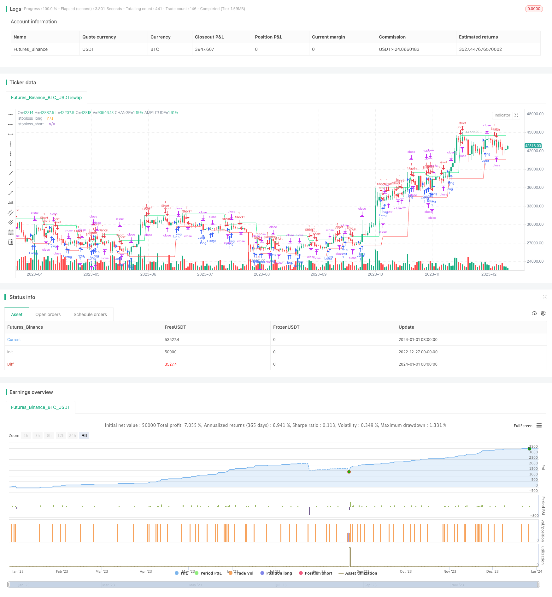

> Name

Moving-Stop-Loss-Tracking-Strategy
> Author

ChaoZhang

> Strategy Description


[trans]

### Overview
This strategy uses the Stoch indicator to judge entry signals. After entering the market, it will track the price's new high or low in real time, thereby dynamically adjusting the stop loss level. At the same time, the strategy will also send stop loss modification information to MT4/MT5 through the alert function to adjust positions in real transactions in real time.
### Strategy Principles
1. This strategy generates buy and sell signals based on the Stoch indicator. When the K line of Stoch breaks through the D line from below, a buy signal is generated; when the K line of Stoch breaks through the D line from above, a sell signal is generated.
2. After entering the market, the strategy will track the latest low of the lowest price and the latest high of the highest price in real time as dynamic stop loss levels. Specifically, for long orders, the most recent low of the lowest price will be tracked as the stop loss level; for short orders, the most recent high of the highest price will be tracked as the stop loss level.
3. When a change in the stop loss level is detected, the strategy will generate a modified stop loss instruction through the alert function and send it to MT4/MT5 to adjust the stop loss level in real transactions in real time. Graphical callouts are also drawn to visually display stop loss changes.
4. This strategy supports manual control of whether to enable the dynamic stop loss mechanism. Once enabled, the stop loss trailing price can be adjusted in real time based on market fluctuations.
### Advantage Analysis
1. Adopt a dynamic tracking stop loss mechanism, which can flexibly adjust the stop loss position according to market fluctuations, realize stop loss tracking, and effectively control risks.
2. Use the alert function to send stop loss adjustment information to MT4/MT5 in real time to achieve automated management without manual intervention.
3. Intuitively mark the stop loss adjustment information on the graph to facilitate viewing and verifying the stop loss tracking effect.
4. Supports manual control of whether to enable the stop-loss tracking mechanism and flexibly adapts to different market conditions.
5. Combined with the Stoch indicator to judge the timing, it can effectively filter out false breakthroughs and improve the stability of the strategy.
### Risk Analysis
1. The Stoch indicator may have frequent cross signals, bringing more risks of invalid operations. The parameters can be adjusted appropriately to filter the signal.
2. In extreme market conditions, the stop loss may be breached, and the risk of huge losses cannot be completely avoided. Position risks should be monitored in a timely manner.
3. The alert connection may experience interruptions, delays, etc., and the adjustment results cannot be fed back in real time, so fault tolerance needs to be done.
4. Dynamic trailing stop loss requires relatively intensive adjustments, which may bring more transaction costs. The magnitude of the adjustment should be balanced against the cost.
### Optimization direction
1. You can test different parameter combinations to optimize the Stoch indicator to obtain better signal quality and strategy effects.
2. It can be combined with other indicators to filter signals or determine the adjustment range, and optimize the stop loss mechanism to improve the stability of the strategy.
3. Different tracking algorithms can be studied to ensure the stop loss effect while reducing the frequency of adjustments.
4. The connection method with MT4/MT5 can be optimized to ensure timely and efficient alert and reduce delay problems.
5. Automatic stop-loss mode and manual mode switching can be introduced, and different stop-loss mechanisms are used for different market conditions.

### Summarize
This strategy first determines the buying and selling timing based on the Stoch indicator, then tracks price fluctuations in real time during the position period to adjust the stop loss level, and automatically issues adjustment information through alert instructions. This dynamic stop-loss mechanism can actively manage position risks according to market changes and reduce manual intervention to improve efficiency. At the same time, the intuitive stop loss adjustment mark is also easy to monitor. This strategy can further optimize signal filtering and stop loss algorithms to increase profit margins. In general, dynamic stop-loss tracking strategies are suitable for tracking volatile markets and automatically adjusting position risks.
||

### Overview

This strategy uses the Stoch indicator to generate entry signals. After entering a position, it will track new highs or lows in real time to dynamically adjust the stop loss. At the same time, the strategy will also send stop loss modification information to MT4/MT5 through the alert function to adjust positions in real trading.

### Strategy Principle 

1. The strategy generates buy and sell signals based on the Stoch indicator. When the Stoch K line crosses above the D line from below, a buy signal is generated. When the K line crosses below the D line from above, a sell signal is generated.

2. After entering a position, the strategy tracks the latest low of the lowest price and the latest high of the highest price in real time as dynamic stop loss levels. Specifically, for long positions, the most recent low point of the lowest price is tracked as the stop loss level. For short positions, the most recent high point of the highest price is tracked as the stop loss level.

3. When a change in the stop loss level is detected, the strategy generates a modify stop loss order via the alert function and sends it to MT4/MT5 to adjust the stop loss level of actual trades in real time. Graphic annotations are also plotted for intuitive display of stop loss changes.

4. This strategy supports manually controlling whether to enable the dynamic stop loss mechanism. When enabled, stop losses can be adjusted in real time according to market fluctuations.

### Advantage Analysis

1. The dynamic trailing stop loss mechanism can flexibly adjust stop loss levels according to market fluctuations to effectively control risks.  

2. The alert function enables real-time sending of stop loss adjustment information to MT4/MT5 for automated management without manual intervention.

3. The visual annotations of stop loss adjustments on the chart facilitate view and verification of trailing stop loss effects.  

4. Support for manually controlling the stop loss trailing mechanism allows flexible adaptation to different market conditions.

5. Combined with the Stoch indicator to determine opportunity, the strategy can effectively filter false breakouts and improve stability.

### Risk Analysis

1. The Stoch indicator may generate frequent crossover signals, introducing the risk of more ineffective operations. Parameters can be adjusted to filter signals.

2. In extreme market conditions, stop losses could be penetrated, unable to completely avoid huge losses. Positions risks should be monitored in a timely manner.

3. Alert connection issues like interruptions and delays may occur, preventing real-time feedback of adjustments. Proper fault tolerance measures need to be in place. 

4. The dynamic trailing stop loss requires relatively frequent adjustments, potentially incurring higher trading costs. The adjustment range should be balanced against costs.

### Optimization Directions

1. Different parameter combinations can be tested to optimize the Stoch indicator for better signal quality and strategy performance.

2. Other indicators can be combined to filter signals or determine adjustment ranges to improve strategy stability. 

3. Different tracking algorithms can be studied to reduce adjustment frequency while ensuring stop loss effects.

4. The connection methods with MT4/MT5 can be enhanced to ensure timely and efficient alerts and minimize delays.

5. Automatic and manual stop loss modes can be introduced for using different mechanisms under different market conditions.


### Summary

This strategy first determines trading opportunities based on the Stoch indicator, then tracks price fluctuations during positions to dynamically adjust stop losses and automatically issues adjustment information via alert orders. Such a dynamic mechanism enables active position risk management according to market changes with less manual intervention. Meanwhile, the intuitive stop loss annotations also facilitate monitoring. Further optimizations on signal filtering and trailing algorithms can improve profitability. Overall, the dynamic trailing stop loss strategy is suitable for tracking volatile markets and automated position risk management.

[/trans]

> Strategy Arguments


|Argument|Default|Description|
|----|----|----|
|v_input_1|400|TakeProfitLevel|
|v_input_2|true|Enable Stoploss Modification Mechanism|


> Source (PineScript)

``` pinescript
/*backtest
start: 2022-12-27 00:00:00
end: 2024-01-02 00:00:00
period: 1d
basePeriod: 1h
exchanges: [{"eid":"Futures_Binance","currency":"BTC_USDT"}]
*/

// This source code is subject to the terms of the Mozilla Public License 2.0 at https://mozilla.org/MPL/2.0/
// © Peter_O

//@version=4
strategy(title="Moving Stop-Loss mechanism", overlay=true)

// This script was created for educational purposes only and it is a spin-off of my previous script:
// https://www.tradingview.com/script/9MJO3AgE-TradingView-Alerts-to-MT4-MT5-dynamic-variables-NON-REPAINTING/
// This spin-off adds very often requested Moving Stop-Loss Mechanism - the logic here moves the stop-loss each time 
// a new pivot is detected.
//
// Last lines of the script include alert() function calls, with a syntax compatible with TradingConnector
// for execution in Forex/indices/commodities/crypto markets via MetaTrader.
// Please note that "tradeid=" variable must be passed with each alert, so that MetaTrader knows which
// trade to modify.

TakeProfitLevel=input(400)

// **** Entries logic, based on Stoch **** {
periodK = 13 //input(13, title="K", minval=1)
periodD = 3 //input(3, title="D", minval=1)
smoothK = 4 //input(4, title="Smooth", minval=1)
k = sma(stoch(close, high, low, periodK), smoothK)
d = sma(k, periodD)

GoLong=crossover(k,d) and k<80
GoShort=crossunder(k,d) and k>20
// } End of entries logic

// **** Pivot-points and stop-loss logic **** {
piv_high = pivothigh(high,1,1)
piv_low = pivotlow(low,1,1)
var float stoploss_long=low
var float stoploss_short=high

pl=valuewhen(piv_low,piv_low,0)
ph=valuewhen(piv_high,piv_high,0)

if GoLong 
    stoploss_long := low<pl ? low : pl
if GoShort 
    stoploss_short := high>ph ? high : ph

plot(stoploss_long, color=color.red, title="stoploss_long")
plot(stoploss_short, color=color.lime, title="stoploss_short")

// Stop-Loss Updating mechanism
enable_stoploss_mechanism=input(true, title="Enable Stoploss Modification Mechanism")
UpdateLongStopLoss = strategy.position_size>0 and strategy.position_size[1]>0 and piv_low and pl!=stoploss_long and not GoLong and enable_stoploss_mechanism
UpdateShortStopLoss = strategy.position_size<0 and strategy.position_size[1]<0 and piv_high and ph!=stoploss_short and not GoShort and enable_stoploss_mechanism
if UpdateLongStopLoss
    stoploss_long := pl
if UpdateShortStopLoss
    stoploss_short := ph

plotshape(UpdateLongStopLoss ? stoploss_long[1]-300*syminfo.mintick : na, location=location.absolute, style=shape.labelup, color=color.lime, textcolor=color.white, text="SL\nmove")
plotshape(UpdateShortStopLoss ? stoploss_short[1]+300*syminfo.mintick : na, location=location.absolute, style=shape.labeldown, color=color.red, textcolor=color.black, text="SL\nmove")
// } End of Pivot-points and stop-loss logic

// **** Trade counter **** {
var int trade_id=0
if GoLong or GoShort
    trade_id:=trade_id+1
// } End of Trade counter

strategy.entry("Long", strategy.long, when=GoLong)
strategy.exit("XLong", from_entry="Long", stop=stoploss_long, profit=TakeProfitLevel)
strategy.entry("Short", strategy.short, when=GoShort)
strategy.exit("XShort", from_entry="Short", stop=stoploss_short, profit=TakeProfitLevel)

if GoLong
    alertsyntax_golong='long slprice=' + tostring(stoploss_long) + ' tradeid=' + tostring(trade_id) + ' tp=' + tostring(TakeProfitLevel)
    alert(message=alertsyntax_golong, freq=alert.freq_once_per_bar_close)
if GoShort
    alertsyntax_goshort='short slprice=' + tostring(stoploss_short) + ' tradeid=' + tostring(trade_id) + ' tp=' + tostring(TakeProfitLevel)
    alert(message=alertsyntax_goshort, freq=alert.freq_once_per_bar_close)
if UpdateLongStopLoss
    alertsyntax_updatelongstoploss='slmod slprice=' + tostring(stoploss_long) + ' tradeid=' + tostring(trade_id)
    alert(message=alertsyntax_updatelongstoploss, freq=alert.freq_once_per_bar_close)
if UpdateShortStopLoss
    alertsyntax_updateshortstoploss='slmod slprice=' + tostring(stoploss_short) + ' tradeid=' + tostring(trade_id)
    alert(message=alertsyntax_updateshortstoploss, freq=alert.freq_once_per_bar_close)

```

> Detail

https://www.fmz.com/strategy/437543

> Last Modified

2024-01-03 16:15:29
