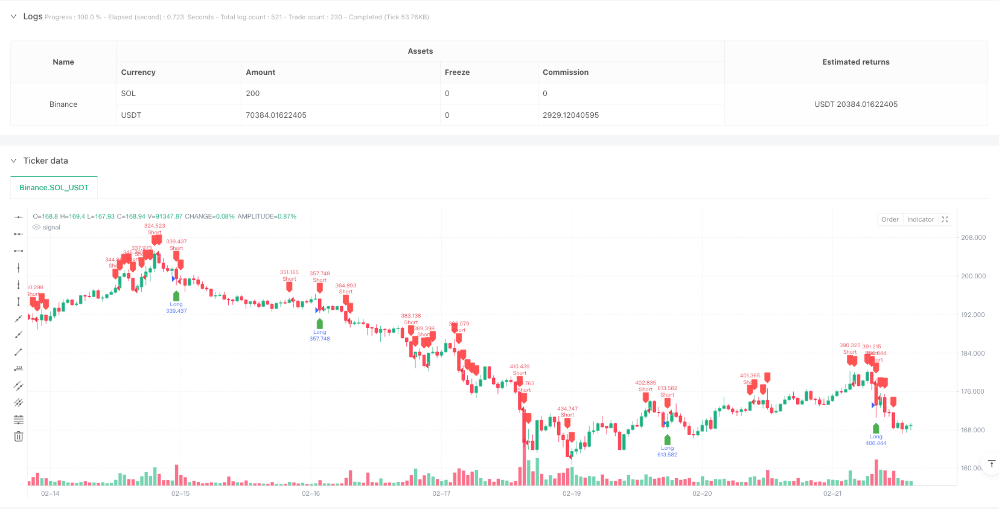
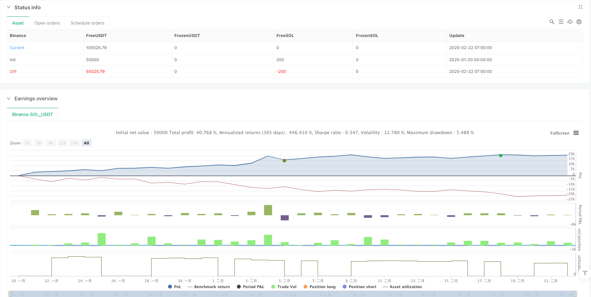

> Name

Multi-Dimensional-Technical-Indicator-Fusion-Trend-Breakthrough-Strategy
> Author

ianzeng123

> Strategy Description





[trans]
#### Overview
This strategy is a trend breakout trading system that combines multiple technical indicators and graphic patterns. It captures market trend turning points by identifying key graphic forms (such as double tops/double bottoms, head and shoulders tops/bottoms) and price breakthroughs, and combines technical indicators such as EMA, ATR and trading volume for signal filtering and risk management to achieve efficient trend tracking and risk control.
#### Strategy Principle
The core logic of the strategy consists of three main parts:
1. Graphical pattern recognition: Use the sliding window method to identify classic technical patterns such as double tops/double bottoms, head and shoulders, etc., and confirm trend reversal signals through comparison of high and low points and EMA crosses.
2. Trend confirmation system: Use the 50-period EMA as a trend filter, combined with price breakthroughs to confirm the trend direction, and verify the validity of the signal through the trading volume filter (requiring trading volume to be higher than 120% of the 20-day average volume).
3. Risk management system: dynamically set stop-profit and stop-loss based on 14-period ATR, and achieve precise control of risk-return ratio through 1.5 times ATR multiplier.
#### Strategic Advantages
1. Multi-dimensional signal fusion: combines market information from multiple dimensions such as graphic patterns, moving averages, volatility and trading volume to improve signal reliability.
2. Dynamic risk management: Use ATR to dynamically adjust the stop-profit and stop-loss positions to adapt to different market environments.
3. High degree of automation: The system automatically identifies patterns, sends trading signals and executes orders, reducing human intervention.
4. Clear visual prompts: Visually display trading signals through graphic markers and alert systems.
#### Strategy Risk
1. False breakthrough risk: False breakthrough signals may appear in volatile markets, which need to be confirmed through strict trading volume.
2. Lagging risk: Indicators such as moving averages and ATR have a certain degree of lag and may miss the best entry opportunity.
3. Parameter sensitivity: The strategy effect is greatly affected by parameter settings, and the optimal parameters need to be determined through backtest optimization.
4. Market environment dependence: In a sideways market where the trend is not obvious, the strategy performance may not be ideal.
#### Strategy optimization direction
1. Introduce market environment identification: add trend strength indicators (such as ADX) to distinguish trending markets from oscillating markets, and dynamically adjust strategy parameters.
2. Optimize signal filtering: Consider adding oscillators such as RSI to further filter out false breakthrough signals.
3. Improve risk control: introduce a position management system to dynamically adjust the position size according to market volatility.
4. Enhance adaptability: Develop an adaptive parameter system to automatically optimize strategy parameters according to market conditions.
#### Summary
This strategy achieves effective capture of the turning points of market trends through the integrated application of multi-dimensional technical indicators. The system design comprehensively considers key elements such as signal generation, trend confirmation and risk control, and has strong practicability. Through the suggested optimization direction, the stability and adaptability of the strategy are expected to be further improved. In real trading applications, traders are recommended to make targeted adjustments to strategy parameters based on specific market characteristics and personal risk preferences.
|| 

#### Overview
This strategy is a trend breakthrough trading system that combines multiple technical indicators and chart patterns. It captures market trend turning points by identifying key patterns (such as double tops/bottoms, head and shoulders) and price breakouts, while incorporating technical indicators like EMA, ATR, and volume for signal filtering and risk management, achieving efficient trend following and risk control.

#### Strategy Principles
The core logic consists of three main components:
1. Pattern Recognition: Uses sliding window method to identify classic technical patterns like double tops/bottoms and head and shoulders, confirming trend reversal signals through comparison of highs/lows and EMA crossovers.
2. Trend Confirmation System: Uses 50-period EMA as trend filter, combines price breakouts to confirm trend direction, validates signals through volume filter (requiring volume above 120% of 20-day average).
3. Risk Management System: Dynamically sets take-profit and stop-loss based on 14-period ATR, precisely controls risk-reward ratio through 1.5x ATR multiplier.

#### Strategy Advantages
1. Multi-dimensional Signal Fusion: Combines market information from multiple dimensions including chart patterns, moving averages, volatility, and volume, improving signal reliability.
2. Dynamic Risk Management: Uses ATR to dynamically adjust take-profit and stop-loss positions, adapting to different market environments.
3. High Automation: System automatically identifies patterns, generates trading signals, and executes orders, reducing manual intervention.
4. Clear Visualization: Intuitively displays trading signals through graphical markers and alert system.

#### Strategy Risks
1. False Breakout Risk: False breakout signals may occur in oscillating markets, requiring strict volume confirmation.
2. Lag Risk: Indicators like moving averages and ATR have inherent lag, potentially missing optimal entry points.
3. Parameter Sensitivity: Strategy performance heavily depends on parameter settings, requiring backtest optimization.
4. Market Environment Dependency: Strategy may underperform in sideways markets with unclear trends.

#### Optimization Directions
1. Introduce Market Environment Recognition: Add trend strength indicators (like ADX) to distinguish between trending and oscillating markets, dynamically adjust strategy parameters.
2. Optimize Signal Filtering: Consider adding oscillating indicators like RSI to further filter false breakout signals.
3. Enhance Risk Control: Introduce position management system to dynamically adjust position size based on market volatility.
4. Improve Adaptability: Develop adaptive parameter system to automatically optimize strategy parameters based on market conditions.

#### Summary
This strategy effectively captures market trend turning points through the fusion application of multi-dimensional technical indicators. The system design comprehensively considers key elements such as signal generation, trend confirmation, and risk control, demonstrating strong practicality. Through the suggested optimization directions, the strategy's stability and adaptability can be further enhanced. In live trading, traders are advised to adjust strategy parameters based on specific market characteristics and individual risk preferences.[/trans]


> Source (PineScript)

``` pinescript
/*backtest
start: 2025-01-20 00:00:00
end: 2025-02-22 08:00:00
period: 1h
basePeriod: 1h
exchanges: [{"eid":"Binance","currency":"SOL_USDT"}]
*/

//@version=5
strategy("Ultimate Pattern Finder", overlay=true, default_qty_type=strategy.percent_of_equity, default_qty_value=100)

// ? CONFIGURABLE PARAMETERS
emaLength = input(50, title="EMA Length")
atrLength = input(14, title="ATR Length")
atrMultiplier = input(1.5, title="ATR Multiplier")
volumeFilter = input(true, title="Enable Volume Filter?")
minVolume = ta.sma(volume, 20) * 1.2  // Ensure volume is 20% above average

// ? MOVING AVERAGES & ATR FOR TREND CONFIRMATION
ema = ta.ema(close, emaLength)
atr = ta.atr(atrLength)

// ? PATTERN DETECTION LOGIC
doubleTop = ta.highest(high, 20) == ta.highest(high, 50) and ta.cross(close, ta.ema(close, 20)) 
doubleBottom = ta.lowest(low, 20) == ta.lowest(low, 50) and ta.cross(ta.ema(close, 20), close)

head = ta.highest(high, 30)
leftShoulder = ta.highest(high[10], 10) < head
rightShoulder = ta.highest(high[10], 10) < head and ta.cross(close, ta.ema(close, 20))

breakoutUp = close > ta.highest(high, 50) and close > ema
breakoutDown = close < ta.lowest(low, 50) and close < ema

// ? NOISE REDUCTION & CONFIRMATION
longCondition = (doubleBottom or rightShoulder or breakoutUp) and (not volumeFilter or volume > minVolume)
shortCondition = (doubleTop or leftShoulder or breakoutDown) and (not volumeFilter or volume > minVolume)

// ? STRATEGY EXECUTION
if longCondition
    strategy.entry("Long", strategy.long)
    strategy.exit("Take Profit", from_entry="Long", limit=close + atr * atrMultiplier, stop=close - atr * atrMultiplier)

if shortCondition
    strategy.entry("Short", strategy.short)
    strategy.exit("Take Profit", from_entry="Short", limit=close - atr * atrMultiplier, stop=close + atr * atrMultiplier)

// ? VISUAL INDICATORS
plotshape(longCondition, location=location.belowbar, color=color.green, style=shape.labelup, title="Long Signal")
plotshape(shortCondition, location=location.abovebar, color=color.red, style=shape.labeldown, title="Short Signal")

// ? ALERTS
alertcondition(longCondition, title="Long Entry Alert", message="? Buy Signal Confirmed!")
alertcondition(shortCondition, title="Short Entry Alert", message="? Sell Signal Confirmed!")


```

> Detail

https://www.fmz.com/strategy/483502

> Last Modified

2025-02-27 16:51:34
