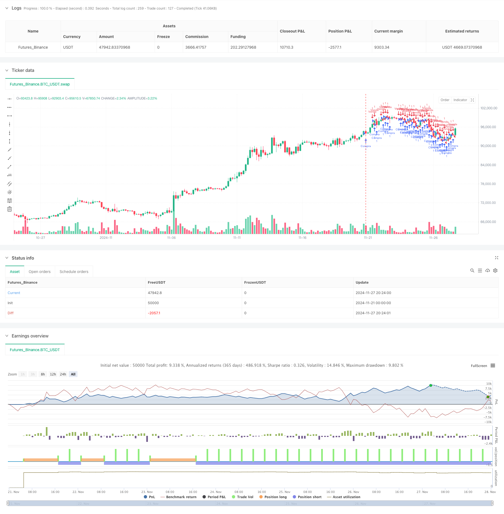

> Name

Composite technical indicator multi-dimensional trend tracking quantitative strategy-Multi-Dimensional-Technical-Indicator-Trend-Following-Quantitative-Strategy
> Author

ChaoZhang

> Strategy Description



[trans]
#### Overview
This strategy is a quantitative trading system based on multi-dimensional technical indicator analysis. It builds a fully automated trading decision-making system by integrating technical indicators such as the Relative Strength Index (RSI), the Moving Average Convergence Divergence Index (MACD), and the Exponential Moving Average (EMA). The strategy adopts a modular design, supports flexible configuration of trading parameters, and integrates a dynamic stop-profit and stop-loss mechanism as well as a trailing stop-loss function, aiming to achieve steady returns with controllable risks.
#### Strategy Principle
The core logic of the strategy is based on the collaborative analysis of three major technical indicators:
1. The RSI indicator is used to identify overbought and oversold areas. A buy signal is generated when the RSI is below 30, and a sell signal is generated when it is above 70.
2. The MACD indicator determines the trend transition by crossing the fast and slow lines. When the fast line crosses the slow line, it is regarded as a buy signal, and when it crosses below, it is regarded as a sell signal.
3. The EMA indicator uses the intersection of the 20-day and 50-day moving averages to confirm the trend direction. When the short-term moving average crosses the long-term moving average, it is a buy signal, and vice versa is a sell signal.
The strategy can trigger transactions when any indicator generates a signal, and integrates three risk control mechanisms: percentage stop loss, fixed take profit, and trailing stop loss. When the price reaches the preset profit target, the trailing stop loss function is automatically activated to ensure that the profits earned will not retract significantly.
#### Strategic Advantages
1. Multi-dimensional signal verification system to improve the reliability of trading signals through cross-validation of different technical indicators
2. Modular design idea supports flexible opening/closing of various indicators to adapt to different market environments
3. Complete fund management mechanism, achieving precise risk control of funds of different sizes through parameterized allocation
4. Triple stop-loss protection system, which strictly manages risks while ensuring profits.
5. Fully automated operation, reducing human emotional interference and improving execution efficiency
6. Real-time display of transaction status and profit and loss to facilitate monitoring and adjustment of strategies
#### Strategy Risk
1. A volatile market may produce frequent trading signals and increase transaction costs.
2. Multiple indicator combinations may have signal lag, which affects the timing of entry.
3. Fixed parameter configuration may not be flexible enough under severe market fluctuations.
4. Technical indicators may produce conflicting signals.
5. Trailing stop loss may trigger position closing in advance during sharp rises and falls.
#### Strategy optimization direction
1. Introduce market volatility indicators and dynamically adjust trading parameters and stop loss positions
2. Develop an indicator weighting system to adaptively adjust the influence of each indicator according to different market environments.
3. Add time frame analysis and improve accuracy through multi-cycle signal confirmation
4. Design an intelligent fund management system to dynamically adjust the position size based on the account's profit and loss status.
5. Optimize the trailing stop loss algorithm and improve its adaptability to violent fluctuations
#### Summary
This strategy builds a systematic trading decision-making framework through collaborative analysis of multi-dimensional technical indicators, and achieves precise management of the entire transaction process through a complete risk control mechanism. Although it may face specific challenges in certain market environments, through continuous optimization and improvement, the strategy is expected to maintain stable performance in different market cycles. The modular design idea of ​​the strategy also provides a good foundation for subsequent function expansion and optimization. ||
#### Overview
This strategy is a quantitative trading system based on multi-dimensional technical indicator analysis, integrating technical indicators such as Relative Strength Index (RSI), Moving Average Convergence Divergence (MACD), and Exponential Moving Average (EMA) to build a fully automated trading decision system. The strategy adopts a modular design, supports flexible configuration of trading parameters, and integrates dynamic take-profit, stop-loss, and trailing stop mechanisms to achieve stable returns under controlled risk.

#### Strategy Principles
The core logic is based on the synergistic analysis of three major technical indicators:
1. RSI identifies overbought and oversold areas, generating buy signals when RSI is below 30 and sell signals above 70
2. MACD determines trend changes through line crossovers, with upward crosses generating buy signals and downward crosses generating sell signals
3. EMA confirms trend direction using 20-day and 50-day moving average crossovers, with short-term moving average crossing above long-term indicating buy signals and vice versa

The strategy triggers trades when any indicator generates a signal, while integrating percentage-based stop-loss, fixed take-profit, and trailing stop mechanisms. When price reaches the preset profit target, trailing stop is automatically activated to protect accumulated profits from significant drawdowns.

#### Strategy Advantages
1. Multi-dimensional signal verification system improves trading signal reliability through cross-validation of different technical indicators
2. Modular design supports flexible enabling/disabling of indicators to adapt to different market environments
3. Comprehensive fund management mechanism achieves precise risk control for different capital scales through parameterized configuration
4. Triple stop-loss protection system manages risk while securing profits
5. Full automation reduces emotional interference and improves execution efficiency
6. Real-time display of trading status and profit/loss facilitates monitoring and strategy adjustment

#### Strategy Risks
1. Oscillating markets may generate frequent trading signals, increasing transaction costs
2. Multiple indicator combinations may have signal lag, affecting entry timing
3. Fixed parameter configuration may lack flexibility in volatile markets
4. Technical indicators may generate contradictory signals
5. Trailing stops may trigger premature exits in rapidly changing markets

#### Strategy Optimization Directions
1. Introduce market volatility indicators to dynamically adjust trading parameters and stop-loss positions
2. Develop indicator weighting system to adaptively adjust indicator influence based on market environment
3. Add timeframe analysis to improve accuracy through multi-period signal confirmation
4. Design intelligent fund management system to dynamically adjust position sizes based on account performance
5. Optimize trailing stop algorithm to improve adaptation to extreme volatility

#### Summary
The strategy constructs a systematic trading decision framework through multi-dimensional technical indicator analysis and achieves precise management of the entire trading process through comprehensive risk control mechanisms. While facing specific challenges in certain market environments, the strategy has the potential to maintain stable performance across different market cycles through continuous optimization and improvement. The modular design approach also provides a solid foundation for future functional expansion and optimization.[/trans]


> Source (PineScript)

``` pinescript
/*backtest
start: 2024-11-21 00:00:00
end: 2024-11-28 00:00:00
period: 4h
basePeriod: 4h
exchanges: [{"eid":"Futures_Binance","currency":"BTC_USDT"}]
*/

// This Pine Script™ code is subject to the terms of the Mozilla Public License 2.0 at https://mozilla.org/MPL/2.0/
// © rfssocal

//@version=5
strategy("Quantico Bot MILLIONARIO", overlay=true)

// Configuração inicial de parâmetros
capital_inicial = input.float(100, "Capital Inicial ($)", minval=10)
risco_por_trade = input.float(1, "Risco por Trade (%)", minval=0.1, maxval=100)
take_profit_percent = input.float(2, "Take Profit (%)", minval=0.1)
stop_loss_percent = input.float(1, "Stop Loss (%)", minval=0.1)
trailing_stop_percent = input.float(5, "Trailing Stop Gatilho (%)", minval=0.1)

// Configuração de indicadores
usar_rsi = input.bool(true, "Usar RSI como Indicador")
usar_macd = input.bool(true, "Usar MACD como Indicador")
usar_ema = input.bool(true, "Usar EMA como Indicador")

// Indicadores
rsi_value = ta.rsi(close, 14)
[macd_line, signal_line, _] = ta.macd(close, 12, 26, 9)
ema_20 = ta.ema(close, 20)
ema_50 = ta.ema(close, 50)

// Condições de compra
compra_rsi = usar_rsi and rsi_value < 30
compra_macd = usar_macd and macd_line > signal_line
compra_ema = usar_ema and ema_20 > ema_50
compra = compra_rsi or compra_macd or compra_ema

// Condições de venda
venda_rsi = usar_rsi and rsi_value > 70
venda_macd = usar_macd and macd_line < signal_line
venda_ema = usar_ema and ema_20 < ema_50
venda = venda_rsi or venda_macd or venda_ema

// Calcular stop loss e take profit
stop_loss_price = strategy.position_avg_price * (1 - stop_loss_percent / 100)
take_profit_price = strategy.position_avg_price * (1 + take_profit_percent / 100)

// Adiciona trailing stop automático
if (strategy.position_size > 0 and close >= strategy.position_avg_price * (1 + trailing_stop_percent / 100))
    strategy.exit("Trailing Stop", from_entry="Compra", stop=close * 0.99)

// Executa as ordens automáticas
if (compra)
    strategy.entry("Compra", strategy.long)

if (venda)
    strategy.entry("Venda", strategy.short)

// Variável para calcular o lucro total
var float total_profit = 0.0
total_profit := strategy.netprofit

// Exibição de dados no gráfico
label.new(bar_index, na, "Take Profit: " + str.tostring(take_profit_price) + "\nStop Loss: " + str.tostring(stop_loss_price),
     style=label.style_label_down, color=color.green, textcolor=color.white)

// Exibe o balanço
label.new(bar_index, na, "Balanço Atual\nDiário: " + str.tostring(total_profit), style=label.style_label_down, color=color.blue, textcolor=color.white)

```

> Detail

https://www.fmz.com/strategy/473366

> Last Modified

2024-11-29 15:33:29
