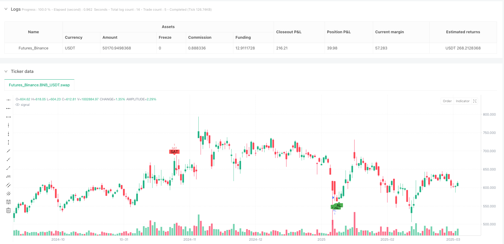
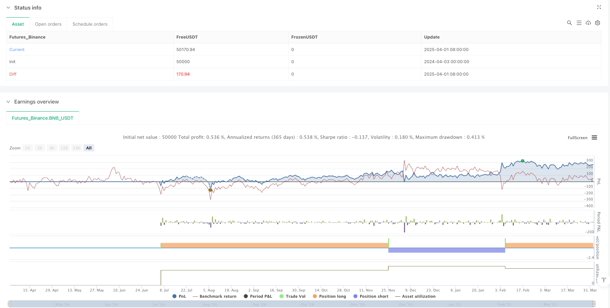

> Name

Multi-Dimensional-Trend-Momentum-Value-Filtering-Trading-Strategy
> Author

ianzeng123

> Strategy Description





[trans]

#### Overview
The Multi-Dimensional Trend Momentum Value Filter Trading Strategy is a quantitative trading strategy that combines multiple technical indicators to identify strong trends and key buy/sell opportunities in the market through multi-dimensional analysis. This strategy mainly relies on four core indicators: ADX, RSI, stochastic RSI and VWAP. It filters market noise through collaborative confirmation between indicators and only selects trading signals with a high probability of success. The strategy design follows the "multiple confirmation" principle, that is, a trading signal will be triggered only when at least three conditions are met at the same time, which greatly improves the accuracy and reliability of trading.
#### Strategy Principle
The core principle of this strategy is based on a multi-dimensional analysis framework that integrates the three dimensions of trend strength, momentum and value assessment:
1. **Trend Strength Assessment**: Use the Average Directional Index (ADX) to confirm whether the market is in a clear trend. ADX greater than 25 is considered a signal of the existence of a strong trend, which is the basic filter of the strategy.
2. **Momentum Indicator Analysis**:
   - The Relative Strength Index (RSI) is used to identify oversold (below 30) and overbought (above 70) conditions
   - Stochastic RSI further detects momentum changes, oversold areas (below 20) and overbought areas (above 80) are used as signal confirmations
3. **Value filter**:
   - Volume Weighted Average Price (VWAP) as a value reference
   - Buy condition requires price below VWAP (potentially undervalued)
   - Sell conditions require price above VWAP (potentially overvalued)
The specific triggering conditions of trading signals are as follows:
- Buy signal: ADX > 25 AND RSI < 30 AND Stochastic RSI < 20 AND Close Price < VWAP
- Sell signal: ADX > 25 AND RSI > 70 AND Stochastic RSI > 80 AND Close > VWAP
The strategy uses a manual ADX calculation method to calculate +DI and -DI by comparing the increase and decrease, and then further calculates the ADX value, which provides the strategy with a more refined measurement of trend strength.
#### Strategic Advantages
This strategy exhibits several significant advantages:
1. **Multi-dimensional confirmation system**: By integrating multiple different types of indicators (trend, momentum and value), the strategy can verify trading signals from different angles, significantly reducing false signals.
2. **Strong trend identification ability**: The use of ADX ensures that the strategy only trades when a clear trend exists, avoiding frequent trading in volatile markets.
3. **Good risk management**: By using the extreme value of the momentum indicator (overbought/oversold) as a signal condition, the strategy can capture potential reversal points and improve the timing accuracy of entry and exit.
4. **Value Assessment Integration**: The addition of VWAP provides the strategy with a perspective on the relationship between price and trading volume, helping to confirm whether the price has deviated from the reasonable value area.
5. **Flexible Time Frame Adaptability**: Although the code comments recommend using the 15-minute chart, the core logic of the strategy is applicable to a variety of time frames and can be adjusted according to trading needs.
6. **Simple and efficient code**: The strategy implementation code has a clear structure, compact logic, high calculation efficiency, and is easy to understand and maintain.
#### Strategy Risk
While this strategy offers several advantages, there are still risks to be aware of:
1. **Over-optimization risk**: The strategy uses specific thresholds for multiple indicators (such as ADX > 25, RSI < 30, etc.). These parameters may be at risk of over-optimization and may need to be adjusted in different market environments.
2. **Signal lag problem**: All technical indicators used are essentially lagging indicators, which may cause a slight delay in entry and exit timing, especially in rapidly changing markets.
3. **Untimely trend reversal**: Reliance on ADX can lead to false signals when the trend is about to end but ADX is still above the threshold.
4. **Lack of Stop Loss Mechanism**: The current strategy implementation does not include clear stop loss settings, which may increase risk exposure when the market suddenly changes.
5. **Indicator Conflict**: Under certain market conditions, different indicators may give conflicting signals, requiring additional judgment mechanisms.
6. **Insufficient retracement control**: The strategy mainly focuses on entry conditions, but there are few risk control mechanisms during the position period, which may lead to profit taking.
#### Optimization direction
In response to the above risks, the strategy can be optimized in the following directions:
1. **Introduction of adaptive parameters**: Replace fixed thresholds (such as ADX > 25) with dynamic thresholds that are automatically adjusted based on market volatility to improve the adaptability of the strategy to different market environments.
2. **Add stop-loss mechanism**: Introduce stop-loss settings based on ATR (average true range) and set clear risk limits for each transaction.
3. **Time filter**: Add time filter conditions to avoid high volatility periods before the market opens and closes, or specific economic data release periods.
4. **Trend confirmation enhancement**: Combine with moving average systems (such as EMA crossover or MACD) as additional trend confirmation to reduce false breakthroughs.
5. **Partial Profit Mechanism**: Implement a batch closing strategy and close some positions when a certain profit target is reached, locking in profits while retaining room for growth.
6. **Trading volume confirmation**: Add the trading volume analysis component to ensure that there is sufficient trading volume support when the signal appears, and improve the reliability of the signal.
7. **Volatility Filter**: Adjust strategy parameters or suspend trading in low volatility environments, because multi-index strategies are prone to noise in low volatility environments.
#### Summary
The multi-dimensional trend momentum value filter trading strategy builds a comprehensive trading decision-making system by integrating indicators such as ADX, RSI, stochastic RSI and VWAP, which can effectively identify key trading opportunities under strong trends. The core value of the strategy lies in its multiple confirmation mechanism, which cross-validates trading signals through different dimensions of market analysis, significantly improving signal quality.
This strategy is particularly suitable for trading in moderately volatile market environments, especially after a clear trend has been established. In practical applications, traders can adjust the stringency of indicator parameters and confirmation conditions based on specific market characteristics and risk tolerance to achieve the best risk-reward ratio.
By introducing the optimization suggestions proposed in this article, especially the adaptive parameter system and a complete risk management mechanism, the strategy can further improve its robustness and long-term profitability. For quantitative traders looking for a technical analysis-driven trading system, this strategy provides a structured and scalable framework that is worthy of trial application and further customized development in actual trading. ||
#### Overview
The Multi-Dimensional Trend Momentum Value Filtering Trading Strategy is a quantitative trading approach that combines multiple technical indicators to identify strong trend-based entry and exit opportunities. This strategy relies on four core indicators: ADX, RSI, Stochastic RSI, and VWAP, using their collaborative confirmation to filter out market noise and select only high-probability trading signals. The strategy follows a "multiple confirmation" principle, requiring at least three conditions to be simultaneously satisfied before triggering a trade signal, which significantly enhances the accuracy and reliability of trades.

#### Strategy Principles
The core principle of this strategy is based on a multi-dimensional analysis framework, integrating three dimensions: trend strength, momentum, and value assessment:

1. **Trend Strength Evaluation**: Uses Average Directional Index (ADX) to confirm whether the market is in a defined trend. ADX greater than 25 is considered a signal of strong trend presence, serving as the base filter for the strategy.

2. **Momentum Indicator Analysis**:
   - Relative Strength Index (RSI) identifies oversold (below 30) and overbought (above 70) conditions
   - Stochastic RSI further detects momentum shifts, with oversold (below 20) and overbought (above 80) zones used for signal confirmation

3. **Value Filtering**:
   - Volume Weighted Average Price (VWAP) serves as a value reference
   - Buy conditions require price below VWAP (potentially undervalued)
   - Sell conditions require price above VWAP (potentially overvalued)

The specific trigger conditions for trading signals are:
- Buy Signal: ADX > 25 AND RSI < 30 AND Stochastic RSI < 20 AND Close < VWAP
- Sell Signal: ADX > 25 AND RSI > 70 AND Stochastic RSI > 80 AND Close > VWAP

The strategy employs a manual ADX calculation method, comparing upward and downward movements to calculate +DI and -DI, then further calculating the ADX value, providing a more refined measurement of trend strength.

#### Strategy Advantages
This strategy demonstrates several significant advantages:

1. **Multi-Dimensional Confirmation System**: By integrating multiple indicators of different types (trend, momentum, and value), the strategy can verify trading signals from different angles, greatly reducing false signals.

2. **Strong Trend Identification Capability**: The use of ADX ensures the strategy only trades when clear trends exist, avoiding frequent trading in oscillating markets.

3. **Sound Risk Management**: By using extreme momentum indicator values (overbought/oversold) as signal conditions, the strategy can capture potential reversal points, improving the precision of entry and exit timing.

4. **Value Assessment Integration**: The inclusion of VWAP provides the strategy with a perspective on the relationship between price and trading volume, helping to confirm whether the price has deviated from reasonable value zones.

5. **Flexible Timeframe Adaptability**: Although the code comments suggest using 15-minute charts, the core logic of the strategy is applicable to multiple time periods and can be adjusted according to trading requirements.

6. **Clean and Efficient Code**: The strategy implementation code is clearly structured, logically compact, and computationally efficient, making it easy to understand and maintain.

#### Strategy Risks
Despite its numerous advantages, the strategy still has the following risks that need attention:

1. **Over-Optimization Risk**: The strategy uses specific thresholds for multiple indicators (such as ADX > 25, RSI < 30, etc.), which may be subject to over-optimization risk and might need adjustment in different market environments.

2. **Signal Lag Issues**: All technical indicators used are inherently lagging indicators, which may lead to slightly delayed entry and exit timing, especially in rapidly changing markets.

3. **Delayed Trend Reversal Recognition**: Dependence on ADX may lead to false signals when a trend is about to end but ADX is still above the threshold.

4. **Lack of Stop-Loss Mechanism**: The current strategy implementation does not include explicit stop-loss settings, which may increase risk exposure during sudden market changes.

5. **Indicator Conflicts**: Under certain market conditions, different indicators may give contradictory signals, requiring additional judgment mechanisms.

6. **Insufficient Drawdown Control**: The strategy mainly focuses on entry conditions but has fewer risk control mechanisms during the holding period, which may lead to giving back previously earned profits.

#### Optimization Directions
In response to the above risks, the strategy can be optimized in the following directions:

1. **Introduce Adaptive Parameters**: Replace fixed thresholds (such as ADX > 25) with dynamic thresholds that automatically adjust based on market volatility, improving the strategy's adaptability to different market environments.

2. **Add Stop-Loss Mechanism**: Introduce ATR (Average True Range) based stop-loss settings to establish clear risk limits for each trade.

3. **Time Filter**: Add time filtering conditions to avoid high volatility periods at market open and close, or specific economic data release periods.

4. **Trend Confirmation Enhancement**: Combine moving average systems (such as EMA crossover or MACD) as additional trend confirmation to reduce false breakouts.

5. **Partial Profit-Taking Mechanism**: Implement a staged position-closing strategy, closing part of the position when certain profit targets are reached, both securing profits and retaining upside potential.

6. **Volume Confirmation**: Add a volume analysis component to ensure sufficient trading volume supports signals, improving signal reliability.

7. **Volatility Filter**: Adjust strategy parameters or pause trading in low volatility environments, as multi-indicator strategies tend to generate noise in low volatility environments.

#### Summary
The Multi-Dimensional Trend Momentum Value Filtering Trading Strategy integrates indicators like ADX, RSI, Stochastic RSI, and VWAP to build a comprehensive trading decision system capable of effectively identifying key trading opportunities in strong trends. The core value of the strategy lies in its multiple confirmation mechanism, cross-validating trading signals through different dimensions of market analysis, significantly improving signal quality.

This strategy is particularly suitable for market environments with moderate volatility, especially for trading after clear trends have been established. In practical application, traders can adjust indicator parameters and the strictness of confirmation conditions according to specific market characteristics and risk tolerance to achieve the optimal risk-reward ratio.

By introducing the optimization suggestions proposed in this article, especially adaptive parameter systems and comprehensive risk management mechanisms, this strategy can further enhance its robustness and long-term profitability. For quantitative traders seeking technically-driven trading systems, this strategy provides a structured and extensible framework worth trying in actual trading and further customization.[/trans]


> Source (PineScript)

``` pinescript
/*backtest
start: 2024-04-03 00:00:00
end: 2025-04-02 00:00:00
period: 1d
basePeriod: 1d
exchanges: [{"eid":"Futures_Binance","currency":"BNB_USDT"}]
*/

//@version=5
strategy("BuySell Strategy OD", overlay=true)

// === INPUTS === //
rsiPeriod   = input.int(14, "RSI Period")
stochPeriod = input.int(14, "Stoch RSI Period")
adxPeriod   = input.int(14, "ADX Period")

// === INDICATORS === //

// RSI
rsi = ta.rsi(close, rsiPeriod)

// Stoch RSI
rsiMin = ta.lowest(rsi, stochPeriod)
rsiMax = ta.highest(rsi, stochPeriod)
stochRsi = rsiMax != rsiMin ? (rsi - rsiMin) / (rsiMax - rsiMin) * 100 : 0

// ADX (manual calculation)
upMove   = high - high[1]
downMove = low[1] - low
plusDM   = (upMove > downMove and upMove > 0) ? upMove : 0
minusDM  = (downMove > upMove and downMove > 0) ? downMove : 0

tr = math.max(math.max(high - low, high - close[1]), low - close[1])
atr = ta.rma(tr, adxPeriod)

plusDI = 100 * ta.rma(plusDM, adxPeriod) / atr
minusDI = 100 * ta.rma(minusDM, adxPeriod) / atr
dx = 100 * ((plusDI - minusDI) >= 0 ? (plusDI - minusDI) : (minusDI - plusDI)) / (plusDI + minusDI)
adx = ta.rma(dx, adxPeriod)

// VWAP
vwap = ta.vwap(hlc3)

// === BUY CONDITION === //
buyCond = (adx > 25) and (rsi < 30) and (stochRsi < 20) and (close < vwap)

// === SELL CONDITION === //
sellCond = (adx > 25) and (rsi > 70) and (stochRsi > 80) and (close > vwap)

// === PLOTS === //
plotshape(buyCond, title="BUY", location=location.belowbar, color=color.green, style=shape.labelup, text="BUY")
plotshape(sellCond, title="SELL", location=location.abovebar, color=color.red, style=shape.labeldown, text="SELL")

// === STRATEGY ORDERS === //
if buyCond
    strategy.entry("BUY", strategy.long)

if sellCond
    strategy.entry("SELL", strategy.short)

```

> Detail

https://www.fmz.com/strategy/489286

> Last Modified

2025-04-03 15:16:18
