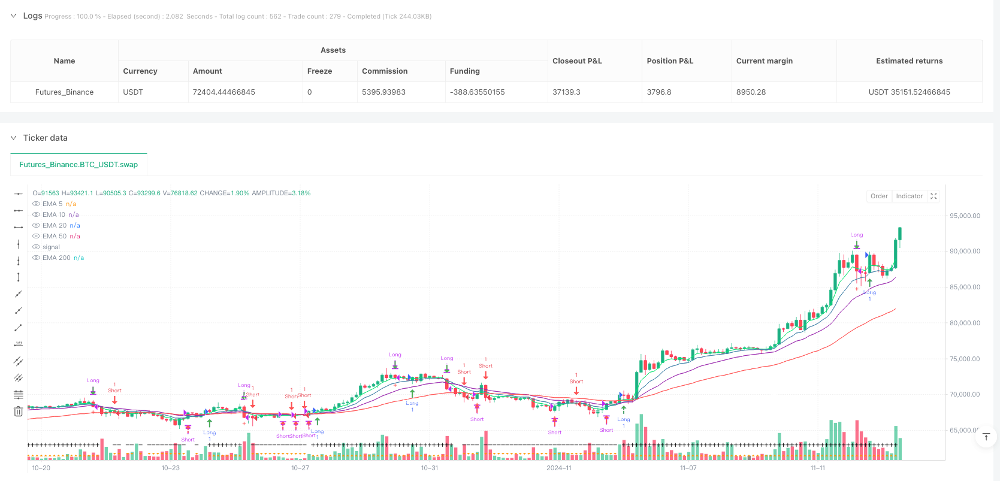
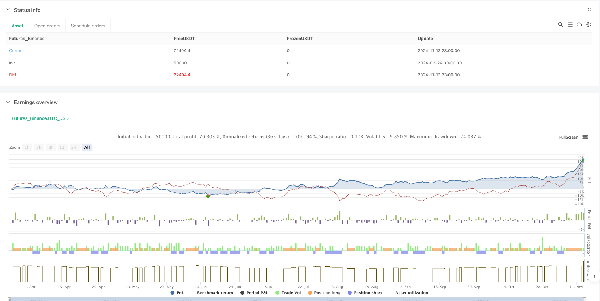

> Name

Multi-EMA-Crossover-Momentum-Alert-Trading-Strategy
> Author

ianzeng123

> Strategy Description





[trans]

#### Overview
This is a multiple exponential moving average (EMA) based trading strategy that combines trend following, momentum confirmation and a volatility warning system. This strategy mainly uses the 5, 10, 15, 20, 50 and 200-day EMA cross signals to determine the market direction. It also designs an intelligent cooling period and risk warning mechanism to help traders open and close positions at the appropriate time. The strategy divides trading opportunities into two situations: call and put, which are applied in uptrends and downtrends respectively. Through multiple condition screening, the selection of trading opportunities is optimized.
#### Strategy Principle
The core logic of this strategy is based on multiple EMA crossovers and trend confirmations:
1. **Trend Judgment Mechanism**: Determine the market trend through the relative position of the 10-day EMA and the 20-day EMA and the relationship between the closing price and the 50-day EMA. When the 10-day EMA is above the 20-day EMA and the closing price is above the 50-day EMA, it is determined to be an upward trend; otherwise, it is a downward trend.
2. **Momentum Confirmation**: The strategy introduces the 5-day EMA as a short-term momentum indicator. In a bullish signal, the 5-day EMA is required to be above the previous period and above the 10-day EMA; in a bearish signal, the 5-day EMA is required to be below the previous period and below the 10-day EMA, thereby ensuring that the trading direction is consistent with short-term momentum.
3. **Intelligent entry and exit rules**:
   - Bullish Signal (Call): Open a position when the uptrend is confirmed and short-term momentum is upward, and close when the price falls below the 15-day EMA.
   - Bearish Signal (Put): Open a position when the downtrend is confirmed and short-term momentum is downward, and close when the price crosses above the 15-day EMA.
4. **Cooling period mechanism**: The strategy is designed with flexible cooling period settings, the default is 2 periods, to prevent frequent transactions caused by opening positions immediately after closing. Users can adjust this parameter according to market characteristics.
5. **Risk Warning System**: A By calculating the change rate of the percentage difference between the 5-day EMA and the 10-day EMA, when the latest change rate exceeds 2.5 times the average change rate of the previous five periods and the current difference is less than the previous period, an early warning signal is triggered to prompt potential abnormal market fluctuations, and you can choose to automatically close positions to avoid risks.
#### Strategic Advantages
1. **Multi-level trend confirmation**: Through multi-period EMA cross-validation, false breakthrough signals are reduced and the reliability of trading is improved. The strategy combines short-term (5, 10-day), medium-term (15, 20-day) and long-term (50, 200-day) moving averages to comprehensively assess market trend conditions.
2. **Dynamic Adaptability**: The strategy can automatically switch trading directions according to changes in market trends, looking for bullish opportunities in rising markets and bearish opportunities in falling markets, and has good market adaptability.
3. **Improved risk management mechanism**: The early warning system can detect abnormal market fluctuations, issue alarms in a timely manner and can choose to automatically close positions, effectively controlling retracement risks. The cooling-off period mechanism avoids excessive trading and reduces transaction costs and the risk of emotional trading.
4. **Parameter customizability**: The strategy provides a wealth of parameter setting options. Users can adjust key parameters such as EMA cycle, cooling period length and warning sensitivity according to different market environments and personal risk preferences.
5. **Visual trading signals**: The strategy clearly marks trading signals through shapes and colors. Green arrows indicate bullish signals, red arrows indicate bearish signals, and the triangle at the bottom indicates the current trend direction, making trading decisions intuitive and clear.
#### Strategy Risk
1. **Moving average lag**: The moving average is essentially a lagging indicator, which may cause delays in entry and exit signals in volatile markets or rapidly reversing markets, resulting in potential losses. To mitigate this risk, consider introducing leading indicators as auxiliary confirmation.
2. **False Breakout Risk**: Although the strategy uses multiple moving average crossovers and momentum confirmations to reduce false signals, false signals caused by frequent moving average crossovers may still occur during the market's sideways consolidation phase. It is recommended to use caution or adjust parameters in low volatility market environments.
3. **Severe Fluctuation Risk**: When the market fluctuates significantly, the early warning system may not be able to respond to sudden price changes in a timely manner. You can consider adding volatility indicators such as ATR (true range) and setting dynamic stops to provide additional protection.
4. **Parameter Optimization Trap**: Over-optimizing parameters may cause the strategy to perform well on historical data but fail in future markets. It is recommended to verify the robustness of the parameters through step optimization and out-of-sample testing.
5. **Long-term trend change risk**: The strategy may generate consecutive loss signals at the beginning of a long-term trend change. Consider increasing the weight of long-term trend indicators such as the 200-day EMA, or reducing position size when the trend is unclear.
#### Strategy optimization direction
1. **Adaptive parameter adjustment**: The current strategy uses a fixed EMA period, and an adaptive mechanism can be introduced to dynamically adjust the EMA period length according to market volatility. For example, use longer EMA periods in high-volatility markets to reduce noise, and use shorter EMA periods in low-volatility markets to increase sensitivity.
2. **Multiple Time Frame Analysis**: Adding trend confirmation in higher time frames and only trading in the direction of the main trend can significantly increase your winning rate. For example, open a long position only when both the daily and 4-hour charts are showing an uptrend.
3. **Stop loss optimization**: The closing conditions of the current strategy are relatively simple (15-day EMA). Dynamic stop loss mechanisms can be introduced, such as ATR-based volatility stop loss or trailing stop loss, to limit the maximum loss of a single transaction while retaining profits.
4. **Fund Management Integration**: Add risk-based position size adjustment to dynamically determine the capital ratio of each transaction based on market volatility and trading signal strength, thereby optimizing the overall risk-reward ratio.
5. **Sentiment Indicator Supplement**: Combined with trading volume, Volume Weighted Average Price (VWAP) or market breadth indicators, the reliability of trend confirmation can be enhanced. Especially near important support and resistance levels, market sentiment indicators can provide additional confirmation.
6. **Machine Learning Optimization**: Using machine learning technology to classify and screen signals, identify the characteristics of high-win-rate trading environments, and avoid trading under adverse market conditions can significantly improve the overall performance of the strategy.
#### Summary
The multi-index moving average cross momentum early warning trading strategy is a well-structured quantitative trading system that creates a comprehensive trading decision-making framework through multi-level EMA cross signals, momentum confirmation, cooling period mechanism and risk warning system. The strategy performs well in trending markets and has a defense mechanism against abnormal market fluctuations.
The main advantage of this strategy lies in its comprehensive trend judgment mechanism and complete risk control system, which enable it to maintain stable performance in different market environments. However, as a trading system based on moving averages, the strategy still faces inherent risks such as hysteresis and false breakthroughs.
Future optimization can focus on parameter adaptation, multi-time frame analysis, dynamic stop loss and risk management to further improve the robustness and adaptability of the strategy. By introducing machine learning technology and market sentiment indicators, a qualitative leap in strategy performance can be achieved, allowing it to remain competitive under various market conditions. ||
#### Overview
This is a trading strategy based on multiple Exponential Moving Averages (EMAs), combining trend following, momentum confirmation, and volatility alert systems. The strategy primarily utilizes 5, 10, 15, 20, 50, and 200-day EMA crossover signals to determine market direction, while incorporating an intelligent cooldown period and risk warning mechanism to help traders open and close positions at appropriate times. The strategy categorizes trading opportunities into Call and Put scenarios, applied in uptrends and downtrends respectively, optimizing trade entry and exit timing through multiple filtering conditions.

#### Strategy Principles
The core logic of this strategy is built on multiple EMA crossovers and trend confirmation:

1. **Trend Determination Mechanism**: Market trends are identified by the relative position of the 10-day EMA to the 20-day EMA, as well as the relationship between closing price and the 50-day EMA. When the 10-day EMA is above the 20-day EMA and the closing price is above the 50-day EMA, an uptrend is established; otherwise, it's considered a downtrend.

2. **Momentum Confirmation**: The strategy incorporates the 5-day EMA as a short-term momentum indicator. For bullish signals, it requires the 5-day EMA to be higher than the previous period and above the 10-day EMA; for bearish signals, it requires the 5-day EMA to be lower than the previous period and below the 10-day EMA, ensuring trade direction aligns with short-term momentum.

3. **Intelligent Entry and Exit Rules**:
   - Call Signals: Open positions when uptrend is confirmed and short-term momentum is rising; close positions when price falls below the 15-day EMA.
   - Put Signals: Open positions when downtrend is confirmed and short-term momentum is falling; close positions when price rises above the 15-day EMA.

4. **Cooldown Period Mechanism**: The strategy features a flexible cooldown period setting, defaulting to 2 periods, preventing frequent trading caused by immediate re-entry after closing positions. Users can adjust this parameter based on market characteristics.

5. **Risk Warning System**: By calculating the rate of change in percentage differences between the 5-day and 10-day EMAs, the system triggers a warning signal when the latest rate of change exceeds 2.5 times the average of the previous 5 periods and the current difference is smaller than the previous period. This alerts to potential abnormal market volatility and can optionally trigger automatic position closure to mitigate risk.

#### Strategy Advantages
1. **Multi-level Trend Confirmation**: Through multi-period EMA crossover verification, the strategy reduces false breakout signals, enhancing trading reliability. It combines short-term (5, 10-day), medium-term (15, 20-day), and long-term (50, 200-day) moving averages to comprehensively assess market trend conditions.

2. **Dynamic Adaptability**: The strategy automatically switches trading direction according to changing market trends, seeking bullish opportunities in rising markets and bearish opportunities in falling markets, demonstrating good market adaptability.

3. **Comprehensive Risk Management**: The warning system can detect abnormal market volatility, promptly issue alerts, and optionally close positions automatically, effectively controlling drawdown risk. The cooldown mechanism prevents overtrading, reducing transaction costs and the risk of emotional trading.

4. **Parameter Customizability**: The strategy offers rich parameter setting options, allowing users to adjust key parameters such as EMA periods, cooldown length, and warning sensitivity based on different market environments and personal risk preferences.

5. **Visualized Trading Signals**: The strategy clearly marks trading signals through shapes and colors, with green arrows for bullish signals, red arrows for bearish signals, and bottom triangles indicating current trend direction, making trading decisions intuitive and clear.

#### Strategy Risks
1. **Moving Average Lag**: Moving averages are inherently lagging indicators and may cause delayed entry and exit signals in oscillating markets or rapid reversal markets, resulting in potential losses. To mitigate this risk, consider introducing leading indicators as supplementary confirmation.

2. **False Breakout Risk**: Despite using multiple moving average crossovers and momentum confirmation to reduce false signals, frequent crossovers during market consolidation phases may still generate erroneous signals. Caution is advised when using this strategy in low-volatility market environments, or parameter adjustments may be necessary.

3. **Severe Volatility Risk**: During significant market fluctuations, the warning system may not respond promptly to sudden price movements. Consider adding volatility indicators such as ATR (Average True Range) and setting dynamic stop losses to provide additional protection.

4. **Parameter Optimization Trap**: Excessive parameter optimization may result in a strategy that performs excellently on historical data but fails in future markets. Step-wise optimization and out-of-sample testing are recommended to verify parameter robustness.

5. **Long-term Trend Reversal Risk**: The strategy may generate consecutive loss signals during the initial phase of long-term trend changes. Consider increasing the weight of long-term trend indicators such as the 200-day EMA, or reducing position size when trends are unclear.

#### Strategy Optimization Directions
1. **Adaptive Parameter Adjustment**: The current strategy uses fixed EMA periods. An adaptive mechanism could be introduced to dynamically adjust EMA period lengths based on market volatility. For example, using longer EMA periods in high-volatility markets to reduce noise, and shorter EMA periods in low-volatility markets to increase sensitivity.

2. **Multi-timeframe Analysis**: Adding trend confirmation from higher timeframes and trading only in the direction of the main trend can significantly improve win rates. For instance, only taking long positions when both daily and 4-hour charts show uptrends.

3. **Stop Loss Optimization**: The current strategy's exit condition is relatively simple (15-day EMA). Dynamic stop-loss mechanisms could be introduced, such as volatility-based stops using ATR or trailing stops, to limit maximum loss per trade while preserving profits.

4. **Money Management Integration**: Adding position sizing based on risk, dynamically determining the proportion of capital for each trade according to market volatility and signal strength, thereby optimizing overall risk-reward ratio.

5. **Sentiment Indicator Supplement**: Combining volume, Volume Weighted Average Price (VWAP), or market breadth indicators can enhance the reliability of trend confirmation. Especially near important support and resistance levels, market sentiment indicators can provide additional confirmation.

6. **Machine Learning Optimization**: Using machine learning techniques to classify and filter signals, identifying characteristics of high-probability trading environments and avoiding trading in unfavorable market conditions can significantly improve overall strategy performance.

#### Summary
The Multi-EMA Crossover Momentum Alert Trading Strategy is a well-structured quantitative trading system that creates a comprehensive trading decision framework through multi-level EMA crossover signals, momentum confirmation, cooldown mechanisms, and a risk warning system. The strategy performs excellently in trending markets while possessing defensive mechanisms to handle abnormal market volatility.

The main advantages of this strategy lie in its comprehensive trend determination mechanism and well-developed risk control system, enabling it to maintain stable performance across different market environments. However, as a moving average-based trading system, the strategy still faces inherent risks such as lag and false breakouts.

Future optimizations can focus on parameter adaptivity, multi-timeframe analysis, dynamic stop losses, and risk management to further enhance the strategy's robustness and adaptability. By introducing machine learning techniques and market sentiment indicators, a qualitative leap in strategy performance can be achieved, maintaining its competitiveness across various market conditions.[/trans]


> Source (PineScript)

``` pinescript
/*backtest
start: 2024-03-24 00:00:00
end: 2024-11-14 00:00:00
period: 3h
basePeriod: 3h
exchanges: [{"eid":"Futures_Binance","currency":"BTC_USDT"}]
*/

//@version=6
strategy(title='GRIM309 CallPut Strategy', shorttitle='CallsPuts Strategy', overlay=true, initial_capital=500, commission_value=0.1)

// Input parameters for EMAs
len5 = input.int(5, minval=1, title='5 EMA Length')
len10 = input.int(10, minval=1, title='10 EMA Length')
len15 = input.int(15, minval=1, title='15 EMA Length')
len20 = input.int(20, minval=1, title='20 EMA Length')
len50 = input.int(50, minval=1, title='50 EMA Length')
len200 = input.int(200, minval=1, title='200 EMA Length')

// EMA calculations
ema5 = ta.ema(close, len5)
ema10 = ta.ema(close, len10)
ema15 = ta.ema(close, len15)
ema20 = ta.ema(close, len20)
ema50 = ta.ema(close, len50)
ema200 = ta.ema(close, len200)

// Plot EMAs with specified colors
plot(ema5, title='EMA 5', color=color.lime)
plot(ema10, title='EMA 10', color=color.rgb(64, 131, 170))
plot(ema20, title='EMA 20', color=color.purple)
plot(ema50, title='EMA 50', color=color.red)
plot(ema200, title='EMA 200', color=color.white)

// Determine trend conditions
uptrend = ema10 > ema20 and close > ema50
downtrend = ema10 < ema20 and close < ema50

// Plot trend indicators at the bottom of the chart
plotshape(series=uptrend, location=location.bottom, color=color.orange, style=shape.triangleup, text='+', title='Uptrend Indicator')
plotshape(series=downtrend, location=location.bottom, color=color.orange, style=shape.triangledown, text='-', title='Downtrend Indicator')

// Position state variable
var int positionState = 0  // 0 = no position, 1 = long, -1 = short

// Cooldown period settings (dont open right after a close)
cooldownBars = input.int(2, minval=1, title='Cooldown Period (bars)')
var int barsSinceClose = na

// Additional check for EMA5 trend confirmation (optional check to see that it is already in momentum short term)
emaCheckCall = ema5 > ema5[1] and ema5 > ema10
emaCheckPut = ema5 < ema5[1] and ema5 < ema10

// Open and close conditions for calls
openCalls = uptrend and emaCheckCall and positionState == 0 and (na(barsSinceClose) or barsSinceClose >= cooldownBars) 
closeCalls = positionState == 1 and (close <= ema15)

// Open and close conditions for puts
openPuts = downtrend and emaCheckPut and positionState == 0 and (na(barsSinceClose) or barsSinceClose >= cooldownBars)
closePuts = positionState == -1 and (close >= ema15)

// --- WARNING SYSTEM ---

// Calculate recent percentage differences between ema5 and ema10
diffNow = (ema5 - ema10) / ema10 * 100
diff1 = (ema5[1] - ema10[1]) / ema10[1] * 100
diff2 = (ema5[2] - ema10[2]) / ema10[2] * 100
diff3 = (ema5[3] - ema10[3]) / ema10[3] * 100
diff4 = (ema5[4] - ema10[4]) / ema10[4] * 100
diff5 = (ema5[5] - ema10[5]) / ema10[5] * 100

if diffNow < 0
    diffNow:=diffNow*-1
if diff1 < 0
    diff1:=diff1*-1
if diff2 < 0
    diff2:=diff2*-1
if diff3 < 0
    diff3:=diff3*-1
if diff4 < 0
    diff4:=diff4*-1
if diff5 < 0
    diff5:=diff5*-1

// Compute average of last 5 changes
avgChange = (math.abs(diff1 - diff2) + math.abs(diff2 - diff3) + math.abs(diff3 - diff4) + math.abs(diff4 - diff5)) / 4

// Check if latest change is more than double the average
isWarning = positionState != 0 and math.abs(diffNow - diff1) > 2.5 * avgChange and diffNow < diff1

// Draw warning symbol
plotshape(series=isWarning, location=location.belowbar, color=color.red, style=shape.cross, text='⚠', textcolor=color.white, title='Warning Signal')

if isWarning //optional, close position if a warning emits
    if positionState == 1  // Only close calls if the last position was a long
        closeCalls := true
    if positionState == -1 // Only close puts if the last position was a short
        closePuts := true

// Update position state and cooldown counter based on signals
if (openCalls)
    strategy.entry('Long', strategy.long)
    positionState := 1
    barsSinceClose := na  // Reset cooldown counter when opening a position

if (closeCalls)
    strategy.close('Long')
    positionState := 0
    barsSinceClose := 0  // Start cooldown counter when closing a position

if (openPuts)
    strategy.entry('Short', strategy.short)
    positionState := -1
    barsSinceClose := na  // Reset cooldown counter when opening a position

if (closePuts)
    strategy.close('Short')
    positionState := 0
    barsSinceClose := 0  // Start cooldown counter when closing a position

// Increment cooldown counter if it's active
if (not na(barsSinceClose))
    barsSinceClose += 1

// Plot open and close signals for Calls
plotshape(series=openCalls, location=location.belowbar, color=color.green, style=shape.arrowup, text='Open', textcolor=color.white, title='Open call position')
plotshape(series=closeCalls, location=location.abovebar, color=color.green, style=shape.arrowdown, text='Close', textcolor=color.white, title='Close call position')

// Plot open and close signals for Puts
plotshape(series=openPuts, location=location.abovebar, color=color.red, style=shape.arrowdown, text='Open', textcolor=color.white, title='Open put position')
plotshape(series=closePuts, location=location.belowbar, color=color.red, style=shape.arrowup, text='Close', textcolor=color.white, title='Close put position')

```

> Detail

https://www.fmz.com/strategy/488010

> Last Modified

2025-03-24 13:49:59
