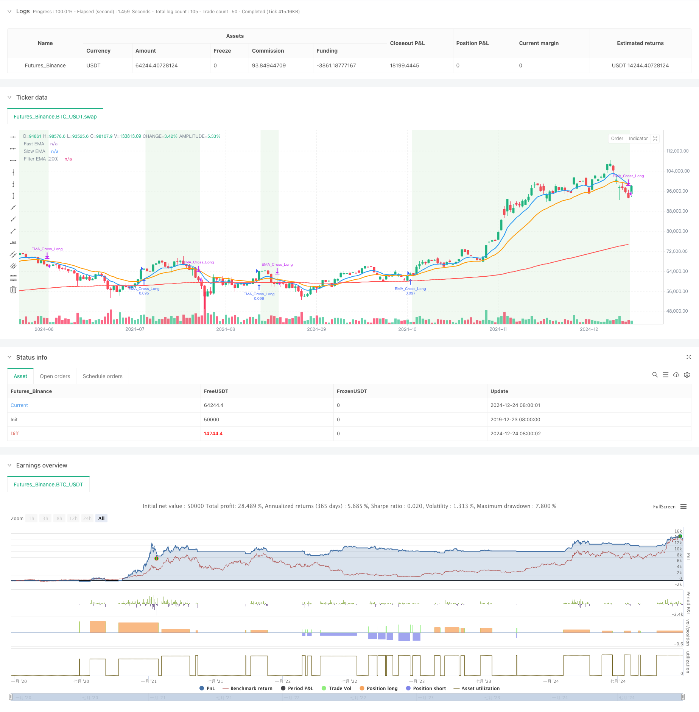

> Name

Multiple moving average crossover dynamic trend capturing quantitative trading strategy-Multi-EMA-Dynamic-Trend-Capture-Quantitative-Trading-Strategy
> Author

ChaoZhang

> Strategy Description



[trans]
#### Overview
This strategy is a quantitative trading system based on multiple exponential moving average (EMA) crossovers. It builds a complete trend following trading framework through the cooperation of three moving averages: 9-day EMA, 21-day EMA and 200-day EMA. The strategy identifies market trends and trades by determining the intersection of the fast moving average and the slow moving average and their positional relationship with the long-term moving average.
#### Strategy Principle
The core logic of the strategy is to capture market trends through triple moving average crossovers. Specifically:
1. Use the 9-day EMA as a fast moving average to reflect short-term price trends
2. Use the 21-day EMA as the mid-term moving average to filter out short-term noise
3. Use the 200-day EMA as a long-term moving average to determine the main trend direction
When the fast moving average crosses the slow moving average upward, and both moving averages are above the 200-day moving average, the system generates a long signal; when the fast moving average crosses the slow moving average downward, and both moving averages are below the 200-day moving average, the system generates a short signal. This design can not only capture the turning point of the trend, but also avoid frequent trading in the consolidation market.
#### Strategic Advantages
1. High degree of trend confirmation: through the combined use of triple moving averages, market trends can be confirmed more accurately
2. Improved risk control: Use long-term moving averages as trend filters to effectively reduce the risk of false breakthroughs
3. Clear operating rules: clear entry and exit conditions, easy to execute and backtest
4. Strong adaptability: parameters can be adjusted according to different market characteristics, and has good universality
5. Simple calculation: using commonly used technical indicators, high computing efficiency, suitable for real-time trading
#### Strategy Risk
1. Lagging risk: The moving average indicator itself has lag, which may lead to delayed entry or exit timing.
2. Risk of market shock: Frequent false signals may occur in a volatile market.
3. Trend reversal risk: May suffer a large retracement when the trend suddenly reverses
4. Parameter sensitivity: Different parameter combinations may lead to large differences in strategy performance
It is recommended to manage these risks by setting stop loss positions, controlling position size, etc.
#### Strategy optimization direction
1. Introduce trading volume indicators: combine changes in trading volume to confirm trend strength
2. Add volatility filtering: adjust trading frequency in high volatility environments
3. Optimize parameter selection: dynamically adjust moving average parameters for different market cycles
4. Add trend strength indicators: Use indicators such as ADX to evaluate trend reliability
5. Improve the stop-loss mechanism: design more flexible stop-loss and take-profit rules
#### Summary
This is a well designed and logical trend following strategy. Through the coordination of multiple moving averages, it can effectively capture market trends and at the same time have good risk control capabilities. The strategy has a large space for optimization, and its stability and profitability can be further improved through continuous improvement. ||
#### Overview
This strategy is a quantitative trading system based on multiple Exponential Moving Average (EMA) crossovers. It constructs a complete trend-following trading framework using three EMAs: 9-day, 21-day, and 200-day. The strategy identifies market trends and executes trades by analyzing the crossovers between fast and slow EMAs and their positions relative to the long-term EMA.

#### Strategy Principles
The core logic revolves around triple EMA crossovers to capture market trends. Specifically:
1. Uses 9-day EMA as the fast line to reflect short-term price movements
2. Uses 21-day EMA as the medium-term line to filter short-term noise
3. Uses 200-day EMA as the long-term line to determine major trend direction
The system generates long signals when the fast EMA crosses above the slow EMA while both are above the 200-day EMA, and short signals when the fast EMA crosses below the slow EMA while both are below the 200-day EMA. This design captures trend reversal points while avoiding frequent trades in ranging markets.

#### Strategy Advantages
1. High trend confirmation: Multiple EMA combinations provide more accurate trend confirmation
2. Robust risk control: Long-term EMA serves as a trend filter to reduce false breakout risks
3. Clear operational rules: Entry and exit conditions are well-defined, easy to implement and backtest
4. High adaptability: Parameters can be adjusted for different market characteristics
5. Simple computation: Uses common technical indicators, efficient for real-time trading

#### Strategy Risks
1. Lag risk: EMA indicators have inherent lag, potentially causing delayed entries or exits
2. Consolidation risk: May generate frequent false signals in ranging markets
3. Trend reversal risk: May experience significant drawdowns during sudden trend reversals
4. Parameter sensitivity: Different parameter combinations may lead to varying performance
It's recommended to manage these risks through stop-loss placement and position sizing.

#### Optimization Directions
1. Incorporate volume indicators: Confirm trend strength with volume changes
2. Add volatility filters: Adjust trading frequency in high volatility environments
3. Optimize parameter selection: Dynamically adjust EMA parameters for different market cycles
4. Include trend strength indicators: Use ADX to evaluate trend reliability
5. Enhance risk management: Design more flexible stop-loss and take-profit rules

#### Summary
This is a well-designed trend-following strategy with clear logic. Through the coordination of multiple EMAs, it effectively captures market trends while maintaining good risk control. The strategy has significant optimization potential, and its stability and profitability can be further enhanced through continuous improvements.[/trans]


> Source (PineScript)

``` pinescript
/*backtest
start: 2019-12-23 08:00:00
end: 2024-12-25 08:00:00
period: 1d
basePeriod: 1d
exchanges: [{"eid":"Futures_Binance","currency":"BTC_USDT"}]
*/

//@version=6
strategy("EMA Cross with both MinhTuan", overlay=true, default_qty_type=strategy.percent_of_equity, default_qty_value=10)

// Tham số EMA
fastLength = input.int(9, title="Fast EMA Length", minval=1)
slowLength = input.int(21, title="Slow EMA Length", minval=1)
filterLength = input.int(200, title="EMA Filter Length", minval=1)

// Tùy chọn chế độ giao dịch
tradeMode = input.string("Both", options=["Long", "Short", "Both"], title="Trade Mode")

// Tính toán EMA
fastEMA = ta.ema(close, fastLength)
slowEMA = ta.ema(close, slowLength)
filterEMA = ta.ema(close, filterLength)

// Điều kiện vào lệnh Long: EMA nhanh cắt lên EMA chậm và cả hai nằm trên EMA 200
longCondition = ta.crossover(fastEMA, slowEMA) and fastEMA > filterEMA and slowEMA > filterEMA

// Điều kiện vào lệnh Short: EMA nhanh cắt xuống EMA chậm và cả hai nằm dưới EMA 200
shortCondition = ta.crossunder(fastEMA, slowEMA) and fastEMA < filterEMA and slowEMA < filterEMA

// Điều kiện thoát lệnh: EMA nhanh cắt ngược lại EMA chậm
closeLongCondition = ta.crossunder(fastEMA, slowEMA) // Thoát lệnh Long
closeShortCondition = ta.crossover(fastEMA, slowEMA) // Thoát lệnh Short

// Thực hiện lệnh Long
if (longCondition and (tradeMode == "Long" or tradeMode == "Both"))
    strategy.entry("EMA_Cross_Long", strategy.long)
    label.new(x=bar_index, y=low, text="Long", color=color.green, textcolor=color.white, size=size.small)

// Thực hiện lệnh Short
if (shortCondition and (tradeMode == "Short" or tradeMode == "Both"))
    strategy.entry("EMA_Cross_Short", strategy.short)
    label.new(x=bar_index, y=high, text="Short", color=color.red, textcolor=color.white, size=size.small)

// Thoát lệnh Long
if (closeLongCondition)
    strategy.close("EMA_Cross_Long")
    label.new(x=bar_index, y=high, text="Close Long", color=color.orange, textcolor=color.white, size=size.small)

// Thoát lệnh Short
if (closeShortCondition)
    strategy.close("EMA_Cross_Short")
    label.new(x=bar_index, y=low, text="Close Short", color=color.blue, textcolor=color.white, size=size.small)

// Vẽ đường EMA nhanh, EMA chậm, và EMA 200
plot(fastEMA, title="Fast EMA", color=color.blue, linewidth=2)
plot(slowEMA, title="Slow EMA", color=color.orange, linewidth=2)
plot(filterEMA, title="Filter EMA (200)", color=color.red, linewidth=2)

// Hiển thị nền khi đang giữ lệnh
bgcolor(strategy.position_size > 0 ? color.new(color.green, 90) : strategy.position_size < 0 ? color.new(color.red, 90) : na)

```

> Detail

https://www.fmz.com/strategy/476260

> Last Modified

2024-12-27 14:59:35
