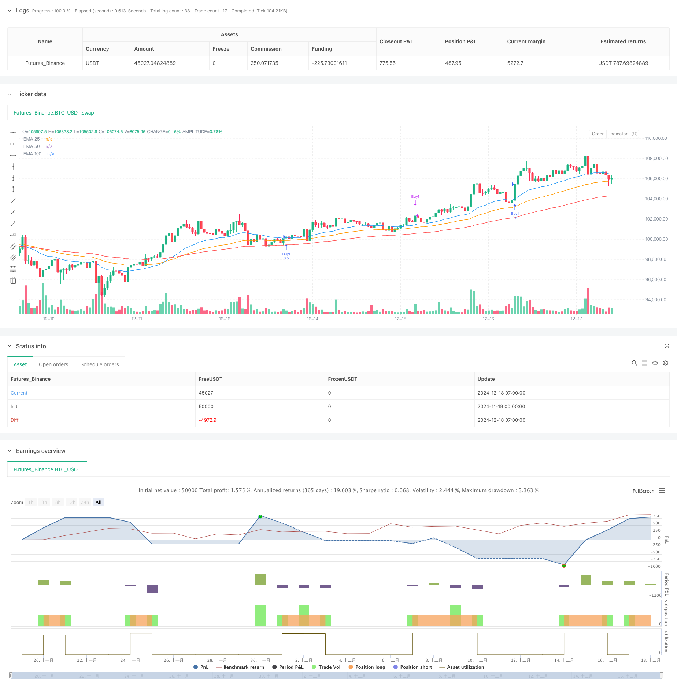

> Name

Multi-EMA-Golden-Cross-Strategy-with-Tiered-Take-Profit
> Author

ChaoZhang

> Strategy Description



[trans]
#### Overview
This strategy is a trend following trading system based on multiple exponential moving averages (EMA). It uses the golden cross formed by three moving averages EMA25, EMA50 and EMA100 to confirm a strong upward trend, and enters the market in batches when the price breaks through EMA25. The strategy uses dynamic stop loss and batch take profit to manage risks and profits.
#### Strategy Principle
The core logic of the strategy includes the following key parts:
1. Trend confirmation: Using three EMAs of different periods (25, 50, 100), when the short-term moving average is above the mid-term moving average and the mid-term moving average is above the long-term moving average, a golden cross pattern is formed to confirm the upward trend.
2. Entry signal: Based on the formation of the golden cross, when the closing price breaks through EMA25 upwards, enter the long position in two batches with 50% of the positions each.
3. Stop loss setting: Set dynamic stop loss based on the lowest price in the past 20 periods, and add an additional buffer interval (0.0003) to avoid false breakthroughs.
4. Take profit in batches: Set two take profit targets with different multiples (1.0 and 1.5 times). The first batch of positions will leave when the lower take profit target is reached, and the second batch of positions will leave when the higher take profit target is reached.
5. Trend end protection: When the price falls below EMA100, in order to prevent losses caused by trend reversal, the closing signal of all positions will be triggered.
#### Strategic Advantages
1. Multiple confirmation mechanism: Through the combined use of multiple moving averages, false signals can be effectively filtered and the reliability of transactions can be improved.
2. Dynamic risk management: The stop loss position is dynamically adjusted based on real-time market fluctuations, making it more adaptable.
3. Opening positions in batches and taking profits: By operating in batches, you can not only lock in part of the profits, but also allow profits to continue running, maximizing returns.
4. Trend protection mechanism: The long-term moving average is set as a warning line for trend reversal, which can stop losses in time and avoid sharp retracement.
#### Strategy Risk
1. Lagging risk: The moving average indicator itself has lag, which may lead to late entry and miss the best buying point.
2. Risk of volatile markets: In a volatile market, frequent false breakthroughs may lead to continuous stop losses.
3. Fixed stop loss buffer risk: Using a fixed stop loss buffer may not be suitable for all market environments.
4. Fund management risk: The fixed 50% position allocation may not be flexible enough.
#### Strategy optimization direction
1. Dynamic parameter optimization: the moving average period and stop loss buffer can be automatically adjusted according to market volatility.
2. Market environment filtering: Add trend strength and volatility indicators to adjust strategy parameters under different market environments.
3. Position management optimization: dynamically adjust position size based on volatility and account equity.
4. Optimization of entry timing: You can combine other technical indicators (such as RSI, MACD, etc.) to optimize entry timing.
5. Optimization of take-profit methods: A mobile take-profit mechanism can be introduced to better protect existing profits.
#### Summary
This strategy builds a relatively complete trend following trading system through multiple moving average combinations and batch operations. The advantage of the strategy is that it combines multiple key elements of trend tracking and risk management, but it still requires parameter optimization and rule improvement based on actual market conditions. Through the suggested optimization direction, the strategy is expected to maintain stable performance in different market environments. ||
#### Overview
This strategy is a trend-following trading system based on multiple Exponential Moving Averages (EMAs). It uses three EMAs (25, 50, and 100) to form a golden cross pattern confirming strong upward trends, and enters positions when price breaks above EMA25. The strategy employs dynamic stop-loss and tiered take-profit mechanisms for risk and profit management.

#### Strategy Principles
The core logic includes several key components:
1. Trend Confirmation: Uses three EMAs of different periods (25,50,100), forming a golden cross pattern when the shorter-term EMA is above the medium-term EMA, which is above the longer-term EMA.
2. Entry Signal: After the golden cross formation, enters long positions in two 50% batches when the closing price breaks above EMA25.
3. Stop-Loss Setting: Sets dynamic stop-loss based on the lowest price of the past 20 periods, with an additional buffer zone (0.0003) to avoid false breakouts.
4. Tiered Take-Profit: Establishes two different take-profit targets (1.0x and 1.5x), exiting the first position at the lower target and the second at the higher target.
5. Trend Protection: Triggers position closure when price falls below EMA100 to protect against trend reversals.

#### Strategy Advantages
1. Multiple Confirmation Mechanism: Effectively filters false signals through the use of multiple EMAs.
2. Dynamic Risk Management: Stop-loss levels adjust dynamically based on market volatility.
3. Tiered Position Building and Profit-Taking: Maximizes profits while securing partial gains through staged operations.
4. Trend Protection Mechanism: Uses long-term EMA as a trend reversal warning line to prevent significant drawdowns.

#### Strategy Risks
1. Lag Risk: EMA indicators have inherent lag, potentially leading to delayed entries.
2. Range-Bound Market Risk: Frequent false breakouts in sideways markets may cause consecutive losses.
3. Fixed Buffer Risk: Using a fixed stop-loss buffer may not suit all market conditions.
4. Position Sizing Risk: Fixed 50% position allocation may lack flexibility.

#### Optimization Directions
1. Dynamic Parameter Optimization: Automatically adjust EMA periods and stop-loss buffer based on market volatility.
2. Market Environment Filtering: Add trend strength and volatility indicators to adjust parameters in different market conditions.
3. Position Management Optimization: Dynamically adjust position sizes based on volatility and account equity.
4. Entry Timing Optimization: Incorporate additional technical indicators (RSI, MACD, etc.) to optimize entry timing.
5. Take-Profit Optimization: Introduce trailing stop mechanisms for better profit protection.

#### Summary
The strategy builds a comprehensive trend-following trading system through multiple EMAs and tiered operations. Its strength lies in combining key elements of trend following and risk management, though it requires parameter optimization and rule improvements based on actual market conditions. Through the suggested optimization directions, the strategy has the potential to maintain stable performance across different market environments.[/trans]


> Source (PineScript)

``` pinescript
/*backtest
start: 2024-11-19 00:00:00
end: 2024-12-18 08:00:00
period: 1h
basePeriod: 1h
exchanges: [{"eid":"Futures_Binance","currency":"BTC_USDT"}]
*/

//@version=6
strategy("Golden Cross with Customizable TP/SL", overlay=true)

// Parameters for EMA
ema_short_length = 25
ema_mid_length = 50
ema_long_length = 100

// Parameters for stop-loss and take-profit
lookback_bars = input.int(20, title="Lookback bars for lowest low")
pip_buffer = input.float(0.0003, title="Stop-loss buffer (pips)")  // Fixed default pip value (e.g., 3 pips for 5-digit pairs)
tp_multiplier1 = input.float(1.0, title="Take-profit multiplier 1")
tp_multiplier2 = input.float(1.5, title="Take-profit multiplier 2")

// Calculate EMAs
ema25 = ta.ema(close, ema_short_length)
ema50 = ta.ema(close, ema_mid_length)
ema100 = ta.ema(close, ema_long_length)

// Golden Cross condition (EMA25 > EMA50 > EMA100)
golden_cross = ema25 > ema50 and ema50 > ema100

// Entry condition: Candle crosses above EMA25 after a golden cross
cross_above_ema25 = ta.crossover(close, ema25)
entry_condition = golden_cross and cross_above_ema25

// Stop-loss and take-profit calculation
lowest_low = ta.lowest(low, lookback_bars)
var float entry_price = na
var float stop_loss = na
var float take_profit1 = na
var float take_profit2 = na

if (entry_condition)
    entry_price := close
    stop_loss := lowest_low - pip_buffer
    take_profit1 := entry_price + (entry_price - stop_loss) * tp_multiplier1
    take_profit2 := entry_price + (entry_price - stop_loss) * tp_multiplier2
    strategy.entry("Buy1", strategy.long, qty=0.5)  // First 50%
    strategy.entry("Buy2", strategy.long, qty=0.5)  // Second 50%

// Separate exit conditions for each entry
cross_below_ema100 = ta.crossunder(close, ema100)
exit_condition1 = close >= take_profit1
exit_condition2 = close >= take_profit2
exit_condition_sl = close <= stop_loss

if (exit_condition1 or cross_below_ema100)
    strategy.close("Buy1")
if (exit_condition2 or cross_below_ema100 or exit_condition_sl)
    strategy.close("Buy2")

// Plot EMAs
plot(ema25, color=color.blue, title="EMA 25")
plot(ema50, color=color.orange, title="EMA 50")
plot(ema100, color=color.red, title="EMA 100")

```

> Detail

https://www.fmz.com/strategy/475633

> Last Modified

2024-12-20 16:54:43
