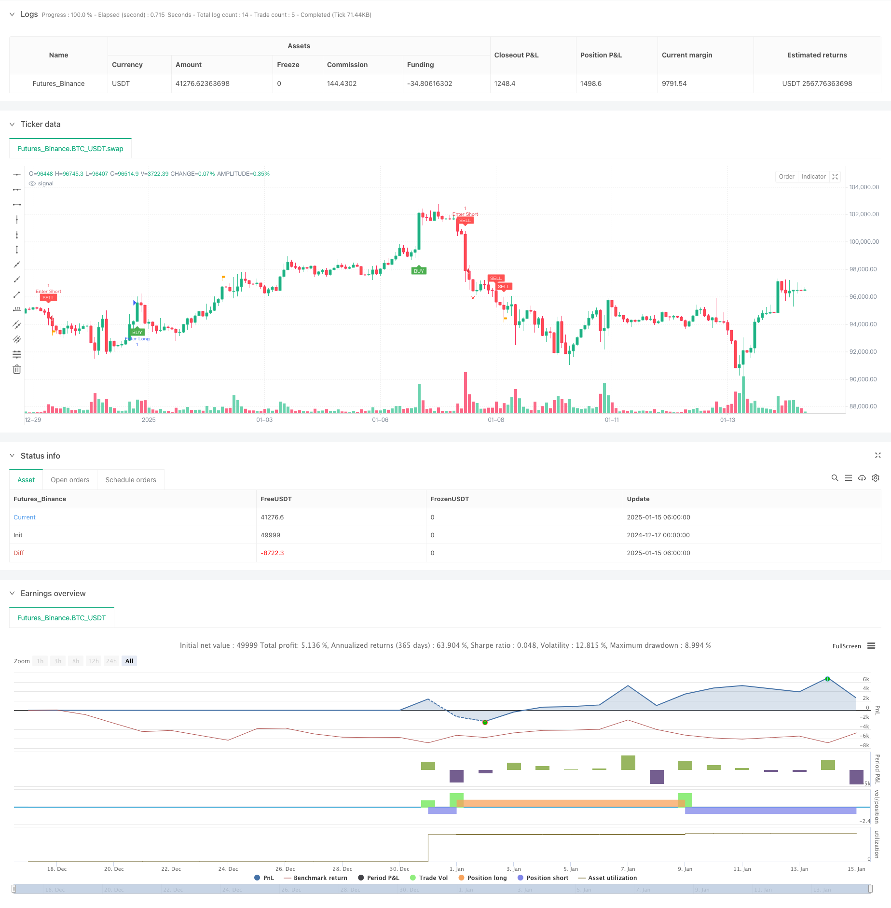

> Name

Multi-EMA-Trend-Following-Strategy-with-Dynamic-Volatility-Filter
> Author

ChaoZhang

> Strategy Description



[trans]
#### Overview
This strategy is an intelligent trading system that combines trend following and volatility filtering. It identifies market trends through exponential moving averages (EMA), uses true range (TR) and dynamic volatility filters to determine entry timing, and uses volatility-based dynamic stop-profit and stop-loss mechanisms to manage risk. The strategy supports two trading modes: short-term (Scalp) and swing (Swing), which can be flexibly switched according to different market environments and trading styles.
#### Strategy Principle
The core logic of the strategy includes the following key components:
1. Trend identification: Use the 50-period EMA as a trend filter, only go long when the price is above the EMA, and go short when the price is below the EMA.
2. Volatility filtering: Calculate the EMA of the true volatility (TR) and use an adjustable filtering coefficient (default 1.5) to filter market noise.
3. Entry conditions: Combined with the morphological analysis of three consecutive K lines, the price movement is required to have continuity and acceleration characteristics.
4. Stop profit and stop loss: Based on the current TR setting in short-term mode and based on previous high and low point settings in band mode, dynamic risk management is achieved.
#### Strategic Advantages
1. Strong adaptability: Through the combination of dynamic volatility filtering and trend tracking, it can adapt to different market environments.
2. Improved risk management: Provides two trading modes with dynamic stop-profit and stop-loss mechanisms, which can be flexibly selected according to market characteristics.
3. Good parameter adjustability: Key parameters such as filter coefficients, trend cycles, etc. can be optimized according to the characteristics of trading varieties.
4. Good visualization effect: Provide clear buy and sell signal marks and take profit and stop loss level display, which facilitates transaction monitoring.
#### Strategy Risk
1. Trend reversal risk: Continuous stop losses may occur at trend turning points.
2. False breakthrough risk: False signals may be triggered when volatility suddenly increases.
3. Parameter sensitivity: Improper setting of the filter coefficient may result in too much or too little signal.
4. Impact of slippage: In a fast market, you may face larger slippage, which affects the performance of your strategy.
#### Strategy optimization direction
1. Add trend strength filtering: ADX and other indicators can be introduced to evaluate the trend strength and improve the trend tracking effect.
2. Optimize stop-profit and stop-loss: Consider introducing trailing stop-loss to protect more profits.
3. Improve the band model: more judgment conditions unique to band trading can be added to improve medium and long-term position holding capabilities.
4. Increase trading volume analysis: Combined with trading volume changes to confirm the effectiveness of breakthroughs.
#### Summary
This strategy builds a complete trading system by organically combining trend tracking, volatility filtering and dynamic risk management. The advantage of the strategy is that it has strong adaptability, controllable risks, and provides a large space for optimization. By properly setting parameters and selecting appropriate trading modes, this strategy can maintain stable performance in different market environments. It is recommended that traders conduct sufficient backtesting and parameter optimization before using it in real trading, and make corresponding adjustments according to the characteristics of specific trading varieties. ||
#### Overview
This strategy is an intelligent trading system that combines trend following with volatility filtering. It identifies market trends using Exponential Moving Averages (EMA), determines entry timing through True Range (TR) and dynamic volatility filters, and manages risk using a volatility-based dynamic stop-loss/take-profit mechanism. The strategy supports two trading modes: Scalp and Swing, which can be flexibly switched based on different market environments and trading styles.

#### Strategy Principles
The core logic includes the following key components:
1. Trend Identification: Uses 50-period EMA as a trend filter, only taking long positions above EMA and short positions below EMA.
2. Volatility Filtering: Calculates EMA of True Range (TR) and uses an adjustable filter coefficient (default 1.5) to filter market noise.
3. Entry Conditions: Combines analysis of three consecutive candles, requiring price movement to show continuity and acceleration characteristics.
4. Stop-Loss/Take-Profit: Set based on current TR in scalp mode and based on previous highs/lows in swing mode, achieving dynamic risk management.

#### Strategy Advantages
1. Strong Adaptability: Adapts to different market environments through the combination of dynamic volatility filtering and trend following.
2. Comprehensive Risk Management: Provides dynamic stop-loss/take-profit mechanisms for both trading modes, allowing flexible selection based on market characteristics.
3. Good Parameter Adjustability: Key parameters such as filter coefficient and trend period can be optimized according to trading instrument characteristics.
4. Excellent Visualization: Provides clear buy/sell signal markers and stop-loss/take-profit level displays for easy trade monitoring.

#### Strategy Risks
1. Trend Reversal Risk: May experience consecutive stops at trend turning points.
2. False Breakout Risk: May trigger false signals during sudden volatility increases.
3. Parameter Sensitivity: Improper filter coefficient settings may lead to too many or too few signals.
4. Slippage Impact: May face significant slippage in fast markets, affecting strategy performance.

#### Strategy Optimization Directions
1. Add Trend Strength Filtering: Can introduce indicators like ADX to evaluate trend strength and improve trend following effectiveness.
2. Optimize Stop-Loss/Take-Profit: Can consider introducing trailing stops to protect more profits.
3. Improve Swing Mode: Can add more swing-trading-specific conditions to enhance medium to long-term holding capability.
4. Add Volume Analysis: Combine volume changes to confirm breakout validity.

#### Summary
This strategy constructs a complete trading system by organically combining trend following, volatility filtering, and dynamic risk management. Its strengths lie in its adaptability, controllable risk, while providing significant optimization potential. Through proper parameter settings and appropriate trading mode selection, the strategy can maintain stable performance in different market environments. Traders are advised to conduct thorough backtesting and parameter optimization before live trading, and make appropriate adjustments based on specific trading instrument characteristics.[/trans]


> Source (PineScript)

``` pinescript
/*backtest
start: 2024-12-17 00:00:00
end: 2025-01-15 08:00:00
period: 2h
basePeriod: 2h
exchanges: [{"eid":"Futures_Binance","currency":"BTC_USDT","balance":49999}]
*/

// This Pine Script™ code is subject to the terms of the Mozilla Public License 2.0 at https://mozilla.org/MPL/2.0/
// © Creativ3mindz

//@version=5
strategy("Scalp Slayer (I)", overlay=true)

// Input Parameters
filterNumber = input.float(1.5, "Filter Number", minval=1.0, maxval=10.0, tooltip="Higher = More aggressive Filter, Lower = Less aggressive")
emaTrendPeriod = input.int(50, "EMA Trend Period", minval=1, tooltip="Period for the EMA used for trend filtering")
lookbackPeriod = input.int(20, "Lookback Period for Highs/Lows", minval=1, tooltip="Period for determining recent highs/lows")
colorTP = input.color(title='Take Profit Color', defval=color.orange)
colorSL = input.color(title='Stop Loss Color', defval=color.red)

// Inputs for visibility
showBuyLabels = input.bool(true, title="Show Buy Labels")
showSellLabels = input.bool(true, title="Show Sell Labels")

// Alert Options
alertOnCondition = input.bool(true, title="Alert on Condition Met", tooltip="Enable to alert when condition is met")

// Trade Mode Toggle
tradeMode = input.bool(false, title="Trade Mode (ON = Swing, OFF = Scalp)", tooltip="Swing-mode you can use your own TP/SL.")

// Calculations
tr = high - low
ema = filterNumber * ta.ema(tr, 50)
trendEma = ta.ema(close, emaTrendPeriod)  // Calculate the EMA for the trend filter

// Highest and lowest high/low within lookback period for swing logic
swingHigh = ta.highest(high, lookbackPeriod)
swingLow = ta.lowest(low, lookbackPeriod)

// Variables to track the entry prices and SL/TP levels
var float entryPriceLong = na
var float entryPriceShort = na
var float targetPriceLong = na
var float targetPriceShort = na
var float stopLossLong = na
var float stopLossShort = na
var bool tradeActive = false

// Buy and Sell Conditions with Trend Filter
buyCondition = close > trendEma and  // Buy only if above the trend EMA
      close[2] > open[2] and close[1] > open[1] and close > open and 
      (math.abs(close[2] - open[2]) > math.abs(close[1] - open[1])) and 
      (math.abs(close - open) > math.abs(close[1] - open[1])) and 
      close > close[1] and close[1] > close[2] and tr > ema

sellCondition = close < trendEma and  // Sell only if below the trend EMA
       close[2] < open[2] and close[1] < open[1] and close < open and 
       (math.abs(close[2] - open[2]) > math.abs(close[1] - open[1])) and 
       (math.abs(close - open) > math.abs(close[1] - open[1])) and 
       close < close[1] and close[1] < close[2] and tr > ema

// Entry Rules
if (buyCondition and not tradeActive)
    entryPriceLong := close  // Track entry price for long position
    stopLossLong := tradeMode ? ta.lowest(low, lookbackPeriod) : swingLow  // Scalping: recent low, Swing: lowest low of lookback period
    targetPriceLong := tradeMode ? close + tr : swingHigh  // Scalping: close + ATR, Swing: highest high of lookback period
    tradeActive := true

if (sellCondition and not tradeActive)
    entryPriceShort := close  // Track entry price for short position
    stopLossShort := tradeMode ? ta.highest(high, lookbackPeriod) : swingHigh  // Scalping: recent high, Swing: highest high of lookback period
    targetPriceShort := tradeMode ? close - tr : swingLow  // Scalping: close - ATR, Swing: lowest low of lookback period
    tradeActive := true

// Take Profit and Stop Loss Logic
signalBuyTPPrint = (not na(entryPriceLong) and close >= targetPriceLong)
signalSellTPPrint = (not na(entryPriceShort) and close <= targetPriceShort)

signalBuySLPrint = (not na(entryPriceLong) and close <= stopLossLong)
signalSellSLPrint = (not na(entryPriceShort) and close >= stopLossShort)

if (signalBuyTPPrint or signalBuySLPrint)
    entryPriceLong := na  // Reset entry price for long position
    targetPriceLong := na  // Reset target price for long position
    stopLossLong := na  // Reset stop-loss for long position
    tradeActive := false

if (signalSellTPPrint or signalSellSLPrint)
    entryPriceShort := na  // Reset entry price for short position
    targetPriceShort := na  // Reset target price for short position
    stopLossShort := na  // Reset stop-loss for short position
    tradeActive := false

// Plot Buy and Sell Labels with Visibility Conditions
plotshape(showBuyLabels and buyCondition, "Buy", shape.labelup, location=location.belowbar, color=color.green, text="BUY", textcolor=color.white, size=size.tiny)
plotshape(showSellLabels and sellCondition, "Sell", shape.labeldown, location=location.abovebar, color=color.red, text="SELL", textcolor=color.white, size=size.tiny)

// Plot Take Profit Flags
plotshape(showBuyLabels and signalBuyTPPrint, title="Take Profit (buys)", text="TP", style=shape.flag, location=location.abovebar, color=colorTP, textcolor=color.white, size=size.tiny)
plotshape(showSellLabels and signalSellTPPrint, title="Take Profit (sells)", text="TP", style=shape.flag, location=location.belowbar, color=colorTP, textcolor=color.white, size=size.tiny)

// Plot Stop Loss "X" Marker
plotshape(showBuyLabels and signalBuySLPrint, title="Stop Loss (buys)", text="X", style=shape.xcross, location=location.belowbar, color=colorSL, textcolor=color.white, size=size.tiny)
plotshape(showSellLabels and signalSellSLPrint, title="Stop Loss (sells)", text="X", style=shape.xcross, location=location.abovebar, color=colorSL, textcolor=color.white, size=size.tiny)

// Alerts

alertcondition(buyCondition and alertOnCondition, title="Buy Alert", message='{"content": "Buy {{ticker}} at {{close}}"}')
alertcondition(sellCondition and alertOnCondition, title="Sell Alert", message='{"content": "Sell {{ticker}} at {{close}}"}')
alertcondition(signalBuyTPPrint and alertOnCondition, title="Buy TP Alert", message='{"content": "Buy TP {{ticker}} at {{close}}"}')
alertcondition(signalSellTPPrint and alertOnCondition, title="Sell TP Alert", message='{"content": "Sell TP {{ticker}} at {{close}}"}')
alertcondition(signalBuySLPrint and alertOnCondition, title="Buy SL Alert", message='{"content": "Buy SL {{ticker}} at {{close}}"}')
alertcondition(signalSellSLPrint and alertOnCondition, title="Sell SL Alert", message='{"content": "Sell SL {{ticker}} at {{close}}"}')

if buyCondition
    strategy.entry("Enter Long", strategy.long)
else if sellCondition
    strategy.entry("Enter Short", strategy.short)
```

> Detail

https://www.fmz.com/strategy/478707

> Last Modified

2025-01-17 15:00:37
