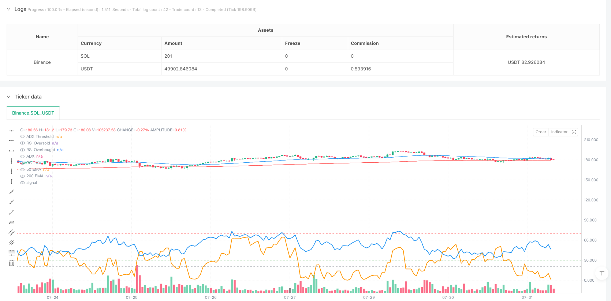
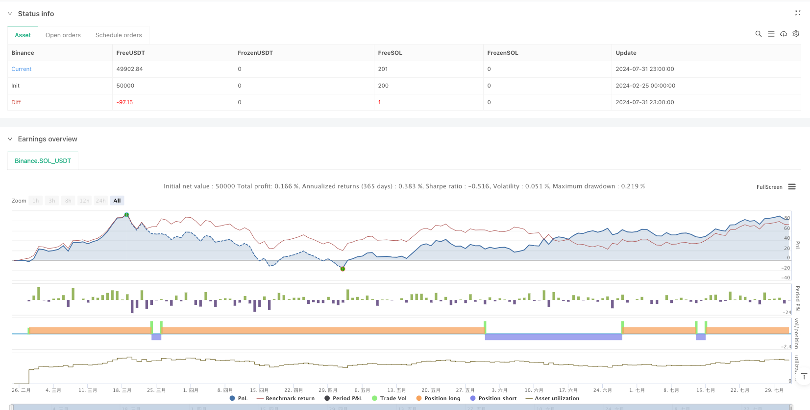

> Name

Multi-EMA-Trend-Momentum-Crossover-Trading-System
> Author

ianzeng123

> Strategy Description





[trans]
#### Overview
This strategy is a trend following system based on multiple technical indicators, combining the advantages of the Moving Average (EMA), the Average Trend Index (ADX) and the Relative Strength Index (RSI). Identify market trends through the intersection of the 50-day and 200-day exponential moving averages, while filtering out weak trends with ADX and using RSI to avoid trading in overbought or oversold areas. The strategy uses dynamic stop loss and profit targets based on true range (ATR), which not only ensures risk control but also maximizes profits.
#### Strategy Principle
The core logic of the strategy is based on the following key elements:
1. Trend judgment: Use the intersection of fast EMA (50 days) and slow EMA (200 days) to determine the market trend direction. When the 50-day EMA crosses above the 200-day EMA, it indicates that it has entered an uptrend; when the 50-day EMA crosses below the 200-day EMA, it indicates that it has entered a downtrend.
2. Confirmation of trend strength: Use the ADX indicator to measure the strength of the trend. Only consider entering the market when the ADX value is greater than 20, and ensure that you only trade in strong trends.
3. Momentum filtering: Carry out momentum filtering through the RSI indicator, only open positions when the RSI is between 30-70, and avoid trading in over-bought or over-sold areas.
4. Risk management: Use dynamic stop loss and profit targets based on ATR. The stop loss is set to 2 times ATR and the profit target is set to 4 times ATR.
#### Strategic Advantages
1. Multi-dimensional trend confirmation: By combining the triple filtering of moving average crossover, ADX and RSI, the reliability of trading signals is greatly improved.
2. Dynamic risk management: Dynamic stop loss and profit settings based on ATR can adaptively adjust according to market volatility.
3. Filter weak trends: The introduction of the ADX indicator effectively avoids frequent trading in sideways markets.
4. Prevent chasing highs and chasing lows: The RSI filtering mechanism can avoid trading in extreme areas.
#### Strategy Risk
1. Trend reversal risk: In a rapid reversal market, the lag of the moving average system may lead to a larger retracement.
2. Risk of market shock: When the market is in range oscillation, frequent false breakthrough signals may occur.
3. Parameter sensitivity: The parameter settings of multiple indicators need to be optimized in different market environments.
4. Slippage risk: In a market with poor liquidity, the actual transaction price may deviate greatly from the signal price.
#### Strategy optimization direction
1. Introduce trading volume indicators: You can consider adding a trading volume confirmation mechanism, and trade only when there is a breakthrough in heavy volume.
2. Optimize the stop loss mechanism: You can consider using trailing stop loss to protect existing profits during the development of the trend.
3. Add time filtering: You can add trading time filtering to avoid trading during periods of greater volatility.
4. Market environment classification: dynamically adjust strategy parameters according to different market environments (trends, shocks).
#### Summary
This strategy builds a complete trend following trading system by comprehensively using multiple technical indicators. The advantage of the strategy lies in the multi-dimensional signal confirmation mechanism and dynamic risk management system, but at the same time, attention must be paid to the risks caused by trend reversal and volatile markets. Through continuous optimization and improvement, this strategy is expected to maintain stable performance in different market environments.
#### Overview
This strategy is a trend-following system based on multiple technical indicators, combining the advantages of Exponential Moving Averages (EMA), Average Directional Index (ADX), and Relative Strength Index (RSI). It identifies market trends through the crossover of 50-day and 200-day EMAs, filters weak trends using ADX, and avoids trading in overbought or oversold areas using RSI. The strategy employs dynamic stop-loss and take-profit targets based on Average True Range (ATR), ensuring both risk control and profit maximization.

#### Strategy Principles
The core logic of the strategy is built on the following key elements:
1. Trend Identification: Uses the crossover of fast EMA (50-day) and slow EMA (200-day) to determine market trend direction. A bullish trend is signaled when the 50-day EMA crosses above the 200-day EMA, and a bearish trend when it crosses below.
2. Trend Strength Confirmation: Utilizes the ADX indicator to measure trend strength, only considering entry when ADX is above 20, ensuring trades only in strong trends.
3. Momentum Filtering: Applies RSI indicator for momentum filtering, only entering positions when RSI is between 30-70, avoiding trades in overbought or oversold areas.
4. Risk Management: Uses ATR-based dynamic stop-loss and take-profit levels, with stop-loss set at 2x ATR and take-profit at 4x ATR.

#### Strategy Advantages
1. Multi-dimensional Trend Confirmation: Combines EMA crossover, ADX, and RSI triple filtering to significantly improve signal reliability.
2. Dynamic Risk Management: ATR-based dynamic stop-loss and take-profit settings adapt to market volatility.
3. Weak Trend Filtering: Introduction of ADX effectively avoids frequent trading in ranging markets.
4. Prevention of Extreme Entries: RSI filtering mechanism prevents trading in extreme areas.

#### Strategy Risks
1. Trend Reversal Risk: The lag in moving average systems may lead to significant drawdowns in quick reversal scenarios.
2. Range-bound Market Risk: May generate frequent false breakout signals during sideways markets.
3. Parameter Sensitivity: Multiple indicator parameters need optimization across different market conditions.
4. Slippage Risk: Actual execution prices may significantly deviate from signal prices in less liquid markets.

#### Strategy Optimization Directions
1. Volume Indicator Integration: Consider adding volume confirmation, only trading on volume breakouts.
2. Stop-loss Mechanism Enhancement: Consider implementing trailing stops to protect profits during trend development.
3. Time Filter Addition: Add trading time filters to avoid high-volatility periods.
4. Market Environment Classification: Dynamically adjust strategy parameters based on different market conditions (trending, ranging).

#### Summary
The strategy constructs a comprehensive trend-following trading system through the integrated use of multiple technical indicators. Its strengths lie in multi-dimensional signal confirmation and dynamic risk management systems, while attention must be paid to risks from trend reversals and ranging markets. Through continuous optimization and refinement, the strategy has the potential to maintain stable performance across different market environments.[/trans]


> Source (PineScript)

``` pinescript
/*backtest
start: 2024-02-25 00:00:00
end: 2024-08-01 00:00:00
period: 1h
basePeriod: 1h
exchanges: [{"eid":"Binance","currency":"SOL_USDT"}]
*/

//@version=5
strategy("Trend Following Strategy with EMA, ADX & RSI", overlay=true)

// Define the EMAs
ema50 = ta.ema(close, 50)   // 50 EMA (Short-term trend)
ema200 = ta.ema(close, 200) // 200 EMA (Long-term trend)

// ADX (Average Directional Index) to measure trend strength
adxLength = 14
adxSmoothing = 1  // ADX smoothing parameter (default is 1)
[plusDI, minusDI, adx] = ta.dmi(adxLength, adxSmoothing)
adxThreshold = 20  // Only trade when ADX is above 20 (strong trend)

// RSI (Relative Strength Index) to avoid overbought/oversold conditions
rsiLength = 14
rsi = ta.rsi(close, rsiLength)
rsiOverbought = 70
rsiOversold = 30

// Buy Condition: 50 EMA > 200 EMA (bullish trend) and ADX > 20 (strong trend) and RSI between 30 and 70
longCondition = ta.crossover(ema50, ema200) and adx > adxThreshold and rsi > rsiOversold and rsi < rsiOverbought

// Sell Condition: 50 EMA < 200 EMA (bearish trend) and ADX > 20 (strong trend) and RSI between 30 and 70
shortCondition = ta.crossunder(ema50, ema200) and adx > adxThreshold and rsi > rsiOversold and rsi < rsiOverbought

// Stop Loss and Take Profit levels based on recent swing highs and lows (for simplicity)
longStopLoss = low - (ta.atr(14) * 2)  // Stop loss set 2x ATR below the recent low
longTakeProfit = close + (ta.atr(14) * 4) // Take profit set 4x ATR above entry

shortStopLoss = high + (ta.atr(14) * 2)  // Stop loss set 2x ATR above the recent high
shortTakeProfit = close - (ta.atr(14) * 4) // Take profit set 4x ATR below entry

// Strategy Entry and Exit
if (longCondition)
    strategy.entry("Long", strategy.long, stop=longStopLoss, limit=longTakeProfit)

if (shortCondition)
    strategy.entry("Short", strategy.short, stop=shortStopLoss, limit=shortTakeProfit)

// Plot the EMAs on the chart
plot(ema50, color=color.blue, title="50 EMA")
plot(ema200, color=color.red, title="200 EMA")

// Plot ADX on a separate pane
hline(adxThreshold, "ADX Threshold", color=color.gray)
plot(adx, color=color.orange, title="ADX", linewidth=2)

// Plot RSI on a separate pane
hline(rsiOversold, "RSI Oversold", color=color.green)
hline(rsiOverbought, "RSI Overbought", color=color.red)
plot(rsi, color=color.blue, title="RSI", linewidth=2)
```

> Detail

https://www.fmz.com/strategy/483522

> Last Modified

2025-02-27 16:46:00
