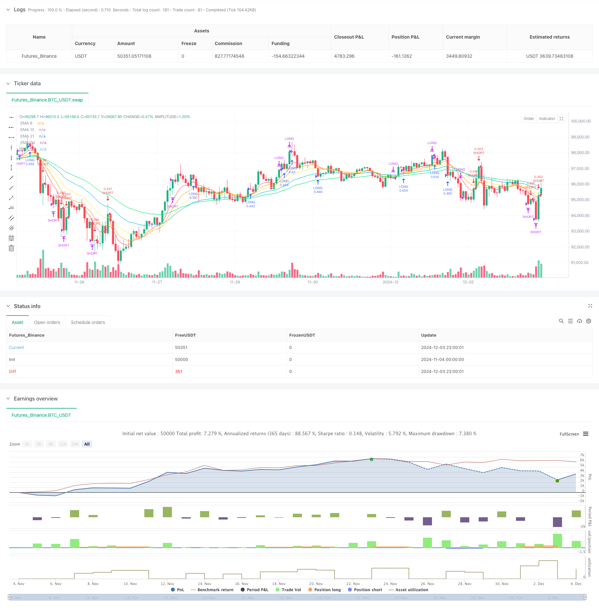

> Name

Multi-EMA-Trend-Momentum-Trading-Strategy-with-Risk-Management-System
> Author

ChaoZhang

> Strategy Description



[trans]
#### Overview
This is a trading strategy that combines momentum and trend, using multiple exponential moving averages (EMA), relative strength index (RSI) and stochastic indicators to identify market trends and momentum. The strategy also integrates an average true range (ATR)-based risk management system, including dynamic stop loss, profit target and trailing stop functions, while using a risk-based position management approach.
#### Strategy Principle
The strategy uses 5 EMAs with different periods (8, 13, 21, 34, 55) to determine the trend direction. When the shorter period EMA is above the longer period EMA, it is identified as an upward trend; otherwise, it is a downward trend. RSI is used to confirm momentum and sets different entry and exit thresholds. The stochastic indicator acts as a third filter to help avoid over-buying or selling. The risk management system uses ATR to set dynamic stops (2x ATR) and profit targets (4x ATR), and uses a trailing stop of 1.5x ATR to protect profits. Position sizing is calculated based on 1% risk of account equity.
#### Strategic Advantages
1. Multiple confirmation mechanism: combines trend and momentum indicators to reduce the risk of false signals
2. Dynamic risk management: adaptively adjust stop loss and profit targets based on market volatility
3. Intelligent position management: automatically adjust transaction size based on risk and volatility
4. Complete profit protection: use trailing stop to lock in existing profits
5. Flexible exit mechanism: multiple combinations of conditions ensure timely exit
6. Low risk exposure: Maximum loss of 1% of account funds per transaction
#### Strategy Risk
1. Risk of volatile market: Multiple moving average systems may produce frequent false signals in sideways markets
2. Slippage risk: Periods of high volatility may cause the actual execution price to deviate from expectations.
3. Fund management risk: Although single losses are limited, continuous losses may still significantly affect funds.
4. Parameter optimization risk: Over-optimization may lead to over-fitting
5. Technical indicator lag: both moving averages and oscillators have a certain lag
#### Strategy optimization direction
1. Market environment filtering: Add volatility filter to adjust strategy parameters during periods of high volatility
2. Time filtering: adjust trading parameters according to market characteristics in different time periods
3. Dynamic parameter adjustment: automatically adjust EMA period and indicator threshold based on market conditions
4. Add volume confirmation: Add volume analysis to improve signal reliability
5. Optimize the exit mechanism: study better trailing stop loss multiples
6. Introduce machine learning: Use machine learning to optimize parameter selection
#### Summary
This strategy provides a comprehensive trading solution by combining multiple technical indicators and a comprehensive risk management system. Its core advantage lies in the multi-layer filtering mechanism and dynamic risk management, but it still needs to be optimized according to specific market characteristics. The successful implementation of the strategy requires continuous monitoring and adjustment, especially the adaptability of parameters in different market environments. Through the proposed optimization direction, this strategy has the potential to further improve its stability and profitability. ||
#### Overview
This is a trading strategy that combines momentum and trend, using multiple Exponential Moving Averages (EMAs), Relative Strength Index (RSI), and Stochastic oscillator to identify market trends and momentum. The strategy incorporates a risk management system based on Average True Range (ATR), including dynamic stop-loss, profit targets, and trailing stops, along with risk-based position sizing.

#### Strategy Principles
The strategy employs 5 EMAs with different periods (8, 13, 21, 34, 55) to determine trend direction. An uptrend is identified when shorter-period EMAs are above longer-period EMAs, and vice versa for downtrends. RSI confirms momentum with different entry and exit thresholds. The Stochastic oscillator serves as a third filter to avoid overbought and oversold conditions. The risk management system uses ATR to set dynamic stop-loss (2x ATR) and profit targets (4x ATR), with a 1.5x ATR trailing stop to protect profits. Position sizing is calculated based on 1% risk of account equity.

#### Strategy Advantages
1. Multiple confirmation mechanism: Combines trend and momentum indicators to reduce false signals
2. Dynamic risk management: Adapts stop-loss and profit targets based on market volatility
3. Intelligent position sizing: Automatically adjusts trade size based on risk and volatility
4. Complete profit protection: Uses trailing stops to lock in profits
5. Flexible exit mechanism: Multiple conditions ensure timely exits
6. Low risk exposure: Limits losses to 1% of account per trade

#### Strategy Risks
1. Choppy market risk: Multiple EMA system may generate frequent false signals in ranging markets
2. Slippage risk: High volatility periods may lead to execution prices deviating from expected levels
3. Money management risk: Despite single trade loss limits, consecutive losses can significantly impact capital
4. Parameter optimization risk: Over-optimization may lead to overfitting
5. Technical indicator lag: Both moving averages and oscillators have inherent lag

#### Strategy Optimization Directions
1. Market environment filtering: Add volatility filters to adjust strategy parameters during high volatility periods
2. Time filtering: Adjust trading parameters based on different time period characteristics
3. Dynamic parameter adjustment: Automatically adjust EMA periods and indicator thresholds based on market conditions
4. Add volume confirmation: Incorporate volume analysis to improve signal reliability
5. Optimize exit mechanism: Research optimal trailing stop multipliers
6. Introduce machine learning: Use machine learning to optimize parameter selection

#### Summary
The strategy provides a comprehensive trading solution by combining multiple technical indicators with a robust risk management system. Its core strengths lie in its multi-layer filtering mechanism and dynamic risk management, but it still requires optimization based on specific market characteristics. Successful implementation requires continuous monitoring and adjustment, especially parameter adaptability in different market environments. Through the proposed optimization directions, the strategy has the potential to further improve its stability and profitability.[/trans]


> Source (PineScript)

``` pinescript
/*backtest
start: 2024-11-04 00:00:00
end: 2024-12-04 00:00:00
period: 1h
basePeriod: 1h
exchanges: [{"eid":"Futures_Binance","currency":"BTC_USDT"}]
*/

//@version=5
strategy("Combined Strategy (Modernized)", overlay = true)

//----------//
// MOMENTUM //
//----------//
ema8 = ta.ema(close, 8)
ema13 = ta.ema(close, 13)
ema21 = ta.ema(close, 21)
ema34 = ta.ema(close, 34)
ema55 = ta.ema(close, 55)

// Plotting EMAs for visualization
plot(ema8, color=color.red, title="EMA 8", linewidth=1)
plot(ema13, color=color.orange, title="EMA 13", linewidth=1)
plot(ema21, color=color.yellow, title="EMA 21", linewidth=1)
plot(ema34, color=color.aqua, title="EMA 34", linewidth=1)
plot(ema55, color=color.lime, title="EMA 55", linewidth=1)

longEmaCondition = ema8 > ema13 and ema13 > ema21 and ema21 > ema34 and ema34 > ema55
exitLongEmaCondition = ema13 < ema55

shortEmaCondition = ema8 < ema13 and ema13 < ema21 and ema21 < ema34 and ema34 < ema55
exitShortEmaCondition = ema13 > ema55

// ----------  //
// OSCILLATORS //
// ----------- //
rsi = ta.rsi(close, 14)
longRsiCondition = rsi < 70 and rsi > 40
exitLongRsiCondition = rsi > 70

shortRsiCondition = rsi > 30 and rsi < 60
exitShortRsiCondition = rsi < 30

// Stochastic
k = ta.stoch(close, high, low, 14)
d = ta.sma(k, 3)

longStochasticCondition = k < 80
exitLongStochasticCondition = k > 95

shortStochasticCondition = k > 20
exitShortStochasticCondition = k < 5

//----------//
// STRATEGY //
//----------//

// ATR for dynamic stop loss and take profit
atr = ta.atr(14)
stopLossMultiplier = 2
takeProfitMultiplier = 4
stopLoss = atr * stopLossMultiplier
takeProfit = atr * takeProfitMultiplier

// Trailing stop settings
trailStopMultiplier = 1.5
trailOffset = atr * trailStopMultiplier

// Risk management: dynamic position sizing
riskPerTrade = 0.01  // 1% risk per trade
positionSize = strategy.equity * riskPerTrade / stopLoss

longCondition = longEmaCondition and longRsiCondition and longStochasticCondition and strategy.position_size == 0
exitLongCondition = (exitLongEmaCondition or exitLongRsiCondition or exitLongStochasticCondition) and strategy.position_size > 0

if (longCondition)
    strategy.entry("LONG", strategy.long, qty=positionSize)
    strategy.exit("Take Profit Long", "LONG", stop=close - stopLoss, limit=close + takeProfit, trail_offset=trailOffset)

if (exitLongCondition)
    strategy.close("LONG")
    
shortCondition = shortEmaCondition and shortRsiCondition and shortStochasticCondition and strategy.position_size == 0
exitShortCondition = (exitShortEmaCondition or exitShortRsiCondition or exitShortStochasticCondition) and strategy.position_size < 0

if (shortCondition)
    strategy.entry("SHORT", strategy.short, qty=positionSize)
    strategy.exit("Take Profit Short", "SHORT", stop=close + stopLoss, limit=close - takeProfit, trail_offset=trailOffset)

if (exitShortCondition)
    strategy.close("SHORT")

```

> Detail

https://www.fmz.com/strategy/474022

> Last Modified

2024-12-05 14:52:06
