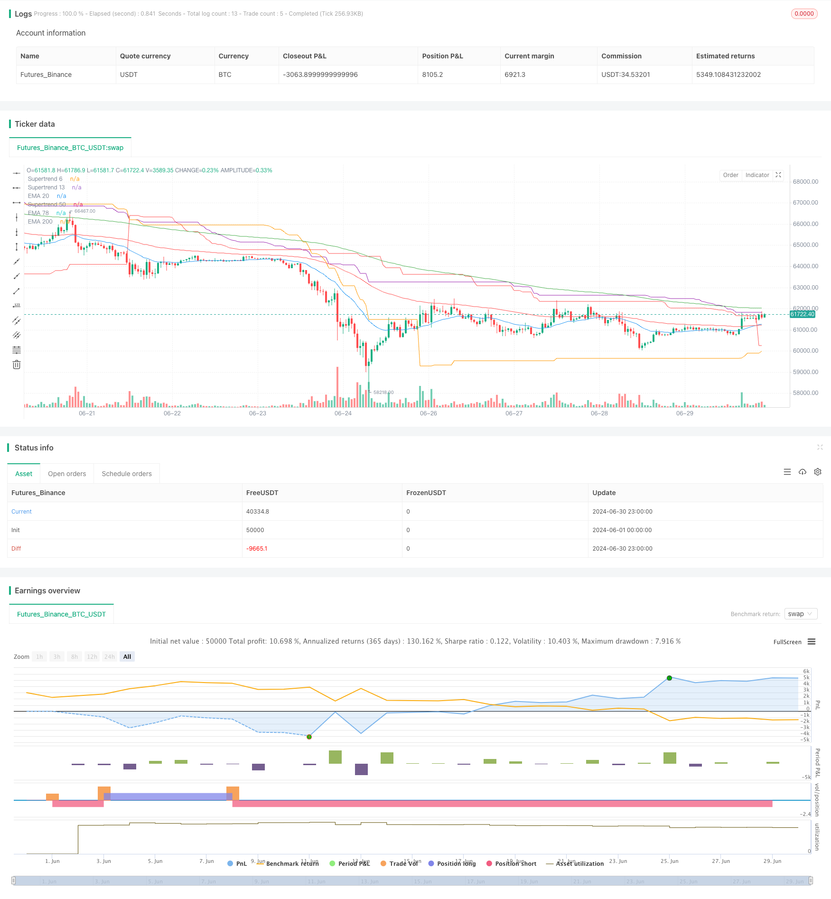

> Name

Multi-EMA-and-Supertrend-Crossover-Strategy
> Author

ChaoZhang

> Strategy Description



[trans]
#### Overview
This strategy is a trading system based on multiple exponential moving averages (EMA) and the Supertrend indicator. It uses the crossover of EMA and Supertrend indicators of different periods to generate buy and sell signals. This strategy is designed to capture changes in market trends and trade when the trend is confirmed.
#### Strategy Principle
This strategy uses three different periods of EMA (22, 79 and 200) and three different periods of the Supertrend indicator (50, 13 and 6). The generation of trading signals is based on the following conditions:
1. Buy signal:
   - The medium-term EMA (79) is lower than the short-term EMA (22)
   - Closed above long-term EMA (200)
   - Closed higher than all three Supertrend indicators
2. Sell signal:
   - The medium-term EMA (79) is higher than the short-term EMA (22)
   - Closed below long-term EMA (200)
   - Closed below all three Supertrend indicators
When these conditions are met, the strategy opens a long or short position accordingly. At the same time, when a contrary signal appears, the strategy will close existing positions.
#### Strategic Advantages
1. Multiple confirmations: Using multiple indicators and time frames can provide more reliable trading signals and reduce false breakthroughs.
2. Trend following: By combining EMA and Supertrend, the strategy can effectively capture medium and long-term trends.
3. Flexibility: The parameters of EMA and Supertrend can be adjusted according to different market conditions.
4. Risk Management: Use the long-term EMA (200) as an additional filter to help avoid contrarian trades.
5. Automation: The strategy can easily realize automated trading and reduce human emotional interference.
#### Strategy Risk
1. Lagging: EMA and Supertrend are both lagging indicators, which may lead to late entry or exit when the trend reverses.
2. Poor performance in volatile markets: In sideways or volatile markets, the strategy may produce frequent false signals.
3. Over-reliance on technical indicators: Ignoring fundamentals and market sentiment can lead to wrong trading decisions.
4. Parameter sensitivity: Strategy performance is highly dependent on the selected EMA and Supertrend parameters.
5. Lack of stop-loss mechanism: There is no clear stop-loss strategy in the code, which may lead to larger losses.
#### Strategy optimization direction
1. Introduce a stop-loss mechanism: Set a stop-loss based on ATR or a fixed percentage to limit the maximum loss in a single transaction.
2. Add volume filtering: Incorporate volume indicators into the signal confirmation process to improve signal quality.
3. Optimize parameter selection: Use historical data to backtest different EMA and Supertrend parameter combinations to find the optimal settings.
4. Add trend strength filtering: Introduce trend strength indicators such as ADX and only trade in strong trends.
5. Implement partial position management: allowing strategies to gradually build or reduce positions based on signal strength, rather than full position operations.
6. Add market regime recognition: Add logic to identify the current market status (trend/shock) in the strategy, and adjust trading behavior accordingly.
7. Consider fundamental factors: Use important economic data releases or events as additional filters.
#### Summarize
The Multiple Moving Average and Trend Indicator Crossover Strategy is a comprehensive trading system that combines multiple technical indicators. By utilizing the EMA and Supertrend indicators of different periods, this strategy aims to capture strong market trends and trade when the trend is confirmed. Although the strategy has the advantages of multiple confirmations and trend following, it also faces risks such as lagging and poor performance in volatile markets.
In order to improve the robustness and performance of the strategy, you can consider introducing a stop-loss mechanism, optimizing parameter selection, adding additional filtering conditions, and achieving more flexible position management. At the same time, incorporating fundamental analysis into the decision-making process may also help improve the overall effectiveness of the strategy.
Overall, this is a promising strategic framework that, through continued optimization and adjustment, is expected to achieve stable performance under a variety of market conditions. However, before using it in real trading, it is recommended to conduct thorough backtesting and forward testing to ensure the reliability of the strategy in different market environments.
|| 

#### Overview

This strategy is a trading system based on multiple Exponential Moving Averages (EMAs) and Supertrend indicators. It generates buy and sell signals using crossovers of EMAs and Supertrend indicators with different periods. The strategy aims to capture market trend changes and execute trades when trends are confirmed.

#### Strategy Principle

The strategy employs three EMAs with different periods (22, 79, and 200) and three Supertrend indicators with different periods (50, 13, and 6). Trading signals are generated based on the following conditions:

1. Buy Signal:
   - Medium-term EMA (79) is below the short-term EMA (22)
   - Closing price is above the long-term EMA (200)
   - Closing price is above all three Supertrend indicators

2. Sell Signal:
   - Medium-term EMA (79) is above the short-term EMA (22)
   - Closing price is below the long-term EMA (200)
   - Closing price is below all three Supertrend indicators

When these conditions are met, the strategy opens long or short positions accordingly. It also closes existing positions when opposite signals occur.

#### Strategy Advantages

1. Multiple Confirmations: Using multiple indicators and timeframes provides more reliable trading signals, reducing false breakouts.

2. Trend Following: By combining EMAs and Supertrend, the strategy effectively captures medium to long-term trends.

3. Flexibility: EMA and Supertrend parameters can be adjusted for different market conditions.

4. Risk Management: Using the long-term EMA (200) as an additional filter helps avoid counter-trend trades.

5. Automation: The strategy can be easily automated, reducing emotional interference in trading decisions.

#### Strategy Risks

1. Lag: Both EMAs and Supertrend are lagging indicators, which may lead to late entries or exits during trend reversals.

2. Poor Performance in Ranging Markets: The strategy may generate frequent false signals in sideways or choppy markets.

3. Over-reliance on Technical Indicators: Ignoring fundamental factors and market sentiment may lead to incorrect trading decisions.

4. Parameter Sensitivity: Strategy performance highly depends on the chosen EMA and Supertrend parameters.

5. Lack of Stop-Loss Mechanism: The code does not include an explicit stop-loss strategy, which may result in significant losses.

#### Strategy Optimization Directions

1. Introduce Stop-Loss Mechanism: Implement ATR-based or fixed percentage stop-losses to limit maximum loss per trade.

2. Add Volume Filters: Incorporate volume indicators into the signal confirmation process to improve signal quality.

3. Optimize Parameter Selection: Backtest different combinations of EMA and Supertrend parameters using historical data to find optimal settings.

4. Add Trend Strength Filters: Introduce trend strength indicators like ADX and only trade in strong trends.

5. Implement Partial Position Management: Allow the strategy to build or reduce positions gradually based on signal strength, rather than all-or-nothing operations.

6. Incorporate Market Regime Recognition: Add logic to identify current market states (trending/ranging) and adjust trading behavior accordingly.

7. Consider Fundamental Factors: Use important economic data releases or events as additional filtering conditions.

#### Conclusion

The Multi-EMA and Supertrend Crossover Strategy is a comprehensive trading system that combines multiple technical indicators. By leveraging EMAs and Supertrend indicators with different periods, the strategy aims to capture strong market trends and execute trades when trends are confirmed. While the strategy has advantages in multiple confirmations and trend following, it also faces risks such as lag and poor performance in ranging markets.

To enhance the strategy's robustness and performance, consider introducing stop-loss mechanisms, optimizing parameter selection, adding additional filters, and implementing more flexible position management. Incorporating fundamental analysis into the decision-making process may also help improve the strategy's overall effectiveness.

Overall, this is a promising strategy framework that, with continuous optimization and adjustment, has the potential to achieve stable performance across various market conditions. However, before using it in live trading, it is recommended to conduct thorough backtesting and forward testing to ensure the strategy's reliability in different market environments.

[/trans]


> Source (PineScript)

``` pinescript
/*backtest
start: 2024-06-01 00:00:00
end: 2024-06-30 23:59:59
period: 1h
basePeriod: 15m
exchanges: [{"eid":"Futures_Binance","currency":"BTC_USDT"}]
*/

//@version=5
strategy("Strategia EMA i Supertrend", overlay=true)

// Definicja parametrów
ema_short_length = 22
ema_medium_length = 79
ema_long_length = 200
supertrend_50_length = 50
supertrend_13_length = 13
supertrend_6_length = 6
supertrend_factor = 6.0  // Ustawienie czynnika na 6 dla wszystkich Supertrend

// Obliczenia EMA
ema_short = ta.ema(close, ema_short_length)
ema_medium = ta.ema(close, ema_medium_length)
ema_long = ta.ema(close, ema_long_length)

// Obliczenia Supertrend
[supertrend_50, _] = ta.supertrend(supertrend_factor, supertrend_50_length)
[supertrend_13, _] = ta.supertrend(supertrend_factor, supertrend_13_length)
[supertrend_6, _] = ta.supertrend(supertrend_factor, supertrend_6_length)

// Warunki sygnału kupna (Long)
buy_signal = (ema_medium < ema_short) and close > ema_long and close > supertrend_50 and close > supertrend_13 and close > supertrend_6

// Warunki sygnału sprzedaży (Short)
sell_signal = (ema_medium > ema_short) and close < ema_long and close < supertrend_50 and close < supertrend_13 and close < supertrend_6

// Rysowanie EMA na wykresie
plot(ema_short, title="EMA 20", color=color.blue)
plot(ema_medium, title="EMA 78", color=color.red)
plot(ema_long, title="EMA 200", color=color.green)

// Rysowanie Supertrend na wykresie
plot(supertrend_50, title="Supertrend 50", color=color.orange)
plot(supertrend_13, title="Supertrend 13", color=color.purple)
plot(supertrend_6, title="Supertrend 6", color=color.red)

// Generowanie sygnałów kupna i sprzedaży
if (buy_signal)
    strategy.entry("Long", strategy.long)

if (sell_signal)
    strategy.entry("Short", strategy.short)

// Zamknięcie pozycji Long przy sygnale sprzedaży
if (sell_signal)
    strategy.close("Long")

// Zamknięcie pozycji Short przy sygnale kupna
if (buy_signal)
    strategy.close("Short")

// Alerty
alertcondition(buy_signal, title="Sygnał Kupna", message="Sygnał Kupna")
alertcondition(sell_signal, title="Sygnał Sprzedaży", message="Sygnał Sprzedaży")

```

> Detail

https://www.fmz.com/strategy/458146

> Last Modified

2024-07-30 12:14:37
